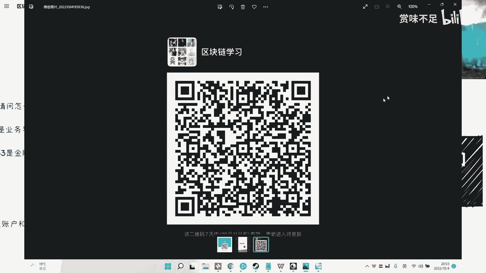
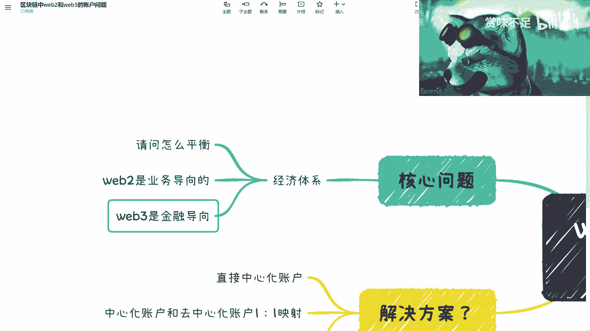

# 赏味区块链——Web2与Web3的账户问题 - P1 🔑


在本节课中，我们将探讨Web2与Web3在账户体系上的核心差异，分析当前试图融合两者的常见方案及其面临的挑战，特别是经济体系平衡这一根本问题。



---

## 概述

本次内容主要讲解Web2与Web3的账户问题。Web3的核心价值在于用户对自身账户和信息的自主控制权，这与Web2的中心化账户体系形成鲜明对比。虽然存在通过中心化账户映射到Web3的方案，但这会削弱Web3的核心优势，并带来新的经济平衡难题。

---

## Web2与Web3账户体系对比

上一节我们概述了课程主题，本节中我们来看看Web2和Web3账户体系的具体区别。

在Web2世界中，大型平台如BATJ（百度、阿里巴巴、腾讯、京东）或字节跳动等，它们为用户创造了功能、业务和产品流程，同时也构建了复杂的中心化账户体系。然而，用户对这些账户没有真正的控制权。平台可以随时封禁账号或限制发言。

**公式表示Web2账户关系：**
`用户账户控制权 = 平台`

而在Web3世界中，项目方或组织只提供平台功能、流程和业务，并不构建账户体系。用户直接通过自己的去中心化账户与平台、系统或智能合约进行交互。

**公式表示Web3账户关系：**
`用户账户控制权 = 用户自己`

这意味着平台方无法获取或控制用户的账户信息。即使用户被某个合约拒绝，他们也可以使用其他匿名账户，因为Web3账户本质上是匿名的。因此，Web3生态确保了用户对自己资金和信息的所有权与控制权，账户不会被任意删除。

**代码示例（概念性）：**
```solidity
// Web3 用户与合约交互的简化逻辑
contract Platform {
    function userAction(address _userWallet) public {
        // 平台只能与用户钱包地址交互，无法控制该钱包
        // 用户通过私钥完全控制 _userWallet
    }
}
```

---

## 中心化与去中心化账户的映射方案

了解了基本差异后，我们自然会想到一个折中方案：能否用Web2的方式让用户接入Web3呢？

现在有一种常见的解决方案，即建立中心化账户与去中心化账户的一对一映射。其背后的逻辑是，通过中心化技术托管用户的私钥，降低用户使用Web3的门槛。

然而，这种做法存在根本性问题。它抹杀了Web3最大的核心价值——用户信息的自主权。虽然实现了一对一映射，但所有用户的私钥都托管在中心化系统中。

**这意味着：**
`用户资产与信息安全 = 依赖于中心化服务商的诚信与能力`

如果该中心化服务商作恶、倒闭或出现其他问题，用户将毫无办法。尽管有人认为当前的Web2世界也是如此，用户并未因信息可控性问题而放弃使用微信、滴滴等应用，但我们的目标是引导Web2用户进入Web3，就不应牺牲Web3的根本逻辑。否则，直接使用纯中心化账户即可，无需进行映射。

---

## 核心挑战：经济体系的平衡

上一节我们讨论了技术方案本身的矛盾，但更深层的问题并非技术，而是经济体系。

Web2是由业务导向的。以滴滴、美团、饿了么为例，它们有完整的业务闭环。公司需要投入巨大成本运营，同时也从海量用户的使用中获得收入，形成商业闭环。

**公式表示Web2模式：**
`Web2 商业模式 ≈ 业务收入 - 运营成本`

而Web3目前尚处于早期阶段，无论其外表是DeFi、GameFi还是NFT，剥开外壳，其本质是金融导向。其根本驱动力来自一级市场、二级市场、拍卖等金融活动。

**公式表示Web3模式：**
`Web3 当前驱动力 ≈ 金融活动（如拉盘、投机）`

这就带来了一个巨大的平衡难题：即使我们相信中心化映射方案不会作恶，能成功引导Web2用户进入Web3，但如何平衡这两个生态的经济？

Web2的业务可能初期没有收入甚至亏损，而Web3的金融生态需要大量资金来托底、宣传或“拉盘”以维持热度。整个闭环中，收入从何而来？对Web3的固定投入与对Web2的运营投入如何平衡？这才是最核心的问题。

有观点设想用Web2的“烧钱”模式激励用户（如赚取积分），而资金来自Web3生态内的平台价差套利。但关键在于，如果一个Web3产品带有通证（Token），那么该通证的价格就必然与产品生态深度绑定。通证价格需要上涨来吸引关注，这本身就需要持续的资金投入。

**最终，金钱的天平必须平衡：**
`Web2补贴支出 + Web3运营/拉盘支出 = 可持续的收入来源`

目前很难找到两者健康的平衡点，因为整个生态尚未发展到成熟阶段。账户体系背后的根本原因，正是这种经济模式的不兼容性。

---

## 总结

本节课我们一起学习了Web2与Web3账户体系的本质区别。Web2是中心化控制，而Web3赋予用户自主权。虽然存在通过账户映射来降低门槛的方案，但它牺牲了Web3的核心价值，并面临难以调和的经济体系平衡挑战。未来，任何能成功融合两者并建立健康经济循环的产品，都将具有巨大潜力。



---
**注意**：本课程内容在多平台发布，如需观看视频版本以获得更直观体验，可在B站或微博搜索相关课程标题。