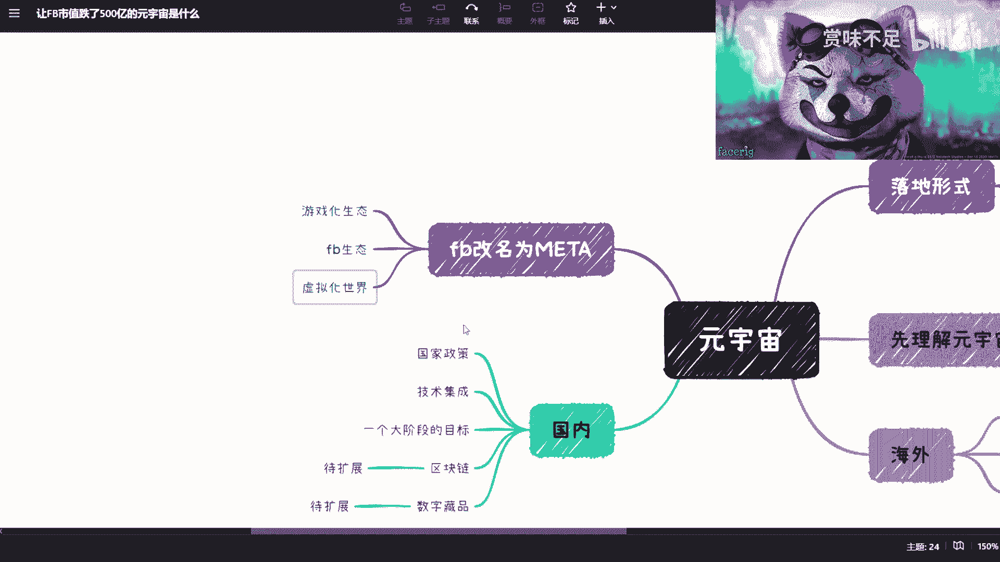

# 赏味区块链——今天来讲人人都能听懂的元宇宙 - P1 - 赏味不足 - BV1rg41127wT

好大家好啊，我是赏味不足呃，昨天那个视频很受大家欢迎啊，我非常感谢大家，然后今天这个小浣熊跟昨天不太一样，对不对，那这个小浣熊呢是我特别喜欢的一个啊，特别喜欢一个，为什么呢。

因为我觉得他长得跟小丑一样对吧，就嗯充满了邪恶感是吧，OK然后我是这么想的啊，就是因为跟就跟昨天说的一样啊，就我想出一系列的可能免费的视频啊，但是呢就是说这个免费的视频里面呢，可能我们也会啊。

这个加加杂一些这个收费的服务啊，那么也这个我也要赚钱嘛对吧，所以说也希望大家能够多多支持，那么我整个的一个免费的一个，视频的一个脉搏啊，我是这么想的，就是昨天呢我们就上一次啊。

我们讲的是web跟web3对吧，那这个是一个很大的概念啊，然后元宇宙也是有很大的概念，那么我想呢是把大的框架的内容呢先讲调呃，然后呢我们再往里面细的去分啊，就比如说web2和web3里面。

可能还有比如说呃工业互联网啊对吧，这个区块链啊啊，那像元宇宙这里面的东西也就很多了对吧，就像这边数字孪生数字藏品啊，那区块链里面就更多了对吧，就里面细分，比如说预言机啊啊智能合约啊对吧，或者其他的。

就我打算先把外围的一些东西先讲掉啊，你看现在这个晃的也没人知道我在晃对吧，就多多好对吧啊，然后就是我想把把外围先剪掉，然后后面我们再慢慢慢慢去往里面细化啊，是这么一个想法，呃稍等啊。

我这个打开一个我诶这两天，嗯不重要啊，这个这样吧，我们先继续往下讲啊，这个这一次呢，我是想讲的这个元宇宙整个的一个大的框架啊，那从大的框架诶，我看看是不是会被挡住啊，啊没有。

就是大的框架来讲，我们先来看啊，首先我们先要来理解的是元宇宙是什么，对不对，那么呃大家在微博上，在其他各个地方其实都会听到这个词对吧，包括国家现在也做了很多的政策相关的啊，时速度规划啊对吧。

或者其他的都跟元宇宙有关，但是呢我们怎么能来理解这个东西，我觉得是这样子的，首先从它的落地形式角度来讲啊。

你比如说你知道有ARVR对吧，MR对吧，有所谓的全息投影对吧，然后有很多人说哎是以前的数字孪生对吧，然后你说呃跟数字藏品啊，区块链也有关系，但其实本质上是什么呢，我们这么去理解啊。

其实元宇宙本身它的落地形式可以有很多种，这无所谓啊，这无所谓，但是呢呃我们说现在的这个这个大众所理解，元宇宙跟国家，从政策角度和国家的这个政府角度，他理解元宇宙其实是两个东西，就是大众所理解的元宇宙呢。

它更像一个，就是我就觉得他就是个虚拟化的产品啊，虚拟化的空间啊，就比如说头号玩家对吧，这个刀剑神域啊对吧，或者这个这个这个这个，反正就跟虚拟世界有关的啊，包括这个游戏对吧等等等啊。

这个呢就是大众所理解的这么一个东西，那么我们怎么去理解就更好的去理解元宇宙呢，其实是这样子的啊，就是我以前也说过，就是啊我们在每一个不同的时代，在站在前一个时代看下一个时代的时候，其实他都称之为元宇宙。

这就好像最近那个埃隆马斯克做的这个呃，猴子的人脑联机对吧，那你说人脑去联机相对现在来讲是不是元宇宙，那也算对吧，那你说如果我们以前站在一个我们举个例子，比如说我们以前站在一个啊，这个二级的时代对吧。

你当时比如说用诺基亚，用塞班对吧，站在二级的时代，你站在那个时间点去看，现在比如说看android的，看IOS，你也会觉得现在是元宇宙啊，其实是一个道理，所以说呢我觉得本质上大众目前所理解的呢。

它是一个下一个阶段的啊，或者说是更容易被大众所接受的，就像我们说戴上那个VR眼镜啊对吧，这种那这种是对于大众来讲，目前理解的一个元宇宙的这么一个，这个这个切入点啊，但是呢有很多人咨询我的时候呢。

他也会问，就是说元宇宙到底是什么对吧，那我就会跟他这么说，我说这个东西都是就是你不同的背景，不同的人不同站在不同的时间点，它所描述出来的东西是不一样的哦，所以我们现在没有办法。

我不可能现在就跟你直白的说好，我告诉你啊，元宇宙就是这个ABCDEFG啊，然后长得什么样子，这个没有人能讲得出来啊，你们但凡所听到，比如说这个清华教授啊，或者怎么样，我我我好像不应该点名对吧。

就是你但凡听到有很多人去跟你讲，他是个具象化的东西，这个你说它不对吧，也不能一刀，就是不能一棒子打死，但是你说他完全对，他肯定不能不可能完全对，所以说呢我希望大众，就大家能够去明白的一点是什么呢。

就是他没有一个很具象化，很确定的一个概念，或者这么一个东西告诉你好，元宇宙这个东西就叫元宇宙三个字，不是哦，他其实站在不同的时间点。

它有都有不同的理解啊，那么我们说啊。

我们说这个看得见看得见啊，那我们说从国内这个角度来讲呢，它不一样啊，它不一样好，首先啊我们先来看国内，区块链这边肯定是元宇宙的一个基建，就是所谓的基础建设，但这个东西呢是我后面还会再去扩展的。

我不打算在这次的这个分享里面就跟大家讲啊，呃然后呢数字藏品啊，它也是有待扩展，我们后面再来讲啊，这个慢慢慢慢来啊，这个东西非常多非常多啊，然后呢我们先来看哦，我们说呃国内它为什么这个从政策角度。

从政府角度会大力去推广元宇宙啊，呃我们是这么理解的，哎我的小熊猫好像脱脱掉线了啊，那我换个角度啊，好了好了对吧，就就呃我们这边来理解啊，怎么说呢，就是说国内现在啊，他为什么会来这个做这个东西，很简单。

因为我们从国家角度来讲啊，我们说2018年开始互联网走下坡路对吧好，那AI啊，我们说真的了解AI领域的人，他们都明白一点是什么呢，就是AI整个的目前的这个投资啊，这两年其实属于大亏啊。

大奎那也有很多人说你扯淡对吧，那怎么可能呢对吧，你看看这个叫什么，这个科大讯飞对吧，然后这个这个商汤对吧，或者其他的，那你看这个问题呢，就是你要从一个大局上面去看，就说你不能说哦，因为头部做的不错对吧。

然后你说小米也在做对吧，其他也在做，你不能因为头部做的不错，你就说好这个行业都做的不错对吧，那那还是可以去换，那那剩下的那些这个投资方啊，这个投钱进去的好，投钱进去的，包括就是说那些中小型企业。

那你说他们做的怎么样呢对吧，其实真正我们说投资AI的人啊，其实他会明白这两年AI的投入是很大的，但是它的叫做ROM，就是它的投入产出比其实并不是那么的高啊，并不是那么高。

所以说呢我们从一个呃就个人粗浅的理解啊，其实AI本身，要么就是他一定有一个质一样的改变啊，在某些层面上啊，我不管是国用家用军用对吧，要么他就是一个辅助性功能，我们举个例子来讲，比如说有很多的这种啊。

这个这个客服对吧，或者说这个儿童用品，他现在也会告诉你，哎你看啊这个产品有AI啊，有人工智能对吧，怎么样怎么样，包括现在有非常多的电话，也有这些这个功能，但是你想想看，如果从整个商业逻辑来讲。

一个产品它的核心逻辑，比如说就像我们刚刚说的，是这个这个这个这个人工智能的客服，或者说叫做人工智能，就是这个叫做儿童用品，你说它的核心业务，核心功能，核心竞争力是AI呢，还是它的，比如说这个语音电话。

还说是他的这个这个这个这个，比如说给孩子去播放蓝牙功能啊，播放播放歌啊对吧，包括什么到底是什么对吧，所以你会发现很多的这个AI在产品上面，它更多的是像一个辅助，叫做呃，叫做什么叫做锦上添花哦。

他是这么个概念，那这个时候你就会发现，就是说我们如果从锦上添花角度来讲，你去做这个产品没问题，但是如果你单纯的说我要去投资一个AI的产品，我要让这个AI的产品有产出，我要赚大钱，那OK那我们说好这两年。

结果事实已经告诉大家是怎么一个情况对吧，那我们说国内现在还在推什么呢，我们从各方的红头文件上面能够看到啊，就是还有什么呢，比如说工业互联网对吧，机器人啊，区块链数字孪生对吧，碳中和吧。

好呃5G6G对吧好，那但是呢你会发现这个东西啊，它的技术面是很散的啊，很散的，那这就像什么呢，这就像今天啊我们打个比方，我们呃每一个咨询我的人对吧，我都会跟他去阐述，我说你想想看啊，我现在跟你阐述啊。

这个5G6G啊，怎么个快法啊，要做成什么样子对吧，你可能讲完你一脸懵逼对吧，好，然后呢，我再来跟你阐述这个碳中和工业互联网啊，做成什么样子啊，我就跟你讲半天，然后呢，哎这个这个我阐述的这个东西。

我脑子里想的这个东西，跟你脑子里想的这个东西不是一个东西，你知道吗，这就好像今天你们看我这个视频，我今天如果想办法跟你们阐述元宇宙啊，长什么样子啊，好这里有棵树啊，这里有个凳子对吧。

然后我坐在这个凳子上，其实你会发现我这么描述，就算哪怕我把它画出来，你们每个人所理解的元宇宙肯定也不一样对吧，所以说呢你会发现为什么啊，我们说从国家角度，他觉得诶元宇宙这个方向不错对吧，或者说各地区。

这个不管是这个叫做元宇宙产业园啊，都会啊，就就某些城市的时速度规划吧，把它列进去，为什么，因为国家从政府角度他发现诶，我原本一个就是不太好去描述的一个目标，哎我现在突然出现了哎。

有用一个词好像能够描述的什么意思呢，就是你看吧呃工业互联网啊，这个这个工这个区块链啊，碳中和啊对吧，这个5G6G啊，AI啊对吧，其实大家都要发展啊，但是呢我们现在哎，简单的可以用元宇宙三个字来告诉大家。

哎你看啊最终发展出来的样子，就是那种，虽然你对元宇宙的这个最终的样子，可能模糊不清，但是唉大家至少知道吗，哦我可能需要一个虚拟空间啊，这个虚拟空间里面呢呃如果要达到这个目标，唉，你网络必须要快吧。

你5G6G要发展嘛，对吧好，你这个里面有很多地方要用到AI吧，好诶你这个也这个这个也能够有利于碳中和吧，对吧好诶，你会发现诶诶好像是这么个道理对吧，就是说他虽然是一个比较模糊的一个目标。

但是呢他的确是国家现在在近几年大力发展的，所有技术的一个集合体啊，那么既然对吧，大家的目标是一致的，那我与其花这个这么多的这个口水，跟大家去解释啊，说啊这个这个碳中和，什么乱七八糟的东西是什么。

我还不如直接告诉你哎我的目标就元宇宙啊，虽然我也不知道这个当中的路该怎么走，但是不重要啊，我就告诉你我的目标是原著啊，大家也可以拆分一下对吧，因为反正你在往元宇宙走的时候，你也离不开AIR区块链啊。

A2V2啊，碳中和啊，互联工业，互联网啊，对吧等等等啊，那么与其讲这么多，那么现在就大家找到了一个共通的，有共识的一个一个目标好，那么我们说为什么啊，国内说哎我要大力发展元宇宙，其实是这么个道理啊。

但是你说他的这个元宇宙的这个这个样式，就像很多人说的，哎呀我这个啊元宇宙啊，未来讲了很多很多很多很多啊，很很叫做天马行空这种这种场景，因为有很多咨询我的人呢，也会跟我说，他说啊，陈老师对吧，就是这个。

我我听到别人跟我描述这个元宇宙的未来啊，然后怎么样怎么样怎么样，然后我就跟他说，就这个事情你怎么理解啊，是这样子的，这就好像我跟你说，人可以永生，你的肉体会毁灭，你的意识会永生，就跟我们说黑镜一样。

对不对，哎你说这件事情会不会发生，我可以担保会发生，但是你说这件事情到底多久会发生，我不知道，问号问号问号问号对吧，所以我就会跟他讲，你看元宇宙这件事情也是一样的，就是你不要去太背。

就是这种描述得非常好的样子所吸引这个东西，你说它假哎可能不合适，但是你说他是不是最近就能实现，我觉得这是不可能的对吧，但是现在问题就在于说他到底多久实行，这个才是大家要去探讨或者再要去研究的事情。

而不是要去看唉，这个今天吹了一个牛皮，这个牛皮是不是真的没关系啊，你只要把时间拉得足够长，所有牛批都是真的对吧，我觉得这件事情没有意义啊，所以就说这个呢是国内目前的一个一个。

我觉得呃，这个为什么大力去发展，元宇宙的这么一个关键点啊，那我们接下来就来看那个FACEBOOK啊，FACEBOOK是一个非常典型的啊，有非常大的这个参考意义的这么一个，这个元宇宙上面的一个企业啊。

首先我们都知道小张把FACEBOOK改名为了matter对吧好，然后呢这两天的这个新闻他又上头条了对吧，就说诶我的小花肉怎么又掉下来了，唉最近不行啊，啊好了啊，那你看啊他说改名改名为matter。

对吧好，那这两天的新闻又说了啊，这个小张同学这个matter对吧，这个市值蒸发了500亿，市值蒸发500亿好，那么那么问题就来了对吧，那这个肯定唱衰嘛对吧，但是我们先不管这个股价怎么样。

因为我们说啊就是他现在怎么样，并不代表他以后怎么样啊，这个我们先不谈啊，那我们说从FACEBOOK的这个角度来讲，他要做什么，他要做的就是我的旗下有非常多的产品，我已经有我的生态了。

而我要做的就是要把我的生态，就乔布斯以前说过一个点，就是我要把我等一个个点是散落的，这些点我要把它串起来，这个就是小茶叶去做的事情，那也就是为什么FACEBOOK在前两年要去提出稳定币，LIBRA啊。

然后在这两年又非常积极的去改名为meta呃，这个里面我们看到FACEBOOK从他的各种宣传片里面，和他的这个宣传角度，我们能看到这么几个点啊，第一个它是一个游戏化的生态发展对吧，好，这是第一个。

第二个就是我要把我的生态集成起来，第三个呢就叫虚拟化的世界对吧，就是我不是我我也告诉你了，我不是做一个AR，我要做的其实是个VR对吧，那小赵同学也也在宣传片里面也告诉大家了，但是啊我们说啊。

它为什么现在其实陷入一个僵局，其实也很正常，就是我这么跟大家讲，但凡你现在，不管你是多大的巨头或者多小的创业公司，你说我要all in到METAVER都很难，为什么，因为你相当于是在一个还没有基础建。

就是基建叫做基础建设么，基建还没有牢的情况下面，你肯定会面临很大的问题，这就好像你站在时代的前沿，但是大家不理解你，或者说你做的东西大家不能接受，那你就会面临这么一个情况。

那么FACEBOOK现在面临的情况其实更困难，为什么，因为你要去做MATERAS啊，我们说真的要去做METAVER，你肯定是离不开什么呢，就是我们说啊要么就是web2政府的扶持。

要么就是web3的纯去中心化的生态对吧，那但是你FACEBOOK是两两边都不搭对吧，因为FACEBOOK本身以前已经被SEC挑战了很多次了，对吧，那么既然SEC不扶持你。

不支持你去发你的stable coin就是你的稳定币，那么政府方他不可能百分之百站在你身后对吧，首先是第一点，第二点是你作为一家中心化的企业，你又不可能完全去走就是web3的。

我们称之为纯去中心化的社区的路线对吧，我们称之为道，那这个东西我们后面我再单独开一期再来讲啊，就大家不用太去纠结里面的一些名词，我后面再会去拆分啊，就是它属于上不上下不下的这个阶段。

那么你又属于all in进去，那么大家对你的期望自然会很高，但是问题是你到目前为止对吧，你说好，你就做了一个虚拟的一个东西对吧，然后你又没有纯去中心化的生态，你又没有说这个政府这边就就支支持情况。

下面做一些，就把你的生态里面把这一部分的这个稳定币啊，或者金融体系建立起来，那我们就不知道你接下来要干嘛，那或者换句话来讲，我们知道你接下来想干嘛，但是你能不能真的做到这一点呢。

我们现在就越来越打问号了对吧，所以我觉得就是说FACEBOOK，我虽然也不知道这个小张未来想怎么做啊，但是从他以往的这个这个经验路线来看呢，他的确是想的蛮明白的。

但是你想的明白跟你事实当中能不能做的明白，这这是两码事啊，这是两码事好，那么这个是小札啊。

这边的这个路线啊，那我们接下来看这里啊。

这个看得见吗，看得见啊，我把它放大一点看一下，OK那这个最核心的一款啊，METAVERSE就是海外啊，海外那我们在这个地方我简单稍微扩展一下，就是这个国内跟海外。

就是或者说web2的世界跟web3的世界，你要去做元宇宙，它最大的区别在哪里啊，这一点也是很多人他不明白的地方，其实很简单，呃我们说啊就是头号玩家这个电影啊，大家看过的，我推荐这个大家都知道了。

没看过的我推荐大家都去看一下啊，那个呃头号玩家里面其实最重要的点，并不是说他那一套什么头盔啊，啊然后这个触感模拟的这个衣服啊，这个不是核心，我发现很多咨询我的人，他把关注点都关注在了这个VR上面。

其实并不是啊，呃头号玩家里面最最中心的点，核心的点在哪里呢，是在于今天在不同的平台，不同的生态，不同的游戏之间跨越，它是可以无缝去跨的，你会发现这个才是最大的核心，这就好像什么。

这就好像今天你在吃鸡里面，你是一个100级的账号，你到王者荣耀里面，你理论上你也应该是个100级的账号，只不过哦你在不同游戏里面，所拥有的资产和所拥有的你的ABBA，就是你的这个叫什么。

就是这个虚拟人物，或者你的这个道具等级可能会不一样，但是它是能够互通的，这个才是虚拟，不是这个才是头号玩家里面，最最重要的一个东西，那么我们说在web2的事情啊，至于什么是web2中。

我们上上期的视频已经讲过了，这个大家没看过也可以去看一下啊，就是在一个web2的世界里面，你要做到元宇宙，其实最最核心的，你其实要做到，我们说虽然你的资产身份数据不能够自主。

但是你至少要做到身份数据资产互通版对吧，那如果要做到这件事情，一定是绕不过区块链的，这是毫无疑问的，我可以明确告诉大家啊，那么有很多人会说，那你为什么这么肯定呢，我那我就会告诉大家。

虽然不能完全的肯定一定用区块链，但是他我可以肯定的是，一定是一个类似于区区块链的这么一个技术，它可以不叫区块链啊，大家不要纠结于它叫什么啊，但是我为什么这么肯定，是因为打通这个东西。

其实往往靠的不是技术层面的东西，之所以现在无法打通，你说腾讯跟阿里，阿里跟百度，百度跟腾讯当中有很多一些数据，为什么不能打通，是因为技术问题吗，肯定不是，但是区块链为什么能做到，是因为区块链技术。

能够让他们以前心中所忌讳的一部分东西，能够有所保障，那么未来才有可能去达到技术上的这个呃，这个数据上的一个互通啊，这个才是最大的一个核心点哦，所以说你们我这么告诉大家，所有商业层面不能这个实现的东西。

都不是技术问题啊，千万不要觉得这个都是技术问题，技术早就成熟了，没有什么问题啊，那么好，那么我们来往下讲啊，就是呃web2它所要实现的元宇宙，其实本质上应该是一个数据能够互通啊，这么一个完整的生态。

只不过呢这些数据并不来自于同一家企业，或者是同一个主体，或者说同一个人啊，这个才是企业想看的，或者来说政府想看到的啊，那么这个是web2的世界啊，那么web3为什么我们说web3跟matters as。

就web3跟元宇宙是完全天然融合的，很简单，因为web3我们说目前最大的生态是以太坊对吧，因为比特币不算啊，因为比特币它没有，就它最多只能算一个点对点的支付系统，它不能称之为生态啊。

那么最大的生态就是以太坊，那么为什么我们说以太坊跟元宇宙是完全，贴合的这么一个形式行为啊，是因为你会发现在以太坊本身上面，他就完全有已经有了，就他的自己的这套生态，就是一个完整的web3生态。

也就是说在以太坊里面，它有我们说有金融的稳定货币，有这个去中心化金融define对吧，有去中心化这个呃，这个这个这个游戏有去中心化社交，有去中心化的各种各样的产品，包括我们说的NFT。

也就是我们所说的web3的数字藏品，对吧好，那你会发现这个里面token就是NT，但是token就NT是token的一个子集，token可以是各种各样的东西，比如说它可以是一个一个数字货币。

它可以是一个积分，它可以是一个可以不被交易的数字货币，或者说它可以是一个独一无二的一个一个产品，对吧，就是说它有它可以有很多种形式存在，但是由于它都是token。

所以它可以天然的和我们说的去中心化金融啊，对吧，去中心化的这个这个这个社交啊，驱逐所有在链上的这个产品，都可以跟token无缝的衔接，那么就相当于说他已经省去了web这边，什么所谓的打通啊对吧。

然后所谓的这个基础建设，它已经省去了这一系列的步骤，它直接可以毫无门槛的，或者毫无困难地直接冲入meta，那这个也就是为什么我们说链跟元宇宙，它是一个非常天然结合的这么一个东西。

因为它这个这个叫做原生态的很多东西，它就是一个这个这个独立就是完整的一个生态，而不像说web2世界里面啊，腾讯是一块，百度是一块对吧，所有东西你会发现你要把它变成元宇宙，你得把它先串起来。

它是非常困难的啊，那么具体这个我后面再讲web3的时候，我会再再再扩展出来啊，大家这个现在不理解没有太大关系啊，呃然后呢你会发现在海外形式上并不是很重要，因为大众对于这个METAVERSE的理解。

它更像一个什么呢，它更像一个自由的世界啊，也就是说你说我今天这个形式上面到底是。

那就像我们在这个地方写。

然后A把它缩小一点，这样子差不多啊，就是你说就是说对于web3生态来讲啊，你说这个形式上面今天到底是全息还是数字，孪生，还是数字藏品，还是什么什么什么AR还是VR，其实我觉得对于web3。

现在大家有共识的web3的这个人来讲，大家根本就不关心，根本就不care为什么，因为本身区块链的web3生态，就已经是一个元宇宙了，或者来说是一个元宇宙的雏形啊，那么随着这个公链啊。

随着web3生态的一个发展，慢慢慢慢它最终的一个终点，就是我们或者说web3的这个人员，心目当中的这个元宇宙的一个方向哦，所以呢我们说呃，你们会发现就是对区块链了解的人啊。

他元宇宙诶可能是一个这个A样子啊，不懂区块链人哎，他可能是一个B样子，嗯呢在web3的人，他可能又是一个C的样子，那么从政府角度出发，他可能就是D样子啊，就是说每个人呢，他所想象的这个最终所所要达成的。

这个元宇宙的这个样式其实是很不一样的啊，但是不管怎么样，每一方要去做到元宇宙，或者想要去做到元宇宙，一定是就是就在这个院子里面，一定有一些地方或者有一些技术点也好，有一些商业点也好，是现阶段中心化。

或者，或者来说互联网技术没有办法做到的东西哦，所以这也就是为什么他们想要去做元宇宙的，这么一个关键点啊，所以说这个我总结一下啊。

呃虽然这样子可能会被我的小浣熊挡住啊，但是没关系啊，就是我总结一下，就是元宇宙本身哦，我希望大家就是，通过我们这次免费的这个内容啊，能够得到这么几个结论啊，第一个结论就是说元宇宙一定是未来的方向。

毫无疑问，只不过哦它当中实现的时间到底多久，我们是打问号的哦，首先这是第一点，第二点是不管是元宇宙还是区块链，我们不要太拘泥于它到底叫什么名字，这不重要啊，我可以明年告诉你不叫元宇宙。

叫什么叫什么啊啊这个这个赏宇宙啊对吧，政府说啊，我我要做一个中国宇宙对吧，你不用管它名字叫什么，不重要啊，但是就说这个理念它一定是一个未来方向啊，那么同样的区块链它能够解决的问题。

的确有很多地方是中心化，或者来说我们叫做互联网的技术做不到的，至于怎么做不到，为什么做不到，凭什么做不到，他为什么怎么就怎么做，做不到了对吧，我后面再来讲区块链的时候，我一定会给大家讲明白啊。

包括我们说啊，元宇宙里面还有一个非常重要的一个东西，是什么呢，就是这个好。

我们来看一下叫做，对吧这就是现在是叫ECNY嘛，啊CNY啊，就是这个呢也是一个在元宇宙里面，绝对是不可或缺的啊一个东西，这个我后面也单独再会列几种出来啊，所以呢你会发现啊。

其实web2跟web3在这个映射的时候，他有很多东西是完全一比一是完全可以映射的，只不过啊由于一个是国家要掌控，一个是完全去中心化的生态，那么这两个在运作模式上面不一样啊。

但是呢就是说其最终想要达到效果，其实还是有点相似啊，在这个里面，OK那最终最后我就到到我打广告的时候。

今天这个广告打的不给力啊，大家可以到在行上啊，这是个app啊，找到我啊，这个搜索我的名字打错了，做我的名字对不对，你们就可以找到我啊。

然后找到我呢就可以这个付费咨询，好付费咨询啊，这个看在大家看，在我这个给大家做免费的课程上面，呃，你不付费咨询也行啊，这个给可以打赏一点或者怎么样，这都可以啊，呃我我后面我会再准备。

因为今天我忘记准备那个那个图了好吧，那个这个上面也能找到我啊，然后咨询的话呢，反正这么几个切入点，一个呢是啊。

我这个可以写一下啊，啊一个呢是国家的新基建对吧，国家新基建好，一个呢是这个区块链，区块链在教育产业的这个商机，一个呢就是web2跟web3呀呀呀呀呀啊，web2和web3融合好吧，呃基本上就这样嗯。

哦哦对对对，我最后再提一点吧，就是大家反正有任何因为我免费的内容当中，这个说实话我讲的可能也也比较多啊，所以这个大家要是但凡有任何不清楚的，反正也欢迎大家比如说评论啊或者私信啊，反正随时找我好吧。

这个我属于活在网上的人，反正你们找我基本上肯定能秒回你们吧，我觉得，靠这个把我咖啡都录进去，OK那谢谢大家。

