# 赏味区块链课程 P1：人人都能听懂的元宇宙 🧠

在本节课中，我们将一起探讨“元宇宙”这个宏大而热门的概念。我们将从不同角度理解它的定义，分析国内外对元宇宙的不同解读，并探讨其与Web2、Web3以及区块链技术的关系。课程旨在为你梳理出一个清晰、易懂的元宇宙宏观框架。

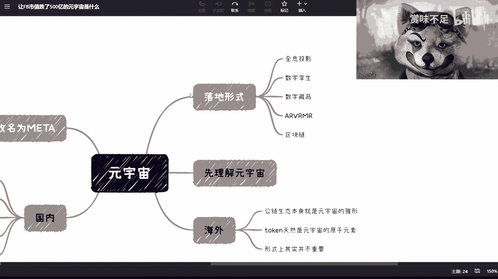

## 课程概述

元宇宙是当前科技和商业领域最受关注的概念之一。它并非一个具象化的单一产品，而是一个融合了多种前沿技术的未来愿景。本节课将帮助你理解元宇宙的本质、不同背景下的解读差异，以及它为何成为各方力量共同推动的方向。

## 理解元宇宙：没有标准答案

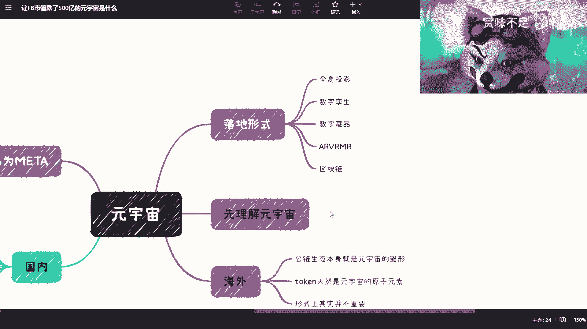

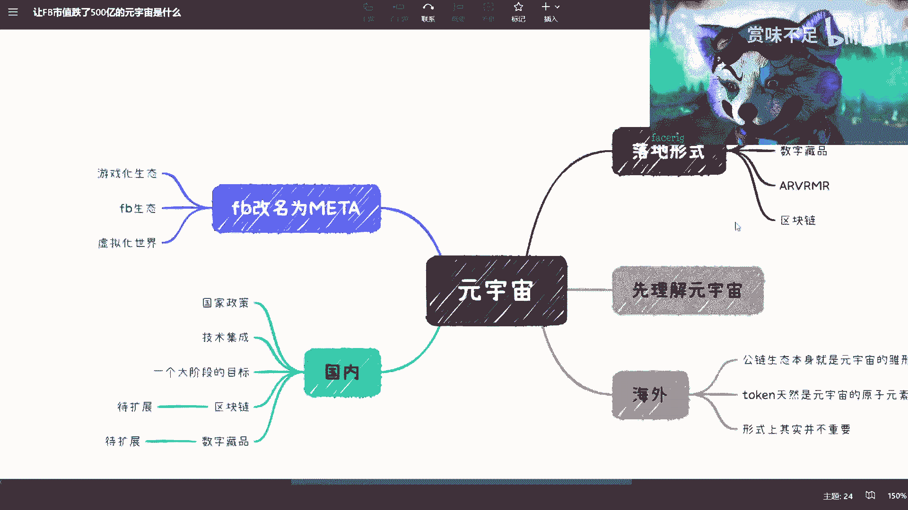

上一节我们概述了课程内容，本节中我们来看看如何理解元宇宙本身。

大众、企业、政府和技术专家对元宇宙的理解各不相同。它没有一个绝对正确或完整的定义。元宇宙更像是一个随着技术发展而不断演化的目标，站在不同的时间点看，其形态和内涵都会发生变化。

例如，从2G时代看今天的智能手机和移动互联网，那便是当时的“元宇宙”。同样，今天我们所畅想的脑机接口、完全沉浸的虚拟世界，则是面向未来的“元宇宙”。因此，理解元宇宙的关键在于认识到它的**动态性和包容性**。

## 国内视角：元宇宙作为技术集合体

理解了元宇宙概念的模糊性后，我们来看看国内为何大力推广元宇宙。

从国家政策层面看，元宇宙并非特指某个游戏或虚拟社交产品。相反，它被视为一个能够统合多项国家战略技术的“目标容器”。近年来，国家在AI、工业互联网、区块链、数字孪生、碳中和、5G/6G等领域均有大量投入和发展规划。

然而，这些技术方向分散，向公众描绘统一愿景较为困难。元宇宙概念的提出，恰好为这些分散的技术发展提供了一个**共识性的、易于理解的长远目标**。它暗示了一个需要高速网络（5G/6G）、人工智能（AI）、可信数据（区块链）、虚拟交互（AR/VR）和可持续性（碳中和）共同构建的未来数字空间。

因此，国内推广元宇宙，实质上是为一系列前沿技术发展找到了一个共同的、富有想象力的出口。

## 海外案例：Meta的雄心与困境

了解了国内的宏观策略，我们转向海外，看看科技巨头如何实践元宇宙。

Facebook（现Meta）是元宇宙领域最典型的探索者。其创始人扎克伯格将公司更名为Meta，并宣布全面转向元宇宙。Meta的愿景是整合其旗下庞大的产品生态（如Facebook、Instagram、WhatsApp），通过VR设备等入口，构建一个游戏化、虚拟化的沉浸世界。

然而，Meta的探索目前陷入困境，市值大幅波动。其根本原因在于定位的尴尬：
*   它无法像Web2公司那样获得政府在数字货币（如其曾计划的Libra稳定币）等方面的全力支持。
*   它作为中心化公司，又难以完全采用Web3去中心化社区（DAO）的运作模式。

这导致Meta在构建元宇宙的基建（如经济系统、治理规则）时面临巨大挑战，处于“上不上下不下”的中间状态。

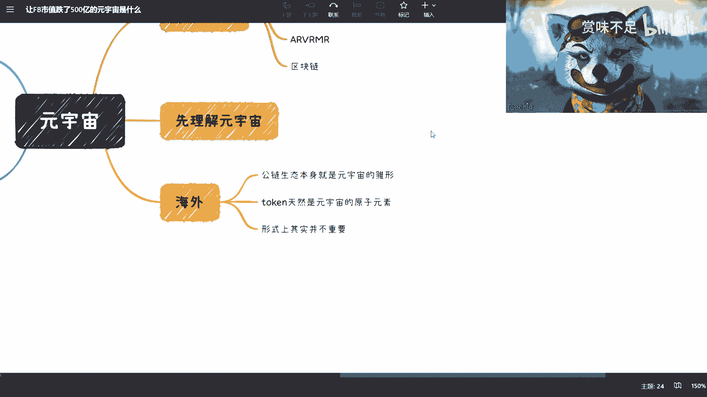

## Web2与Web3：两条不同的元宇宙路径

Meta的困境引出了一个核心问题：实现元宇宙有哪些不同的路径？

实现元宇宙主要有两条路径：**Web2路径**和**Web3路径**。它们的核心区别在于数据与资产的权属和互通性。

**Web2路径（以现有互联网巨头为例）**
目标是实现**身份、数据、资产在各大平台间的互通**。当前腾讯、阿里、百度等平台的数据无法打通，主要障碍并非技术，而是商业利益和信任问题。区块链或类似技术的关键作用在于，能提供一个可信的解决方案，让各方在保障自身权益的前提下愿意共享和互通数据。电影《头号玩家》中，玩家资产和身份能在不同游戏间无缝迁移，便是Web2世界对元宇宙的理想描绘。

**Web3路径（以以太坊等区块链生态为例）**
Web3生态本身已具备元宇宙的雏形。在以太坊上：
*   拥有原生的数字货币和稳定币作为经济基础。
*   拥有去中心化金融（DeFi）、游戏（GameFi）、社交等应用。
*   所有资产（同质化代币或非同质化代币NFT）都以**Token**的形式存在，并能在这个开放生态中自由流通和组合。

公式表示一个基础Token交互：`用户钱包 + 智能合约 -> 资产转移/交换`

因此，Web3生态省去了Web2世界“打通壁垒”的艰难步骤，其发展自然导向一个由社区共建、资产互通的去中心化元宇宙。对于Web3的参与者而言，区块链本身就是元宇宙的初级阶段，形式（AR/VR）反而不是最核心的关切。

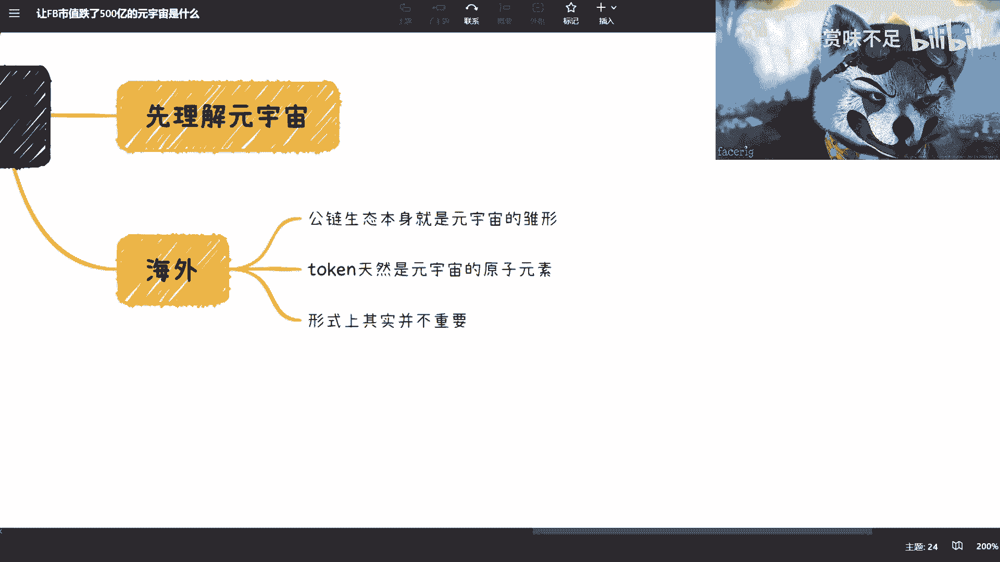

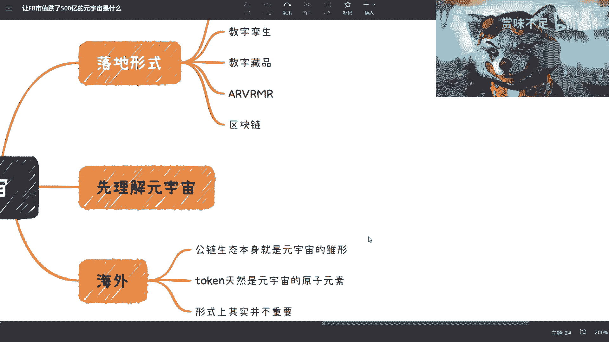

## 核心总结与要点回顾

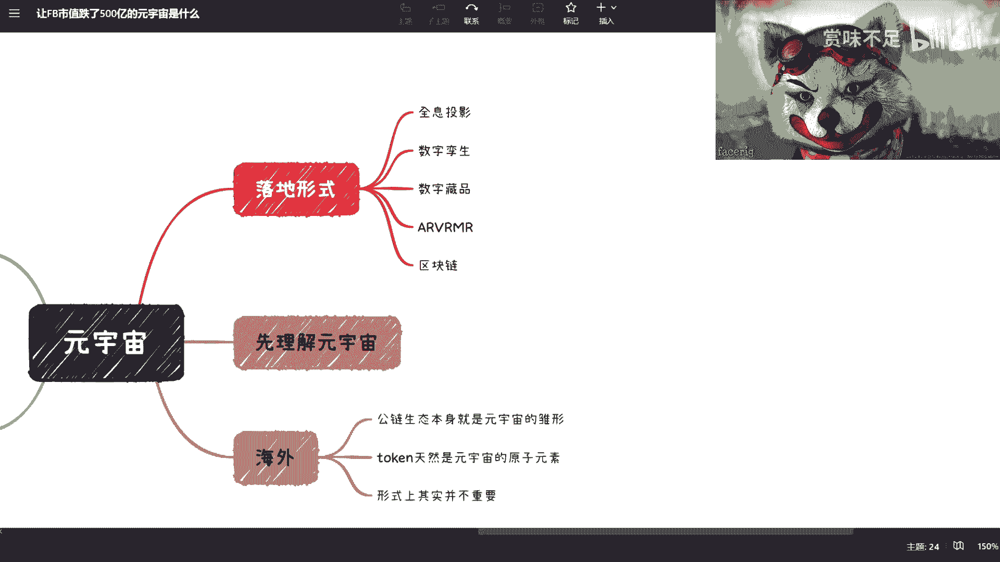

本节课我们一起学习了元宇宙的宏观框架，以下是需要掌握的核心要点：

1.  **元宇宙是未来方向，但实现路径漫长**：它代表了数字技术融合发展的远景，但具体形态和实现时间仍是未知数。
2.  **概念本身具有包容性**：不必纠结于“元宇宙”这个名称，其核心是融合多项技术、实现更高维度数字互通的理念。
3.  **国内与海外的侧重点不同**：国内视其为技术发展的集合目标；海外企业（如Meta）和Web3社区则从产品生态和去中心化网络角度进行构建。
4.  **Web2与Web3是两条根本路径**：Web2追求在中心化框架下实现互通；Web3则基于区块链，从诞生起就在构建一个资产与身份自主的开放元宇宙。
5.  **区块链技术是关键赋能者**：无论是作为Web2互通的信任解决方案，还是作为Web3元宇宙的基石，区块链技术都解决了中心化系统难以解决的数据确权、资产流通和信任问题。

---

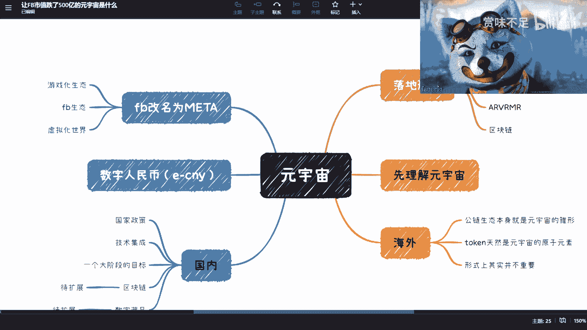

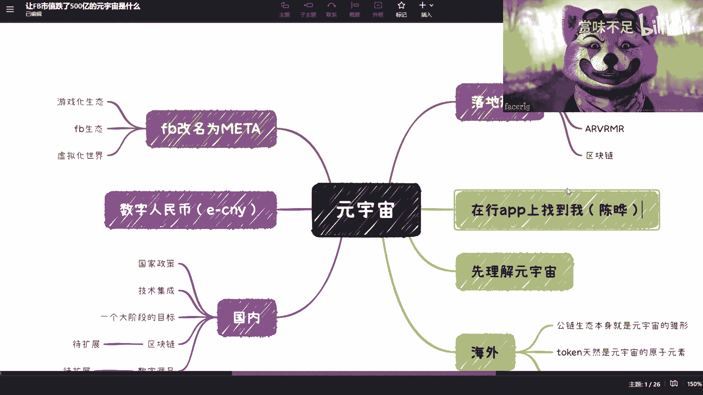

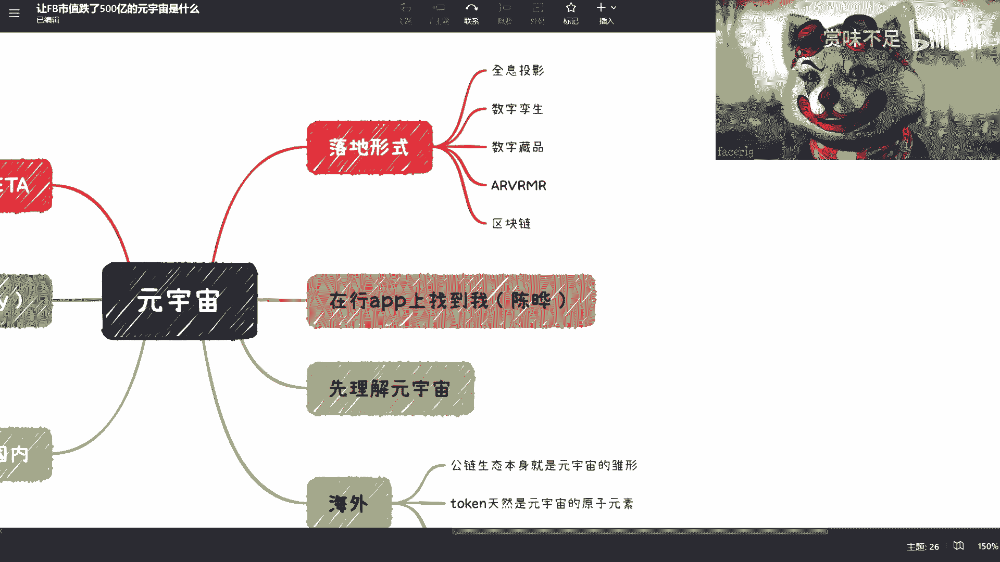

**延伸咨询方向**：
如果您对以下具体方向有进一步的兴趣或疑问，可以就此进行深入探讨：
*   国家新基建与元宇宙的关联
*   区块链技术在教育产业的商业机遇
*   Web2与Web3的融合发展趋势

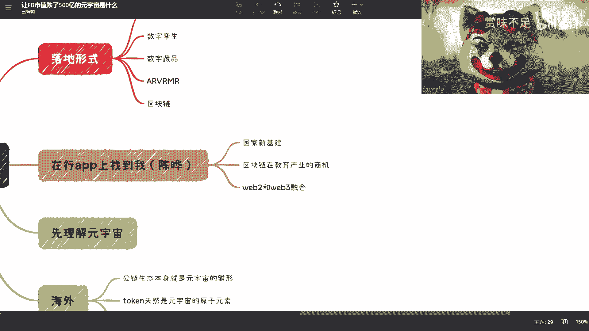

感谢学习本次课程。