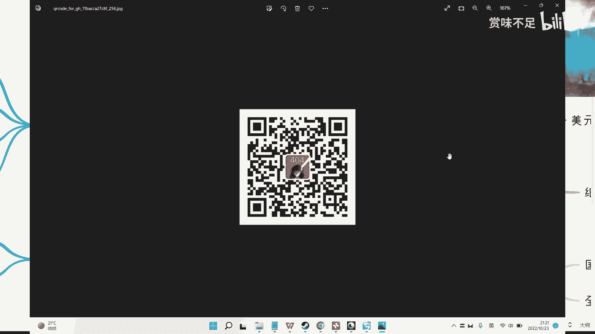

# 赏味区块链——介绍下USDT稳定币 - P1 - 赏味不足 - BV16W4y177t1

好那我们这一期啊，等一下啊，换一下，我们这一期来讲一下这个usd t啊，u s d t，同样的就是一开始呢就是还是要打一下广告啊，呃因为最近的话我是重新开的那个公众号啊。

然后这个希望大家有这个兴趣的可以关注一下啊，我会呃从三个角度啊，三个方就就就未来吧，就基本上就是三个方向的内容，一个是原宇宙，一个是我就是个人的一些，比如说日常的一些碰到的一些事情啊，啊了不了一些人啊。

跟大家分享分享，那还有一方面呢就可能关于某些问题的一些想法思考，就基本上就这三个方向。

ok然后嗯好我们回到主题，啊鉴于很多这个对于未来，因为我希望这个这个视频做到现在，其实好像十几期也有了吧对吧，然后我是希望就是说这个内容上面能够啊，这个有更多的一些这个积累嘛。

然后呃就是很多人可能看的时候也就对于很多web 3啊，或者web的东西也不是很了解，所以我会把整个面积扩大一点，那么同样的就是说这一期呢我来讲一下这个usg啊。

那么从u s d t呢是整个就是v8 也好，或者web web 3生态的一个稳定币，好在这个地方可以写一下啊，他是个稳定币对吧，我们叫做stable coin呃，稳定币之，一啊。

那么稳定币呢其实还有其他的就各种各样的一些内容，这个后面我们我会再单独再去开啊，因为所以说我把usgt会单独先列出来，那usd t是什么呢，它是一个呃中心化的一个企业，叫ta啊做的一个稳定币。

锚定美元一比一的呃，那么中心化呢就是从它的整个使用范围来讲啊，就基本上我们先说他现在的这个结论啊，就是呃u s d t这么多年啊，就是基本上我们说在web 3世界处于霸主地位啊，属于霸主地位。

然后垄断地位不但霸主还垄断呃，那么自从ui d t有了之后呢，其实呃很多，的这种这个稳定币也陆续出来啊，1819年嘛，1819年的时候就很多这个中心化的交易所啊，也发了自己属于交易所的自己的稳定币。

那那个时候呢呃这个地方我可能写一写吧好吧，交易所交易所啊，那个时候呢有很多人会问啊，他说我为什么要交易所，为什么要去发稳定币，因为稳定币这个东西呢，它本身是没有任何的涨幅空间呢对吧。

那有很多人说为什么要去发稳定币，那其实也很简单，就是交易所发的稳定币是相当于是印钞对吧，就告诉大，家我这个是稳定币呃，那么你要跟这个交易所稳定币去交易，你一定拿的是交易对里面的另外一方。

那另外一方是什么呢，有可能是u s d t啊，有可能是btc，也有可能是以太坊对吧，也有可能是比如说索兰娜对吧，或者各种各样的以前逼逼多了对吧，那但是呢有一点就是说我们相当于拿的是有价值的这个数字货币。

跟它原本啊这个印出来没有价值，数字货币，或者说没有价值的稳定币在做交换啊，但是你说他以后有没有价值，这个取决于它生态做得多大对吧，所以说这个本身就是交，易所做稳定币呢。

就是啊就这个目的已经比较明确了对吧，那我们再往下面看啊，就整个这个呃usd t呢这个占领了霸主地位之后呢，也有很多的其他的这种项目方啊，这个企业会来做别的一些这个稳定币，那有很多人会觉得啊。

那你你已经有一个usd t了，为什么就还有别的企业来做，或者是别的企业做的时候呢，它有哪些啊，就是说这个能够打动用户的痛点对吧，就是能够改变的对吧，那么在这个地方呢，我们说啊就是有很多企业为什么做呢。

是因为啊u s d t这边整个行业其实大家，可以去搜啊，或者万一以后就是就出现了一些问题啊，对吧等等等，那你总归得要有个白up的方案嘛，啊备选方案那么很多别的就相当于把资产分布到别的这种稳定币上面。

那其实就变成了一个避险的一种方案，就是去中心化的那个稳定币呃，也出来很多，那么同样的就是整体的这个支持力度啊，用户的接受度其实也都，不一样，那么我们说从整个使用范围来讲啊，我看看大家看得见吗，看得见啊。

就从整个使用范围来讲呢，哎呀就是国内国外哦，国内全球就国内呢它反而是用u s d t用的比较多的啊，因为大家都知道嘛，就是啊这个亚洲啊对吧，华裔啊啊尤其国内啊对吧，这个数字货币整个占有量还是很高的啊。

参与者还是很高的，那么呃用usd t的比例是很高的，因为为什么呢，因为毕竟都是中心化的产品嘛，那么在全球范围内，其实我现在因为毕竟现在2020年底了，我不我不保证我讲的就一定是，对的啊。

但是我就跟大家分享，就我以前所知道的，就是说在之前我沟通下来呢，就是说呃在全球范围里面呃，基本上呢会是就是对去中心化的稳定币的接受度会略高于中心化，或者远高于中心化啊，因为为什么呢。

因为呃全球范围里面的这个参与方案，他会觉得去中心化的稳定币它是安全的，而中心化的稳定币它是不安全的啊，但是在国内反而恰恰是相反的啊，那么这一点呢其实是一个这个比较大的一个区别点。

但是我不清楚就是说这个海外这个老外用的时候，是不是比如说都是，用原用用那个驱逐优化稳定币的，还是说区别开来，比如说我这个这个只有在区区文化交易所上面，用的是驱逐硬化稳定币啊。

其他可能怎么样怎么样怎么样情况下面我可能因为usd t啊，这个我也不是很清楚，那么我们从增发的角度来讲呢，一个是大家可以去看一下那个呃清华五道口视角，这个我忘了他有一个金融的报告。

他有一个专门关于s d t的报告啊，这个是可以看一下，第二呢就是说呃我觉得关于增发这个背后啊，因为现在基本上已经不知道多少亿了嘛，不知道几十个亿，了嘛对吧，那我们说其实本质上很简单，就是我们试想一下。

如果是你对吧，你背后是一比一的一个抵押啊，那么你是不是就就当你增发到比如说几10亿美金的时候，你是不是还会一比一的去猫这个这个这个叫什么，就是低压对吧，我觉得这个就如果是你自己想看啊。

因为这个就是就没有人能有个定论嘛对吧，大家只能猜想嘛，那么当然usgt在这么多年里面呢，这个为了整个生态，它还是呃有蛮多的这个这个这个叫什么发展的啊，支持，因为否则的话你其实就没有办法把整个面打开嘛。

对吧，你比如说e r c啊，o mini t i c呀对吧等等等等等，有很多就大家现在在那个呃叫什么，就是交易所上面去交易的时候，你们会发现你虽然是u s d t，但是它整个协议有很多很多很多啊。

那么其实它就相当于是在不同的链上，那当然不同链上有区别于什么呢，交易的快慢也不一样啊，好去看一下，那关于s d t呢，其实我最后就是想到的时候，其实想到了，这么个聚焦g超屋啊，纸钞屋。

那么纸钞屋这边呢它有一个那个现在已经大结局了嘛，大家可以去看一下，我觉得这个呢其实也是现在就是web 3也好，未来web 3也好，其实呃往两个方向发展吧，啊就一个方向呢就是说就有可能暴雷。

那暴雷就就就连环，因为usd t整个面太大了嘛，它一旦爆裂，整个就基本上属于那种连环爆，就整个面就会爆掉，但是你要说赢是不是，比如web 3毁灭性打击，我觉得不是啊，他还达不到毁灭性打击。

但是这个打击面广告就是那种可能就这个最广的一个项目了没，有哪个项目比它爆雷更广了对吧，那这是一种可能性，还有一种是什么呢，就是说呃也许他会报，但是呢就我就说也许他暗地里汇报啊。

但是呢其实表面上可能没什么太大问题，就是大家这个一切平安，一切和好对吧，所以说呢我觉得就是呃就跟纸上物的最后结局是一样的，就是他用了一个虚假的哦一个抵押，其实这个结局跟usd t很像诶。

不能叫usd很像吧，就跟现有的这种模式很像，就是说他用了个虚假的东西，其实是为了稳定住经济的啊，但是他用了一，些虚假的方式让民众让全球的人都觉得啊他们的经济，这个国家的经济是稳定的。

因为它的作用其实是稳定经济，那我觉得s d t也是一样的，就是也很有可能未来一种可能性是说他可能暴雷，但是他爆了之后呢，呃就为了不影响整个web 3的生态，为了不影响整个web 3以外的全球性的经济。

那可能会就是说也是用一种虚假的这种方式啊来保证住整个的经济啊，虽然就是就是大众都不知道它背后的这个抵押物到底是多，少嘛对吧，可能比如说它增发了100个亿，他抵押物就十个亿，对也有可能。

但是为了保证整个的一个整个市场的一个一个叫做稳定性对吧，那么最终可能相安无事，就只是往前走也有可能啊，所以我觉得就是从目前来看，就是因为它量已经足够大了，你要说他一定会爆，我个人的判断啊。

我个人的这个这个这个逻辑，从各方的这个报告来看呢，就是呃说他爆的概率是很高的，但是我个人是觉得因为量太大了，所以我想我还是比较偏向于就是说呃你说会有震动吗，会有震动，但是他不不就，是哪怕爆了。

它最终的一个影响面，应该也不会说这个直接插入出来，应该还是会有一些这种叫做叫做后备方案的哦，所以基本上我觉得是这么个情况啊，ok那么我们这个这一期吧，就讲这个稳定币的，我就先讲到这吧好吧。

然后后面的话我会再把那个那个叫什么，就是呃去中心化稳定币啊。

