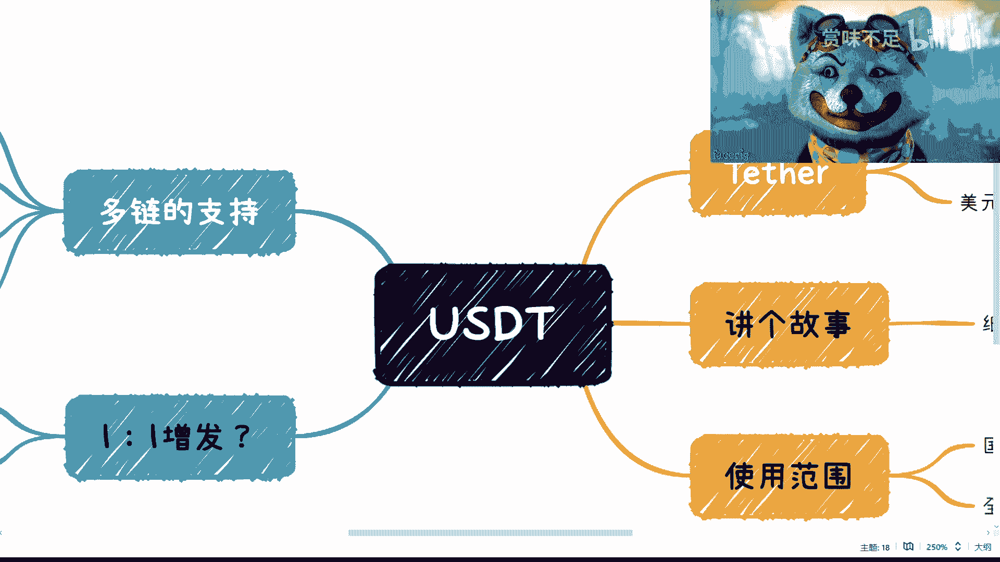
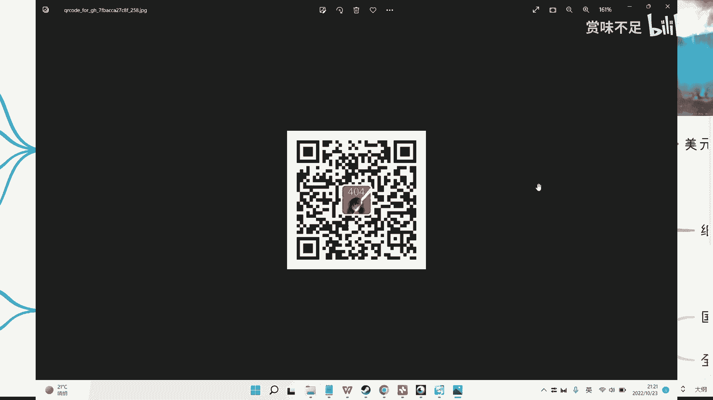
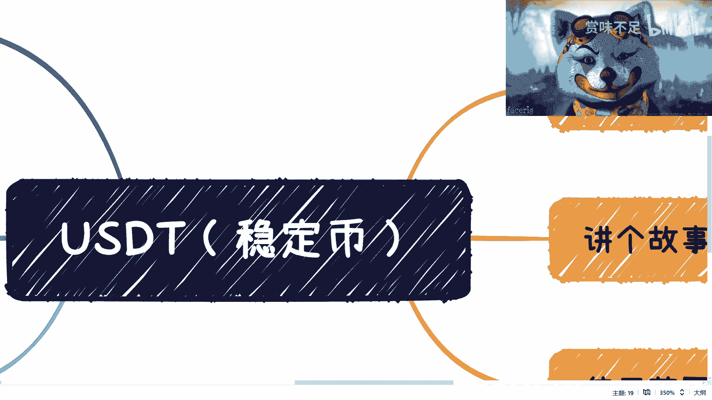

# 赏味区块链课程 P1：USDT稳定币介绍 💱

在本节课中，我们将要学习什么是USDT稳定币，它在Web3生态中的角色，以及其中心化特性、市场地位和潜在风险。我们将以简单直白的方式，帮助你理解这个看似复杂但至关重要的概念。

---

上一节我们介绍了课程概述，本节中我们来看看USDT的基本定义。

USDT，全称Tether，是Web3或加密货币生态中的一种**稳定币**。稳定币是一种旨在保持价格稳定的加密货币，通常与法定货币（如美元）挂钩。

USDT是一种由中心化企业Tether发行的稳定币，其设计目标是锚定美元，保持**1 USDT = 1 USD**的汇率。

---

上一节我们了解了USDT是什么，本节中我们来看看它的市场地位。

从使用范围来看，USDT在Web3世界处于霸主乃至垄断地位。自USDT出现后，许多中心化交易所在2018-2019年间也发行了属于自己的稳定币。

以下是交易所发行稳定币的核心目的：
*   **创造流动性**：交易所发行的稳定币相当于“印钞”，为平台创造基础交易媒介。
*   **锁定资产**：用户需要使用有价值的数字货币（如BTC、ETH）来兑换这些稳定币，从而将资产锁定在交易所生态内。
*   **扩大生态**：稳定币的价值和影响力取决于其生态的规模和发展。

---

上一节我们探讨了USDT的垄断地位，本节中我们来看看其他稳定币存在的意义。

尽管USDT占据主导，但仍有其他项目方或企业发行不同的稳定币。这主要出于以下考虑：
*   **风险分散**：作为USDT的潜在备选方案，将资产配置到其他稳定币是一种避险策略。
*   **理念差异**：去中心化稳定币的出现，满足了部分用户对更高安全性和透明度的需求。

值得注意的是，用户对稳定币的偏好存在地域差异：
*   在国内，用户更倾向于使用**中心化**的USDT。
*   在全球范围内，用户对**去中心化**稳定币的接受度可能更高，因为他们认为其更安全。

---

上一节我们分析了市场格局，本节中我们来关注USDT的增发与潜在风险。

USDT的发行量已增长至数百亿规模。一个核心问题是：其增发是否始终有足额的美元资产进行**1:1抵押**？这引发了社区对其透明度和潜在风险的持续讨论。

为了支持整个生态的发展，USDT已扩展到多条区块链上，例如：
*   **ERC-20** (以太坊)
*   **TRC-20** (波场)
*   **Omni**

在不同的链上使用USDT，会影响到交易速度和手续费。

关于USDT的未来，可以类比电视剧《纸钞屋》的结局，存在两种可能性：
1.  **暴雷风险**：如果抵押不足的问题暴露，可能引发连锁反应，对市场造成广泛冲击。
2.  **系统维稳**：鉴于其体量已足够庞大，为了维持整个Web3乃至更广泛经济的稳定，相关方可能会采取措施，避免其彻底崩溃，即使背后存在抵押不透明的情况。

目前来看，虽然报告指出其暴雷概率存在，但由于其系统重要性，最终引发毁灭性打击的可能性或许较低，更可能的结果是伴随一定市场震动后，由后备方案进行维稳。

---

本节课中我们一起学习了USDT稳定币。我们了解了它是Tether公司发行的、锚定美元的中心化稳定币，在市场中具有垄断地位。我们也探讨了其他稳定币存在的意义、用户的地域偏好差异，以及围绕USDT增发和抵押透明度的核心争议与潜在风险。理解USDT是理解当前加密货币市场流动性和结构的关键一步。

在接下来的课程中，我们将继续探讨**去中心化稳定币**，看看它们如何尝试以不同的方式解决价值稳定和信任问题。