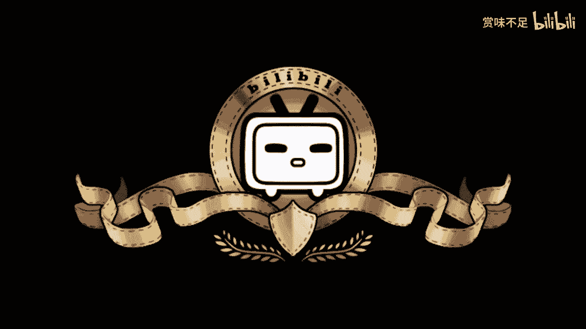
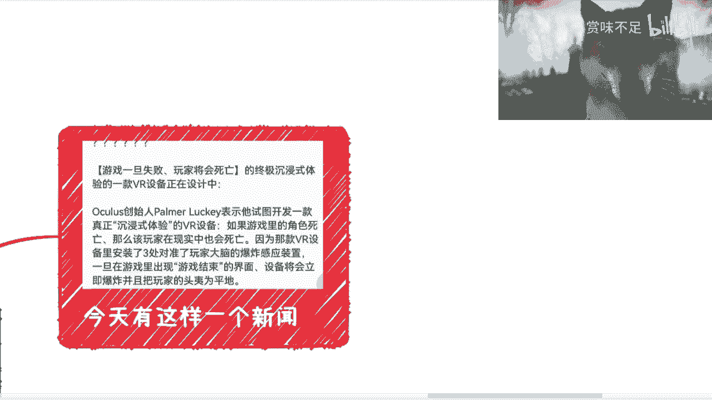

# 赏味区块链--元宇宙并不是只有ARVR---P1---赏味不足---BV1vG411w7vL_not

## 概述

在本节课中，我们将要学习元宇宙的核心概念，并澄清一个常见的误解：元宇宙并不仅仅等同于增强现实（AR）或虚拟现实（VR）。我们将探讨元宇宙的不同展现形式，并理解其作为联通生态的本质。

---

## 元宇宙的展现形式

上一节我们概述了课程目标，本节中我们来看看元宇宙有哪些不同的展现形式。许多人将元宇宙直接等同于AR或VR技术，但这只是其可能的入口之一。

以下是几种常见的元宇宙展现形式：

*   **纯VR设备**：例如电影《头号玩家》中的设定，用户通过VR头盔和体感服装进入完全虚拟的世界。
*   **纯AR体验**：例如《刀剑神域》剧场版或早期的《宠物小精灵GO》，将虚拟信息叠加到现实世界中。目前，实现对整个现实环境的无缝AR覆盖仍是技术挑战。
*   **潜行技术**：这在《刀剑神域》第一部或《盗梦空间》中有所体现。用户意识直接接入虚拟世界，其技术原理（如脑电波或深度催眠）尚不明确，但这是一种与AR/VR不同的深度沉浸形式。

因此，从“元宇宙”这个概念出发，AR和VR未必是唯一或最合适的形态。目前看来，能够实现深度意识交互的“潜行”技术或许是更符合元宇宙愿景的形态。

---

## 对现有“虚拟空间”的思考

了解了不同的技术形式后，我们需要思考这些技术构建的“虚拟空间”是否就是元宇宙。许多现有的应用，如虚拟社交、线上会议、数字博物馆等，其实早已存在。

对于这些领域的从业者而言，元宇宙更像是一个“出圈”的概念。他们看到的是原有的技术被套上了新的外壳，而核心体验并未发生根本性的突破。游戏领域更是如此，成熟的游戏引擎早已能构建复杂的虚拟世界，其发展并非完全由元宇宙概念驱动。

AR/VR技术近年发展迅速，但它们本质上只是一种**展现形式**。不能因为某项技术变得流行，就简单地将其与元宇宙划等号。

---

## 元宇宙的核心：联通的生态

那么，什么才是元宇宙更核心的特质呢？我们接下来探讨这一点。无论采用何种展现形式，我们更应关注的是其底层结构：它是一个个孤立的生态，还是多个联通的生态？它是否包含成熟的经济体系？

我们可以用一些互联网产品来类比：

*   **单一产品**：如早期的支付宝，它主要是一个支付工具，并非一个完整的生态。
*   **多个孤立产品**：如国内一些互联网巨头的产品矩阵，它们之间可能存在壁垒，互通并不顺畅。
*   **联通的生态**：这才是元宇宙应该具备的形态。以埃隆·马斯克对Twitter（现称X）的规划为例，其目标似乎是整合社交、支付（如计划中的“余额宝”）、NFT、Web3乃至电商等功能，构建一个**多个服务联通且具备经济体系的完整生态**。

这就像解数学题和证明数学猜想都使用了同一个公式，但两者的意义和难度截然不同。同样，我们不能因为AR/VR是元宇宙可能的表现形式，就认为元宇宙就是AR/VR。元宇宙的核心在于创造一个**无缝联通、具备内生经济系统的数字世界**。

---

## 总结

本节课中我们一起学习了元宇宙的基本概念。我们明确了元宇宙并不仅限于AR或VR技术，它还可以通过“潜行”等更深度的交互形式实现。更重要的是，我们认识到元宇宙的本质不在于某一种炫酷的展现形式，而在于其是否构建了一个**互联互通、拥有活跃经济体系的数字生态**。理解这一点，有助于我们更清晰地看待目前市场上各种各样的“元宇宙”概念和产品。