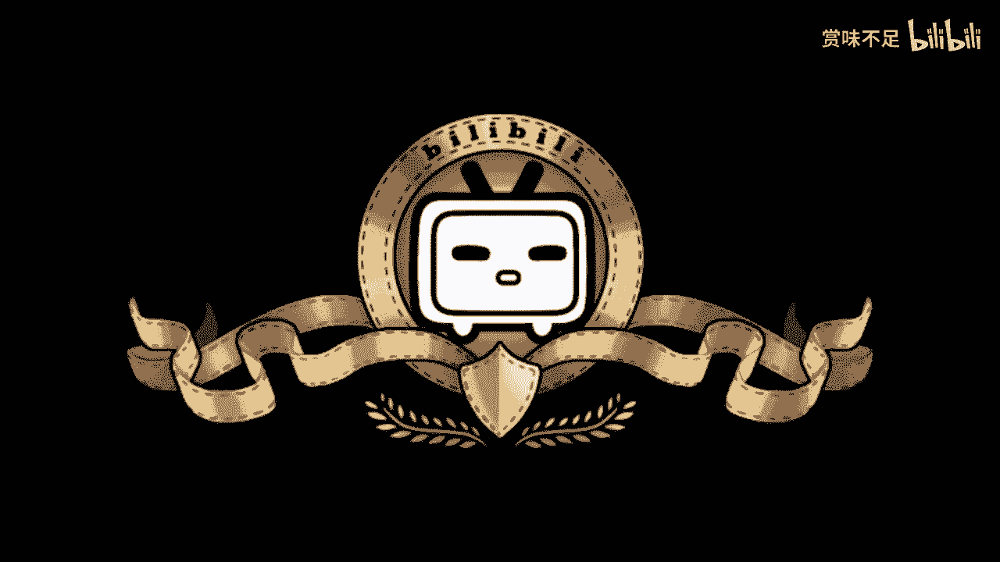

# 赏味区块链——全面阐述国内区块链发展瓶颈 - P1 - 赏味不足 - BV1Hm4y1c7hB

哎呦喂哎呦喂。

啊好大家也都知道啊，就这两天因为我在海南给那个省政府这边做闭门的培训啊，就是其实也蛮多东西啊，但是现在可能我不太好说哦，我不太好说，所以说呢就是先把我们还是我我就来先说一下。

因为这两天也讨论到这个问题啊，啊我因为我就一边说，一边来补全这个x mx m，我觉得是这样子的啊，首先呢就是说是边界不清楚，就在这个地方呢，就是说因为这两天大家也都知道嘛，对不对啊。

那我觉得这个就像我这两天说的，我把它放大一点啊，就像我这两天说的，我也说了，重要的是它很清晰，什么叫很清晰呢，那我们在我在这里面写的很清楚，比如说人家叫n f t，就叫nv t。

他都不不会给你很隐晦的叫什么什，么什么什么数字文创对吧，那比如说比如说稳定币对吧，那我叫稳定币就稳定币对吧，我也不叫什么别的一些东西对吧，不藏着掖着对吧，带壁画这个东西呢，其实真的是一个叫做嗯。

这个人也聊了一下，就是说呃带壁画的问题对吧啊，就是边界不清晰啊，给你不清晰，那这个其实就是说呃，大家在做这块的时候，其实就总是面临这个问题嘛，就不管你说是b也好，还是这个数字藏品也好。

就是好像什么都能做，又好像什么都不能做，对吧，说了等于没有说，首先这是第一点啊，那第二点呢我觉得就是联盟链对吧，联盟练这边呢我觉得啊是这样子的，就是啊我们现在不去判断未来怎么样对吧，我呢也肯定不会说啊。

abcd做得不好对吧，但是呢我觉得我站在2022年年底的这个时间啊，我觉得我历史去看，我认为联盟链的发展方向不对，那为什么不对呢，就是就不应该去说啊，我们就凭空出一个联盟链，然后说啊开始召集节点啦对吧。

开始什么什么什么呃，这个这个这个呃做联盟了对吧，我不点名啊，我我这个我也以免造成矛盾对吧，不点名啊，但是呢就是说我觉得这个方向不对，为什么，因为这么多年下来了，他方向就是不对对吧，就是说你到现在为止。

然后有东西落地嘛也没有对吧，那当然啊就有很多人也会说啊，那电子发票不是吗对吧，那那个什么疫苗溯源不是吗对吧等等等等等啊，那我觉得很简单，我就觉得就是大家这个上面共识是很一致的，就是你什么叫落地啊。

你能给别人赚到钱，叫做落地对吧，你能够真正走入老百姓生活，这叫落地，你别的都叫叫什么对吧，你最多叫个demo对吧，那我觉得这个是一方面，就是说真正的逻辑应该是说呃，它的这个技术上面没有什么很大瓶颈。

你知道吗，就是说我们只要我们又不是为了去挑战双11，挑战618对吧，其实本质上有很多东西是蛮成熟的，那现在就是说我们得要找一个合适的切入点啊，哪怕再细的或者怎么样，这个没关系啊。

就是找一个切入点把它做深对吧，那么这个时候呢一边做一边，我们会把这个联盟链，比如说技术上啊对吧，或者怎，么样啊，就是就把它补全啊，那么这个是一个叫做应用去推动整个联盟链发展啊。

那现在不是现在我看到的就是联盟链都是凭空出来啊，就是联盟链凭空出来，但联盟链的需求也不知道在什么地方也是凭空yy的，那么你比如那么这个时候就是做呢，它其实是很难做的，那么我们再往下来看啊。

就是那个瓶颈也还有很大一块呢，就是教育，那教育在这个地方呢，我比如说我写的，那我们说的教育不仅仅是培训啊，比如说政府对吧，比如说这个企业对吧，那我们说我们说啊，其实那个你你所有。

这个产品技术推动的一个本质是资本，那资本我们说政府也好，企业也好，大家作为一个生意人，就是我要赚钱对吧，那么我们说退1万步来讲，我不赚钱，那你总不能你总不能跟一个这个企业家说啊，你这两者都不行对吧。

你必须亏钱，那还做什么不要做，对不对，那但但是呢在这个当中我们说教育非常缺失的这个点在哪里呢，以至于就是说很多合作的时候，他没有办法合作，这就好像你今天在，跟就是你就这么说吧。

就是说一个纯web 3的原住民，跟一个web 2的不懂web 3的人非要去合作web 3，那永远是讲不通的对吧，这就好像web 2的那个人问他比特币为什么这么贵，desland为什么这么贵。

nf t为什么这么贵，然后花了五六个小时去讨论来发现根本讲不通，所以说呢其实这个问题上面也是一样的，已经是做了，就是叫做啊，比如说呃世俗规划对吧，就既然做了相关的政策，那么就应该就是说政府啊。

企业啊得要去有，那么你才能合作下去，而不是说你比如说像我现在跑到杭州啊，跑到安徽，要跑到各个地方，就是看似好像是能合作的对吧，甚至有种排斥的感觉，那你怎么往下去合作，没有办法合作对吧，你吃了再多的饭。

喝了再多的酒，你到最后也是一场空，那这个其实是目前也是很大的瓶颈，还有一点是什么呢，就是生态啊，还有生态，那生态呢我们就是举个例子来讲，那我们说为什么这个生态你比如说拿数字藏品，来举例子对吧。

你数字藏品我们举比如说啊，比如说啊你要这个这个这个叫什么，就是版权啊，我们举举个例子，比如说版权登记对吧，好现在有人登记吗，没有对吧，那没有啊，比如说版权认证啊，有人来认证吗对吧。

你这个东西怎么算是这个多少价值呢对吧，评估哦，后来就叫版权认真加评估对吧，有吗也没有，那你有多少价值呢，得值多少钱呢，对吧也没有对吧，那么你说版权登记版权认证评估，那么接下来是什么。

就是比如说互联网法院对吧，那么还有什么就是应用，啊应用对吧，那我们说我们说你会发现这些东西它是缺失的，不是并不是说他现在没有啊，而是说它没有真正的跟我们说的练，或者我们说的藏品去打通。

就是你会发现就是说我们现在的整个东西它只是一个点，就是只是一个平台，它是没有生态的，那你说他怎么发展，它没有办法往下发展对吧，这个应用昙花一现对吧，或者说就感觉虎头蛇尾，他他没办法。

你让他怎么个虎头虎尾巴，对不对，就是因为他现在整个的一个发展，的流程，这个趋势就不对啊，它就应该是就是说生态有了，你比如说有了产品之后，应用怎么用呢，那你像alan mask收购twitter。

twitter上面就直接可以交易n f t，twitter可以去用呃，呃isram以太坊上面的n f t来做头像，这个就叫应用对吧，那么他现在是生态也有了，应用也有了n f t底层也有对吧。

那你反观书藏呢对吧，它没有，那你让他怎么做呢对吧，所以说呢我在这个地方这两天沟通下来还有个点，我就在这里顺便提一下，以后再说啊，可能不太方便讲，就从目前的情况来看呢，就是呃联盟联，我们这么说吧。

就是首先是第一个联盟链和功力打通，我们这个打通，大家千万不要觉得它是完全打通，我们只能说部分打通这个未来是很有可能的，这第一点第二点是什么呢，就是就是尾巴二世界直接引用供应。

这个从目前来看呢也是非常有可能啊，也是非常有可能就是他未来发展早晚是要到这一步的啊，当然所以说就是我还是那句话，就是说嗯这个打通也好啊，这个引用也好，它肯定是有业务范围的啊，但是不管怎么样。

这个是早晚的事情啊，早晚的事情，那么所以说我觉得以前啊可能大家都还是一种就是猜测和一种展望，但是我这两天工作下来，我觉得就是很清楚的，但你说多少时间我说不好啊，我说不好，改变比如说这个互联网啊。

唉或者说这么说吧，就是就是我被问到的这个问题这么说的，或者说他说陈老师，才会从现在的量变突破到质变，这个呢我就放到下一期好吧，放到下一期再讲，好那么我觉得目前呢其实整个瓶颈是非常清楚的。

就是说如果啊我在这个地方再讲一下啊，就是如果从2023年开始，教育还不跟上啊，边界也不再清晰呃，叫做联盟链的整个发展方向也不改变的话，那我觉得这件事情就很难了啊，就很难了。

就容易出现一种叫做叫做骑虎南下对吧，就是说政策已经很清，就是就是大方向已经很清晰了，但是就是历史不出来好，那么这个我觉得真的就是说呃无论是创业者还是政政府端啊，都要去考虑这些问题。

好那么这个我就先讲这些吧。

