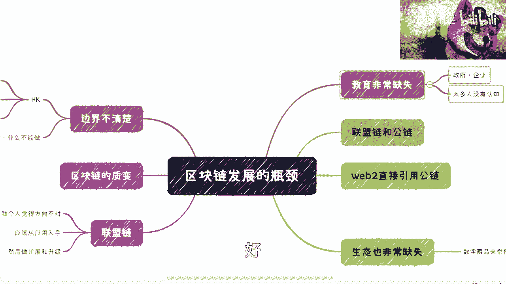

# 区块链入门课程 01：全面解析国内区块链发展瓶颈 🧱

在本节课中，我们将深入探讨当前国内区块链领域面临的主要发展瓶颈。我们将从边界定义、技术路径、行业教育和生态建设等多个维度进行分析，帮助初学者理解行业现状与挑战。

---

## 边界不清晰：什么能做，什么不能做？🤔

上一节我们介绍了课程概述，本节中我们来看看第一个核心瓶颈：边界不清晰。

当前国内区块链领域，许多概念的定义和应用边界非常模糊。例如，国外明确称为 **NFT（非同质化代币）** 或 **稳定币** 的项目，在国内可能会被隐晦地称为“数字文创”或其他名称。这种不清晰的命名和定义，导致从业者面临“什么都能做，又好像什么都不能做”的困境，政策指导如同“说了等于没有说”。

**核心问题公式化表达为：**
`业务可行性 = 模糊(政策边界)`

这种模糊性极大地阻碍了具体业务的设计与落地。

---

## 联盟链的发展方向偏差 🛤️

在理解了边界问题后，我们再来审视技术路径的选择。目前，国内区块链发展很大程度上依赖于联盟链。

然而，从历史视角看，许多联盟链的发展方向可能存在偏差。常见的模式是：先凭空构建一条联盟链技术，然后才开始召集节点、寻找应用场景。这种“技术先行，需求后置”的方式，导致多年发展下来，真正能创造商业价值、走入大众生活的“杀手级”应用寥寥无几。

真正的逻辑应该是 **应用驱动技术发展**。即先找到一个哪怕非常细分的真实业务痛点作为切入点，在解决实际问题的过程中，逐步完善和推动底层联盟链技术的发展。而不是反过来，让技术去凭空想象需求。

**核心逻辑代码描述为：**
```python
# 错误的发展路径
def develop_consortium_chain():
    build_chain_technology() # 先凭空造链
    find_use_cases() # 再艰难寻找应用场景
    result = "落地困难，缺乏价值"

# 理想的发展路径
def develop_consortium_chain():
    identify_real_pain_point() # 先找到真实痛点
    develop_minimal_solution() # 开发最小化解决方案
    iterate_and_scale_chain() # 在应用中迭代并扩展链技术
    result = "价值驱动，持续发展"
```

---

## 行业教育的严重缺失 🎓

技术路径的偏差，部分源于行业认知的不足。接下来，我们探讨第三个瓶颈：教育缺失。

这里的“教育”是广义的，不仅指专业培训，更包括对政府决策者、企业管理者等关键角色的认知普及。任何技术和产品的推动，本质是资本和商业逻辑的驱动。无论是政府还是企业，其核心诉求都离不开“创造价值”或“获得收益”。

目前最大的问题在于认知断层。一个纯粹的Web3从业者与一个完全不了解区块链的Web2企业家，几乎无法进行有效合作。双方会在“比特币为何有价值”、“NFT为何昂贵”等基础问题上陷入无休止且无效的讨论。

因此，在政策规划之后，必须配套相应的认知提升工作，让合作双方能在同一语境下对话，否则一切合作都难以实质推进。

---

## 生态系统的孤立与断裂 🌱

最后，我们来看看生态建设的问题。一个健康的技术生态需要多方协同。

以数字藏品为例，一个完整的版权生态应包括：版权登记、版权认证与价值评估、法律保障（如互联网法院）、以及丰富的应用场景。然而现状是，这些环节要么缺失，要么与区块链及数字藏品本身是割裂的。

当前国内的许多区块链应用只是一个孤立的“点”或“平台”，没有形成彼此联通的“生态”。这导致应用昙花一现，难以持续发展。相比之下，成熟的生态如以太坊，其NFT可以直接在Twitter（现X）上交易或用作头像，实现了底层资产与上层应用的无缝衔接。

**生态健康度对比：**
*   **断裂生态：** `数字藏品平台` ←╌╌╌→ `版权登记` ←╌╌╌→ `应用场景`
*   **联通生态：** `NFT资产` ←→ `交易市场` ←→ `社交应用` ←→ `金融工具`

未来的一个重要趋势，可能是联盟链与公有链在特定业务范围内的部分打通，以及Web2世界直接引用公有链资产。这将是生态融合的关键一步。

---

## 总结与展望 🔮

本节课中，我们一起学习了当前国内区块链发展的四大核心瓶颈：
1.  **政策与业务边界模糊**，导致方向不清。
2.  **联盟链发展路径偏差**，“技术先行”而非“应用驱动”。
3.  **行业教育严重缺失**，关键角色间存在认知鸿沟。
4.  **生态系统孤立断裂**，缺乏多方协同的繁荣生态。

如果从2023年开始，教育普及、边界厘清和发展路径调整等问题仍得不到改善，整个行业可能会陷入“骑虎难下”的困境：顶层设计明确，但落地应用始终无法大规模涌现。

对于创业者和政策制定者而言，正视并着手解决这些瓶颈，是推动区块链技术真正创造价值、实现高质量发展的关键前提。

---



