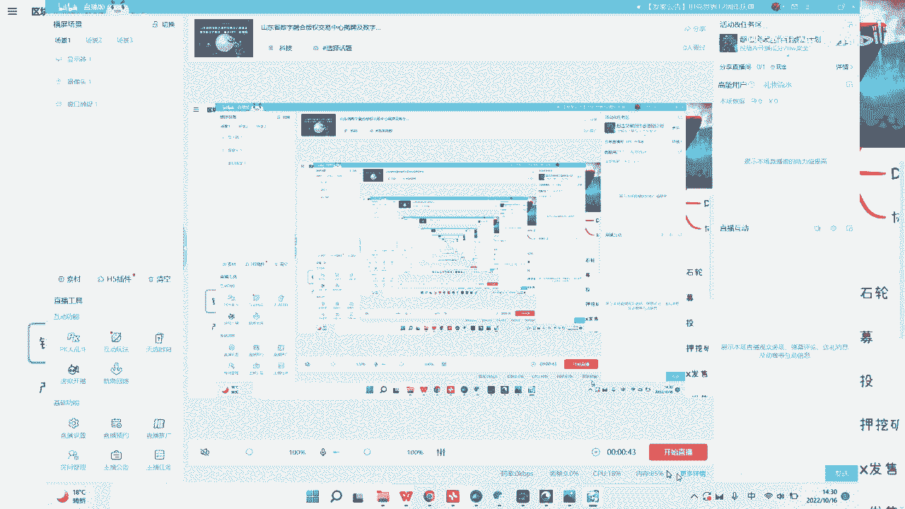
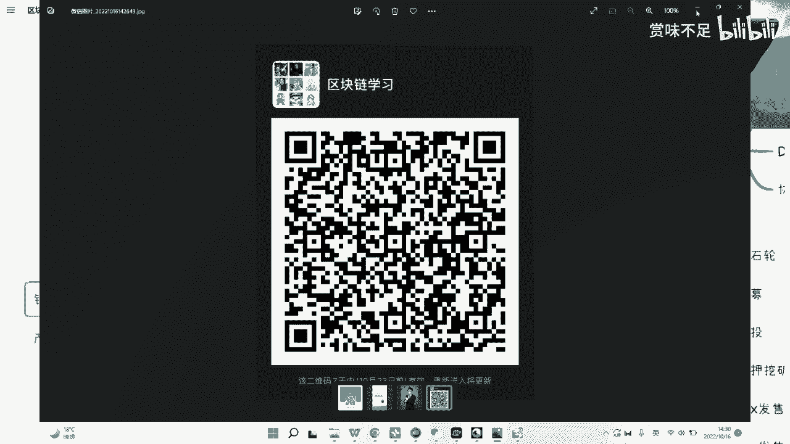

# 赏味区块链——区块链如何更好的ICO - P1 - 赏味不足 - BV1LP411N7Jv

哎呦喂哎呦喂。

啊大家好啊，好久不见，我最近因为两个这个微博号都被封了，所以说就可能视频更新的有点慢，然后更新完了，我就先放b站或者放其他地方了好吧，然后啊大家看到我又换了一个，换了一个小姐姐，对不对。

啊然后这一期对吧，因为当中也有蛮长时间没有这个更新了，那么我在这个地方呢，可以先给大家看一下这个最新的这个群啊，群哎呀呀呀，鼠标呢就大家可以看一下最新的这个群。

因为之前的话他每一期视频我都放了一个，但是呃时间比较长了嘛，所以说之前就已经过期了好吧，大家有兴趣可以扫一下嗯，就如果要过来炒作的就算了啊，避免啊。

ok，好那么这一期的话呢我主要是想讲一下这个i c o啊，啊讲一下s o呃，因为之前呢其实大家也都知道啊，就是比如说大概1161781718年那段时间哦，可能就说i c o还是比较盛行的呃。

我这边主要就是简单说一下，因为基本上这个视频上面呃内容会就比较短嘛，然后另外一方面的话呢，就是我也在考虑啊，就接下来可能会找些投资人呐，啊找一些这个行业里面的人跟大家聊一下一些相关的话题啊。

就i c o之前的话呢，就产品类型我们说有几个呃，一个是公有链啊，公，有链一个是这个dp啊，一个是这个协议，就是所谓的合约，就相当于贷款呢是属于应用层这边的，那协议合约这边可能是属于中间件啊。

像那个技术层这边的啊，那么这样子呃方式呢其实很多对吧，就i c o我们说白了就是大家啊不管了解不了解吧，就说穿了他就是一个募资嘛对吧，那募资呢也有很多啊，就比如说像基础能啊，斯穆伦呐对吧。

空投啊啊抵押挖矿啊，那在这个里面呢是这样子的，就像空投呢就相当于说啊也有很多种对吧，你比如说是哎我们举随便举例子啊，比如说你有这，个啊免费a你比如说有免费的空投对吧，羊毛对吧，啊羊毛，那还有什么呢。

还有就是说一些比如说是呃就是必须要叫什么，空投那当然了，就是说虽然本质上当然还有很多啊，虽然这本质上虽然都是薅羊毛，但是他薅羊毛的这个成本不太一样，那这个是第二个，那那个这个这个这个抵押挖矿啊。

抵押挖矿其实后面也有很多种，就比如说啊你必须是抵押了以太坊啊，抵押了某些资产对吧，然后比如说按照啊每小时或者按照你这个抵押的这个算，力啊来给到你对吧，但不管怎么样。

反正都是都是一种就是说我i c o发了这个相关的代币之后，给予大家的这种方式对吧，那么还有一些就比如说是首次的这个中心化交易所发售，首次的这个非呃这个去中心化交易所发售啊，基本上这些。

那么我们来看这个相关的这个问题啊，其实呃我从以前啊就icu这边的流程来讲，其实，就你怎么说呢，就是说就是说啊我们只能这么理解啊，就是说i c o本身我觉得那个流程上面模式上面没什么太大问题啊。

但是呢就是就跟什么呢，就是跟我们说你像n f t对吧，或者像那个写数字藏品，其实是一个道理，就是我之前前两天在推特上看到有朋友说啊，我就说的蛮对，他说我已经厌倦了这个土狗土狗项目对吧。

但他说我想这个跟真正的跟一个n n p的项目好好往下走，那所谓真正的项目是什么意思呢，就是说我我也不是很care你是不是icu，你i c o我也可以投钱都无。

所谓然后你这个n f t你要发我来买也没问题，但是呢就是说呃大家希望的是你n n p也好，数字藏品也好，都能够有一个这个长持续的发展，倒不是说你你今天发现一个东西，你发了之后啊，就过了两三个月没声音了。

所以说其实这个呢就是说我们更多的希望说陪着这个项目去走，那su其实之前的最大问题在哪里呢，最大的问题就在于说啊，比如说我今天发了一个代币啊，不要比如说我发了一个代币啊，然后我跟大家说我要来募资了对吧。

那其实对于用户来讲，比如说我这个地方，写啊就对于这个投资方，因为所有人都是投资方嘛，对吧啊，当然可能还不太一样对吧，你你你这个资方叫做庄家方，那我们先不说啊，我们就拿所有的投资方来讲，那正常来讲对吧。

你归归就是大家关心的是什么，就是这个钱，什么时候就是这么说吧，钱给到项目方的标准是什么，对不对，那第一个第二个呢就是说就是说这个用户的收益怎么来对吧。

那第三个就是说诶第三个就是说这个投资方的收益怎么来呃，收益怎么来，对不对对吧，那其实现在从i c u就从以往i c u，为什么说这个全球各个国家会都去禁止啊，是因为其实从本质上来讲。

这几个问题都没有解决掉，为什么呢，因为投资方收益就这个i suo的时候怎么来，你很简单，一级市场割二级市场割对吧，那投资方有的是投资方割公链，对吧，公链再去割交易所对吧，交易所再去割用户对吧。

一层层割下来对吧，那正常来讲，你说如果你要去对标，我们举个例子，比如说你要去对标i p o对吧，那你投资方收益怎么来，人家说我现在就不愿意跟传统项目去陪跑，来陪跑个什么，5年10年傻傻子才去陪跑对吧。

那所以什么来着，必须割对吧，那你正常来讲，你投资方的收益怎么来，你肯定要从项目当中来对吧，我举个例子，比如说这个项目发展了对吧，那你这个代币升值了，那你投资方收益对吧，那你用户收益怎么来呢，用户收益说。

哎我可能可以前期投资就是说呃从一个项目角度来讲，就是说它的这个代币可以有很多种对吧，你可以是叫做呃投资的代币，你也可以是产品代币对吧，生态代币你也可以是里面的，比如说defi啊，或者金融代币。

就是你一个项目肯定可以不能只有一个币嘛，那你说用户收益怎么来，就用户的收益理论上就应该是行为及挖矿，就是我参与了我给这个这个项目带来了这个这个这个这个投入对吧，带来了一些这个内容的产出，那我可能怎么样。

那你就打比方来说，举例子来讲，你说滴滴如果，滴滴发币了对吧，那你说用户的收益怎么来，那我打车啊对吧，你打的越多币越多对吧，你打的越多，这个收益越多也行啊，对不对。

那问题最大的问题其实在第一点叫做钱怎么给到项目方，就按照道理来讲啊，其实i c u本身的时候呢，他这样子，因为它叫做叫做这个那个一开始就募资嘛对吧，那你一开始募资其实更像一个什么呢，更像一个叫做集资的。

就是呃产品的众筹，对，就相当于说我告诉大家，我今天比如说要1000万，我1000万这个产品做成什么样子对吧，就像以前白皮书白皮书描，述的其实是个未来嘛，但这个未来其实就是告诉大家我产品做成什么样子。

但是问题在哪里呢，就是说这个钱怎么给到项目方对吧，你到底是比如说按比例给呢，先给一成，再给两成，还是说是按这种项目方的交付来讲，比如说我我今天这个告诉大家，我要造辆车对吧，那我可能比如说发动机有了对吧。

整个轮廓有了股价有了，我可能先拿两成的钱对吧，那车子这个demo做出来了，然后可以上路了对吧，那可能比如说再拿三成的钱对吧，就是说他一定会有个标准，但是i c o呃，你不说以前艾，灸有你。

你哪怕是放到现在，他可能都是没有这么一个标准，也就是既没有标准，也没有合约来做约束，因为你从公链角度来讲，但是没有是没有啊，但是就是说整个的一个标准它就没有那么久而久之对吧。

就从比如说17年的s o就慢慢慢慢就变成什么呢，就是说我也并没有项目对吧，我就是讲个故事，我通过word通过pdf对吧，通过这个公链，我就讲个故事，然后呢大家就是说用户来的目的是什么。

投资未来的目的是什么，是为了割用户对吧，那么项目方位的目的是什么，就是为了赚一笔块钱对吧，可能这个快钱甚至就是一晚上对吧，所以说呢就是你会发现就是说整个的这个模式呢，我觉得其实是没有问题的。

你就是众筹去做一件事情，但是关键是在于里面所有的东西它都是不标准的对吧，就像我们这边写的锁仓的约定啊，产品的约定啊，其实就是这个钱到底怎么给的，项目方，那么我觉得这个呢其实是一个很大的问题。

但是从我们以前讨论下来的结果啊，我们会觉得就i c u未来早晚都是要有的，就是呃虽然现在是被禁止了，但是在未来早晚都是会再有的，只不过那个时候不一定叫s u，或者一部分的这种叫做叫做代持啊，都会有。

但是这种模式是很重要的，为什么呢，因为因为i c o的模式其实才是真正的调动了，不管是b端还是c端还是极端，就各端的一种叫做创造力，而一种动力，因为，你众筹去做一件事情。

其实这个是就是说呃用户也是天然有的流量，也是天然有的钱呢，其实是就相当于是一个一个一个一个i s o过程当中，一个必要的一个结果对吧，但是你会发现整个流程是很健康的，但是呢就是说他就有人要有有当中。

就我们说的这些问题得要有人来解决，嗯，ok然后我觉得基本上就这么样子，嗯后面的话下期的话我打算讲一下，就是区块链跟b啊，因为有很多人会觉得区块链一定要有b，不管是联盟率还是公立。

然后呢有很多人可能也不是太搞得清楚啊，所，以说我下一期会讲一下区块链跟b，但是我不知道就这个视频，因为现在这个短视频平台审核比较严哦，就是我可能就是你们也知道，就我的视频里面没有任何带项目，带任何东西。

但是他们会他们的平台后台会会告诉我，就说哎你这个内容里面，因为它会检测关键字嘛，他说你这个内容里面可能会有些什么涉及到啊，营销啊什么呀，我只我只能申诉，ok那么呃我最后就我看看时间啊。

我最后在这个视频结束的时候，我可以呃我再说一下吧，就是我希望呃大家能够更多合作，就有兴趣合作可以来找我好吧，不管是产品上的还是说呃培训上的，还是这种咨询上的好吧。

然后我的话我也希望就是能够有web 3资源的啊，有wb 2的教育资源，有wb 2的高校资源，有wb 2的这个企业啊，产业园的资源好吧，都可以找我，就是不一定是跟我合作。

我这边可能会有一些其他的这个项目方一起合作好吧，嗯ok那这期我们这期先讲到这。

