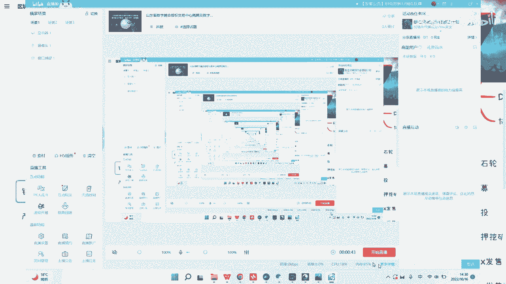
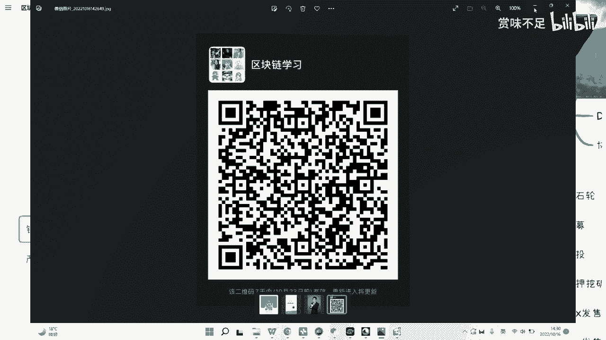
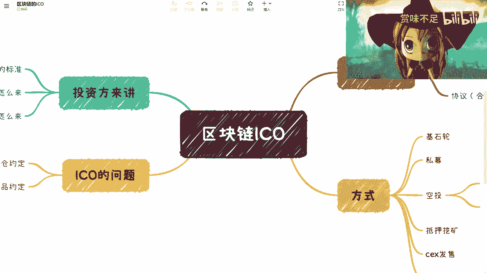

# 赏味区块链——区块链如何更好的ICO - P1 - 赏味不足 🧐

在本节课中，我们将探讨ICO（首次代币发行）的运作模式、其面临的核心问题，以及如何构建一个更健康、可持续的ICO生态。我们将从ICO的基本概念入手，分析其流程中的关键环节，并讨论未来可能的改进方向。

---

## ICO的基本概念与类型

上一节我们介绍了课程概述，本节中我们来看看ICO是什么以及它有哪些常见的形式。

ICO本质上是一种基于区块链技术的募资方式。项目方通过发行代币，向早期支持者募集资金，用于项目的开发与建设。

以下是几种常见的ICO或代币分发形式：

*   **公链/协议发行**：为底层区块链或核心协议项目募资。
*   **应用代币发行**：为建立在区块链上的具体应用（如DeFi、游戏）募资。
*   **空投**：向特定用户群体免费发放代币，通常用于项目推广。
    *   **免费空投**：用户无需付出成本即可领取。
    *   **任务型空投**：用户需要完成某些任务（如社交推广）才能获得。
*   **抵押挖矿**：用户通过抵押已有的加密资产（如ETH）来获取新代币奖励。奖励规则可能基于抵押数量、时间或算力。
*   **交易所发售**：
    *   **IEO**：在中心化交易所进行的首次代币发行。
    *   **IDO**：在去中心化交易所进行的首次代币发行。

---

## ICO流程中的核心问题

了解了ICO的多种形式后，本节我们将深入分析当前ICO模式中存在的主要问题。许多项目缺乏长期规划，导致投资者无法伴随项目成长。

一个健康的ICO流程需要清晰回答以下三个核心问题，但传统模式往往未能解决：

1.  **资金如何交付给项目方？**
    *   问题：募资完成后，资金通常一次性给到项目方，缺乏基于项目里程碑的、受智能合约约束的分阶段支付标准。这导致项目方可能缺乏持续发展的动力。
    *   理想状态：应建立类似传统产品众筹的标准，根据项目开发进度（如完成Demo、主网上线等关键里程碑）按比例释放资金。公式可以表示为：
        **资金释放比例 = f(项目里程碑达成度)**
2.  **用户的收益如何产生？**
    *   问题：用户收益往往依赖于代币在二级市场的价格炒作（即“割韭菜”），而非其真实使用价值。
    *   理想状态：用户收益应与其对项目的贡献和行为绑定，即“行为即挖矿”。例如，在一个打车应用中，用户的收益可能来自：
        **用户收益 ∝ 实际使用服务的行为（如打车次数、里程）**
3.  **投资方的收益如何实现？**
    *   问题：收益主要来自一级市场与二级市场间的价差套利，形成“项目方割早期投资者，交易所割后期用户”的链条。
    *   理想状态：投资方的长期收益应源于项目的成功与发展所带来的代币增值。这需要项目具备真实的产品、用户和生态。

---

## ICO的未来展望

分析了现有问题后，我们来看看ICO这种模式未来的潜力与改进方向。

尽管当前ICO存在诸多乱象并被许多地区禁止，但其核心模式——通过社区众筹来支持创新项目——具有强大生命力。它能够有效调动开发者、投资者和用户的创造力与参与度。

未来的“ICO”或将进化，可能不再沿用此名称，但其核心模式会保留并得到优化。关键在于建立**标准化的流程**和**智能合约的约束**，特别是在**资金释放**和**权责约定**方面，从而保障项目的长期发展和所有参与者的利益。

---

## 总结与下期预告

本节课中我们一起学习了ICO的基本概念、现有模式中的三大核心问题（资金交付、用户收益、投资方收益），并探讨了通过建立标准和合约约束来构建更健康ICO生态的可能性。

下一期，我们将讨论一个常见误区：“区块链是否一定要发币？”。我们将厘清公有链、联盟链与代币之间的关系，敬请期待。

---
**合作邀约**：本人寻求在Web3产品、培训或咨询领域的合作。同时，也欢迎拥有Web2/W3教育资源、高校或企业资源的朋友联系交流，共同探索合作机会。