# 赏味区块链——区块链链改为何昙花一现 - P1 - 赏味不足 - BV1gG41177M3

啊，好，大家好啊，那么。

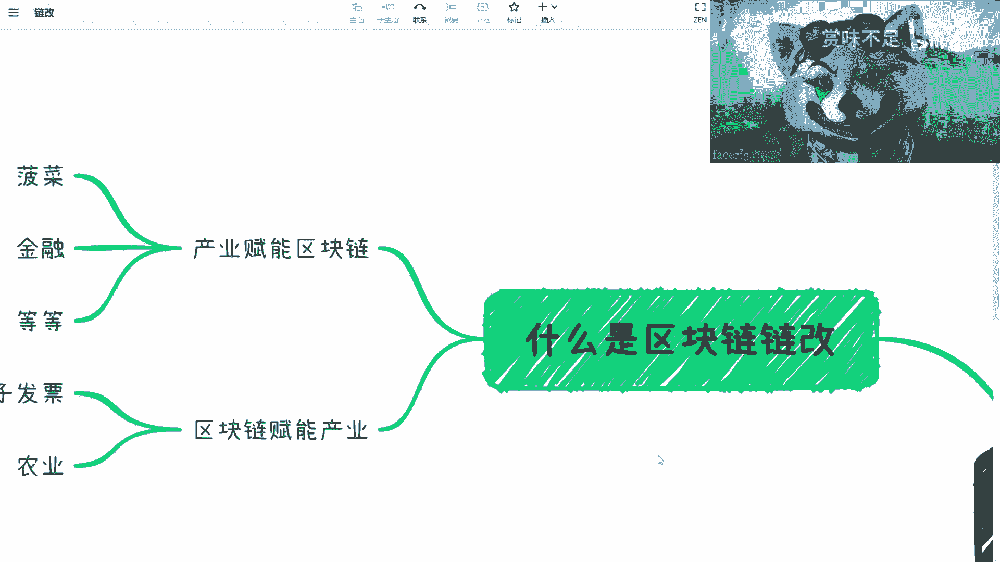

我这一期呢打算跟大家来讲这个区块链的链改。呃，那么从这一期开始呢，我会稍微做一些变化啊，就是说呃内容呢我基本上就是往前的讲啊。但是呢呃因为有很多平台，因为它限制了就15分钟。

所以说呢就是如果这个您是在用短视频平台上面看到此视频的话呢，这个大家可以到B站上面或者到微博上去找到完整的视频。好吧，就是其他的各个平台上面也都能找到完整视频。但是有些平台的话因为有15分钟的限制啊。

所以说我就是呃就只能剪到15分钟。好吧，那么这一期呢主要是来讲这个区块链链改啊，那么这个炼改呢，这个词呢，其实我们先说啊，就是差不多高峰时间呢，是在2011年。

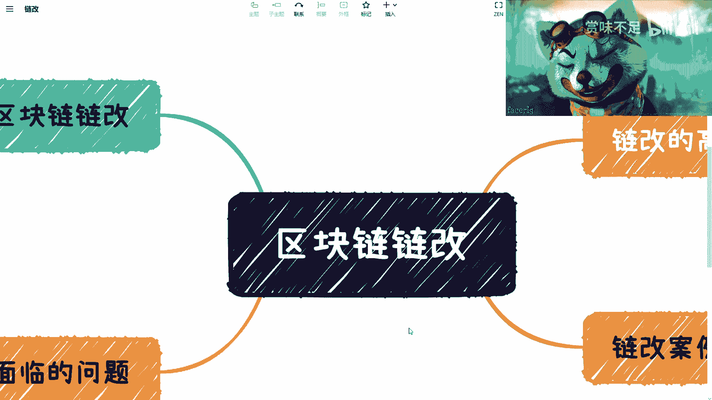

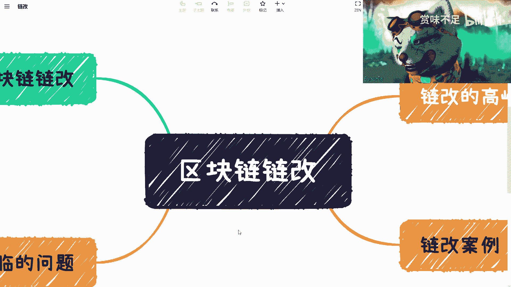

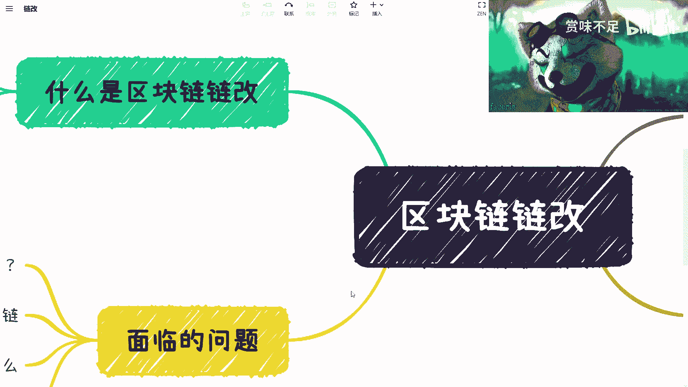

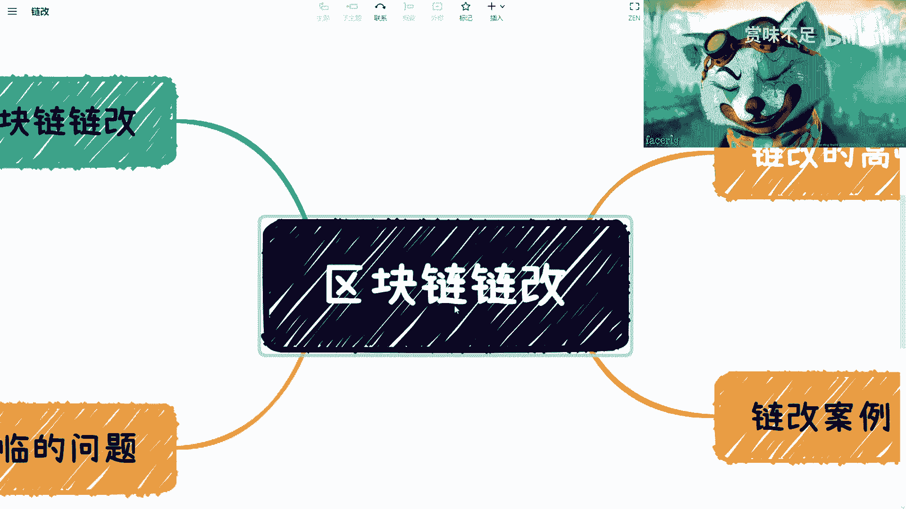

那么2010年。我写写错了傻了。啊，20202020吧。2020啊。呃，2020，然后时间呢差不多是从2019年呃左右吧，2019年左右开始啊，然后到2020整个一年啊，基本上都是炼改。

那当时呢大家这个很多人啊就是有经历过的朋友啊，其实大家也都知道啊，就经过了很长一段时间，就是大家都在说炼改啊，包括当时可能很多组织啊啊这个很多的一些这个企业啊，它都是作为这个炼改，会作为一个发展方向。

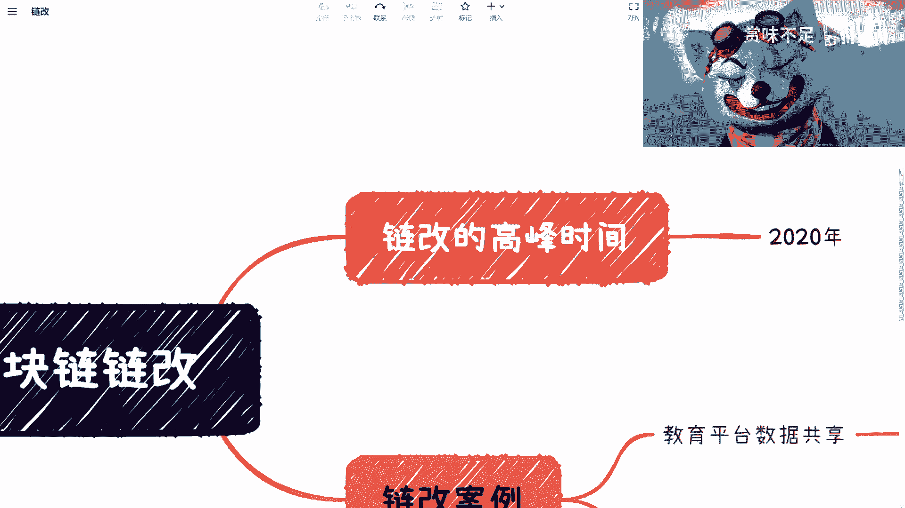

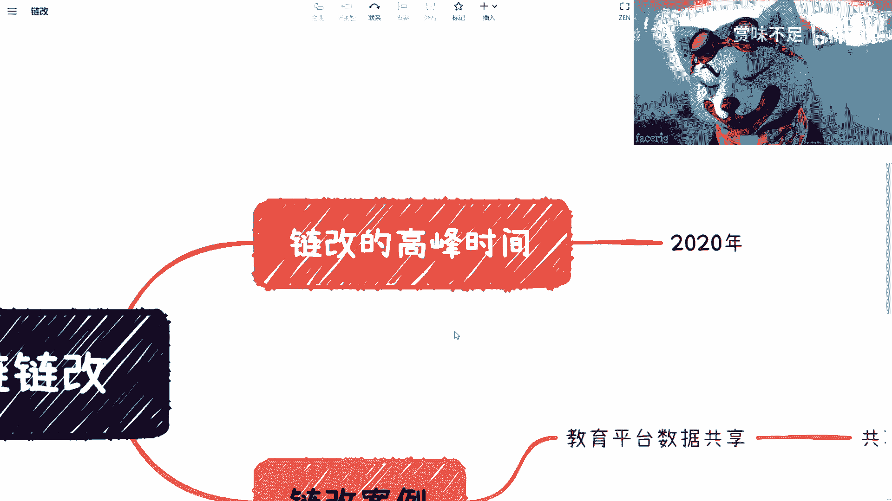

那我们先来说啊，就是什么是炼改，对吧？这个地方我看看大家能不能看到啊，可以，比如什么是炼改，对不对？首先呢我在这个地方主要是分开来说的啊，一个呢叫做产业赋能区块链啊，一个叫区块链副业产呃赋能产业。

我们先说下面这个啊，就是说区块链赋能产业呢，其实是整个。区块链行业讲的最多的一个，可能从20。我想想20118年吧。18年就在一直说赋能产业。嗯，那其实到今天为止呢，其实赋能产业大家也能都能看到。

就比如说电子发票啦，农业啦，对吧？包括啊包括比如说这个医疗对吧？医疗写进去啊，医疗。对吧然后啊那游戏对吧？啊，包括元宇宙，那元宇宙现在也能叫产业了。对吧运输啊。好啊，这个数字藏品对不对啊，数字。

藏品啊很多对吧？那那还有很多按照这个之前我对比如说马云这个支付宝做的叫做跨境支付来讲啊，其实所有的行业区块链可以赋能所有的产业，因为它能解决的问题是通用性的啊。

而且在很多的中心化这个业务里面的确是需要区块链的啊，那么这个是一方面，那主要呢我想来讲的是这个叫做产业赋能区块链，其实我想我在写这个东西时候呢，我也想了半天，就是这个区块链赋营产业啊。

我觉得我这个还能说得通，对吧？这产业赋能区块链呢，我刚刚是想了半天啊，我突然发现有那么几个，对吧？你比如博彩。😊，博彩肯定是产产业赋能区块链，为什么呢？因为区块链本身作为一个比如说比特币啊，对吧？

以太坊啊，或者整个we博3的一些基建。啊，基建的这个技术。那你说什么叫产业赋能区块链？就相当于是一个叫做它给于区块链叫做如虎添翼的这种感觉，对吧？如如鱼得水，对吧？那我们再来看。

就是说博彩啊在很多你比如说像很多dap就 web3的dap，对吧？或者说像这个海外一开始这个流行的一些产产那个产品，基本上都是博彩类产品啊，那么我们说其实因为博彩类产品。

让很多的人呢对区块链能有一个认识。那我不说认知吧，对吧？至少认识。啊，那么我觉得这是第一个。第二个呢就金融。那金融这个呢的确是啊有一说一，对吧？它的确是一个产业赋能区块链。我们说啊比如说。

这个里面你比如说web3对吧？weP3你最早的比特币，比特币就是点对点那个支付系统嘛，对吧？那它完全可以归到那个金融里面，对不对？好，那比特币那第二个你比如说什么呢？你比如说这个联盟链，联盟链的这个叫。

啊，金融落地。对吧其实联盟链金融落地呢，很多人会觉得你这个叫做区块链赋能产业，其实并不是为什么呢？因为从早年来讲啊，其实呃金融对于区块链的探索，就是比如说银行啊，对吧？包括证券啊，对区块链探索。

它的目的并不是说区块链去赋能这个产业，它反而更多的是说我们要从这个产业去赋能这个技术。啊，有的啊，这个其实是就是相对来讲，至少到今天为止啊，我觉得还是这个样子的。啊，就金融它对区块链来讲。

它是一个就独立于其他产业比较特殊的这么一个东西。啊，那么这个第二个，你比如说第三个啊更多的比如defy。对吧就毫无疑问吧，你defy里面多少的这个产品啊，对吧？多少的生态啊。

但这些东西其实是这个叫做产业本身赋能区块链。啊，因为你还是那句话，就是说你让更多的人对区块链能有一定的认识啊，但是虽然虽然现在这个认知不够，对吧？但有很多认识。啊，那么好。

那么我觉得这一块其实是比较重要的啊比较重要的。那么我们说真正当时说炼改炼改啊，其实是这一块啊，其实是这一块。那么在当时呢，你说你你比如说20因为我们说了嘛，2020年嘛。

那2020年其实到现在为止也已经过了3年了，对吧？就2022年尾声了嘛，三年。那其实整个产业这边呢，我们说其实碰到的问题啊，其实很多很多。哎，我的这个啊在这。

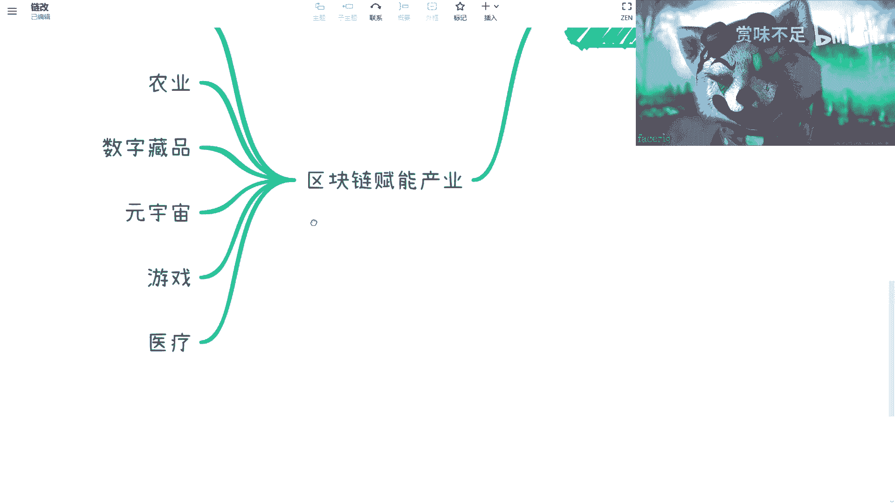

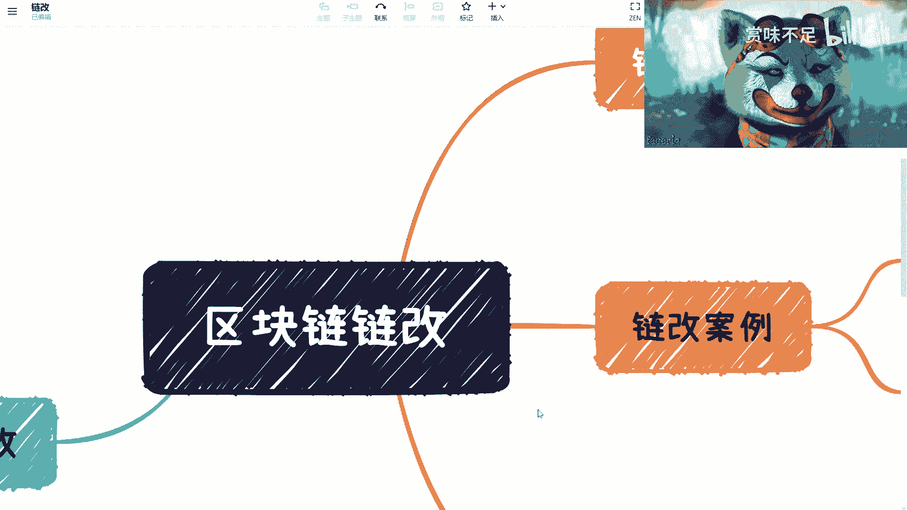

对吧炼改啊面临的问题。好，我们先来看啊，这个面临的哎先行，先看案例吧。好吧，先看案例。我们举个例子啊，比如说。😊。

教育对吧？教育当时是这样子的，就是说啊我们呃我记得我是什么时候啊，就是是某一天啊，早上接到了电话，然后呢，就是说我们想这个他们是做一个教育产业啊，就是给高校做一些解决方案的对吧？好。

那他说呢我想做一个教育平台的一个数据共享。啊，数据共享。那么数据共享呢，我就说那那问题就来了嘛，对吧？诶。啊，没用，算了，那他说他说我想做这个炼感啊，我想做这个炼感。那我说你做这个炼杆干嘛呢？

他说我要这个共享教务数据，对吧？比如说呃不同老师对吧？不同那个科目之间啊，那么分数对吧？那这个也是一样的那同样的有几个一个是高效率对吧？就不同的这个呃老师对吧？不同的这个科目啊，防篡改对吧？

那这个是区块链天然的一个优势嘛，对吧？这个他可能当时也不多说啊。第三个呢，其实我觉得是重点就是那个发行积分。对吧那这个积分呢，你比如说啊你比如说啊这个有几方面啊，这个我们稍微往后写一写啊。啊。

你比如说第一个。对吧什么呢？叫做激励老师。那你激励老师有什么激励呢？你比如说啊老师这个课上的好不好啊，对吧？评价高不高啊，对吧？出勤率怎么样啊，就从各个方面给予。

就相当于是老师在里边通过教课给予就是比如说教课级挖矿，对吧？然后这个评价级挖矿，对不对？那这是第一个。那这第二个呢呢，激励学生。😊，对吧，就地学生，那机续学生也是一样的嘛，你课上的好不好啊，对吧？

你这个作业觉得好不好啊，对吧？那第三个呢，其实是什么呢？叫做呃在这个就是高校范围内啊，就是比如说同一所。😊，啊，学校啊范围内流通。那这个流通呢那退万步来讲啊。

就这个流通呢它不是说一个啊叫做作为一个货币流通，它更多的是作为一种。这个内循环的一种消耗积分。对就比如说你说哎我这个积分啊，我可以。买早饭对吧？买打印。材料对吧？就是就比如说这个学校里面小卖部对吧？

或者你这个学校里面就所有这种这种学校内部的一些设施啊，他都可以做这种流通。那流通呢那因为基于区块链，那么你肯定比如说相对来讲效率比较高，对吧？包括这个叫做防篡改，对吧？其实是这么个逻辑啊，好，呃。

这先讲到这儿啊，先讲到这，我们再来看第二个啊，溯源啊，溯源呢是当时的整个链改里面说的最多的一个案例。那溯源这个案例呢，其实最大的矛盾点在什么地方呢？是这样子的啊。😊，第一个就是说现在有没有属于？

对现在有没有属于？那我们一个来讲，现在有没有水源有对吧？你比如说打开你买这些东西，有二维码。对吧你比如说有二维码对吧？有这个这个这个这个扫码之后去溯颜，对吧？没有问题啊。

有那么你说现在素颜跟区块链素源有什么区别呢？对吧？那你我们来说啊。这个可信啊，公开啊不可篡改。好。啊，就我当时做做炼改啊，就是碰到所有的人，对吧？这三个词反正是绕不开的，就不管他懂不懂。

反正都说这三个词，对不对？可信公开不可篡改，对吧？好，那问题来了，就说。😊，你你现在说他有溯源对吧？然后区块链可信公开不可篡改啊。好，那么问题我们按照之前的这个大家对区块链认知啊。

首先区块链本身可是否可信，是否公开，是否不可篡改的前提是取决于什么？取决于共识。对吧，直绝共识。好，那我们不说当时2020年啊，就是就拿今天2022年来讲，你今天我举个例子。

比如说你今天去买了一个数字藏品啊。呃，我请问有多少人能够知道他用的什么共识，几乎没人知道吧，对吧？首先这第一个。第二个是有多少人知道，比如说他的这个节点啊，比如说我们说你这个数字产品发生在什么链上啊。

比如说节点有多少人知道也不知道，对吧？好，第三个有多少人去关心过他的这个叫做什么区块链浏览器。😊，啊，因为我这两天在给那个中国银行，给那个银行做培训嘛，然后我再跟也跟跟他们说嘛，我说要去看浏览器，对吧？

好，那我说现在问题来了，就是说用户关心这三个东西嘛，不关心那不关心的点员哪有主要有几个问题。第一个问题就是说他的确不懂，对吧？你不能说这个这个你你非要去让他去关心一个他自己不知道的东西，对吧？这一方面。

第二方面是人用户没有这个需求，对吧？人家用户说我我管你有没有这些东西啊，我要吧我买书藏不是这个目的，对不对？😊，好，那么那么好，那么第三个啊，我们来说第三个是什么呢？就是。呃，叫什么？就是溯源元对不对？

就这个元啊，你怎么素呢？对吧？你就是首先你说我通过区块链落链去溯没问题。那这个问题是圆的真实性打问号。😊，对不对？那你告诉我区块链怎么保证它的真实性，保证不了吧，对吧？所以说其实本质上原的这件事情。

它要靠的可能还是其他的技术。比如说人工智能啊，对吧？比如说这个这个物联网啊，对吧？比如说一些传感器啊或其他东西，这个是能保证它的真实性，对你靠区块链能保证它的源嘛，我不说产品溯源啊。

任何一个东西在我们所谓上链数据对吧？就是说这个数据在上链之前，它的真实性有多少知道不知道。对吧？好，我们把这两个案例讲完啊，把这两个哎我的另外一个呢又不进来。啊，在这是吧？好。😊。

其实你会发现讲完之后呢。就是我相信啊就是有朋友一定会明，就从当中在就刚刚聊的时候啊，在这当中会明白一点是什么呢？最主要的是哎。你需求到底是什么？对吧我们现在就是刚刚你比如说刚刚这边说的这个问题啊。

无论是共享交务数据啊，还是这个叫做呃溯源，它当中都会有一个问题。我们来看看啊恋改案例啊，我们在这当写一个叫做什么？叫做。可信对吧？公开。啊，公开啊，不可篡改啊。好好好好OK啊，没问题啊。好。

那么现在这个如果这个能作为炼改的需求之一，对吧？或者说你说我能够要解决这个痛点的话，那么你首先得一个问题是什么？😊，这是不是一个痛点？对不对？好，那么我现在跟所有人去沟通这个问题时候，我都会问他们。

我说你跟我讲可信，公开不可篡改，对吧？或者说你说这个由于为什么那个区块链可信，公开不可篡改，是因为他多多中心化，对吧？多节点好，那么他这个推出的结论是什么呢？就是中心化的企业不可信，不公改不可篡改。

对吧？你你不就这个意思嘛，对吧？如果来说我们假设中心化的企业不可信。😊，不公开可篡改，那的确是个痛点，对吧？那么我就会问他们，我说那按照你们这么个说法，是不是BT就比如说腾讯啊、百度啊、京东啊，自己啊。

这些企业，就各个老百姓都到门口去拉横幅说啊，你们这帮垃圾对吧？就是你们很不可信，你们很不公开，你们一天到晚在篡观我们的数据有吗？也没有吧。😊，对吧而且如果按照这么一个逻辑。

现在整个中心化Y82的世界的企业都不要做了，因为他们都没有区块链。对吧所以说本质上呢我们就是从我的角度，我会觉得这个点对不对？对，但是它是不是痛点？不是他你要是从这个点出发。

它就是一个叫做nice to have的事情。对吧你们这边写好nice to have。对不对？是吧就所以所有的往这方面去做，我觉得就是很不合理的。😊，啊，当然我觉得我在20220年的时候。

可能我也没明白这件事情。但是我后来越来越觉得这就是个很不合理的事情。好い。那么我们来看他需求。吧需求是什么？那首先你说炼改的需求是什么？肯定不是我们刚刚说那些问题。对吧，首先这是第一点啊。

那么我我会觉得他炼改的主要需求其实是往后面，就是还是通证层面的。啊，也不能说完全通证吧，就是一个是数据的数据的共享。对的，这没错啊，但是它不是为了说防你篡改啊，第二个是什么呢？通证。哎。

我直接写token通啥证对吧？token。对吧那这是两点。那么你说2020年的时候，当时其实基本上整个联盟链就没有发展啊。我们那我们现在比如说比如说现在2022年呢，我请问，比如说现在我们要练改了啊。

那你说用什么练？我跟你们说，你现在拉出来一大把人，他面临第一个问题还是我到底选哪个链。对吧就包括来找我的咨询也是一样的。他说他说陈老师，我们现在你告诉我到底有哪些链可以用。😊。

对吧其实这个也是个很大问题啊，那所以说其实到目前为止，就是说当你去做一件事情，你的这个这个选择就像就是说我我不知道选择什么，说明什么，说明就是说它的整个发展还不成熟。😊，对吧那这是第二点，第三点是什么？

盈利模式。

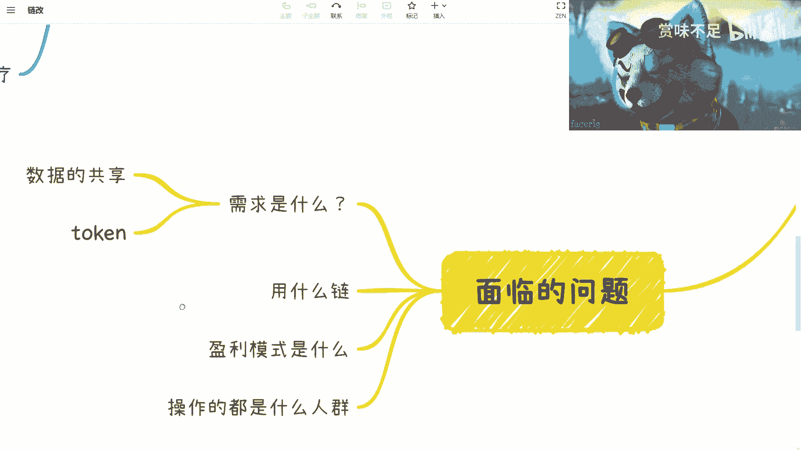

对吧那那你比如说回到这几个，耶呀。

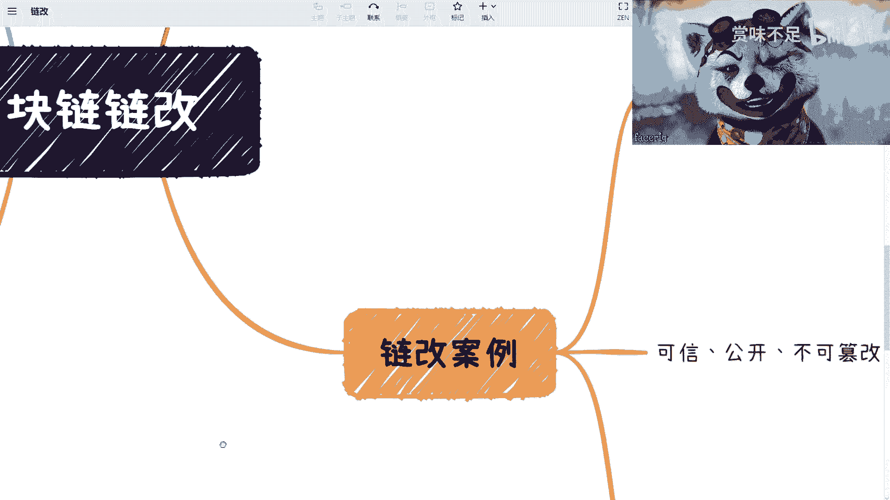

对你回到这两个，一个是教育平台数据共享，对吧？一个是农业素源没问题啊。那我们说。😊，从商业角度来讲，付钱的是付钱的人是谁，买的人是谁？那么付钱的人如果我们找到了，那么我们接下来问题是他为什么要付钱。

对吧？那么我认为从资本或者从商业的角度来讲，付钱的根本原因就是我今天付出100万，你要告诉我能赚500万。😊，哎，对不对？那或者说你你让我付出100万，我自己能够说服我自己，我能赚500万。

我也不我也不关心你能不能给我赚到钱。😡，对吧但是问题是从农业啊，从农业，从教育或者从其他的一些炼改的这个平台。目前来看。他的钱谁来出，从哪里出，为什么出？这个我感觉整体的这个因果逻辑并不是那么清晰。啊。

那么目前来看，唯一有可能出的是谁？政府。对吧。政府。那么接下来还有个。问题是什么呢？就是那么我们说操作的都是些什么人群？其实啊就是说按照我们之前在we8呃，在那个炼改，就we82的这个炼改的逻辑当中。

我们发现其实都是什么人呢？就是都是要发币的人。啊，就说白了就是说当时2020年做炼改啊，其实大部分的人呢都是说想要过来发币的。但是呢他们又不会说他们觉得。叫做发币是违法的。啊，那么。他们想干嘛呢？

他们在想在一个合法的框框里面去做法币。对，这个就是所有当时想要做炼改人的一个一个出发点。我可以这么跟明确跟你们讲，都是这么个出发点。但是问题是什么呢？问题就是说。😊，这件事情本身没有问题。

就是我觉得发token啊，就像我前两天给中行他们培训也是一样的。就是说。就说中国很多的人他有个误解，就是说你发token，他觉得有问题啊。包括我我我跟大家说个很搞笑的事情。

就是我之前在北京一个大会上面给人家做分享的时候，说到了数字人民币那数字人民币呢也提到了这个叫呃发行token啊，然后那边有一个老专家啊，就仗着自己好像年龄比较大啊，然后呢又是什么什么教授。

然后就跟我说啊，这个东西你不能讲的啊，但这个东西不合规啊。我说谁告诉你不合规，哪条法律法规说过不合规了。啊，我说中国最大的问题是你用token来进行非法的募资，对吧？你用token进行，就是说一些敛财。

对吧？这个是他的问题。我说谁跟你讲过，区块链不能发token啊，我说token就是合约所产生出来的一个东西，凭什么我不能发？对吧你不是莫名其妙吗？

对吧所以说呢就是说其实本质上啊就是我们说我为什么会坚信说整个比如说区块链啊，对吧？包括在产业方面，它未来一定是有发展的啊，是因为从智能合约的这个逻辑，从token的这个逻辑。

它未来整个商业变化一定会这样往这上面走。因为他没有别的方向可以走的。其实。啊，当然就是说我们说啊就是说未来可以，它不叫区块链，也可以不叫投ken啊，无所谓啊，但是呢它一定是要朝放朝朝这一方向发展的。啊。

但是你你要说你说啊，我就觉得发托更不对，对吧？这个就不合规。那我觉得就是这个叫什么叫。😊，自欺欺人对吧？就是就是或者说就是有有种就是扭曲，就是误歪歪解这种叫做啊这个政策的现状。

那么我觉得就是说炼改这个问题呢，我觉得基本上就是呃先讲这些啊啊先讲这些呃，我我大概想了一下，就是基本上我讲了这么多期了嘛，我后面会把所有的把它梳理出来。就是每一个这个这个大分类里面可能有哪些小分类啊。

然呃小分类里面呢又有哪些。小点啊，我把它尽可能梳理出来，梳理出来之后呢，回头再可以整理出一个完整的。然后我也看看里面还有哪些要补充的，好吧。嗯，OK那么这节我本期我们先讲到这儿吧。

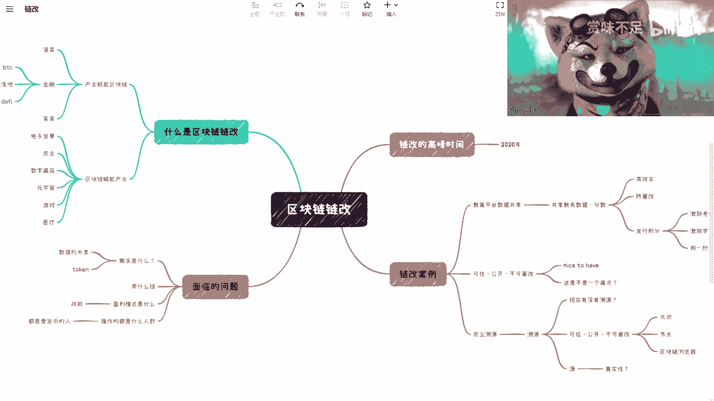