# 赏味区块链 P1：区块链链改为何昙花一现？🤔

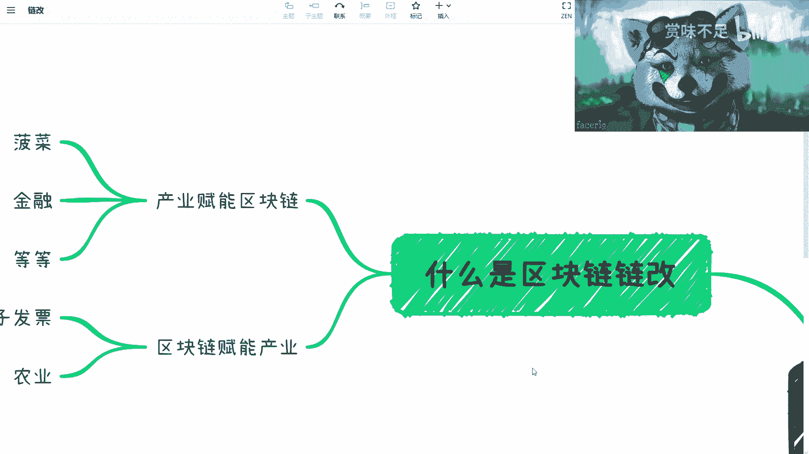

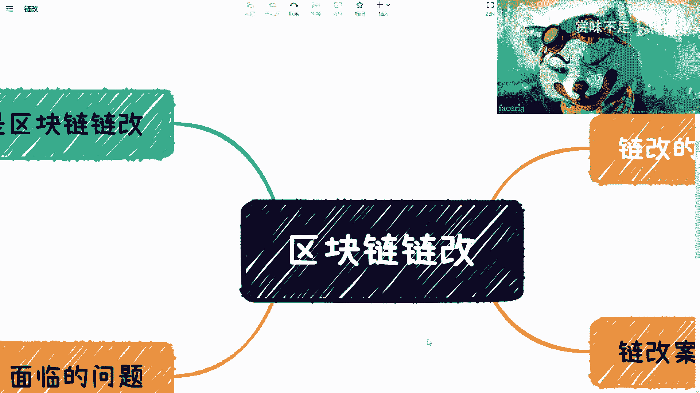

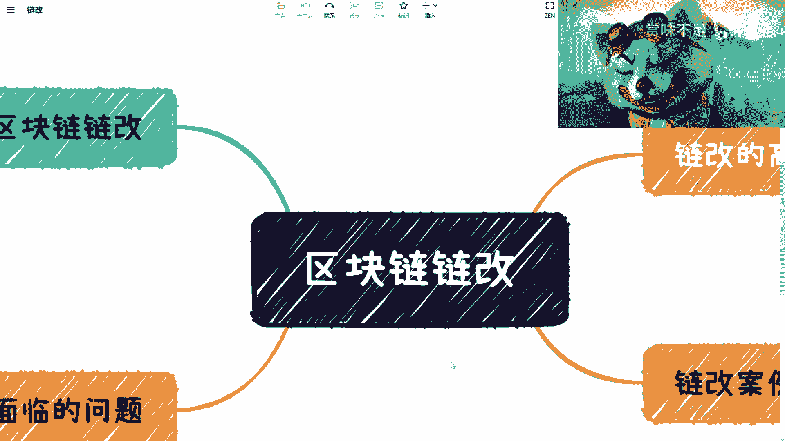

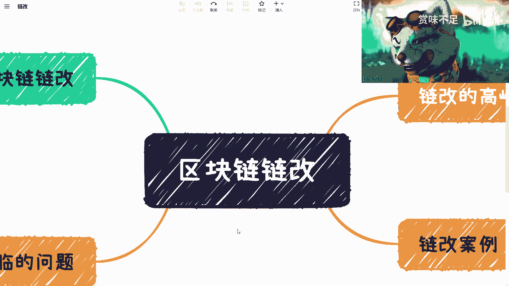

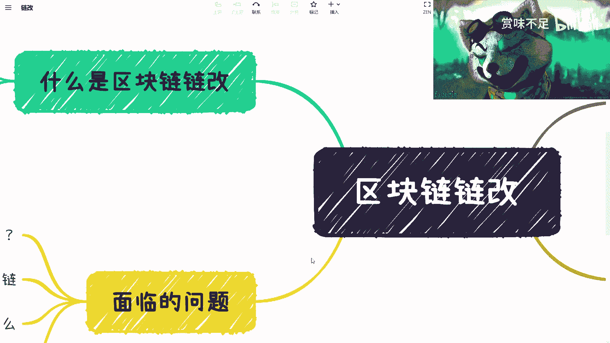

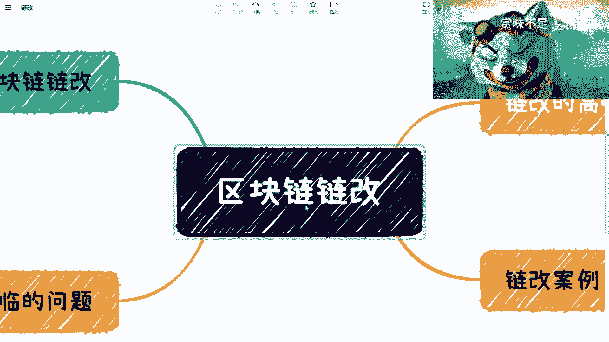

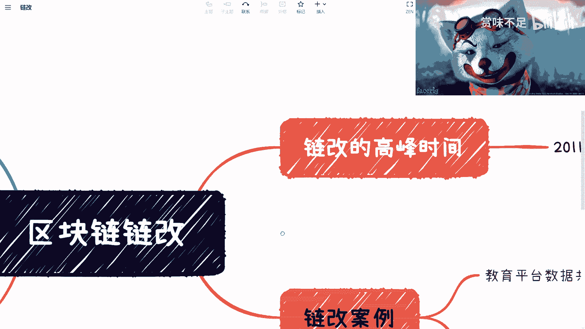

在本节课中，我们将探讨“区块链链改”这一概念，分析其在2020年前后兴起又迅速沉寂的原因。我们将从定义入手，通过具体案例剖析其面临的核心问题，并探讨其背后的商业逻辑与未来可能性。

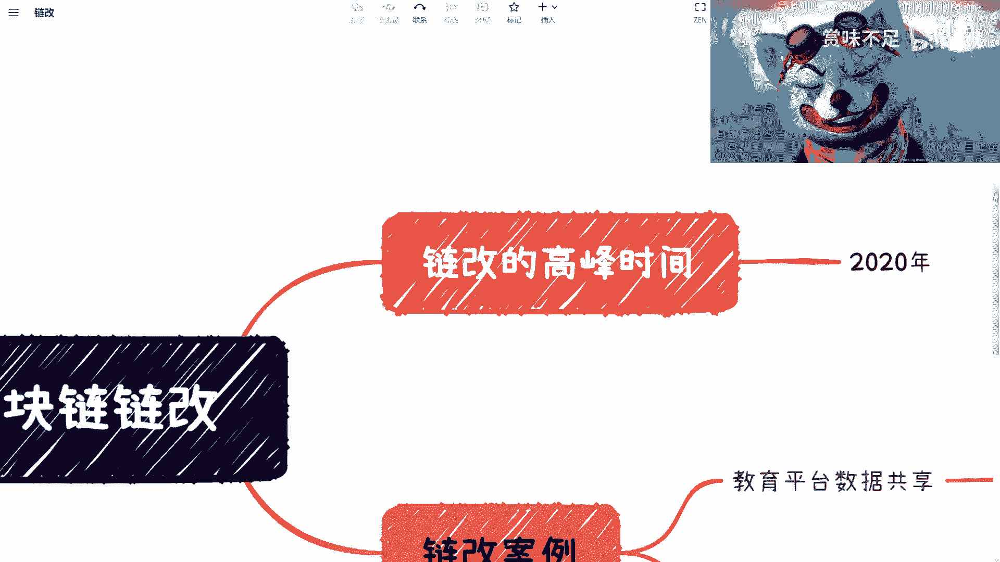

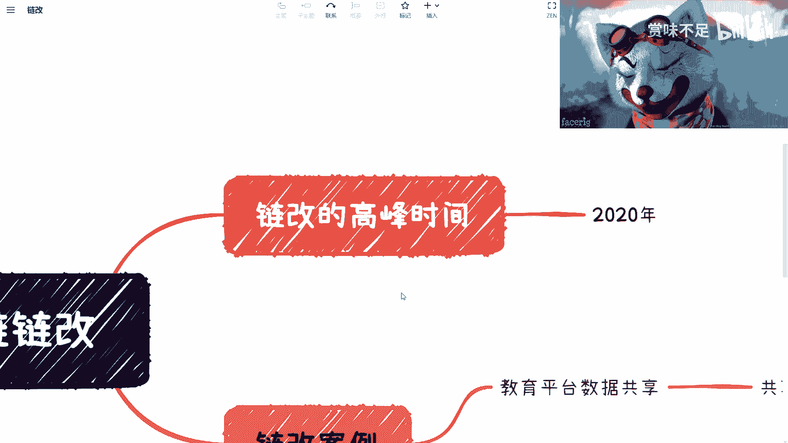

## 什么是链改？🔗

链改，即“区块链改造”，其概念在2019至2020年间达到高峰。我们可以从两个方向来理解它：

*   **区块链赋能产业**：这是最常见的说法，指利用区块链技术（如可信、公开、不可篡改的特性）去优化或改造传统产业，例如电子发票、农业溯源、医疗数据、游戏、元宇宙、物流运输和数字藏品等。
*   **产业赋能区块链**：指某些特定产业（如博彩、金融、DeFi）因其自身特性，极大地推动了区块链技术的应用普及和生态发展，让更多人“认识”了区块链。

上一节我们区分了链改的两个方向，本节中我们来看看当时链改实践中的具体案例及其暴露出的问题。

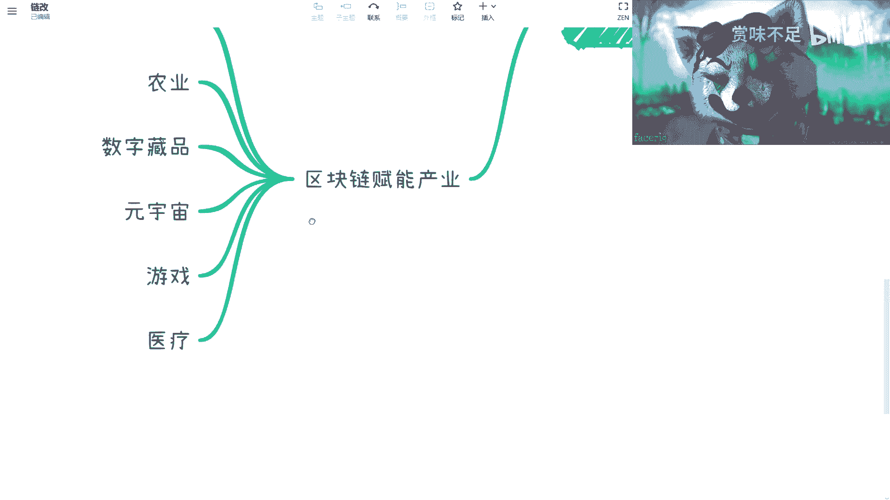

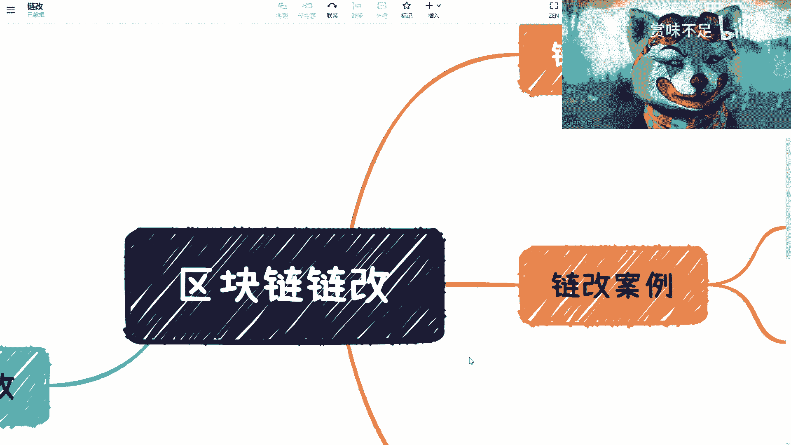

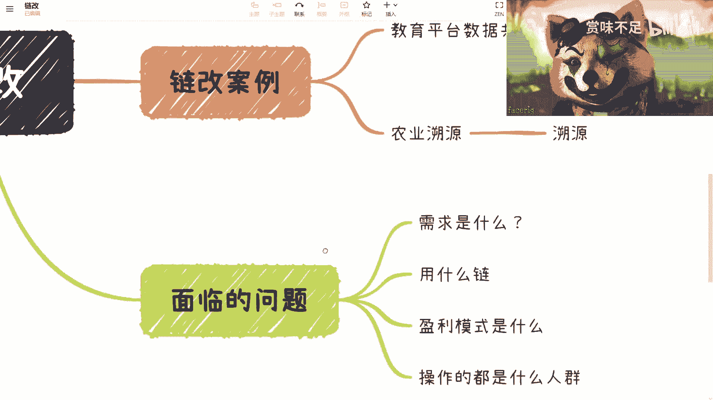

## 链改案例分析📊

以下是两个典型的链改案例：

*   **教育平台数据共享**
    *   **目标**：在高校内共享教务数据（如不同科目分数）。
    *   **宣称优势**：高效率、防篡改。
    *   **核心驱动力**：发行内部激励积分（Token）。
        *   激励教师：根据授课质量、学生评价等“挖矿”获得积分。
        *   激励学生：根据课堂表现、作业完成情况获得积分。
        *   校内流通：积分可用于购买早餐、打印材料等校内消费，形成内循环。

*   **农产品溯源**
    *   **现状**：传统溯源（如二维码）已存在。
    *   **区块链宣称优势**：可信、公开、不可篡改。
    *   **核心矛盾点**：
        1.  **用户不关心技术细节**：普通消费者不关心底层用了什么共识、有多少节点、如何查看区块链浏览器。
        2.  **“源”的真实性无法保证**：区块链只能保证上链后的数据不可篡改，但无法保证上链前数据（如农产品源头信息）的真实性。这需要物联网、传感器等其他技术来解决。

通过以上案例，我们发现链改常常陷入一个逻辑困境：将“中心化系统不可信”作为一个伪痛点来推销区块链方案。

## 链改面临的核心问题⚡️

上一节我们分析了具体案例，本节我们来总结链改面临的根本性挑战。

链改面临的问题是多方面的：

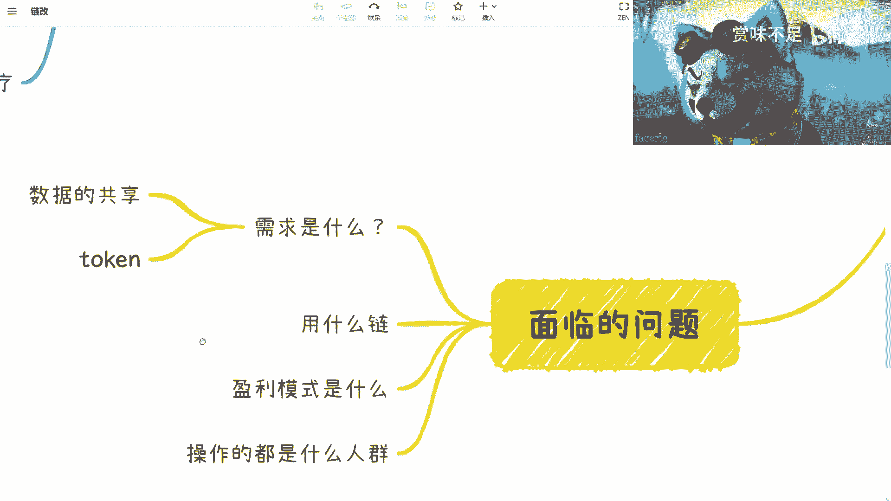

*   **需求错位**：将“可信、公开、不可篡改”作为主要卖点，但这对于大多数企业和用户而言是“锦上添花”（Nice to have），而非“雪中送炭”的刚性痛点。很少有用户会因为中心化企业“可能”篡改数据而去抗议。
*   **技术选择困惑**：市场上有多种区块链（公链、联盟链），项目方往往不清楚该选择哪条链进行改造，这反映了技术生态本身的不成熟。
*   **盈利模式模糊**：链改项目很难回答“谁付钱？”和“为什么付钱？”这两个核心商业问题。投入成本与可预见的收益之间的逻辑不清晰。目前最可能的买单方是政府。
*   **参与动机复杂**：2020年许多链改的参与者，实质是想在合法的框架内进行“通证化”（Tokenization）或变相发币，但又对相关合规性存在误解和担忧。

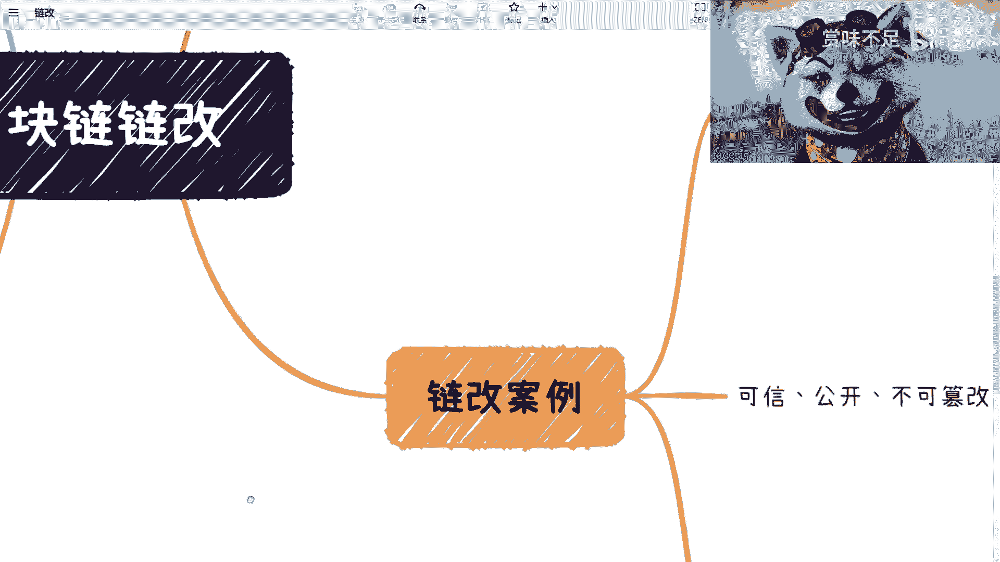

## 总结与展望💡

本节课中我们一起学习了“区块链链改”的兴衰。

链改在2020年的热潮，反映了业界试图将区块链技术与实体经济结合的早期探索。然而，它昙花一现的主要原因在于：**未能找准真实、迫切的商业痛点**，过于强调技术特性而非解决实际业务问题；同时，在商业模式、技术选型和合规认知上也存在诸多模糊地带。

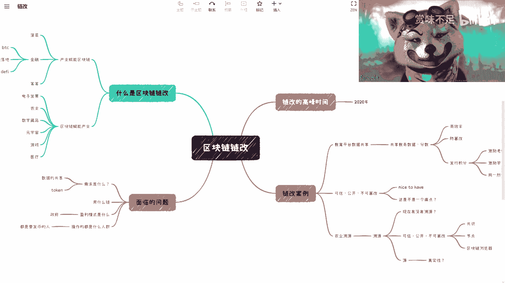

尽管如此，从智能合约和通证经济的内在逻辑看，资产与权益的数字化、可编程化仍是未来商业发展的一个可能方向。未来的“链改”或许不再叫这个名字，但其核心思想——利用分布式技术重构信任与合作机制——仍有其探索价值。关键在于找到那些真正需要不可篡改、透明化协作的真实场景，并构建起可持续的商业模式。