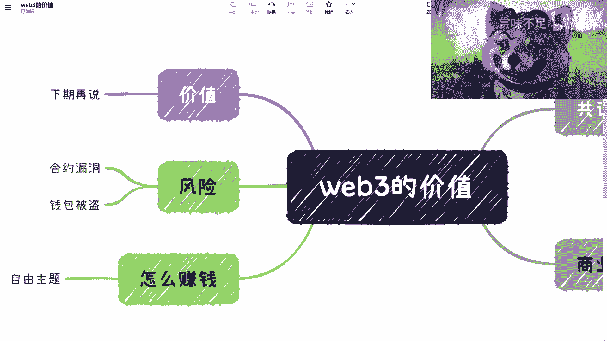
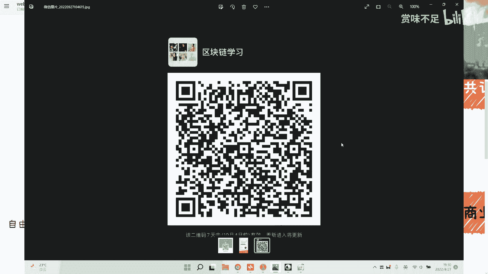

# 赏味区块链——大家一起来讨论下web3（上） - P1 - 赏味不足 - BV1fe4y167PT

嗯好大家好啊，那么这一期呢我想跟大家聊一下，就是关于这个wifi 3的啊，这个价值呃，为什么呢，因为最近就知道就看到我微博上发的啊，就是最近都在面试嘛对吧，诶等一下啊，对就最近都在面试嘛，然后。

就碰到很多人啊，就是这个比如说582做v8 区块链的啊，做web 3区块链的，然后就是啊说这样有问题，那样有问题啊，然后每次我一般都是这样子的啊。

我说我先问一下你在这个web 2和web 3这边的这个职业规划，他能怎么做对吧，你比如说在微博这边选区块链，跟在web 3这边选区块链肯定不一样对吧，那他们都会觉得啊我这个v82 这边啊，我为什么选好。

说理由一大堆，微博三说理由也是一大堆啊，我说你们也不要这个心里面想什么，然后就是说的时候我们又不说对吧，我说其实本质上是什么呢，就是你就是想去找一个remote的工作啊，然后呢肯定薪资。

因为最近来的这个这个小伙伴啊，就是95~01把都有，然后薪资开的都很高很高，就应届生差不多都开到20~30或者30~40对吧，就我觉得是这样子，你们要想找一个remote的对吧，钱多，那你就直接讲对吧。

你不用这个到处再去面，我可以打保票，你们去练一些web的，做区块链公司肯定都都是这么一个结果，结果，嗯然后呢就关于一些这个内容上的问题啊，就是说我觉得呃有满，其实我面下来基本上有五成，大概50%的人呢。

他其实是对，就是啊比如说这个web 2和web 3的这个叫做价值，它其实不是很理解，但是呢他非要就是说啊这个无脑的叙述哈，web 2就是垃圾对吧，web 3就是神，那么好，那么我觉得呢是这样子的。

就是你既然这么说对吧，我就想真的就想来开一期，说好，我们来说一下这web 3的价值，好吧好，啊对首先是这样子的，我呢建了个群啊，就希望大家有兴趣的可以加嗯。

这群呢是这样子对吧，我大家应该现在看得到啊，啊应该看得到啊，我这边定格一下，你们可以扫个码对吧，这个是10月4号之前失效的啊，回头反正我每次弄的我都会给大家搞一个新的群，而不是考虑搞搞就更新一个码。

对大家能加进来好吧，然后呢我这边说一下啊，就是这种宣传项目的炒作的就不要进来了。

好我求求你们了，然后呢我们来说一下这个价值啊，是这样子的对吧，首先你要来跟我说wifi的价值对吧，你说他是神对吧，好没问题好，我们来说几个问题，第一个问题是啊。

我在面啊整个的这个叫做区块链产品经理的时候啊，我都问他们，我说你们这个从比如说这个区块链产品经理的角度啊，你们觉得比如说呃联盟链也好，公链也好，数字藏品也好，n f t也好。

有哪些这个产品上的可以优化的地方对吧，你能知道吗对吧，然后所有的人啊就清一色的都跟我说什么呢，就跟我说这个东西叫做什么，叫做哎呀，经济模型啊，然后呢我每次就是就实在是忍不了了，你们知道吗。

就我每次只能就是中途的打断他们，我说你们不要说了啊，我说你要从产品的角度去看这个问题，你不要什么，我问你所有问题，你都说好，我只用经济模型来来解决对吧，你这个回答就好像跟我说，我我今天我要去做一个产品。

你也别管我对吧，这是什么功能，什么乱七八糟我都不管对吧，我就印钞就可以了，我就告诉你我怎么印钞，我怎么去骗钱，那有意义吗，没有意义，对不对，你我说的不好听点，你说你一个硕士也好，本科也好，毕业的对吧。

毕业23年，你又不是说学金融的对吧，你搞得好像你好像很懂一样的对吧啊，然后呢我们来说共识啊，首先你来看啊啊，在这个地方呢我们说有这个叫做这个公式里面有个最重要的，我忘记写了公式机制对吧好。

你跟我说微博三有没有价值对吧好，那我们来说你你说他有没有价值，有没有真正的价值，取决于它的共识对吧，我以前一直举个例子，比如说你今天这个这个这个这个供电对吧，你说我有10万个节点，一个节点对吧。

但是我共识是什么呢，我共识就是当中我某个节，点说了算就一家独大的，或者说就那么两三个节点说了算对吧，那你跟我说这个练就这个生态有意义吗，没有意义对吧，首先是第一个问题啊。

第二个问题是目前的所有的激励机制，经济模型对吧等等等，我们说啊就是说呃以太坊算是一个就一家独大的这么一个公链生态，但是从以太坊本身来讲，它其实是一个叫做叫什么叫做呃类似于像windows的这种系统。

叫做os，那么os本身我觉得它运行到现在没有问题啊，我觉得以太坊一点问题都没有好吧，但是我们在现在要说的是什么，就是这上，面的a p p，那app就是我们说的这些产品对吧。

就是就是这个smart contract，然后里面对应的比如说define your social fire，各种各样的东西对吧好，那么我们说对吧，你说你你这个web 3里面啊，我们说web 3对吧。

web 3里面，那么我们现在面临几个问题啊，我一直问他们，我说第1p3 这么多年，为什么很多v8 的人或者大部分的人还是不接受他的，你们有没有想过为什么不接受他对吧，这第一个问题，第二个问题是这么多的。

比如说经济学家啊，或者怎么样，的确是有一部分人进去，但是这一部分占整，个中国占全球的多少人呢对吧，就好像现在有很多人跟我说啊，但他占占多少呢，占比多少呢对吧。

你不能跟我说这一小撮人怎么样怎么样怎么样对吧对吧，但同样的就是说我不是不认可微博上的价值，我只是在跟大家说这个事实是怎么样子的啊，不是说你你非要拿一个叫做很小一部一撮人的行为。

或者一撮一撮人的这个这个这个这个这个业务上的东西来来，反正说哦大家都是不对的对吧，甚至还有来面试人跟我说什么，跟我说这个是一个很大的趋，就我说嗯哎呀这个事情对吧，悄悄的讲啊，你你胆子也不小哈对吧。

然后呢我们说啊就是，唉呀谁给我发的消息，啊然后呢我们来说啊就是真正的啊我们来说这个评论这个价值对吧，那我们刚刚那几个问题就是为什么说大部分人不接受对吧，为什么说大部分的人没有enjoy进去对吧。

没有all in进去，其实很简单对吧，我们来看这么几个问题啊，我b2 的商业上面，你做一个产品，我举个例子，比如说饿了么或者滴滴，或者随便你今天要做一个web的产品，我们问这几个问题，问这几个问题啊。

第一你流量在什么地方对吧，你流量怎么来，第二你业务模型在业务模型是什么，第三你商业闭环是什么对吧，好还有什么就是叫做啊商业闭环就就就盈利模式对吧好，那你说而且另外一方面啊啊啊啊对对对。

我要写另外一方面需求需求是什么对吧，就是你今天最大的问题，如果我不要去创业，你无非就问这几个问题对吧好，那我们说啊，比如说像dd饿了嘛对吧，你比如说黑车黑车的这个正规化，黑车的这个再利用。

那饿了么现在比如说创造一些比如说像美团这种啊，就像美团饿了么这种外卖，然后你比如说现在短视频啊，短视频因为也是个那个web的业务嘛对吧，短视频对吧等等等，那你说我，们随便举个例子，比如说滴滴对吧。

你流量哪里来啊，好那么我们说在他的整个业务里面，黑车也好，用户打车也好，它本来就是个流量，他本来就是个需求对吧，就这个流量是一个天然存在的，那么需求是什么，好用户也有直接的需求，其实还是比较难。

那么你业务模式是什么，那么从它的业务模式最早的时候很简单，就是相当于两个呃两端嘛对吧，就是就是叫做这个司机端，用户端对吧，两端，然后呢一个是提供服务，一个是去打车对吧，然后通过一些算法，通过一。

些这个优惠券给你对吧好，那么这个时候呢我们说最早他问你流量在哪的时候呢，就烧钱，我今天打车了，我要去用用用美团啊，用高德啊，用滴滴啊对吧，用以前什么什么拼车软件啊，各种对吧，那么第三个就是商业闭环。

那商业闭环就是说商业闭环就说你怎么赚钱对吧，那赚钱这件事情我觉得对于像滴滴啊，像平，台化的这个逻辑很简单，比如说交易所这种，就是我根本就不关心啊，就是说整个的就是就是因为我的这个流量也好，业务也好。

需求也好，这几个问题解决之后，它的整个就作为平台来讲，它的商业闭环其实很简单，当然了，现在滴滴因为也走偏了嘛对吧，也开始做什么什么小小贷啊对吧，贷款啊，理财啊对吧，这种东西，但是不管怎么样啊。

我们从这个业务角度来讲是是这个情况啊，那我们再来看5f3 ，这边就当下的wifi情况，你流量哪里来对吧，因为这么多年这么多人在那边叫，就说啊我们只有存量市场了，我们只能互歌了对吧，增量市场在哪里。

是增量市场在哪里呢，我也想知道增量市场在哪里，那为什么在那市场不进来呢对吧，你你你今天流量在什么地方呢，你不是说你在twitter space上面做个a a，你自己做一些线下活动就有流量了对吧。

这个不叫流量啊，这个只能说你是一个你是一个简单的一种营销，啊运营市场的一种行为啊，但这个是叫是叫做一个真正的一个流量来的入口嘛，并不是对吧，你总不能说哦，那你这个对吧，就就真的只是说自己骗自己啊。

这是第一个，那你业务模型是什么呢，有业务模型吗，请问现在我也不知道里面那些产品有业务模型吗，没有对吧，为什么，因为大部分的产品你们不要就很多人在喷树藏，就说哎他只有一级对吧，他就卖完就卖完了。

你们去看看5b3 的产品有什么区别，请问有什么区别对吧，就是它有业务，模型吗，它有也许有，但它业务模型极其简单，就根本不能称之为业务模型，它是有商业模式嘛，商业模式就是后面前面买的人赚后面买的人的钱。

这就叫商业模式，那这这个能称之为商业模式吗，对吧，你们去问问那些投资人，这这种叫做商业模式吗对吧，就是我我面试的时候，我一直会跟人家说，我说你们说的东西我都懂，但你们不要自己骗自己对吧，这个是问题。

我不是说就是我们要来面对这些问题，不是说我们今天比如说今天啊有很多人就说了啊，赏微说这，个问题对吧，他他妈就是跟web 3为敌，我就告诉你们，告诉大家，问题在什么地方，我们要去正视它，去解决，对不对。

好，那我们再来看这边啊对吧，怎么赚钱，我看看几分钟了，12分钟对吧，你比如说怎么赚钱，这个地方我其实写得很清楚，我就我也跟很多人聊过对吧，然后他们会怎么回答我呢，啊这个defi对吧，有多少处罚金对吧。

然后那边机枪池对吧，然后这边没有social fi对吧，这边嘛怎么样，我说你别别逼逼了，你们心里面也明白到底怎么赚钱的对吧，我说这不我们不说他是骗局啊，我说你们自己心里明白他是怎么赚钱的。

不就是前面的人赚后面人钱吗，结束了呀，对不了，当初i c o的时候，整个产业链大家知道的，对不对，投资方啊，这个项目方交易所对吧，种子轮基石轮对吧，这个这个这个这个大家谁跟谁都不知道啊。

那慢慢慢慢就发现整个一轮一轮一轮割下来对吧，还供电房对吧等等等啊，就这个大家都知道啊，你没必要就就就自己欺骗自己干嘛呢对吧，你欺骗骗骗外面的人就算了啊，那么怎么赚钱，我觉得很简单，就割呗就结束了对吧。

因为在我现在看来，你你说我f3 里面有没有做的好的，当然有对，有很多做基础建设的，做生态的做做当时像uniswap这种dex对吧等等等，这种都很好啊，但是大部分的对吧，我们说有一部分是很好的。

但大部分的大部分是什么，放盘对吧，大部分是什么，就是我ctrl c ctrl v出来一个，我脑子都不动的，我就搁对吧，然后就是说我我今天先发b发完币，我就拉拉一波，拉完拉完一波就横盘。

横完盘就往下跌就结束了，这个就是他的逻辑对吧，有很多人就问我怎么赚钱，我说我说web 3最简单赚钱的逻辑就是你去所以最早的时间去买入，然后去跑去以最快的方式去抛掉，你肯定能赚钱，结束没有什么逻辑。

这就是逻辑，对不对，然后哎我觉得这个价值我就放到下期再说了，哦，下期再说，然后还有什么呢，就是关于这个，哎我今天又要把这个视频切二了，哎哟好烦啊，哎呀就是我们我们说啊，就是你wife 3作为一个生态啊。

那么之前呢我觉得有一个说法是很认可的，他说wifi 3到现在为止最大的相对v82 来讲进步在哪里呢，就是黑客哦，最大的进步是什么，就是黑客为什么呢，因为他随便投也没有人管他对吧。

那我们说你web 3这边你要完全的去中心化对吧，没有问题，那我们说你现在的风险是什么，比如说合约漏洞也好，你今天你今天钱没有了，那请问这个东西是谁负责，你应该是负责对你，不要到那个时候你说啊。

我要求助于法院了，我要求助于法律了，你哪里来法律，你哪里来法院，你不是纯web 3嘛，就纯dec sion来自哪里来的中心化呀对吧，那我现在碰到我也不是三人上来就鄙视，我。

也不上来就鄙视说你们中心化就是垃圾，那你你这个东西怎么解决呢对吧，那好也有很多人说你不解决，你，请问你作为一个完善的生态，你跟我谈web 3的价值，你不解决可能吗，对吧啊，然后还有人跟我谈这个东西啊。

啊跟我谈这个东西啊，这个我当我也下期再来讲好吧，就这个这个歌有什么好谈，的呢对吧，我就这么说，谈这个东西之前请大家到网上，到到global上面去查一下这几年的刀的数据，那比如说，体验对吧。

体验和那个什么呢，和那个叫叫叫叫呃，链上哦练下对吧好，那还有什么呢啊还有什么呢叫投票，你们去看一下啊，不是我说啊，你们去看一下这个全球的一些一些报道报告啊，report你们去看一下哦，投票数。

再去对比一下这个对应的这个项目的发b数啊，你们对比一些数据，这个数据你们还有脸来说道吗，啊到什么东西啊，到底对吧，因为我就觉得很神奇对吧，一天到晚有很多人来吹对吧，你先看看数据，你再去吹好吗啊。

后面再来，讲所以我觉得是这样子，就是说当下不是说就是有很多人会说什么呢，当下会说哎呀这个联盟链没有价值，联盟链怎么样怎么样怎么样对吧，我真气死对吧，我就问我就问嘛。

我说哎你觉得y82 的区块链的价值是什么，y b3 区块链的价值是什么对吧，他上来就说web 2都是骗人的对吧，都是扯淡啊，可以我给你点个赞，我给你点个赞啊，然后呢我就是这样子的，就是扯不扯淡。

我们另外一说啊，那当下的web 3的价值，在我看来也是一样的，有什么区别呢啊请问有什么区别对吧，你也是一个生态正在建设，你也是一个这个中间建正在建设，中间基础见证的正在建设，大家都在想办法做一些。

比如说为未来的这个web 3的世界做一些贡献或者怎么样对吧，但是你要说现在有价值吗，真正的价值有了吗，还没有体现出来，他也是一个发展中的东西，那你凭什么要一就是就是就是要要去说，我不就是垃圾的对吧。

但你说出个道理来说出来，说出个所以然来呢，也没有的对吧，上来就喷，对吧，而且更何况微博三里面现在大部分的人，大部分的项目方，他就是为了就是为了来割的，他根本没有说为这5b3 的这个生态做出什么贡献有吗。

也没有对吧，他除了混乱混淆视听，一天到晚就对我说啊，我也不知道怎么样怎么样，搞得就很多人根本懂都不懂，然后就在那边吹对吧，所以说我觉得这个才是这个最大的问题对吧，你攻略你跟我谈一个公链。

你至少这些东西得要明白吧对吧，你否则谈什么公链呢对吧，商业价值你有吗，对吧，甚至我跟你们说，我跟有些人聊的时候，他会这么跟我讲，他说他说web 3的流量很简单，我发b啊，我发了b自然就有流量。

你动动脑子好吗啊，你发的币自然就有流量，那请问你这个是一个产品吗，你这个b发出去，然后呢，你除了一个你你有很以前有很多人还有良心，还会还会拉拉盘，还做错事，到现在很多项目方连盘都不拿了，事都不做了对吧。

你请问你这东西叫产品吗，啊你懂产品吗，唉我真的也是醉了，好吧，就我觉得20分钟啊，20分钟，然后基本上就是我先说一下一个大概的一个情况啊，就希望大家对web 3能有个正确的认知对吧。

就在在这个价值上面对吧，然后剩下的呢我觉得就是说这个微博三在我看来他肯定是有价值的嘛，对吧，他未来肯定有很大发展啊对吧，那怎么哪一点我就我下期再来说好吧，我下次再说到，那我也单独再开一期好吧。

ok那这一期先这样啊。

