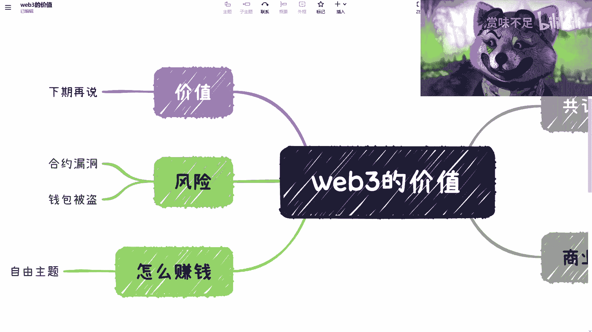
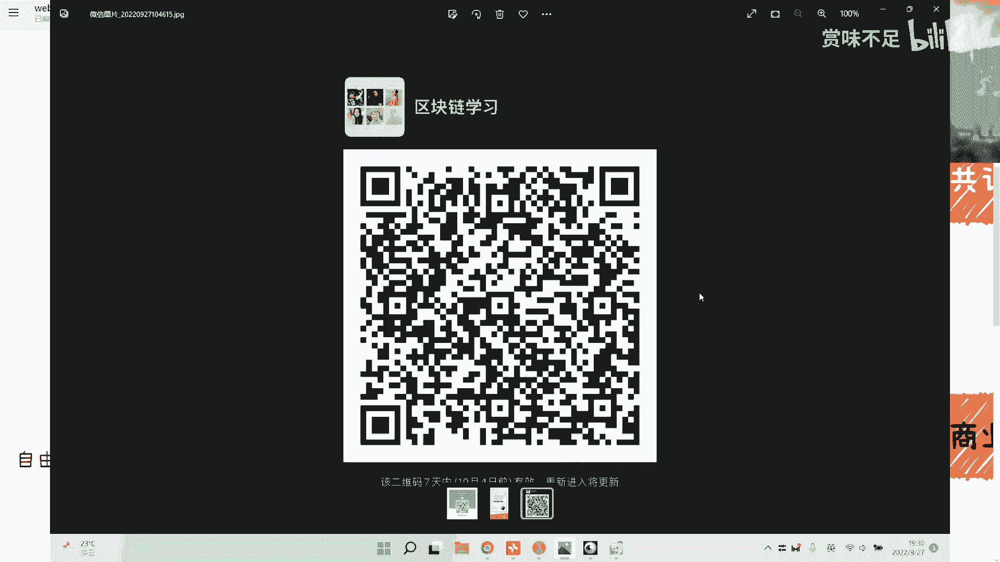
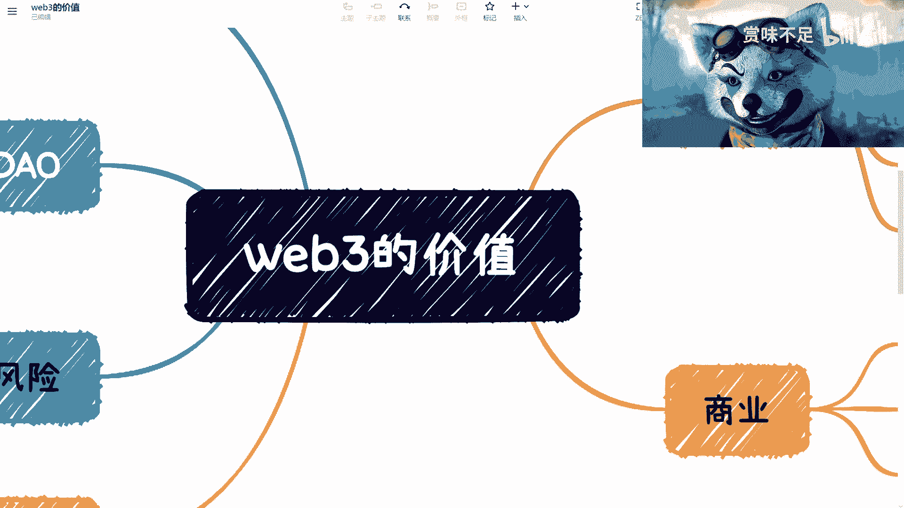

# 赏味区块链--大家一起来讨论下web3-上----P1---赏味不足---BV1fe4y167PT_

在本节课中，我们将探讨Web3的核心价值与当前面临的主要问题。我们将从产品、商业模式、共识机制等角度，分析Web3生态的现状，并与Web2进行对比，帮助初学者建立对Web3更清晰、客观的认知。

---

## 概述：我们为何要讨论Web3的价值？

最近在面试区块链相关岗位的候选人时，我发现一个普遍现象：许多人声称Web3极具价值，但被问及具体原因时，往往无法给出清晰、有逻辑的阐述。他们倾向于全盘否定Web2，盲目推崇Web3，却缺乏对两者本质差异的理解。本节课程旨在剖析这些现象背后的原因，并引导大家理性思考Web3的真实价值所在。

---

## 共识机制：去中心化的核心

上一节我们提到了对Web3价值的普遍误解，本节中我们来看看支撑Web3价值的核心之一——共识机制。

共识机制是区块链确保数据一致性和安全性的基础。其价值并不单纯取决于节点的数量，而在于权力是否真正去中心化。

**公式示例**：如果一个公链有10万个节点，但共识机制实际由其中一两个节点控制，那么这个链的“去中心化”价值就值得怀疑。真正的价值来源于广泛、公平的参与和决策。

以太坊作为主流公链，其底层操作系统（OS）层面的运行目前看来是稳健的。然而，我们更应关注其上构建的应用程序（DApps），即智能合约及其对应的DeFi、SocialFi等产品。这些应用的实际表现，才是Web3价值面向用户的最直接体现。

---

## 当前Web3面临的现实问题

理解了共识机制的基础后，我们来看看当前Web3生态在落地应用中暴露出的几个关键问题。以下是几个核心挑战：

1.  **用户接受度低**：为什么Web3发展多年，大部分Web2用户和开发者仍未大规模涌入？
2.  **参与门槛高**：尽管有经济学家和部分先锋者参与，但这部分群体在全球范围内的占比仍然很小。我们不能仅凭一小部分人的行为来断言其普遍价值。
3.  **价值主张模糊**：许多项目空谈趋势和未来，却无法解决当下的实际问题。

---

## 从Web2的成功逻辑看Web3的缺失

要理解Web3的问题，我们可以借鉴一个成熟的分析框架：评估一个Web2产品时，我们通常会问以下几个核心问题。让我们用这个框架来审视Web3：

*   **流量来源**：产品如何获取用户？Web2产品（如滴滴、饿了么）往往解决的是天然存在的需求（出行、吃饭），流量来源明确。而当前许多Web3项目声称的“流量”，往往局限于Twitter Space或小型线下活动，这更像营销行为，而非稳定的用户增长渠道。增量市场在哪里，是核心问题。
*   **业务模型**：产品如何运转？提供什么服务？Web2平台有清晰的双边或多边市场模型（如连接司机与乘客）。而目前很多Web3产品缺乏可持续的业务模型，其运作模式极其简单。
*   **商业闭环与盈利模式**：产品如何赚钱？Web2平台在解决流量和业务问题后，盈利模式相对清晰（如平台抽成、广告）。反观当前大量Web3项目，其“商业模式”本质是**前面买入的人赚后面买入的人的钱**，这种模式难以持续，也无法创造真正的社会价值。
*   **真实需求**：产品解决了什么痛点？许多Web3项目创造的是金融投机需求，而非解决生活、工作中的效率或体验问题。

正视这些问题，而不是回避或自我欺骗，是Web3走向成熟的第一步。

---

## Web3的“赚钱”逻辑与生态风险

在分析了商业模式缺失的问题后，我们不得不面对一个更直接的现实：当前Web3领域普遍的盈利方式及其带来的生态风险。

目前，许多Web3项目最简单的“赚钱”逻辑是：在最早的时间点买入某个代币，并以最快的速度抛售。这催生了大量复制粘贴、缺乏创新的项目，其生命周期往往是“发币、拉高价格、横盘、下跌”。

除了经济模型的问题，Web3生态还面临其他风险：

*   **安全与责任归属**：Web3强调去中心化，但当智能合约出现漏洞导致用户资产损失时，责任应由谁承担？如果此时求助于中心化的法院和法律，则与“完全去中心化”的理念相悖。这是一个尚未解决的矛盾。
*   **治理与参与度**：许多项目鼓吹“社区治理”和“链上投票”，但实际参与投票的代币持有者比例往往极低。在做出任何判断前，建议先查阅全球相关的数据报告（Report），对比项目的代币发行量和实际治理参与度，数据本身会说明很多问题。

---

## 理性看待：Web2与Web3都在发展中

本节最后，我们需要建立一个客观的认知：无论是Web2还是Web3，都处于不断发展演进的过程中。

贬低Web2为“全是骗局”或神化Web3为“未来唯一”，都是不理性的。当下的Web3，其基础设施和上层应用都还在建设中，真正的、普世的价值尚未完全体现。它和Web2一样，都是一个“发展中”的生态。

当前Web3生态最大的问题之一在于，大量参与者和项目方目的并非建设生态，而是制造混乱、进行投机。这对于整个行业的长期发展是有害的。谈论公链或任何Web3项目的价值，必须建立在理解其商业逻辑、解决真实问题的基础上。

---

## 总结与下期预告

本节课中我们一起学习了如何理性分析Web3的价值。我们探讨了共识机制的重要性，并通过对比Web2的成功要素，指出了当前Web3在流量、商业模式、盈利模式和真实需求方面面临的挑战。同时，我们也揭示了生态中存在的投机风险和安全治理问题。

**核心观点总结**：
1.  Web3的价值根植于**真正去中心化的共识**，而非节点数量。
2.  当前许多Web3项目缺乏**可持续的业务模型和清晰的商业闭环**。
3.  普遍的盈利模式是**金融投机**，而非价值创造。
4.  **安全、责任归属和治理参与度**是亟待解决的生态问题。
5.  应理性看待Web2与Web3，两者都是发展中的技术形态，盲目褒贬不可取。

Web3无疑拥有巨大的未来潜力，但它具体将通过哪些路径创造价值？我们将在下一期课程中继续探讨。