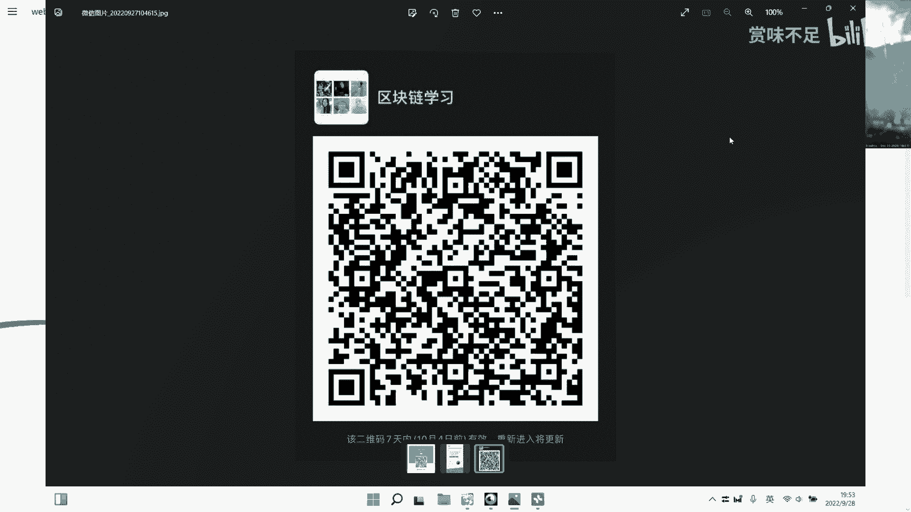
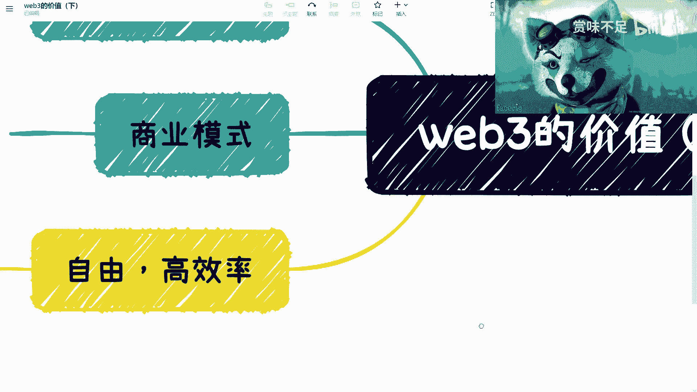
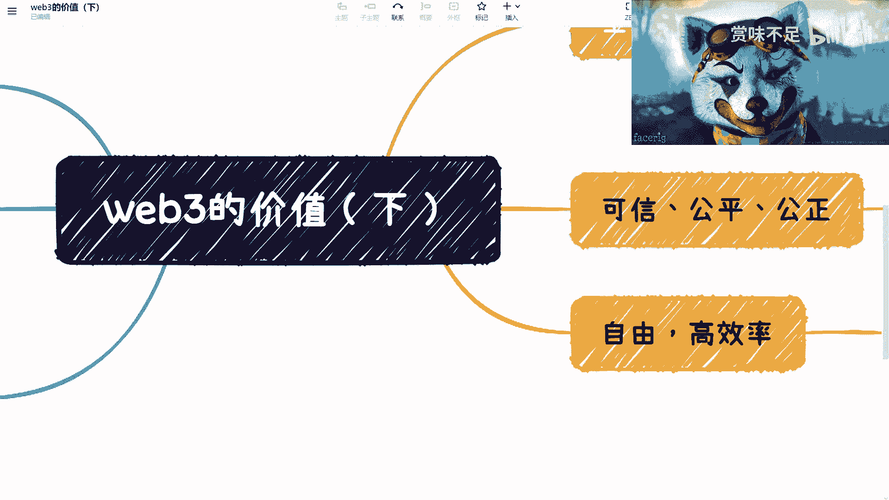

# 赏味区块链--大家一起来讨论下web3的价值-下----P1---赏味不足---BV1w14y187

在本节课中，我们将继续深入探讨Web3的核心价值。我们将分析Web3相较于Web2的独特优势，并阐述其构建可信、高效、自由数字生态的潜力。

## 概述：Web3的生态优势

上一节我们讨论了Web3的基本概念，本节中我们来看看Web3生态系统的具体优势。其核心在于**底层互通性**与**资产通证化**。

Web3相对于Web2有一个天然优势：其底层是互通的。假设跨链技术成熟，不同区块链底层将更容易打通。即便在当前阶段，如果多数生态都构建在以太坊上，其底层数据与资产也是天然互通的。

这比Web2的情况好很多。在Web2中，例如医疗、游戏或社交领域，由于中心化架构，想要打通数据存储、处理或加密等底层服务，难度极高。其根本障碍往往不在技术，而在于商业利益等非技术问题。

## 价值一：万物皆可通证化 🪙

Web3生态的第二个核心特征是**一切皆可通证化（Tokenization）**。这意味着生态内的各种权益和资产都能以通证形式存在和流转。

在Web3生态中：
*   **非同质化通证（NFT）** 本身就是通证。
*   各类**智能合约**，无论是社交、游戏还是去中心化金融应用，其交互与抵押都基于通证。

通证具有极高的灵活性：
*   积分可以是通证。
*   加密货币可以是通证。
*   NFT可以是通证。
*   元宇宙中的虚拟物品，如一张椅子、一张桌子，都可以是通证。

你会发现，这是一个非常自然且灵活的生态。这是Web2因缺乏相应基因而无法成为的生态。目前来看，Web3构建了一个相对Web2更优越、且独一无二的生态。

## 价值二：可信、公平与公正 ⚖️

接下来，我们探讨Web3在建立信任机制方面的价值。基于公有链构建的生态，在数据存储和流程执行上，可以比Web2方案更可信、更公平、更公正。

我们并非主张Web3完全替代Web2，二者更多是相辅相成的关系。在需要高度公开、透明和公平的领域，例如公益项目、选秀节目或各类投票，可以将关键环节部署在公链上，其余部分仍可留在Web2。这种结合是可行的。

Web3生态中这部分提供**可信、公平、公正**的能力，是其不可替代的价值之一。我们不能因为当下的市场炒作而否定其真正的潜力。

## 价值三：通往真正的元宇宙 🌌

现在，让我们将视角转向元宇宙。国内当前炒作的重点常与VR、AR、MR等展现形式挂钩。然而，真正的元宇宙核心不应仅是展现形式。

在我看来，真正的元宇宙应该是一个**门槛较低、效率较高、具备天然共识、且底层数据与资产打通的虚拟世界**。以电影《头号玩家》中的“绿洲”为例，不同游戏间之所以能平滑切换，正是因为其底层数据与资产是互通的。

这正是Web3能够实现的**真正元宇宙的基础建设**。在国内Web2环境下，数据难以共享，很可能出现“阿里元宇宙”、“腾讯元宇宙”等割裂的生态，而无法汇聚成一个统一的元宇宙。这是Web3元宇宙与Web2元宇宙的根本区别。

## 价值四：自由与高效 🚀

最后，我们来看看Web3带来的自由与高效。最直接的例子是**去中心化金融**。

在Web2世界，如果你想从事借贷等金融类业务，几乎不可能快速实现，因为需要资质审核、申报、备案等一系列复杂流程。即便只是开设一个网站，也需要审核各种资质。

在Web3中则不同。你可以直接编写智能合约，并在当晚就部署上线，立即开始运作。当然，其业务逻辑是否优秀是另一回事。因此，Web3带来的核心是**自由与高效率**，虽然技术门槛未必低，但准入和创新的门槛被极大地降低了。

## 总结与展望

本节课我们一起学习了Web3的四大核心价值：
1.  **底层互通**的生态优势。
2.  **万物通证化**带来的灵活性与创新空间。
3.  基于公有链的**可信、公平、公正**特性。
4.  作为**真正元宇宙基础**的潜力，以及其带来的**自由与高效**。

Web3的价值非常广泛。结合智能合约与数字货币，将在新商业模式中催生非常多的事物。我也相信，Meta（原Facebook）的扎克伯格在最初构想元宇宙时，思考的也是价值回归与生态互联。但作为Web2公司，在中心化驱动模式下，想实现Web3那样的智能合约、价值回归和用户共治的元宇宙，是非常困难的。

Web2的元宇宙本质是中心化驱动，而Web3的元宇宙是**用户（或社区）驱动**的。价值回归于此意味着价值可以回归用户、回归企业、回归股东。在Web2模式中，价值回归企业和股东没问题，但很难真正回归用户，即使用户获得了短期激励，长期也难建立信任。本质上，回归用户仍需依赖智能合约这样的可信执行环境。

这正是为什么在讨论区块链时，我们需要对Web2和Web3都有正确的认知。不能谈到Web2区块链就认为落后，谈到Web3又全盘视为骗局，这都过于偏颇。

关于Web3具体的**分布式商业**与**价值回归**等新商业模式，我们将在后续课程中单独展开探讨。本节内容到此结束。