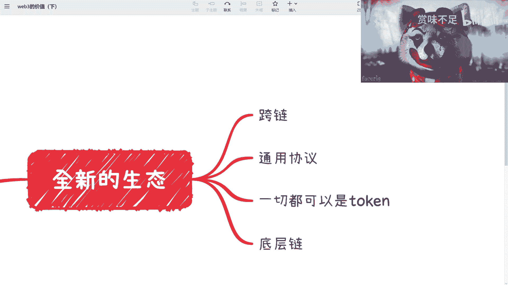
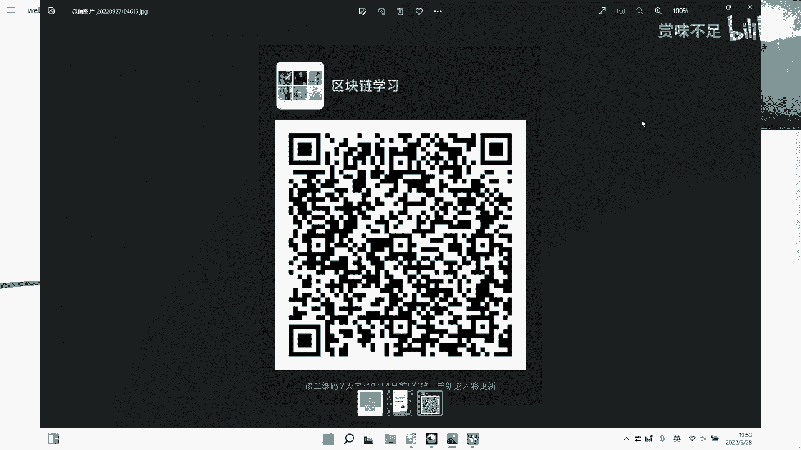
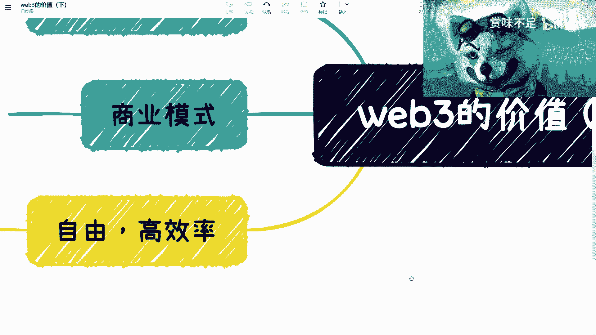
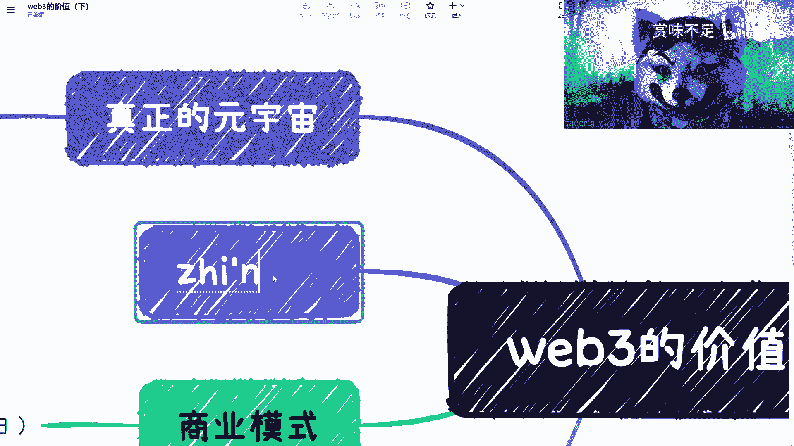
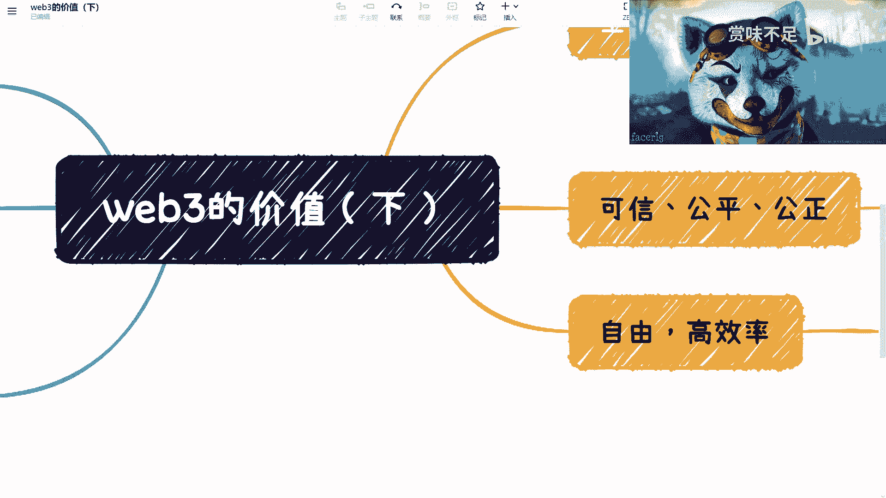

# 赏味区块链——大家一起来讨论下web3的价值（下） - P1 - 赏味不足 - BV1w14y187jJ

好那我们今天就继续来讲这个web 3的价值，就是我一直都说啊，我很认同web 3的价值，从来没有怀疑过web 3的价值啊，呃然后同样的就是呃我这边给大家看一下，哦这个给大家看一下。

这个叫呃群啊，就是就是大家有兴趣的可以加好吧，就是那些就是你们要是只是炒币，或者来说就是炒作的就别加了，好吧，我也谢谢大家啊。

这个放一会儿大家可以加一下，然后我们回到这里啊，啊首先呢我是觉得这样子的，首先呢我也不知道它会提供一个完全的生态哦，叫做全新的生态，为什么这么说呢，是因为它相对维巴尔来讲有一个很天然的优势。

就是它的底层是通的，我们这么来说，就是说假设啊，比如说那个跨链相对比较成熟了啊，那么从呃这个底层链就会相对来讲打那个都容易打通，那就算现在跨链不成熟，那说的不好听点，现在所有的打个比方。

所有的那些生态都在以太坊上面，那其实它的底层也是天然就是痛的对吧，这已经比v8 好很多，了为什么呢，因为我们说v82 ，现在啊我们举个例子，比如说我们随便说啊，就是比如说在什么医疗行业啊。

啊或者说游戏行业啊对吧，社社社交领域啊对吧，你要把底层啊，因为你是中心化的嘛对吧，你说你要把底层啊，我不管叫做数据存储啊，还有数据数据处理啊对吧，还是说是什么加密呀，你要把这些底层打通，你觉得可能吗。

但不是不可能难度到底多高对吧，几乎比登天都高，而且我之前也说过，就是582的底层打通，它的根本问题不在技术上面，它的问根本问题是在非技术的那些，商业也好，或者其他的一些这个问题上面对吧，那这个是一个啊。

第二个就是说那个web 3的整个生态，它是一切都是可以token化的，什么意思呢，就是说我们说啊web 3的这个生态，比如说n f t现在是token的对吧，合约合约。

比如说那个social game fine define，所有的东西它都是通过合约的，那么合约的这个这个交易上面啊，包括抵押也好，它其实都是token，那我们说这个token啊。

我们这个之前啊应该了解过的小伙伴其实都知道嘛，就token这个东西，它是非常的叫做灵活化的，我们比如说啊你说积分它可以是token对吧，b它可以是token对吧，n f t他可以是token对吧。

包括就是里面的啊，我们叫做元宇宙里面的那些原子，就比如说一张椅子，一张桌子它都可以是token等等等等等，这个我看得到吗，大家啊对吧，就是说你会发现就是这个生态是非常天然的对吧。

就是说这个生态其实是非常好的一个生态啊，而且是我觉得是维吾尔不可能成为的一个生态，就他没有办法成为他天然就没有这个基因哦，那么这个你我觉得是一个web 3，非常非常就是说啊我不说未来有没有别的神态啊。

但就目前来讲，它相对v8 来，讲是一个非常叫做好的一个生态啊，而且没有别的生态能跟他相提并论对吧，那首先这第一个第二个是什么呢，我们在这里说的就是这个呃可信公平公正，因为什么呢，因为你整个公链对吧。

你整个公链的这个生态如果做得很好的话啊，那么它相对你web 2等很多的这个存储，它肯定是更可信，更公平更公正，而且我们并不是说web 3它就要替替代web 2对吧。

它很很多是一个比如说相辅相成的一个作用，那么在这个地方我们比如说工艺对吧，或者其他的各种各样的，比如选秀节目啊，或者，其他东西啊你其实都可以上工龄对吧，我们如果广义上来讲的话。

就是所有的那些比如说所有的那些就是说需要大众参与的，或者来说啊他对那种可信啊，公平，尤其是投票类的对吧，可信公平公正公正是比较要求特别高的，那他可以把这一部分放到公链上，剩下的都放在尾巴上面。

这也没有问题对啊，这也没问题，那么这个其实也是web 3这个生态里面不可替代的这么一部分对吧，你不能说web 3就纯炒作对吧，web 3成怎么样，那这个只是当下，但是我们必须得要去了解它真正价值在什。

么地方对吧好那我们再来看啊，好这个地方呢我第一个地方写的叫什么叫真正的元宇宙，为什么呢，因为呃当然啊就是我也认可元宇宙里面有这个vr a r对吧，比如说v r a r m r对吧等等等啊。

就是这个呢我觉得是当下大家，或者说整个啊这个国内现在炒作的这么一个点啊，但是我在我的认知里面，我一直不觉得真正的元宇宙是跟这个东西挂钩的，因为在我看来a r比r m r只是元宇宙的展现形式之一啊。

然而真正的元宇宙应该是什么呢，应该是一个嗯叫做就是一样的，就是，说就像我们刚刚说这个f3 的生态是一样的，就真正的原理中应该是一个它门槛相对比较低或者没有门槛，同时里面效率比较高。

同时它天然会有一定的共识啊，然后底层数据啊，包括那个整个生态它应该是打通的，那我举个例子来讲，你就好像我之前说到那个呃头号玩家是一样的对吧，就是说你头号玩家里面的这个这个这个不同的绿洲啊。

不你你整个系统叫绿洲嘛对吧，你不同的游戏之间，它为什么能够很平滑的去平移，就里面这个虚拟人物为什么能很平滑的去平移，是因为它，每一个系统的底层啊，比如说它的数据啊，他的资产啊是打通的对吧。

那么这个其实是我们说的真正的粤语中啊，当然啊就是说啊国内的话呢就像我们说的，就是说它的数据是很难去做一个共享的啊，那么他很可能在一定时间里面啊，他在一定时间里面很有可能就是说是阿里元宇宙对吧。

这个蚂蚁蚂蚁源宇宙对吧，腾讯源宇宙，但是他没有办法汇集成一个圆宇宙啊，这个就是我们说就是可能web 3这边的元宇宙，跟582这边元宇宙的一个根本上的区别啊，那么在我看来的话，web 3其。

实它实现了一个就叫做真正用宇宙的这么一个叫做基础建设吧，啊那么同样的他有他的新的商业模式，这个是毫无疑问的啊，但但是并不是我们这个很多人所说的阿就发b对吧，发完b就这个这个叫什么就经济模型对吧。

然后就拉盘，拉完盘就横盘，横盘盘就就往下跌对吧，这个不叫做商业模式啊，但是呢它的确也有它的价值啊，也有它的商业模式呃，我们之前的话是把它称之为叫做分布式商业啊，或者来说那个价值回归啊，那么关于这一块呢。

就回头单独再开一期啊，我单独再开一，期嗯那么还有一个呢就是自由和高效，因为在这个地方呢，我们说啊最最这个直接的一个例子是什么，就define对吧，你比如说你比如说你现在想要去做一个借贷对吧。

或者做一些别的一些产品，尤其是金融类的，你在yy的世界几乎不可能，为什么，因为你要你得资质审核吧对吧，你得你你得就是申报吧对吧，你还得报备啊，报备案啊，各种各样的问题对吧，你比如像像像你单纯开个公司。

开个网站对吧，你还得去审核你的资质啊，包括你的各种各样的一些问题对吧，那你现在在web 3里面就不一，样了你可以直接写合约，你今天晚上就可以写，写了你就可以不对吧，你就可以去去去deploy对吧。

去去去去布置部署对吧，那你就直接可以做，当然你的逻辑好不好是另外一件事情啊，所以呢我在这个地方其实本来写的是什么呢，我本来写的是一个叫做啊自由低门槛的啊，但是我后来想了下，我还改掉了对吧。

这低门槛好像不是很合理啊，其实它应该是一个自由叫高效率的，门槛未必低啊，门槛未必低，嗯，ok哎呀，我刚刚点错了啊对吧，所以我觉得呢就是说整个微博三啊，它的价值是非常广泛。

的包括就是我们说啊就是啊那个合约对吧。

就是说智能合约这边结合智能合约啊，这个呃是结合那个里面的数字货币对吧等等啊，我们说在这个新的商业模式里面其实会产生非常多的东西，而且呢我也有理由相信啊。

就是那个facebook的小张同学在最早想要去说原作原宇宙的时候呢，他其实他想的其实也是应该是价值回归这一个点啊，而且呢他想把他的生态所串起来，但是就是说可能这个问题在哪里呢，这个问题就在于有两两点。

第一点呢就是说s e c啊，就是sec这边对他的一个监，管这个是一方面，但那但我觉得这个不是最重要的，最重要的是我不二对，因为它毕竟还是个维吾尔的模式嘛对吧，你要说facebook今天自爆了对吧。

你说我就把我那个facebook下面的所有生态全部变成web 3，那就是另外一个故事了对吧，但是问题是他还是个web 2，那么在web 2的这个模式下面，他想去做到就是叫做web 3下面的。

比如说智能合约啊，包括价值回归啊，包括元宇宙啊，这么一个模式呢，其实是很难的啊，是很难的，就是就你简单来讲呢，就是说比如说web 3，大家现在也知道都都说到嘛对吧，就，是道好不好，是另外一件事情。

但是提到这件事情是有道理的，为什么呢，因为582的元宇宙，它其实归根结底还是个中心化驱动的模式，但web 3的圆桌不一样的点在哪里呢，它就是一个叫做用户驱动呢，或者说叫做叫做不一定叫做用户。

就是项目方也好，比如说facebook这边跟他所有的这个用户，包括telegram ma对吧，不是telegram instagram对吧，就是这些用户大家是平等的，大家可能当中有一些不同的地方。

但是大家是一起推动整个这个东西，那价值回归在这个地方啊，我们简单说一下吧，啊比如说价值回归哎，呀呀呀呀呀，天呐对吧，你比如说嗯价值回归这个地方，我们打个比方，你回归用户对吧，一个是回归用户。

一个是回归企业，对吧，一个是回归股东，呃比较股东的投资方，那其实你想嘛就是说现在你为b2 的模式，你回归企业，回归投资方是没问题的，用户是回归不了的对吧，用户回归不了呢，而且就算你回归用户，他时间长了。

他不相信你对吧，所以其实你本质上的回归用户，你还是要通过智能合约，但问题是facebook也没有所谓的联盟链对吧，那他其实最好的一个方式就是通过供链，但是他并没有这么做，那当然他作为一家中心化的企业。

它没法这么做啊，或者说他可能还没有写这个这个有一个比较平衡的一个点，可能没这么容易找到，因为毕竟你web 3跟b2 要找到一个平衡点，一个中间态的这个状态去做这件事情几乎是不可能的。

所以说呢我觉得就是说当下呢，就是呃就是我们之前那个课程里面也提到过嘛，就是啊这个市值蒸发了300个亿对吧，那其实这个事情是比较尴尬啊，是比较尴尬嗯，不过也正常啊。

但是我觉得就是说我还是很佩服facebook的，因为在这个地方它属于一个先行者对吧，你要说碰到点问题啊，或者说有些这个骨架上的波动也是很正常的啊，但是不管怎么样呢，就是说我觉得这个他也好，或者大部。

分的这个人也好呢，他是能看到我p3 的价值的，嗯所以呢就是这也是我为什么最近呃在招聘的时候一直问，就是来一个人，我就会问他，我说你觉得web 2的区块链的价值跟5b3 区块链价值在什么地方啊。

最主要原因呢，我是觉得一呢就是说呃，一大家希望我希望大家能够对web产能有个正确的认知啊，这个跟微博也有个正确认知，你不能不要说到web 2的区块链，就说好垃圾对吧，人说的5b3 的区块链嘛。

又变成骗局对吧，你这个这个这个就太过偏颇对吧，所以就说在这方面呢，我基，本上就列了这几块啊，我觉得这几块是我不然无法替代的啊，那么关于商业模式呢，我这个夏季以后再单独看一期好吧，呃。

ok那么本节这次这个内容我就先讲到这儿啊。

