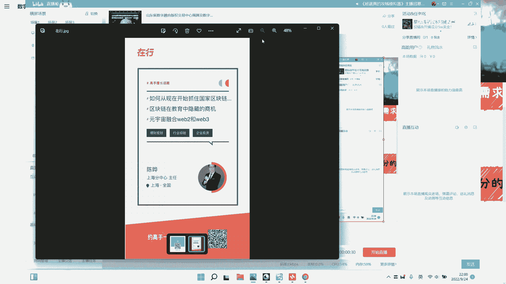
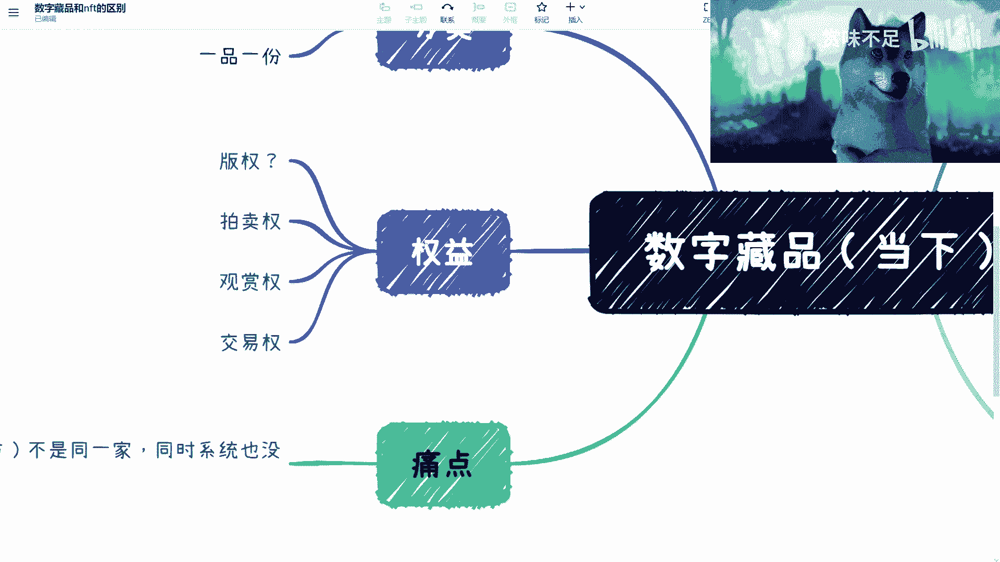

# 赏味区块链——数字藏品的现状 - P1 - 赏味不足 - BV1ke4y1b7Pv

啊好大家好啊，然后今天这个呢我们就来讲这个数字藏品啊，呃大家看到我把这个小浣熊换成了一只汪，呃柴犬对柴犬，然后先调整一下啊啊然后在这之前呢，就是我先说一下啊，两个服务，啊我先说一下两个服务。

我们来看一下，一个是。

啊两个一个是在行这边啊。

我弄了一个一个咨询的，然后有那么几个主题，一个是啊国家新基建的啊，一个是区块链和教育的一个结合啊，第三个呢就是元宇宙融合web2和web3啊，然后还有一个呢就是我开了一个那个，怎么两个都在行呀。

好烦啊啊，还有一个就是那个知识星球，知识星球这边呢，大家可以就是感兴趣可以扫一下，然后我最近正在弄啊，然后我会把一些比如说web3的一些信息啊，包括一些商机啊，啊包括目前可能有一些就落地的信息哦。

我会分享在这个元宇宙这个信息呃，知识星球里面，然后大家加进来之后呢。

大家有什么问题，也可以随时在这个知识星球里面去，然后提出来，好吧好，然后我把这个显示关掉，好那我们切入今天这个主题啊，呃数字藏品这边呢是这样子的，就是我今天先说一下，就当下的这个情况啊。

就是这边为什么写这个当下呢，就是因为这是一个现状啊，并不是说他未来一定也是这样的，或者不一定不代表他未来发展趋势这样子啊，然后呢就是在这个地方有个痛点，这个呢我就另外再开一期啊。

另外再开一期就不在这个地方说了哦，我把它再放大一下啊，我们首先先来看几个啊，一个是这个呃，这个数字藏品在国内的这个联盟链啊，因为我们说数字藏品这么一个称呼啊，我们就说是这个国内的这么一个东西对吧。

就是说如果今天我会把NFTT也说进来的话，那就是web3的一个内容，那么我会把NFTT再单独开一期啊，那联盟链这边呢我们能看到有那么几个，一个是铸造对吧，就是铸造本身呢。

我们说其实是通过一个合约来做铸造的对吧，那么这个铸造呢我们就是做过的这个朋友啊，他都能明白，就是其实整个链搭完之后，整个合约的铸造其实不是那么复杂哦，因为你铸造的话无非就是说一些属性。

比如说是否可以交易啊对吧，它的量是多少啊，然后他呃这个智能合约呃，这个叫做啊，是不是我异性啊对吧等等等啊，因为现在整个的一个数字藏品，还没有涉及到它背后的一个业务逻辑啊，包括一些这个呃丰润的逻辑啊。

这个我们回头在这个说痛点的时候，大家可以再详细的，我会详细的跟大家去说啊，那么呃这个铸造本身没有太大问题，那么第二个就是上线对吧，因为你铸造完了之后，我们去做上线，其实本质上它是一个行为啊。

他是一个行为，但是呢就是因为我们说啊，就是说这边是联盟链嘛对吧，那我们现在所有藏品所用的那个app，他是个中心化的对吧，所以说呢，其实本质上就相当于说我们要维护一套系统。

这套系统是用户所用的那个数字藏品的平台，和我们这根链得要有一个那个接口的打通啊，包括一个数据的打通对吧，那么第三个是确权，确权，这边呢是这样子的，就是呃我们其实我跟很多人沟通下来啊。

就我发现很多人有一个误区，就这个确权和上链啊，就是上链，好上A上线啊，不代表确权啊，那么同样的就是说这个地方呢我们要来说一下，就是说嗯你国家确不确权，因为确权本身它是一个法律行为啊。

不是说今天你站在这或者一家公司跟你说，确权就要确权呢对吧，那我们真的要说确权的话，它是一个法律行为，它是一个在国家层面有一个官方的，或者有一些官方的组织，有些这个这个这个机构要来做这个事情的啊。

所以说我们并不是说他去上练了，今天你说我上A链上B链上C练，他就代表确权了，这是两化两码事啊，也就是说在国内的数字藏品逻辑当中，其实本质上就是要么哦未来，比如说有一个官方认可的这个链，你上去了。

他默认就告诉你，我是代表已经确权了，要么就是说你现在上线只是那个一个行为，除了上线以外，你还得到官方的一些平台，比如说版权呃，版权局啊对吧，包括一些版权申请的机构啊对吧，那些地方去做确权。

那么单纯的你说上链其实这件事情啊，无论他在平台上面，在产品上面到底怎么去说的，但其实他是没有任何法律依据的，也就是说如果你这个产品今天你上线了，未未来它被侵权了，其实一样。

就说你是没有这个这个任何的一个，保护自己的一个措施好，那么我们诶我看一下啊，啊我们继续来说这个权益啊，好我们来看权益，权益这边是这样子的，首先交易权啊，这个呢其实已经有了很大的一个争议性，那为什么呢。

因为本质上啊，目前来讲就是数字藏品，在这个国内的这个定位上面，其实它有两个两个分类啊，我们把这个座位写一下，比如说分类啊，它哪两个分类呢，一个叫做一个叫做一品一类，啊不叫一品一类吧，一品一份对吧。

一个叫一品多份，拿一瓶多芬好，那一品一份的意思，就是说我比如说我今天发行100个对吧，这100个每个都不一样对吧，然后每一个就一份对吧，那一品多份呢就是说我今天发一张照片。

这张照片呢可能有1000份或2000分对吧，好那在这个里面呢就是说一品一份哦，他如果要去做交易，他其实就是如果来说他的版权就被认可了，他要去做交易，那么本质上没有太大问题啊。

你该有的一些资质有了之后就能够去做交易了，但是呢就是当中现在最大的问题在哪呢，啊现在最大的问题在哪呢，就是这个一品多份，因为一品多份本身，首先它版权是很难去认可的，那当然我也看到过。

有一些是那个版权登记证书是可以申请下来的，但这个具体我可能也不是很清楚，为什么啊，但是我们今天要讲的是什么呢，就是我们的前提是他版权就被认可了，但如果版权一旦被认可的情况，下面一一个东西一品多份啊。

他其实交易的时候只能是什么呢，只能是比如说是观赏权，或者来说他的一些呃拍卖权啊，他不能有任何商业这种版，就是真正的版权的转移，亦或者来说交易权哦，交易权可以啊，版权的转移是不行的，为什么呢。

因为你一品多份在法律目前的定义当中，你最多最多只能分割200份啊，超过200分他就是不合法的啊，那么也就是说如果你要有版权的属性的交易，也就是说我今天卖卖出去的时候，等于有版权的一个交换哦，有一个转换。

那么它最多就200分啊，那么这个情况下面，其实从从目前的数藏角度来讲，没有平台限制200分的，到目前为止没有看到过啊，那么所以说呢，其实本质上他的一品多份卖的是什么呢，卖的就是观赏权。

或者说它的交易权是不存在它的商用版权的啊，或者说这个有一定的这种版权属性，没有的，没有版权转移啊，也就是说我今天就算卖出去1万份，这个东西的版权该是谁还是谁的好，那么这个是从分类角度。

那么最终呢在这个权益当中有一个版权，我打问号对吧，因为这个呢在目前来讲，就是国内的整个生态是没有打通的啊，当然就像我们刚刚说的，你说有一些练啊，他说你上了这个店，他就帮你到版权去做登记，这个是可以的。

这个是没问题的啊，是没问题的，但是我们说是不是只有九就登记完了就结束了，其实并不是因为我们要的是什么，就是你今天上完了，登记完了交易了啊，然后这个东西以后，比如说交易了这个费用啊，到底怎么算啊。

到底怎么有，有没有一个标准，这个费用是中心化转移，还是通过智能合约来转移对吧等等，那么这些其实是我们需要现在这个，接下来就整个生态去完善的，所以说呢现在其实本质上来讲啊，我们说整个数字藏品啊。

就是他属于就是0~1已经OK了啊，但是1~100，整个的一个基础建设其实还是有有待完善的啊，那么这边是这一块啊，我们再来看市场需求，市场需求这块呢，目前大部分的品牌对于我们说的合作方，IP方，品牌方啊。

它对于数藏的这个需求在哪里呢，就是品牌宣传，就相当于叫做营销费用啊，他走的是营销费用，啊那么同样的市场需求还有什么呢，一级也是市场需求，二级也是市场需求，但是呢我们在这个地方说一嘴啊。

就是正因为他的那个市场需求，是在品牌宣传上面，所以说呢对于很多的这个用户来讲，他现在的数藏跟品牌它是一个叫做弱绑定关系，也就是说我举个例子，比如说我今天帮麦当劳啊，帮肯德基发了个收藏。

那可能就是说我只是发了个收藏，你说这个收藏是不是真的能融合到现有的这个，麦当劳或者说肯德基的生态里面，基本上是没有的啊，我们说现在所有的那些平台，比如鲸探啊，或者换合啊，或者其他的一些各个平台。

你会发现它的数藏，他都是一个基本上只有一级和二级的行为，为什么呢，因为它的发行方啊，它的发行方呃，我们在这地方提一嘴啊，就是我们说这个哎这个不应该放在这，这个应该是放在痛点这边。

但这个回头我会单独再拎一期出来啊，就什么叫做发行方和IP方，或者我们叫做创造方，创作方对吧，他就是说不是同一个不是同一家，同时呢系统也没有打通，啊那么这个是目前一个最大的问题。

所以说你们会发现所有的平台，其实目前都是这样子的啊，所以说这个问题呢就会最终导致什么呢，就是这个平台，比如说这个数藏，他最终只有一级和二级，也就是说他只有交易，他没有所谓的负能啊。

而且你会看到这个赋能更多的，也就是说我送你一点东西，我送你，我送你一些啊，周边对吧，我送你一些礼品，但这些并不是，就这个数藏并不会真正融合到这个品牌当中啊，那么这个原因就像我们刚刚说的。

就是说他的这个发行方，创作方，其实它并并不是同一家啊，那么这个地方还有个叫做确权对吧，因为目前来讲，我们说啊，真正的这个从大大这个数藏的大市场来看，真正确权的我们叫做国家到到国家版权这边。

或者国家系统认可的确权是很少很少的，你们会发现它最多也就是说是一个品牌方，授权啊，有一个授权合同，然后呢他就告诉你好，我来我今天要发行这个数藏了，然后我就是你先到一级来做购买，二级来做交易对吧。

但真正的缺陷是很少的，那么这个两个问题会导致所有的人都会觉得，数藏是只有发行啊，只有一级发行，二级交易，没有后续的，它是一个就是断档的一个事情啊，那么这个是目前的一个痛点啊，那我们说和积分的区别啊。

首先如果从用户的角度或者从品牌方，品牌方的角度，他会觉得是没有区别的啊，而且反过来说很大的区别在哪里呢，目前的数据他是落在发行方这边的，并不是落在品牌方这边的，也就是说如果今天你是一个收藏平台。

我是麦当劳，我跟你的合作，这个数藏卖出去10万粉，我我能得到什么，我能得到，这是那是这个10万粉的分润，但是这10万份数据其实是在链上的，而且是在你联盟链上的，而且我根本就不知道你到底是在哪个联盟链上。

对不对，那这个数据我作为麦当劳我是拿不到的对吧，那我既然拿不到数据，我其实这个数藏跟我的系统也没打通，那说难听点，这个数据跟我麦当劳有关系吗，没有关系，那这个收藏对我来讲更多的是什么呢。

这个地方写的对吧，就是个品牌宣传营销，所以说呢其实这个也是为什么，导致就是说目前来讲这个很大的一个就是说啊，大家觉得这个市场很冷啊对吧，或者这个市场比较的就是嗯就是萧条对吧，这个是目前很大的一个痛点啊。

那么那么OK后面就是说我会我来讲，这个真正的这个这个叫做痛点的时候，我会单独再开一期啊，在那个开启，Ok，然后我现在基本上每期视频，我会把这个视频时间都压到15分钟以内，因为目前大部分的这个平台啊。

视频号啊，小红书啊都是只支持15分钟，所以我就不想做一个上下级了好吧，反正大家有什么问题，大家就加那个知识星球或者在行啊，或者微博私信我好吧。

