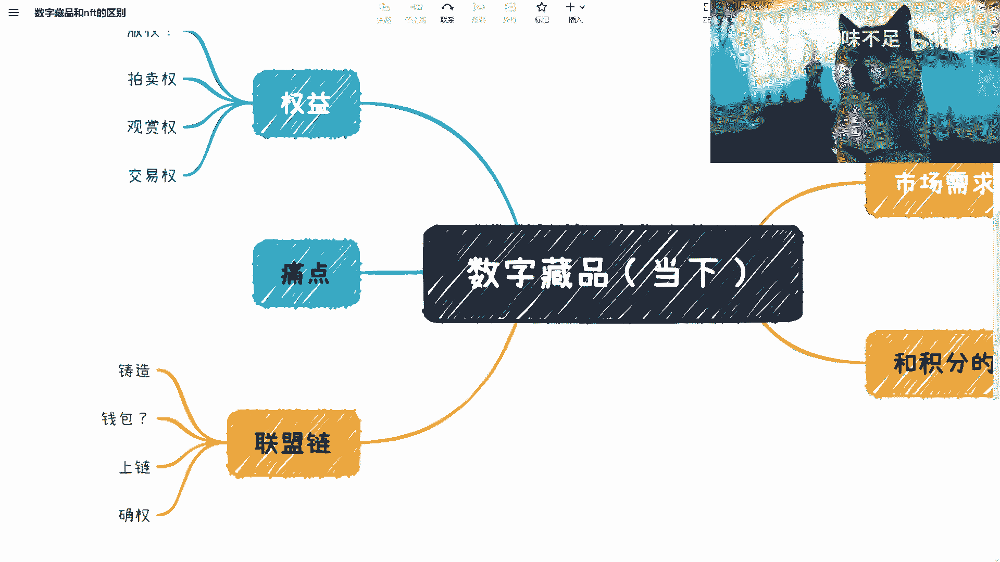
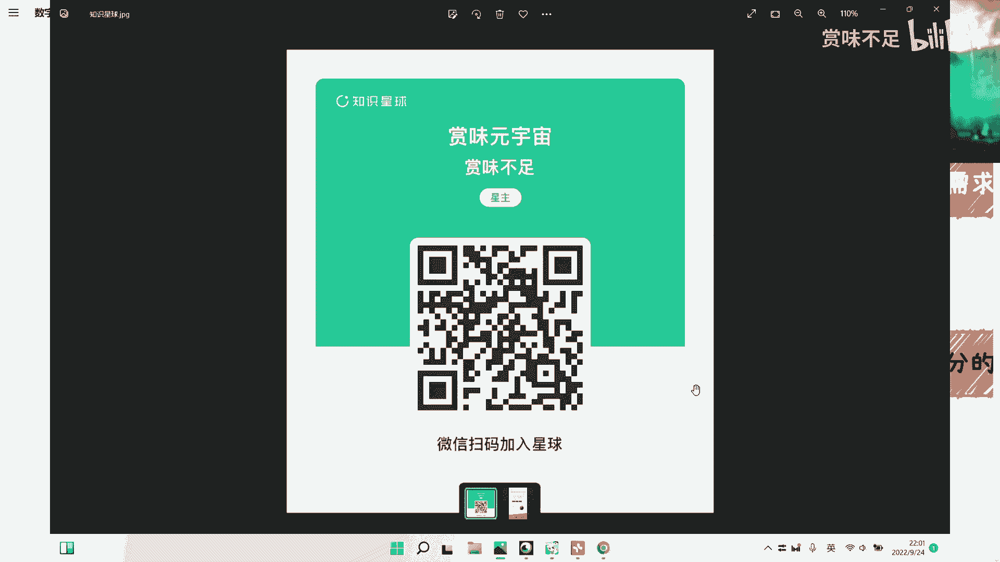
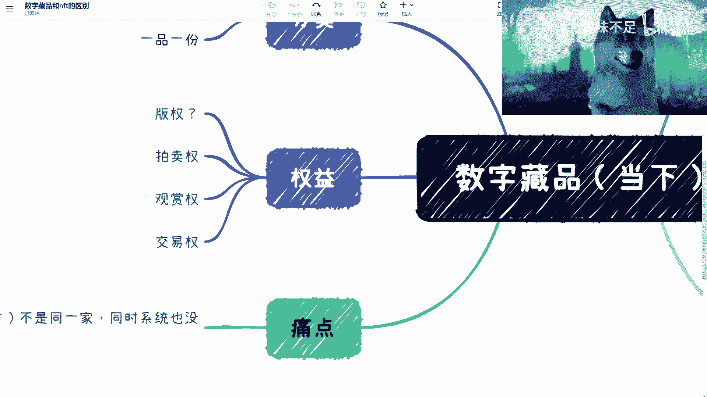

# 赏味区块链--数字藏品的现状---P1---赏味不足---BV1ke4y1b7Pv




在本节课中，我们将要学习数字藏品在国内的现状。我们将探讨其核心概念、运作流程、当前的市场需求以及面临的主要问题，帮助初学者理解这个新兴领域的真实面貌。

---

## 课程概述 📋



数字藏品，作为国内区块链技术应用的一个热点，其发展现状与公众认知存在一定差距。本节课程将系统性地介绍数字藏品在联盟链环境下的铸造、上线、确权等关键环节，并分析其权益属性、市场需求以及与积分的区别，旨在厘清当前数字藏品生态的真实图景。

---

## 核心概念与流程 🔗

上一节我们介绍了课程的整体框架，本节中我们来看看数字藏品运作的几个核心环节。

### 铸造

铸造是数字藏品产生的第一步，本质上是通过智能合约在区块链上生成独一无二的通证。这个过程并不复杂，主要涉及设定藏品的一些基本属性。

以下是铸造合约可能包含的关键属性代码示例：
```solidity
// 伪代码示例
contract DigitalCollection {
    uint256 public totalSupply; // 发行总量
    bool public isTradable; // 是否可交易
    bool public isBurnable; // 是否可销毁
    // ... 其他属性如元数据链接等
}
```
铸造行为本身不涉及复杂的业务逻辑，例如版税分配或更深层的赋能规则。

### 上线

铸造完成后，藏品需要上线到用户使用的平台。由于国内数字藏品平台多为中心化应用，而底层是联盟链，因此需要打通两套系统。

这个过程本质上是维护一套中心化平台系统，并与底层的联盟链进行接口和数据同步。

### 确权

确权是一个关键但常被误解的概念。需要明确：**上链不等于确权**。确权是一个法律行为，需要国家官方机构或授权组织的认可。

目前，单纯在某个联盟链上记录信息，并不具备法律意义上的确权效力。未来可能需要官方认可的链，或者藏品发行方额外前往版权局等机构进行登记，才能获得法律保护。

---

## 权益分析 ⚖️

了解了基础流程后，我们进一步分析数字藏品所承载的权益。目前，其权益属性存在较大争议和不确定性。

数字藏品主要分为两类：
*   **一品一份**：发行数量有限，且每个藏品都独一无二。这类藏品的版权相对清晰，交易逻辑也较为直接。
*   **一品多份**：同一作品发行多份副本。这类藏品的权益最为复杂。

对于“一品多份”的藏品，即使其版权获得认可，根据现行法律框架，其交易通常也只能涉及“观赏权”或“转让权”，**很难包含“商业版权”的转移**。因为法律上对权益分割的份数存在限制（例如最多200份），而目前市面上的数字藏品平台很少遵守此限制。

因此，目前大多数数字藏品的“版权”属性是存疑的，整个生态中版权登记、交易后的权益分配（如版税）等环节尚未形成标准化、自动化的流程。

---

## 市场需求与痛点 😟

上一节我们分析了数字藏品的权益困境，本节中我们来看看市场是如何看待它的，以及由此产生了哪些核心痛点。

目前，品牌方对数字藏品的主要需求集中在**品牌宣传**，将其视为一种营销费用。这导致数字藏品与品牌业务之间是“弱绑定”关系。

以下是当前市场模式导致的主要痛点：

1.  **生态割裂**：发行方（平台）与IP创作方/品牌方通常是分离的，且系统未打通。藏品发行后，除了在平台内进行一级发售和二级交易外，很难融入到品牌原有的业务或会员生态中，缺乏持续“赋能”。

2.  **数据孤岛**：藏品产生的交易数据、用户数据沉淀在发行平台的联盟链上，品牌方无法直接获取和利用。这使得数字藏品对品牌方的长期价值大打折扣。

3.  **价值认知单一**：由于上述痛点，市场（包括用户和部分品牌方）容易将数字藏品简单理解为一种可交易的“数字积分”或“纪念品”，忽视了其潜在的数字资产属性和更深层的生态整合可能性。

正是这些痛点，导致了市场感觉数字藏品领域后劲不足，从“0到1”的突破已经完成，但从“1到100”的生态建设仍任重道远。

---

## 与数字积分的区别 🔄

由于上述痛点，从品牌方的实际体验来看，数字藏品与数字积分的区别可能并不明显。但一个关键区别在于：**数据所有权**。

在传统积分体系中，数据完全由品牌方掌控。而在当前的数字藏品模式中，核心数据（链上资产记录）归属于平台所依托的联盟链，品牌方难以直接获取和利用。如果藏品无法与品牌业务系统打通，那么它对品牌而言，其价值就主要局限于一次性的营销曝光。

---

## 课程总结 🎯

本节课中我们一起学习了数字藏品在国内的现状。我们梳理了从铸造、上线到确权的基本流程，指出了“上链非确权”的关键认知。我们深入分析了数字藏品的权益困境，特别是“一品多份”模式下的版权限制。最后，我们探讨了当前市场将数字藏品主要用于品牌营销的现状，并揭示了由此产生的生态割裂、数据孤岛等核心痛点，这些痛点使得数字藏品的长期价值未能充分释放。



理解这些现状，是客观看待数字藏品领域、洞察其未来可能发展方向的基础。