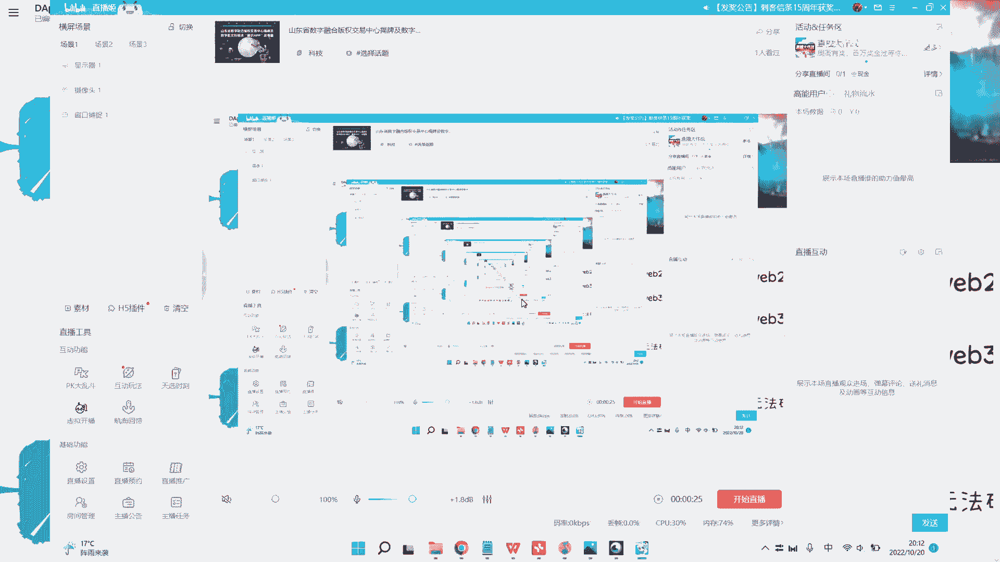
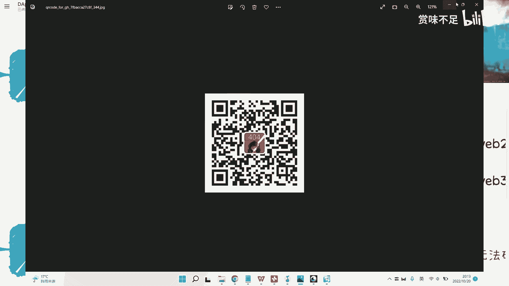
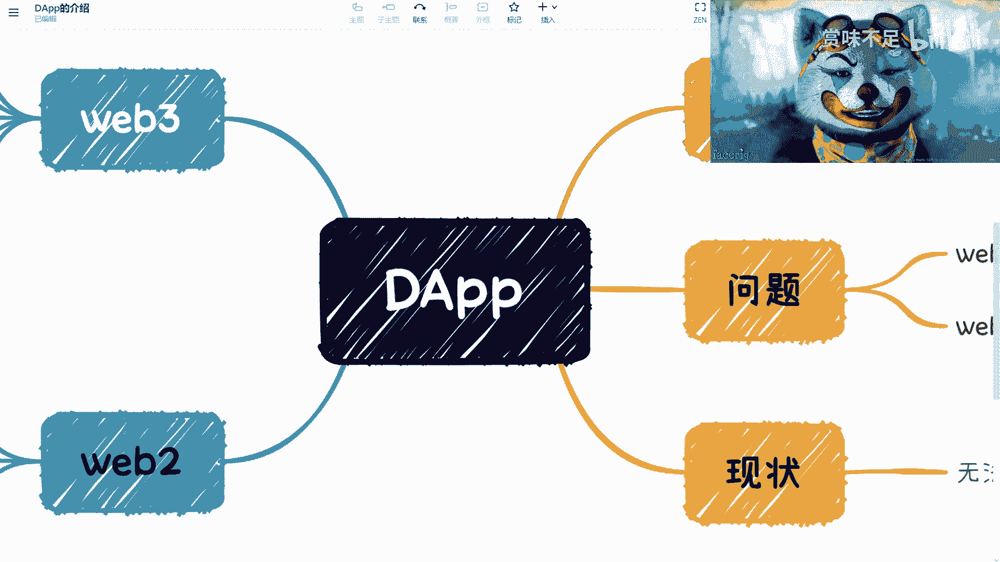
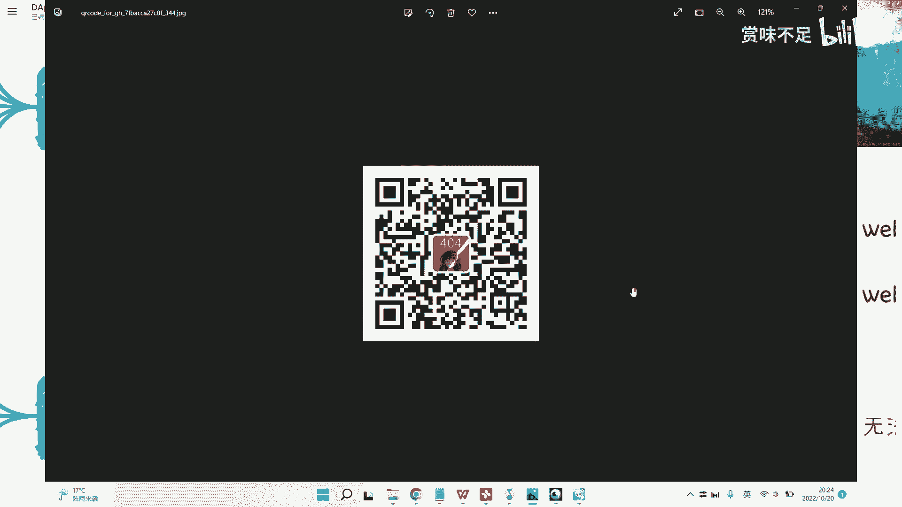
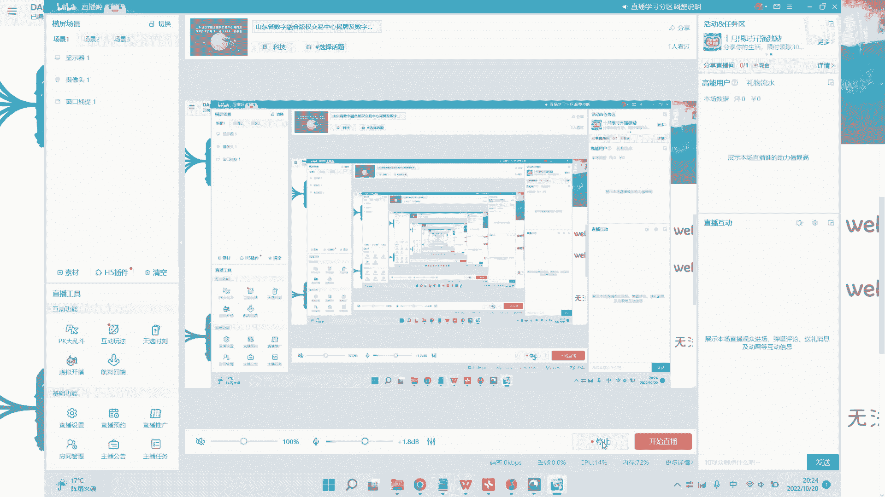

# 赏味区块链——来谈谈我所了解的DApp - P1 - 赏味不足 - BV1Ad4y1y7rK

好那我们这一期呢是这个来讲这个dp哎呀，呃对首先来讲这个deep之前呢放大看看，差不多讲这个deep之前呢就跟大家说一下，就是重启了我的那个公众号啊，然后大家有兴趣的可以关注一下。

就是这个好吧，就可以关注一下，因为呃这个一方面呢我主要是在里面打算讲三个东西啊，就是一方面呢是啊，就是我会找各种各样的人，什么投资人啊，或者来说呃各方面各自从就各行各业的啊。

然后可以跟大家分享一些这个经验，这个web 3的原理之后，我肯定该写的一滴血，那还有一些呢可能就是一些随笔了啊，就是日常的好吧。

那大家可以暂停的这个关注一下，我们今天来讲这个dp这个deep呢对吧，首先我们先说这个介绍在这个地方有啊，叫decentralized application啊。

呃其实本质上呢就是说web和web 3还是不太一样的，因为从去中心化的应用角度来讲呢，其实理论上它是一个纯f3 的产品对吧，你其实就跟我爸没什么关系啊，但是呢就是微博这边呢就是呃为什么会有呢。

呃待会我们来讲啊，但首先先来说这个介绍啊，这个介绍其实本质上呢呃我们可以简单的理解，为什么呢，就是说因为正常来讲我们叫做application就没有这个d对不对。

那这个plication呢大家用的时候都知道啊，就是它是一个什么结构呢对吧，就比如说呃你现在用的所有的这些应用对吧，它其实就是一个啊这个客户端啊，再加上服务器对吧，那服务器在谁那边呢。

就是中心化的这个企业这边对吧，我们称之为application，那么decisions the application是什么呢，就是嗯应用端还是应用端对吧。

比如说什么什么什么什么h5 i a p p啊对吧，这些啊，呃然后呢它这个服务器呢它就没有了啊，它它相当于就直接对接到，比如说这个合约啊，因为我们之前课程大啊。

之前那个也不是课程啊哈就我视频号写的这些东西，大家就发的这些东西大家也都知道啊，就是说啊这个练对吧，合约是在链上的啊，练呢因为它是一个去中心化的一个一个生态对吧，那么也就是说前面的客户端还是不变啊。

但是呢它这个对接的一些服务呢其实是在这个应用上的，呃，在这个合约上的啊，那么这样呢我们称之为一个纯的一个web 3的一个descent descralized application啊。

那我在这个地方举了几个例子，就比如说以前的加密猫对吧，大家可能呃听说过都知道啊，这不知道的可以百度1下对吧，google一下啊，好像附魔3d对吧，这两个就比较有代表性嘛。

像其他的剩下其实所有的那些都叫deep啊，没什么很大区别啊，就同我们在那个wifi这边统称嘛对吧，就应用了，但是呢在在就是说因为今天我去，今天就看我朋友圈，也知道，就我去了福袋嘛。

我跟复旦这边的这个老师聊下来呢，其实也是一样的，就我也跟他们说嘛，我说就是未来我们说原宇宙也好，web 3啊，我这个先不去谈未来事情，没人讲得清楚啊，但我说当下的这个web 3是什么呢。

就是你抛开他的皮啊，我不管就是底层建筑，那底层建筑先不说什么跨令啊，聊one 6 to啊对吧，这些先不说啊，我说从这个应用生态角度来讲对吧，你比如说social fy game。

fine define对吧，然后stable coin啊，然后呃呃就各种各样的应用对吧，不nf啊，我说其实是这样子的，你把皮刨掉啊，就是web 3的本质就是金融，因为我在这地方也写了嘛对吧。

web 3的本质就是金融，就是千万千万不要去想，就千万千万要我认为啊就要认清楚这个事情，为什么呢，因为我们做一件事情啊，肯定是跟这个就当下的这个时间点是有关系的对吧，就是你要顺势而为嘛。

那么我们说为什么要认清楚他，是因为就是我们不要就是这个自欺欺人啊，觉得啊好像我要现在去做一个微博三产品了啊，这个产品怎么样怎么样，好对吧，然后做的怎么样，这边这个美优美对吧，怎么样子啊。

我说这个都不重要，为什么，因为现在5f3 的本质其实就是金融啊，或者我们这个是再往下说一层，就是web 3的本质是它底层逻辑的一个一种金融模式，就是说我们可以表面是呀点错了，就我们可以表面是社交。

可以是什么游戏，可以是别的，但是关键是什么，我不管你想从web 2吸引人也好，还是从微博三让用户来玩也好，就是你最终我们说那个目前的整个微博三，他来我不管他到底为了赚钱还是为了什么别的目目的啊，但是。

你让他赚钱其实是我不三现在生态的一个核心对吧，或者我们认为是web 3的共识啊，当然你总不能说啊，当然你总不能说啊，这个赚钱不合理对吧，那你赚钱有什么不合理的对吧，就对吧，所以说就是说从本质上来讲呢。

就是就是这个deep的产品就应该给别人赚钱，别人来就是为了赚钱的对吧，你千万不要跟别人说哦，你我好玩我好玩，我就说我为什么不能玩哦，哦我为什么不去玩web 2的游戏啊，我玩ps 45，ps 4。

玩这个任天堂的steam不香吗，所以说其实这个就是核心啊，那么我们来看尾巴，我不在这边呢，其实有一些是什么呢，就是呃你比如说就是为了引流的，那他可能也没有什么很大的别的目的对吧好，这没问题啊。

那你比如说联盟脸啊，联盟链这个产品呢就比较畸形，那我只比较畸形的点，并不是说联盟林本身体型，而是说联盟链所产出的这个decent application，相对于原生的代表来讲，它就是个畸形对吧。

因为因为你本身decentralize的一个应用，我们说它的本质上是什么，就是这个叫做web 3的产品，那web 3产品我们之前也说过嘛对吧，就是数据自主啊，这个资产自主啊，身份自主。

但是问题是你在联盟链上面你资助不了啊，你怎么自主呢，对不对，所以说我说这个东西有点激情，那web这边呢其实还有web 3的产品，那web 3产品指什么东西呢，就是只说哎我呢也是做了一个web 3产品。

但是呢我是给微博用户用的啊，那么这个时候呢就会面临说这个微博用户对吧，门槛太高了，那怎么办呢啊我们可以给wey的用户啊，不是啊，对我们可以给wey的用户托管对吧，就是说你还是用用户名密码登录。

但是呢我们可以这个这个这个登录之后呢，让让你来使用链上的产品，对吧好，那这个无非就这些逻辑啊，我们来看啊，那现状是什么呢，其实现状就是今天我跟那个辅导老师聊的时候，我也提到啊。

就是说这个叫什么叫做web 3呢，它也没有新增血液，我b2 呢也无法破圈啊，不这个怎么说呢，就是说我b3 没有新增血液，微博二呢就是也无法吸引没有吸引到的用户，就web 2很难。

就是说被这些产品做这个做转化啊，那我们来看这个问题出在什么地方呢，首先是这样子的啊，我们先看这个web 2啊，呃如果你现在要做一个web的产品，那你比如说你说我把私钥托管对吧。

要做一个web 2的生态的web 3的产品，那么这个时候呢就是说，诶我这个地方可能写错了啊，哦我知道我我我我想起来我为什么写这个东西，就是说这个产品其实对于大部分用户来讲，因为你已经把私钥托管了嘛对吧。

所以说用户其实并不知道你背后到底对接的是合约呢，还是说是是个链的产品呢，还是个什么产品呢，用户并不知道，那么对于这个用户来讲，你其实就是个web的产品，对不对，那么如果你是个web的产品的话。

那么我们就回到web的世界来说，你你要与所有，比如说你要做社交，那么你就，得与所有web 2世界里面的社交做pk，那这个已经在2022年已经是卷成狗的一件事情，对不对，好，那我们说我三。

那当然啊这个地方我补充一句啊，千万不要梦想着说，所以你说嗯我比人家有竞争力，没有这件事情了啊，那首先这是第一个问题，那第二个就是说从web 25 b3 世界的这个角度来看。

就是你其实根本就不是个web 3的产品，为什么呢，因为如果我是个5f3 的那个那个生态，就是现在的参与者或者原住民，我就问嘛，那请问那个那个叫什么身，呃数据自主，身份自主啊，这个叫什么呃，资产自主。

你哪个做到了一个都做不到对吧，我不管你到底今天是在这个中心化产品上面，还是在联盟链产品上面，你没有一个做得到的对吧，你总不能跟我说啊，你在一个联盟链的产品上面，这个我的一个身份资产数据还自主。

你自主给我看看，你怎么自主发对吧，那你算个什么，我也不算产品，对不对，那我甚至还怀疑你要动用我的c，要去动区去挪用我的资产呢，对不对，旦老师聊完的时候啊，我也就是呃提醒了一嘴，我说什么意思呢。

就是说其实啊现在有很多的人啊，啊，啊就是就是或者说圈外人员，比如说这个decentralize啊，他们会接触到很多新的东西呢，但对他们来讲有很多新的东西，那么他们就会有很多的idea。

但其实这些id在2018年，2019年，其实在以往的过程当中，其实都有很多人想过，溯源啊对吧，分布式商业了，其实很多人都想过，所以我就跟那个复旦的老师也说了，我说我们要去创新没问题。

但是有一点就是我们得要去了解过去发生过什啊，二呢你也别重复把人家踩过的坑再全部踩一遍，就没什么意义，你知道吗，我们去做一些事情要试错对吧，那所谓试错试错就是你你肯定就是说你觉得哎呀。

我已经呃肯定是个创新了啊对吧，我也没有什么和可以借鉴的经验，那我，就去试错，那如果来说以前已经有非常多的案例告诉你，这条路就走不通的，那就别试错了对吧，所以就是说这个原本来我本来就是因为这个x y的。

原本就是做完了嘛对吧，那今天正好跟那个这负担，他们老师嘛正好就是哎聊起来聊起来嘛也正好谈到了这个the lication啊，正好回来想想还要把它做掉算，好呀，其实呃我不知不觉感觉我也做了蛮多期了。

蛮多期了，那个呃播放量我看了一下，其实还行啊，其实还行，我也希望就是说未来能有更多的播放量好吧，然后那个行吧好吧，然后再次提一嘴好吧。

再次提一嘴，那个大家可以关注一下公众号好吧。

关注一下公众号嗯。

