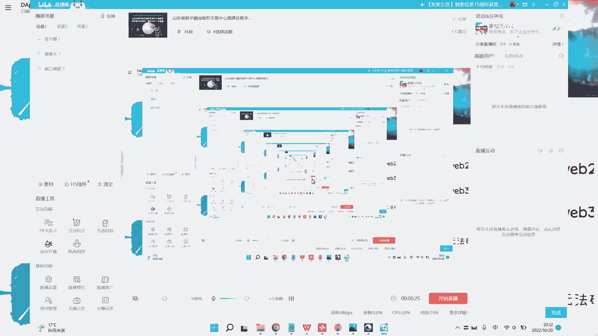
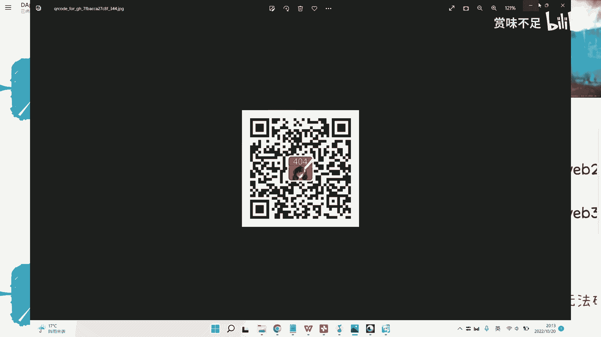
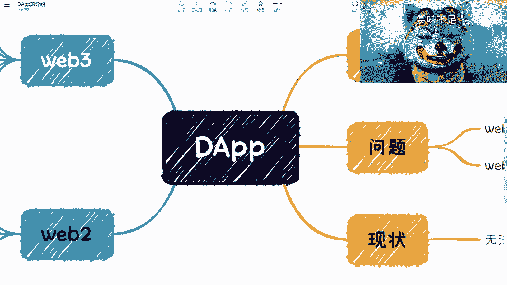

# 赏味区块链--来谈谈我所了解的DApp---P1---赏味不足---BV1Ad4y1y7rK_not



在本节课中，我们将要学习什么是去中心化应用（DApp），探讨其与Web2应用的核心区别，并分析当前DApp生态的现状与挑战。



## 概述

DApp，全称 Decentralized Application，即去中心化应用。它是Web3世界的核心产品形态。理解DApp是进入区块链和Web3领域的第一步。

## 什么是DApp？🤔

上一节我们介绍了课程主题，本节中我们来看看DApp的具体定义。

一个传统的中心化应用（Application）通常由**客户端**和**服务器**构成。服务器由中心化的企业或组织控制和管理。其结构可以简化为：
```
用户 <-> 客户端 <-> 中心化服务器
```

而去中心化应用（DApp）则移除了中心化的服务器。它的前端（如网页、App）直接与部署在区块链上的**智能合约**进行交互。区块链本身是一个去中心化的网络。因此，DApp的结构变为：
```
用户 <-> 客户端 <-> 区块链智能合约
```

这意味着，DApp的服务逻辑和数据由链上的代码（合约）管理，而非某个中心化实体。

## DApp的现状与本质 💎

理解了DApp的基本概念后，我们需要认清其当前发展阶段的核心本质。

Web3的本质是**金融**。这是当下时间点必须认清的现实。无论DApp的表面形态是社交、游戏还是其他，其吸引用户的核心动力在于能提供**金融激励**或赚钱效应。用户选择Web3产品，而非体验更成熟的Web2产品（如主机游戏、传统社交应用），核心诉求往往与资产增值相关。

因此，当前一个成功的DApp产品，其设计必须考虑如何让参与者获得经济收益，这是Web3生态的一个重要共识。

## DApp的分类与挑战 ⚖️

基于不同的实现方式和目标用户，DApp面临不同的处境和挑战。以下是几种主要类型：

**原生DApp**
这是纯粹的Web3产品，运行在公链（如以太坊）上，用户完全掌控自己的资产、数据和身份。例如早期的加密猫（CryptoKitties）和Decentraland。

**面向Web2用户的“Web3产品”**
这类产品为了降低Web2用户的使用门槛，采用了**私钥托管**方案。用户仍用邮箱/密码登录，但背后由项目方帮助用户管理链上资产和操作。

**联盟链DApp**
部署在联盟链上的应用。由于其节点由特定组织控制，并非完全去中心化，因此难以实现真正的“数据自主、资产自主、身份自主”，在理念上与原生DApp存在矛盾。

---

每种类型都面临独特挑战：
*   **原生DApp**：用户体验复杂，难以吸引圈外新用户。
*   **面向Web2的DApp**：在Web2世界中，需要与所有成熟的同类应用竞争，异常艰难；在Web3世界中，又因不具备“自主性”而不被认可。
*   **联盟链DApp**：在去中心化特性上存在先天不足。

这导致了当前Web3生态难以吸纳新血液，而Web2应用也难以通过简单嫁接区块链实现破圈的困境。

## 给开发者的建议 💡

在探索和开发DApp时，有两点至关重要：

1.  **充分研究历史**：许多在2018、2019年区块链热潮中出现的创意（如溯源、分布式商业），已经被大量尝试和验证。了解过去的成功与失败案例，可以避免重复踩坑。
2.  **明确试错边界**：创新需要试错，但试错应针对未知领域。如果已有明确证据表明某条路径走不通，则应调整方向，将资源投入到更有希望的创新中。

## 总结



本节课中我们一起学习了：
1.  **DApp的定义**：一种前端直接与区块链智能合约交互，无中心化服务器的应用。
2.  **当前DApp的本质**：在现阶段，Web3及DApp的核心驱动力是金融属性与激励模型。
3.  **DApp的主要分类**：包括原生DApp、面向Web2用户的托管式DApp以及联盟链DApp，它们各自面临不同的发展挑战。
4.  **实践建议**：开发者应深入研究行业历史，在明确的边界内进行创新试错。


认清这些基本概念和现状，是构建或参与Web3项目坚实的第一步。