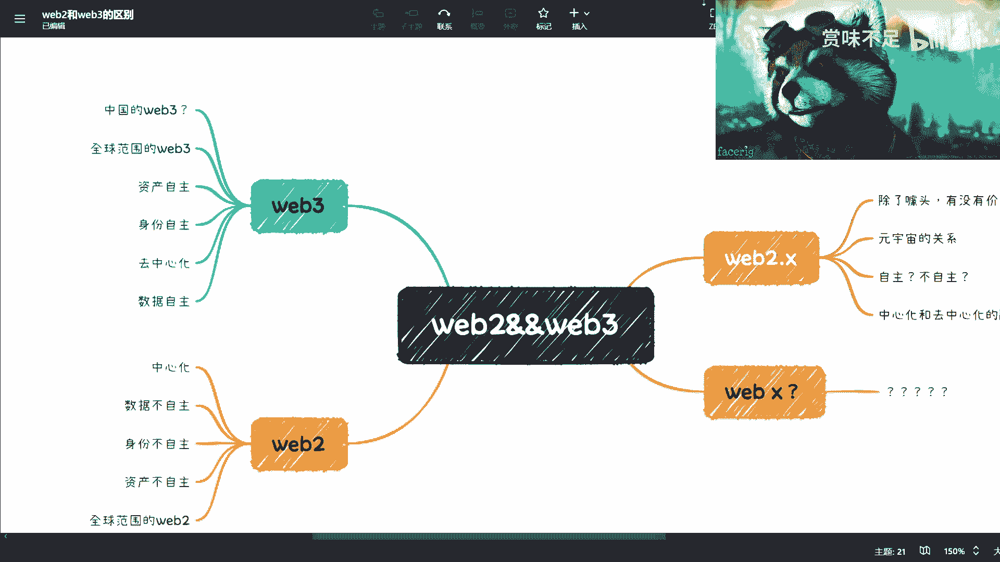

# 赏味区块链课程 P1：Web2 与 Web3 核心概念解析 🌐

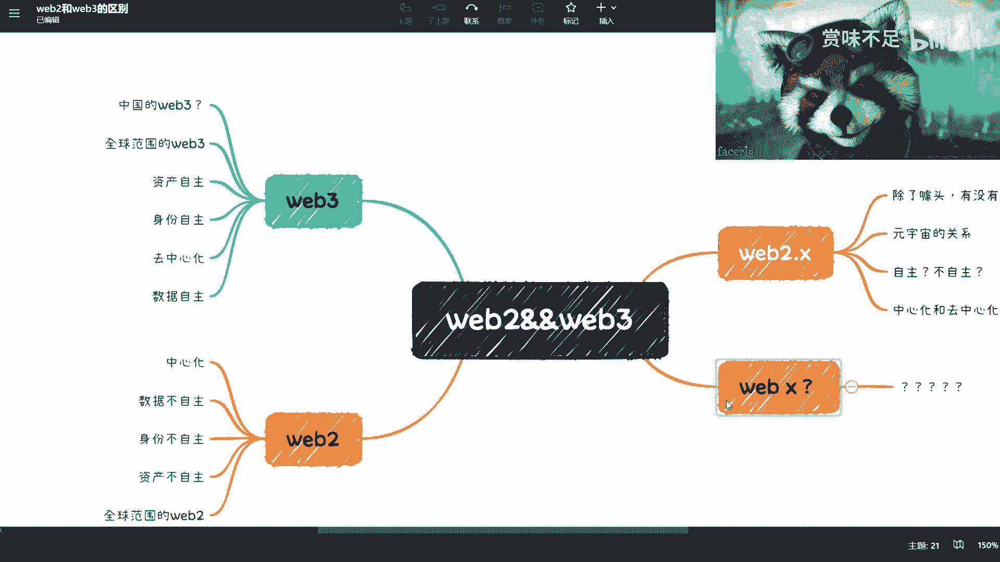

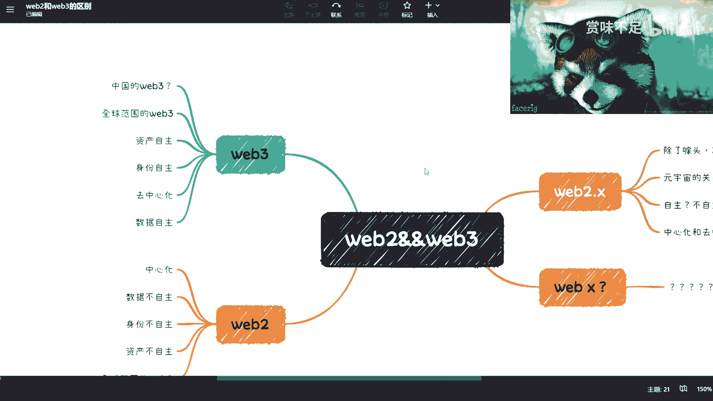

在本节课中，我们将学习互联网发展的两个重要阶段：Web2 与 Web3。我们将通过对比它们的核心特征、架构差异以及各自的优缺点，帮助你清晰地理解这两个概念的本质区别。

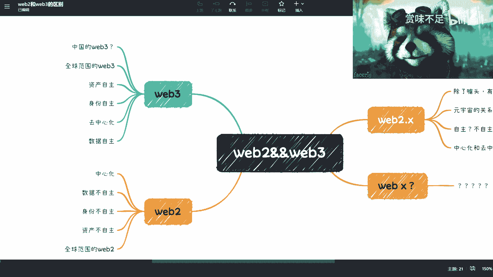

---

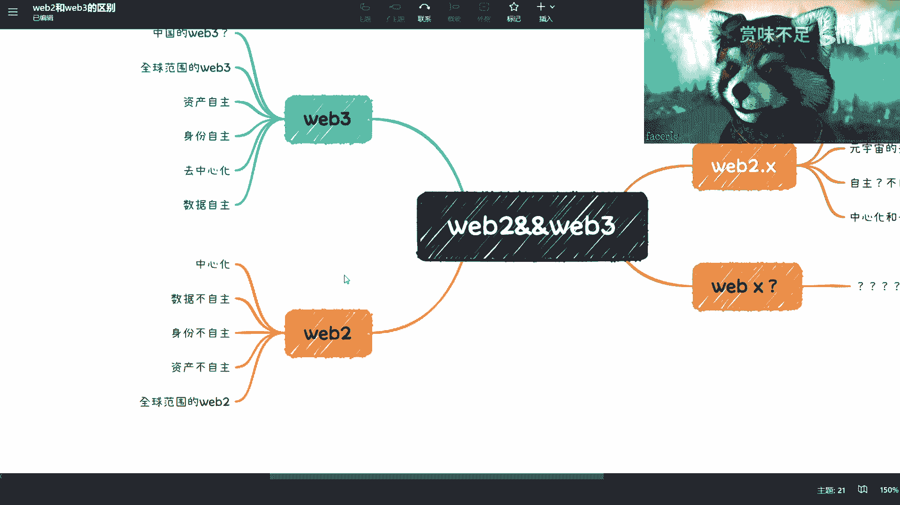

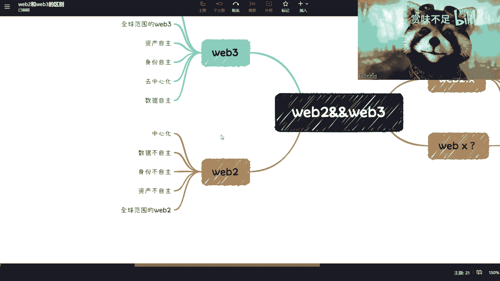

## 概述：什么是 Web2 与 Web3？

Web2 通常指我们当前正在使用的“传统互联网”或“中心化互联网”，其特点是服务由中心化的公司（如腾讯、阿里、Google）提供和控制。而 Web3 则代表“下一代互联网”或“去中心化互联网”，其核心在于利用区块链等技术，将数据、身份和资产的控制权交还给用户。

接下来，我们将详细探讨这两个概念。

---

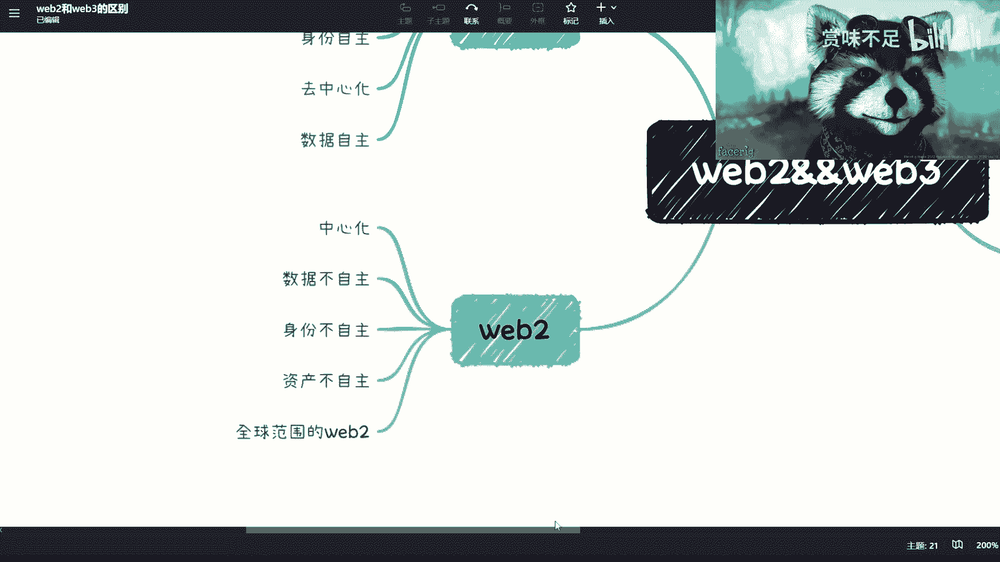

## Web2：中心化的世界 🏢

上一节我们概述了 Web2 与 Web3，本节中我们来看看 Web2 的具体特点。

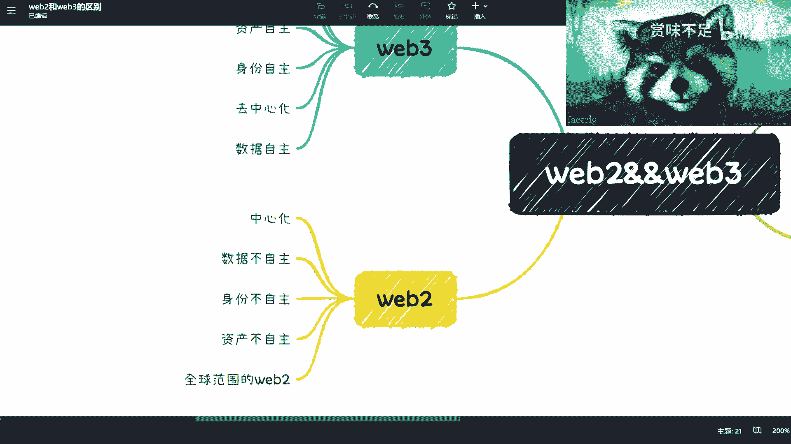

Web2 是我们最熟悉的互联网形态，所有服务都依赖于中心化的平台。其核心特征可以概括为“三个不自主”。

以下是 Web2 的核心特点：

*   **中心化**：服务由单一或少数几家大型公司控制和管理。
*   **数据不自主**：用户产生的所有数据（如聊天记录、浏览历史）都存储在平台方的服务器上，平台有权决定数据的存留。
*   **身份不自主**：用户的账号、社交关系等身份标识由平台创建和管理，平台可以封禁或注销账号。
*   **资产不自主**：用户在平台内的虚拟资产（如钱包余额、游戏道具）本质上由平台托管，存在因平台运营问题而丢失的风险。

以微信为例，你的聊天记录、好友列表和零钱都存储在腾讯的服务器上。虽然你在使用，但数据的最终控制权并不在你手中。平台可以依据规则删除数据、封禁账号，甚至在极端情况下，托管资产的安全性也依赖于平台的承诺和复杂的申诉流程。

Web2 的优点在于用户体验流畅、响应迅速（如双十一抢购），且维权路径相对清晰（可通过客服、投诉或法律途径）。但其根本缺点也源于中心化：平台对用户数据、身份和资产拥有绝对的控制权。

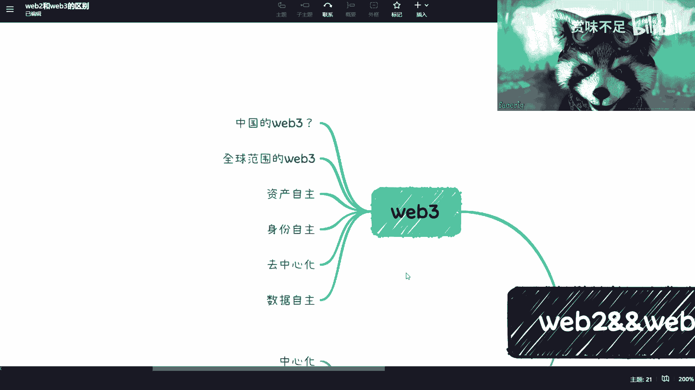

---

## Web3：去中心化的愿景 🔗

了解了 Web2 的中心化特性后，本节我们来看看 Web3 如何试图解决这些问题。

Web3 的核心目标是构建一个去中心化的网络，让用户真正拥有自己的数据、身份和资产。其实现依赖于区块链技术。

以下是 Web3 的核心主张：

*   **去中心化**：服务运行在由全球众多节点共同维护的区块链网络上，而非单一公司的服务器。
*   **数据自主**：用户数据存储在链上，未经用户私钥授权，他人无法访问或篡改。
*   **身份自主**：用户通过**私钥**（Private Key）创建和管理自己的去中心化身份，完全由个人控制。
*   **资产自主**：数字资产（如加密货币、NFT）由用户通过私钥直接掌控，链上合约保障其所有权。

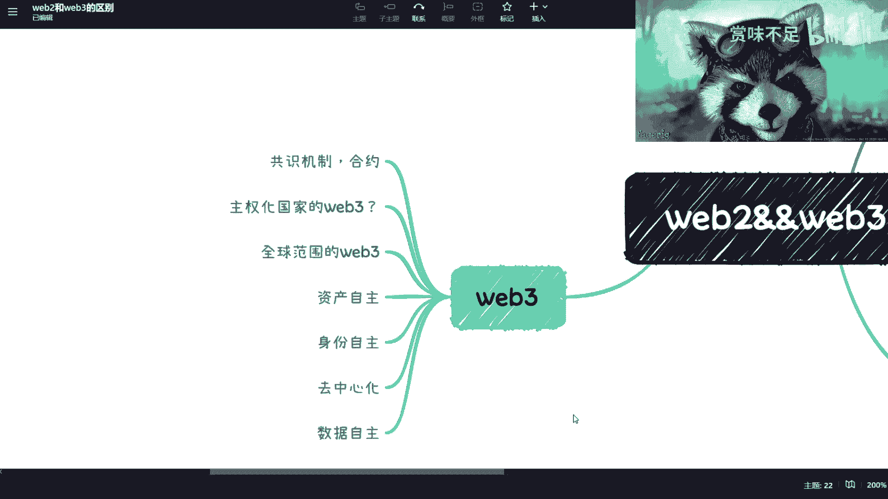

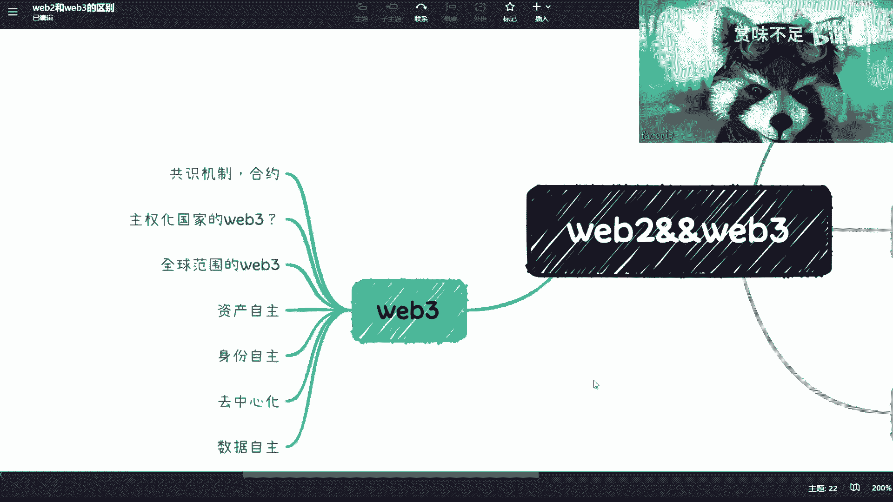

如果微信是一个 Web3 应用，那么腾讯可能只提供前端界面，而你的聊天记录和资产数据会加密存储在由成千上万个独立节点组成的区块链上。只有你用私钥签名授权，才能访问或转移这些资产。平台方（腾讯）无法单方面触碰你的数据。

Web3 的优点显而易见，即用户主权得到极大提升。但其缺点也很突出：
1.  **技术安全性依赖共识与合约**：安全的核心在于区块链的**共识机制**（如 PoW, PoS）和智能合约代码是否可靠，而非某个中心化机构的信誉。
2.  **维权困难**：一旦发生资产被盗或诈骗，由于没有中心化的责任方，很难通过传统客服或司法途径快速解决。

> 核心公式：**Web3 安全 ≠ 绝对安全**，其安全性取决于：**共识机制的安全性 + 智能合约的严谨性**。

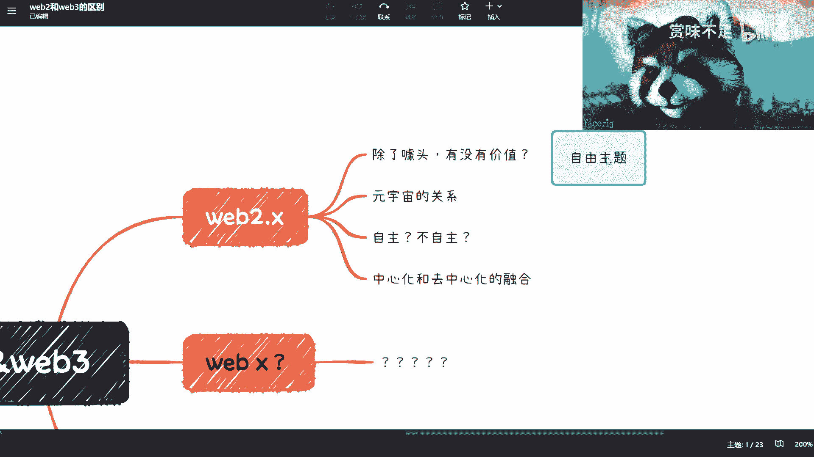

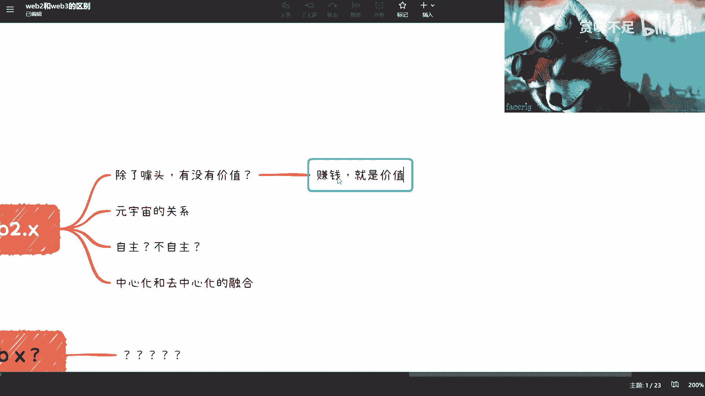

---

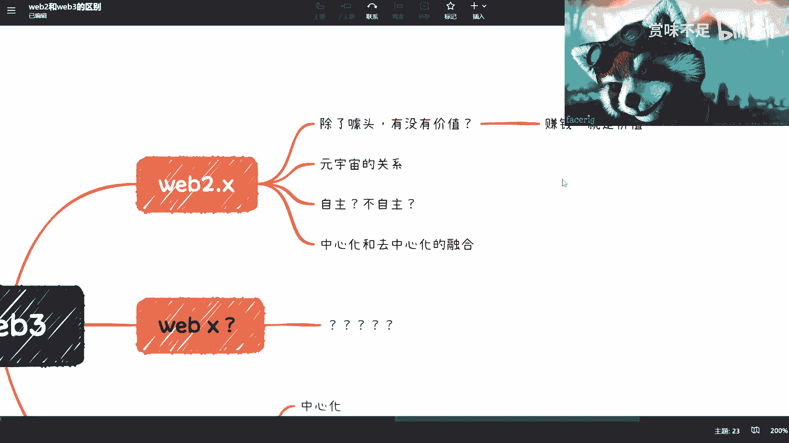

## 概念辨析与现状探讨 💡

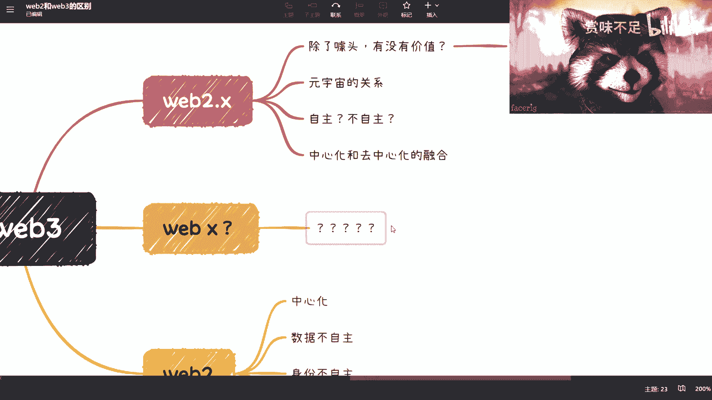

在对比了 Web2 和 Web3 的核心理念后，我们还需要了解一些相关的衍生概念和当前的市场状况。

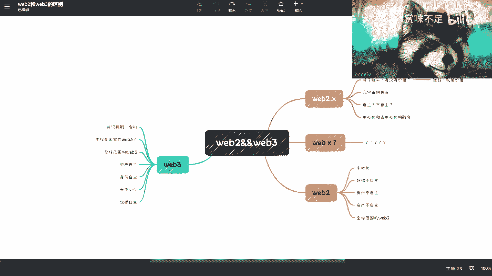

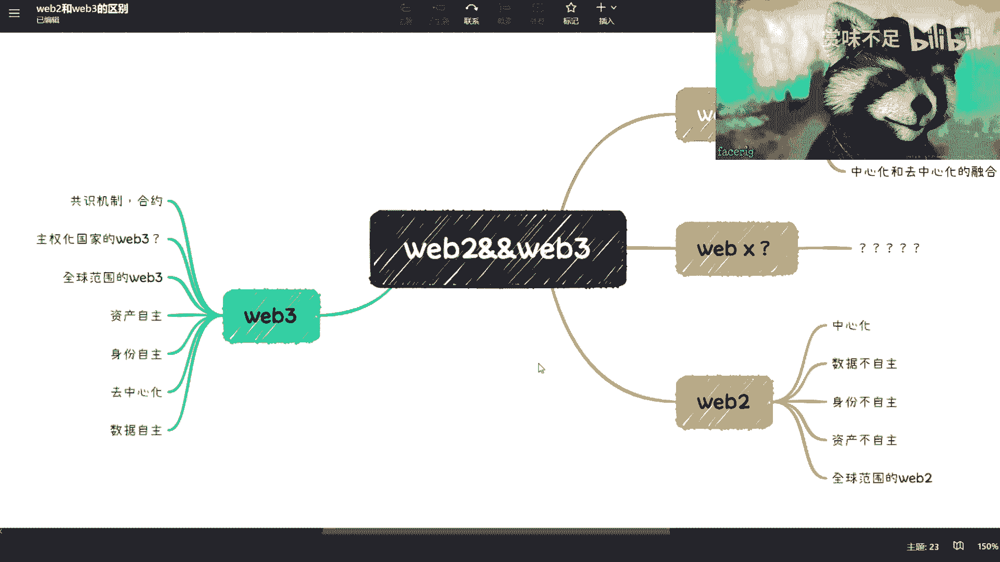

以下是几个重要的相关概念：

*   **全球 Web3 与主权国家 Web3**：全球范围的 Web3（如以太坊、比特币网络）追求完全的去中心化。然而，这与主权国家的监管存在根本矛盾，因为去中心化网络难以有效禁止非法内容。因此，主权国家所提的“Web3”往往是一个不同的、更受控的概念。
*   **Web2.5**：这是一个过渡概念，指在中心化架构中引入部分 Web3 元素（如数字积分、链上凭证），试图在用户体验和用户主权之间取得平衡。
*   **元宇宙**：元宇宙是融合了 VR/AR、区块链、数字资产等多种技术的复杂概念，它与 Web3 密切相关，但并非等同。我们将在后续课程中单独探讨。
*   **价值判断**：对于一个技术或概念，最直白的价值判断标准是：**它是否能创造可持续的、真实的商业回报**。噱头本身没有价值。

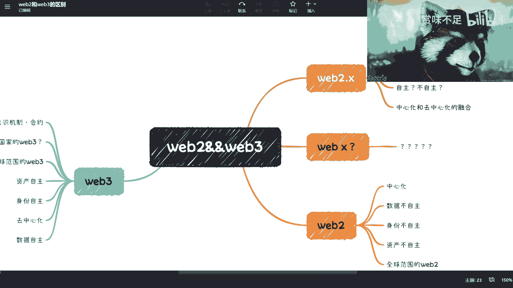

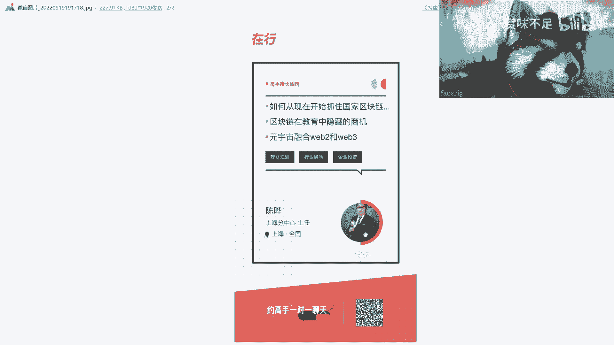

---

## 总结与预告 📚

本节课我们一起学习了 Web2 和 Web3 的核心区别。Web2 是**中心化控制、平台主导**的互联网，优点是效率高，缺点是用户主权缺失。Web3 是**去中心化、用户主导**的互联网愿景，优点是主权回归，缺点是技术复杂且当前生态不成熟，维权困难。

理解这些基础概念是进入区块链和数字资产世界的第一步。在接下来的课程中，我们将逐一深入探讨元宇宙、数字藏品（NFT）、区块链商业应用等具体话题，帮助你拨开迷雾，看清本质。

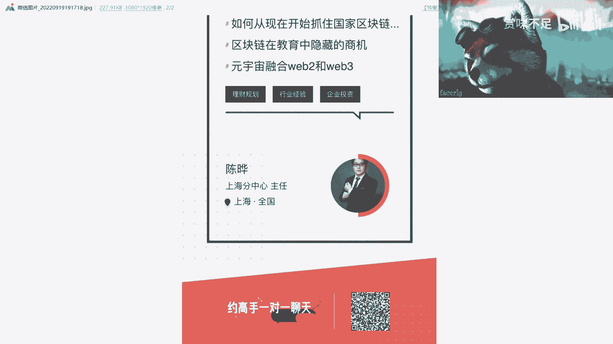

（注：教程中提及的付费咨询服务及二维码图片已根据要求省略，仅保留知识分享部分内容。）