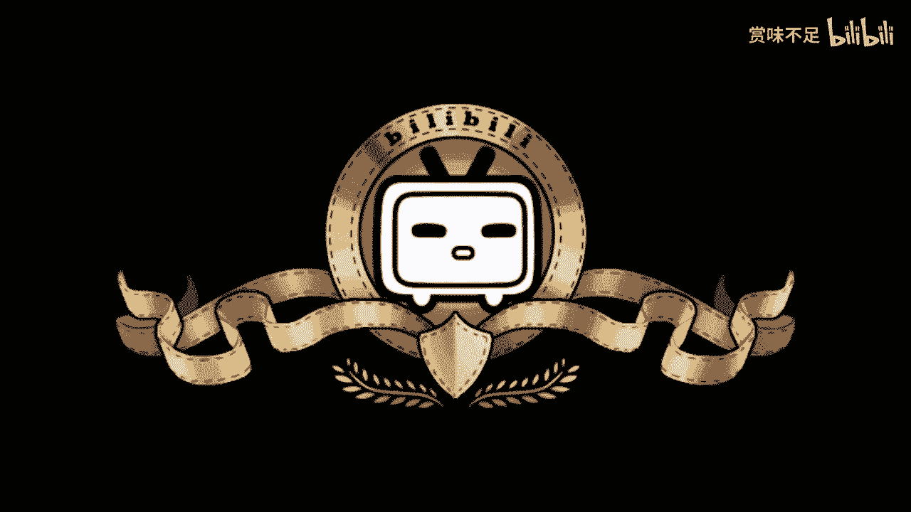
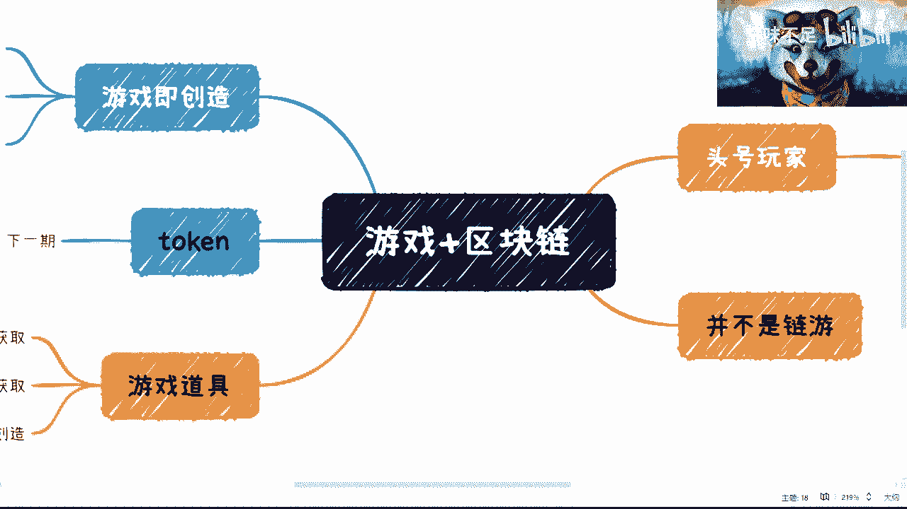

# 赏味区块链——游戏行业+区块链（不含token） - P1 🎮

## 概述

在本节课中，我们将要学习游戏行业与区块链技术结合的基本概念与应用场景。我们将探讨如何在不涉及代币（token）的情况下，利用区块链的特性为传统游戏（Web2）带来新的可能性，例如资产与身份的跨平台继承。

---

## 游戏与区块链的天然结合

上一节我们介绍了课程的主题，本节中我们来看看为什么游戏与区块链的结合是自然而然的。

首先，这里讨论的并非纯粹的Web3应用，而更侧重于一个Web2产品如何利用Web3上的数据。简单来说，就像Twitter支持将以太坊上的资产用作头像一样。头像只是第一步，Twitter后续也宣布将支持NFT交易。

因此，我认为纯粹的Web3应用模式已较为成熟或探索较多，所以本课程将重点放在Web2产品如何整合区块链数据上。

---

## 关键概念一：身份与资产的跨平台继承

在电影《头号玩家》的“绿洲”中，包含了无数个元宇宙。电影中，主角可以穿梭于游戏A、游戏B和游戏C之间。

许多人沉浸于游戏的画面、体感或VR技术，但其本质核心在于：无论主角身处哪个元宇宙，他的**身份**、**资产**和**数据**都是可以继承的。例如，他在不同游戏中的金钱、金币和形象虽然会根据元宇宙的背景进行调整（例如在原始部落中不会出现未来科技形象），但其核心资产与数据是连贯的。

这一点是区块链技术在未来，尤其是元宇宙层面，非常重要的一个方面。它确保了用户虚拟身份的持久性和资产的真正所有权。

---

## 关键概念二：游戏道具作为链上资产

接下来，我们探讨游戏道具如何与区块链结合。

从本质上讲，游戏道具是一种天然适合用智能合约生成的数字物品。因为无论是NFT、游戏道具还是代币，从技术角度看，它们都属于 **`token`**。

因此，游戏道具本质上是一种由特定协议衍生出来的特殊token。这些道具可以从公链上获取，也可以从联盟链上获取。我个人认为，大约九成的结合案例可能发生在成熟的Web2产业引用链上数据（无论是联盟链还是公链），而仅有一成是纯粹的Web3生态。

---

## 关键概念三：用户生成内容（UGC）与数字创作

游戏非常贴近现代元宇宙的概念，其中包含了丰富的用户生成内容。

例如，在许多游戏中，玩家热衷于“捏脸”（角色外观自定义），如《艾尔登法环》或《巫师3》。每个玩家捏出的脸都是独一无二的，即使相似也不可能完全相同。这些由用户创造的角色外观，理论上都可以成为NFT或数字藏品。

随着基础设施的完善，用户生成内容（UGC）将逐渐形成生态。例如，未来游戏中的精彩画面、视频、截图，甚至一个独特的战术组合，都可能被铸造为NFT并上链交易。

---

## 结合模式展望

如果不涉及代币经济模型，游戏与区块链的结合主要围绕以下两点：

以下是两种核心的结合方向：

1.  **从游戏中创造NFT并上链**：将游戏内产生的独特内容（如角色、截图、视频）铸造为NFT，使其成为可拥有、可验证的链上资产。
2.  **从链上获取资产并用于游戏**：将已有的链上资产（如CryptoPunks、无聊猿等NFT形象）导入到中心化游戏中，作为玩家在游戏内的独特身份标识。

在商业逻辑上，这非常简单：如果你在链上（无论是公链还是联盟链）拥有某个NFT形象，你就可以在支持该功能的游戏中使用它，展示你独一无二的身份。如果你没有该资产，也可以通过智能合约向创作者或当前拥有者支付费用来获得使用权，从而形成一个完整的生态。

---

## 总结

本节课中我们一起学习了游戏与区块链技术结合的基础。我们探讨了身份与资产的跨平台继承、游戏道具的链上化以及用户生成内容成为数字资产的潜力。核心在于，Web2产品通过引用Web3的链上数据（获取或创造），能够极大地扩展其生态，这可能是比纯粹Web3应用更广阔的发展路径。

随着基础设施的完善和更多主流平台（如Twitter）的整合，游戏与区块链的结合将拥有更丰富的可能性。在下一节课中，我们将引入代币（token），深入探讨包含经济模型的游戏与区块链结合案例。

---

