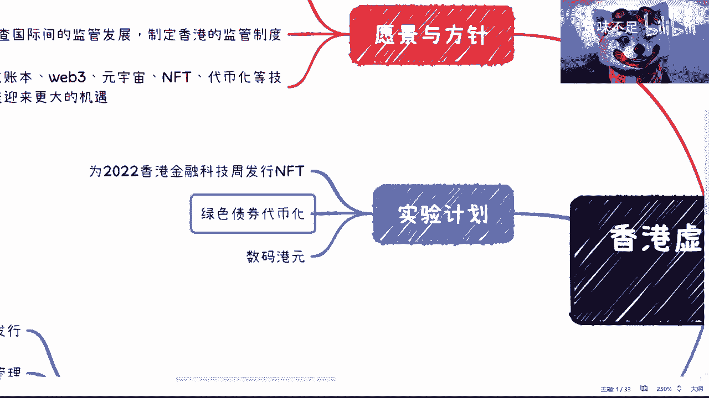

# 赏味区块链——简述香港虚拟资产发展的政策宣言 - P1 🧐

在本节课中，我们将一起学习并解读香港近期发布的《有关香港虚拟资产发展的政策宣言》。这份文件清晰地阐述了香港对于虚拟资产领域的愿景、监管方针以及具体的试点计划。我们将逐点分析其核心内容，并探讨其对行业可能产生的影响。

## 愿景与方针 🧭

上一节我们介绍了课程概述，本节中我们来看看宣言中提出的整体愿景与方针。

宣言明确指出，其整体目标围绕“虚拟资产”展开。文件强调了建立法律监管框架、对接国际监管制度的重要性，并认为分布式账本等技术将迎来更大的发展机遇。这表明香港旨在构建一个规范、透明且与国际接轨的虚拟资产生态环境。

## 核心领域与态度 📑

在明确了整体方向后，宣言对几个关键领域表明了具体态度和规划。以下是文件中重点提及的几个方面：

*   **稳定币**：文件直接使用了“稳定币”这一术语，并指出将由政府主导推动相关监管制度的建设。这为稳定币的合规化发展指明了方向。
*   **代币化资产产权**：政府对代币化资产和智能合约的合法性持开放态度。这相当于为“资产通证化”或“资产证券化”提供了可探索的合规路径，甚至为合规的ICO（首次代币发行）留下了可能性。
*   **投资者相关**：文件表示对虚拟资产ETF（交易所交易基金）等投资产品持欢迎态度，并将就此展开公众咨询，体现了开放的监管思路。
*   **监管框架**：宣言的核心在于建立“明确清晰的监管框架”，并计划近期开展虚拟资产制度的探索。清晰的监管规则是行业健康发展的基石。

## 核心试点计划 🚀

在阐述了监管态度后，宣言列出了三项具体的试点计划，以实践其理念。

1.  **为2022香港金融科技周发行NFT**：此NFT不仅具有收藏赋能，更旨在让参与者获得沉浸式虚拟体验。它可能是一个代表参与者的虚拟身份NFT，并可能与未来的元宇宙权益挂钩。
2.  **绿色债券代币化**：这是一个具有标杆意义的尝试。无论代币化的是绿色债券、商超积分还是股权，其核心意义在于迈出了“资产代币化”实践的第一步，为后续的监管、运作和交易流程探索经验。
3.  **数码港元**：这实质上是一种由香港政府推动的稳定币。其发展路径很可能先与本土的NFT、证券化资产等挂钩，逐步渗透至更广泛的Web3领域，而非直接对标现有的USDT等稳定币。

## 总结与展望 🤔

本节课中我们一起学习了香港虚拟资产政策宣言的核心内容。

总体来看，这份宣言的积极意义在于概念清晰、公开透明，明确了“能做什么”与“不能做什么”的边界。它为虚拟资产在香港的合规发展绘制了蓝图，特别是在资产代币化和稳定币领域提出了具体的试点方向。

然而，宣言仅是开始，后续具体的监管细则（如牌照要求、资本门槛等）和试点项目的实际落地效果仍需观察。对于行业参与者而言，保持关注并理性看待后续发展是更为稳妥的态度。香港的举措也可能为其他地区（如海南）探索类似路径提供参考。

---
**声明**：本教程基于公开政策文件进行解读，旨在知识分享，不构成任何投资建议。虚拟资产投资风险较高，请谨慎决策。