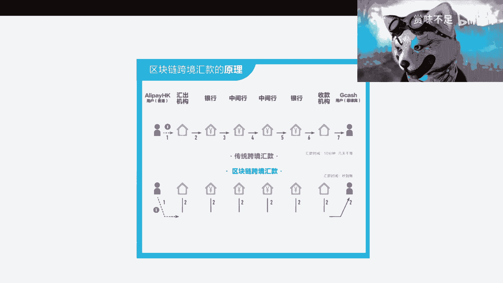
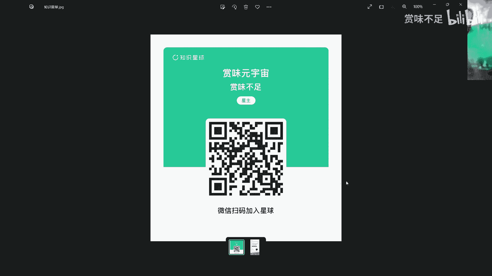
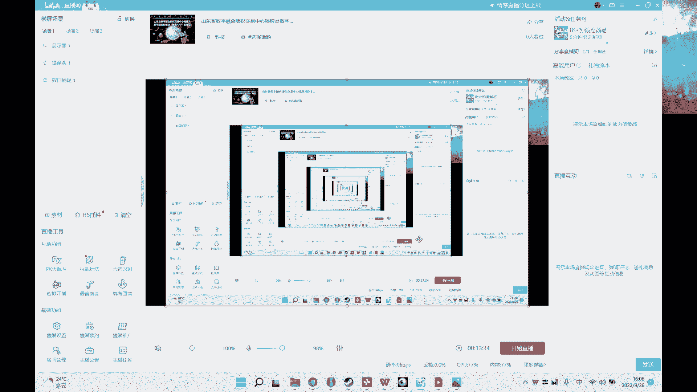

# 赏味区块链课程 - P1：联盟链在数据共享中的优势 🧱

在本节课中，我们将学习联盟链技术，并重点探讨其在数据共享场景下相较于传统中心化系统的核心优势。我们将通过具体概念和案例，理解联盟链如何提升数据共享的可信度、效率和安全性。

---

## 概述

联盟链是一种由多个组织共同参与管理的区块链。与完全公开的公链不同，联盟链的参与节点需要经过许可，这使得它在企业级数据共享场景中具有独特价值。本节课程将聚焦于联盟链在数据共享方面的几大优势。

上一节我们概述了联盟链的基本概念，本节中我们来看看它在数据共享中的具体优势。

---

## 优势一：更强的隐私保护 🔒

在传统的数据共享过程中，通常采用加密或中心化技术来保护数据。而联盟链可以通过结合多种前沿技术，在共享数据的同时更好地保护隐私。

以下是实现隐私保护的几种关键技术：
*   **边缘计算**：将数据处理在靠近数据源的网络边缘进行，减少原始数据在链上的暴露。
*   **零知识证明**：一种密码学方法，允许一方向另一方证明某个陈述是真实的，而无需透露陈述本身以外的任何信息。例如，证明“我超过18岁”而不透露具体年龄。
    *   **公式/概念描述**：`零知识证明 ≈ 证明“我知道秘密X”而不泄露“X是什么”`。
*   **联盟链权限保护与分组**：通过精细的节点权限控制和数据分组隔离，确保只有授权的参与方才能访问特定数据。

这些技术使得联盟链在数据共享时，既能保护数据隐私，又能满足协作需求，其可信度比单纯的中心化方案更高。


---


## 优势二：比纯中心化系统更可信 📜

中心化系统虽然也能追溯数据，但其数据的不可篡改性存疑。联盟链通过分布式账本技术，提供了更强的可信保障。

以下是联盟链在可信方面的核心特点：
*   **数据可追溯**：链上所有交易记录都被按时间顺序永久存储，可以完整追溯数据的历史状态。
*   **防篡改**：数据一旦上链，单个或少数节点难以篡改，因为需要控制大部分共识节点才能修改历史记录，这极大地提高了作恶成本。
    *   **核心概念**：**分布式共识机制**（如PBFT、Raft）确保了数据在多个独立节点间的一致性，篡改数据需要攻破大多数可信节点，成本极高。

因此，联盟链为实现可信的数据共享提供了一个更坚实的基础。

---

## 优势三：天然支持智能合约 🤖

智能合约是存储在区块链上、在满足条件时自动执行的代码。联盟链为智能合约提供了天然的运行环境。

智能合约在未来业务流程中，将承载部分业务逻辑和与交易相关的规则。它不同于现有的两种约束方式：
1.  **商业合同**：法律层面的书面约定。
2.  **系统约束**：在中心化系统内设置的访问权限和控制逻辑。

智能合约可以作为第三种约束力量，将关键条款（如支付时间、金额）代码化并自动执行。例如，在跨境贸易中，可以将“货到后24小时内支付尾款”的规则写入智能合约。
*   **代码示例（概念性）**：
    ```solidity
    // 伪代码示例：一个简单的支付合约
    contract Trade {
        function releasePayment(address seller) public payable {
            // 当收货方确认收货后，自动向卖家释放货款
            require(confirmationReceived == true);
            seller.transfer(contractBalance);
        }
    }
    ```
这种自动化和去信任化的执行方式，需要联盟链或公链作为其载体。

---

## 优势四：优化业务流程（以跨境支付为例） 💸

传统中心化的串行业务流程存在效率低、透明度差和篡改风险的问题。联盟链通过并行数据共享能有效优化此类流程。

让我们以跨境支付为例进行对比分析：

以下是传统串行流程与联盟链流程的对比：
*   **传统中心化流程**：
    1.  汇款人通过机构A发起汇款。
    2.  机构A通知银行B。
    3.  银行B通知中间行C。
    4.  中间行C通知银行D。
    5.  银行D通知收款机构E。
    *   **问题**：流程慢，且任一环节都可能因人为错误或恶意篡改（如将10元改为5元）导致信息不一致，事后追溯困难。
*   **联盟链流程**：
    1.  所有参与方（机构、银行、中间行）作为节点加入联盟链。
    2.  汇款信息上链后，**所有授权节点近乎同时看到该笔交易**。
    3.  各节点基于共识同步处理，流程并行化。
    *   **优势**：
        *   **效率高**：消除了串行等待时间。（例如，避免“晚十点后转账需次日到账”的情况）
        *   **一致性**：所有节点看到的数据相同，极大降低了中途被篡改的风险。
        *   **透明可审计**：交易全过程记录在链，便于审计和追溯。

这个案例表明，任何涉及多方、流程串行的业务场景，都可以借鉴联盟链的数据共享模式来提升效率和可信度。




---


## 总结

本节课我们一起学习了联盟链在数据共享中的四大核心优势：
1.  通过**边缘计算、零知识证明**等技术实现**更强的隐私保护**。
2.  凭借**分布式账本和共识机制**，提供**比中心化系统更高的可信度与防篡改能力**。
3.  **天然支持智能合约**，为自动化、可信的业务逻辑执行提供了平台。
4.  能够**优化多方协作的串行业务流程**，提升效率、透明度和一致性。





联盟链正在为构建可信、高效的数据共享基础设施奠定基础，虽然目前仍处于发展和完善阶段，但其应用前景广阔。