# 赏味区块链——论新人怎么进入区块链领域 - P1 - 赏味不足 - BV1We411K7cG

啊好呃，大家好，那么今天这一期呢主要是给大家说一下。

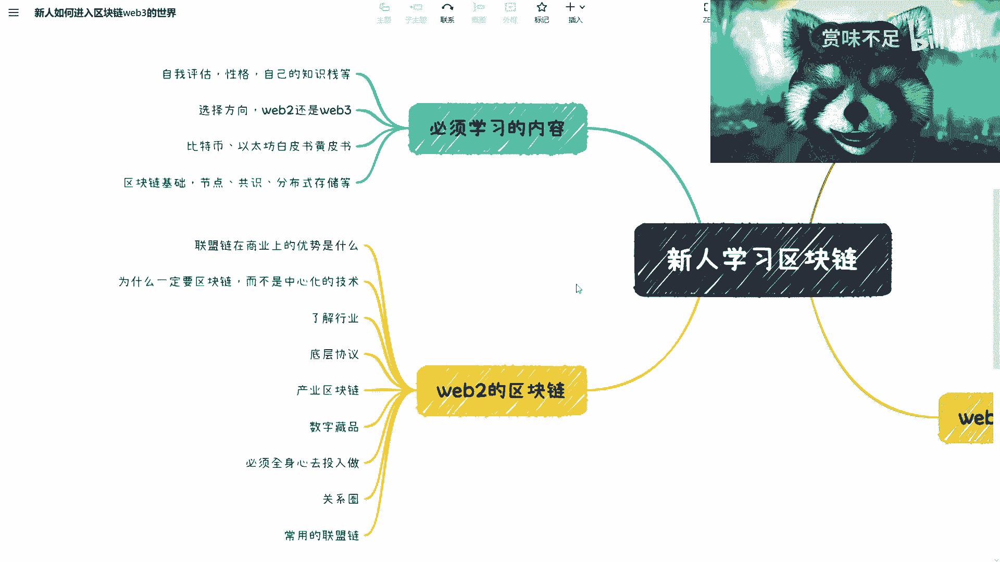

在最近这个咨询过程当中啊，有非常多的人呢是讲这么问这么一个问题啊，就是关于这个新人学习区块链啊，他说我想这个进入这个行业，那么从哪几个方面进行切入啊，是这么一个情况，对然后这个第二期有很多人反馈。

那个小浣熊比较邪恶对吧，我就把他换回来了，换回来了，然后那个呃我们继续来说啊。

是这样子的，就是，啊啊我在这个地方列了几点啊，就是说我们学习区块链啊。

主要是我们首先先来看啊。

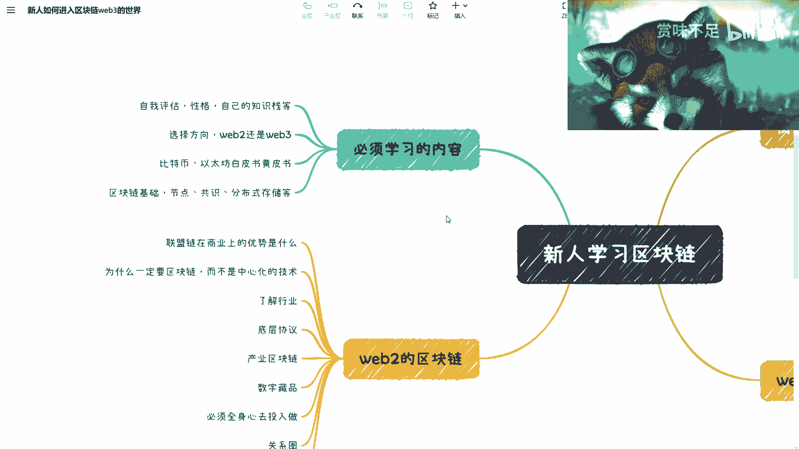

我在这个地方写了必须学习的内容对吧，那么这个必须学习内容呢，呃在这个地方我写了几个，一个是选择方向啊，就是说经过了一定的时间学习之后，我们得要去判断，我到底是进入一个纯web3的领域，还是说是一个。

比如说在web领域里面的一个区块链啊，还是纯web30的区块链，因为这两个东西是不一样的啊，那么必须学习内容里面呢，我这边也写了，就是说比特币以太坊的白皮书，黄皮书这个肯定是要去看的，而且看完之后呢。

你得去了解，或者说你得去理解说他到底讲了些什么东西，那这是第一个，第二个呢就是关于这个区块链的基础对吧，就比如说一些节点啊，共识啊，分布式存储等等啊，这个也是一定要的，那么经过这两个之后呢。

你就基本上可以去想，就是说我到底是进入一个纯web3的区块链，还是纯web2点区块链，那这两者有非常大的区别，待会我们在下面讲的时候啊，也会讲讲到啊，也会讲到网上呢。

还有什么呢，就是唉我把这个放大一下，这样看看。

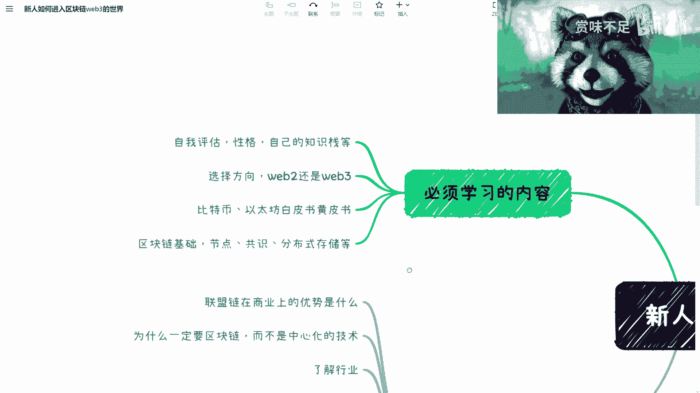

时不时看得见啊，好那你比如说网上还有什么呢，就是关于这个自我一个评估性格啊，包括自己的知识站，也就是说你比如说以前自己学的是什么，对你说我比如说以前自己学的是金融，那我可能会建议你说哎。

你比如说可以进入一些投资领域啊对吧，或者说这个做一些这个研究员啊，research啊对吧，那如果你说你以前做技术的，那我说那你可能比如说智能合约开发对吧，你比如说以前做一些业务相关的。

那比如说可以做这个产品经理啊，市场啊，或者其他的一些啊，就各种各样的，就你得根据自己的这个这个业务能力，去做一些评估对吧，第二个呢就是说也要去根据自己的这个呃，性格对吧，因为这个是很重要的，为什么呢。

因为呃我们说啊就是说在web跟web3里面，其实有比较大的一个差异，和就像我们刚刚说的啊，在web3里面，其实很多呢它是比较偏向于这个外向型的，就是我会跟大家说。

就是说不管你是嗯就比如说你在web3里面，除了你做技术以外，就比如说你做销售，做市场，做研究员或者做其他的，他不太会存在那种说你坐在办公室里面，这种这种纯粹的这种叫做工作的啊。

他还是比较偏向于说你你要多混圈子对吧，多跟人交流对吧，多去呃跟别人去沟通，你才能更深入的去了解这个行业。

因为我们今天这个主题是关于新人，学习区块链嘛，所以说这个上面呢。

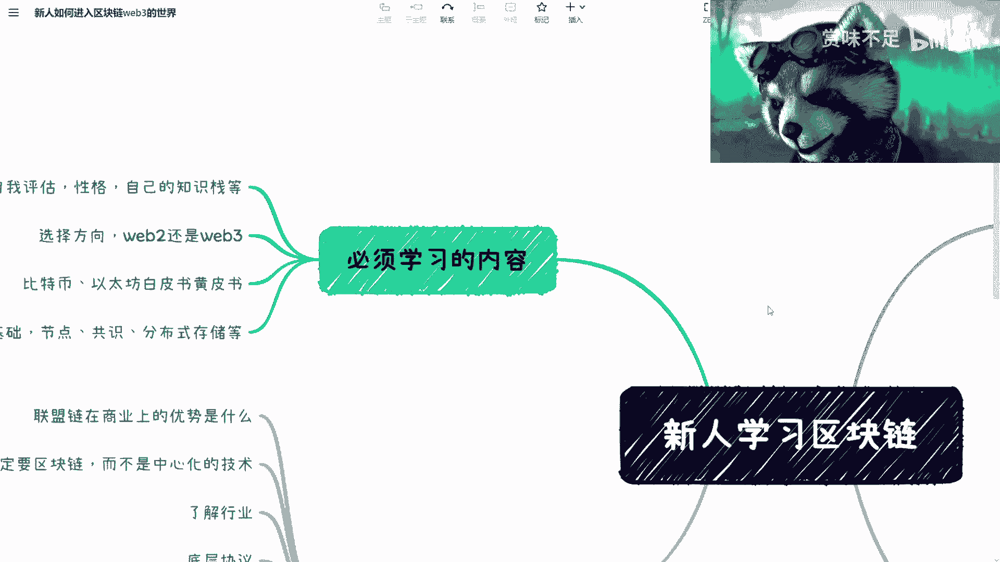

就是说你的性格其实是非常这个影响，你接下来的这个叫做啊就业道路啊，那么好。

那么我们接下来这块这块我先说完了啊，我们接下来先详细下来，先来说个办法啊，比如说啊你说我们现在这个这个想清楚了啊，那么它有哪几个方向呢。

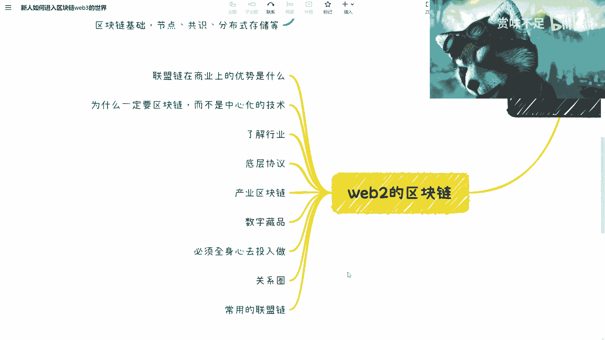

第一个就是说我们说常见的常用的这个联盟里，然后把它再放大，是不是看得清楚对吧，就说这样哎我把它看看啊，这样好，那你比如说常用的联盟里，那常用联盟链有哪些呢，我们举个例子啊。

比如说啊比如说你说那个GEO啊，because是吧，好啊，比如说这个叫这个这个这个天秤诶，诶诶，对吧好嗯嗯，这样啊呃你比如说那个星互联网对新互联网好，新人互联网对吧，好那啊，那么我们诶好像还有啊。

对对对，那个蚂蚁开放零，对不对，好那等等啊，我就不写了等等对吧好，那这个时候呢你说啊我首先对吧，你说你常用联盟链，那首先你得对这些联盟链得有了解吧，对吧好，那其实就是说每一个联盟链里面。

它肯定有它的特点对吧，你比如说有不同的共识啊，有不同的这种叫做技术站啊，啊不同的这个智能合约的方式啊，包括他隐私保护的方式肯定都不一样对吧，那包括我怎么加入节点啊，他每一个链它的这个业务垂直。

就是相对来讲比较适合哪些业务，你比如说fiscal bicles对吧，他说哎我比如说是比较偏向于金融行业的对吧，那天秤我比较偏偏向于是这个法律是吧，那星火链网可能是一个。

比如说国家做的一个大的一个联盟链对吧，蚂蚁开放联盟链，那可能有自己的生态对吧等等等，那这些啊我们不说你这个全部实践过了对吧，那至少咱们说啊，你对于里面的一些这个文档啊，或者里面的一些细节得要有所了解吧。

好那我们来看啊，那这是一块啊，那么第二个关系圈对吧，那你比如说你要做web的区块链，那很简单，你比如说有些这个相关的，比如说线下活动啊对吧，线上的ma呀对吧，我们我们可能web3就是M啊。

比如说叫公开课是吧啊，线下活动，线下活动对吧等等等，那这些你得去认识吧，就是把一些该认识认识，该该大家多沟通，多沟通对吧，然后该加的群加进去对吧，因为你作为一个新人，你肯定得要就是尽可能多的去获取信息。

因为我一般都跟很多人这么说，我说你不要去担心你，你认识的人没有价值，你也不要担心你，比如获取到知识没有价值，因为你还没有这个能力去判断他有没有价值，你知道吗，所以说其实本质上你的逻辑应该是什么呢。

应该是你先是以大数据的方式，比如说我今天集中两周，我认识1000个人对吧，我听有1000个人在讲的内容，那么等你有了一定的大量数据之后，你自己再去判断哦，哪些人对我是有用的，哪些那个那个那个叫什么理论。

对我是有用的对吧，哪些内容是都有用的，那你才有一个方向，而不是说一开始，比如说啊小陈老师，你说的是对的，或者陈老师，你说的是错的，其实没有用对吧，就像今天你们听我这个课，那我也不会跟大家讲安全。

我说的一定是对的，没有这么说过对吧，就说你们可以去认识更多的人，听更多的一些这个这个声音，然后最终自己再来判断我今天说的对不对啊，所以我觉得这个才是一个，非常重要的一个问题啊。

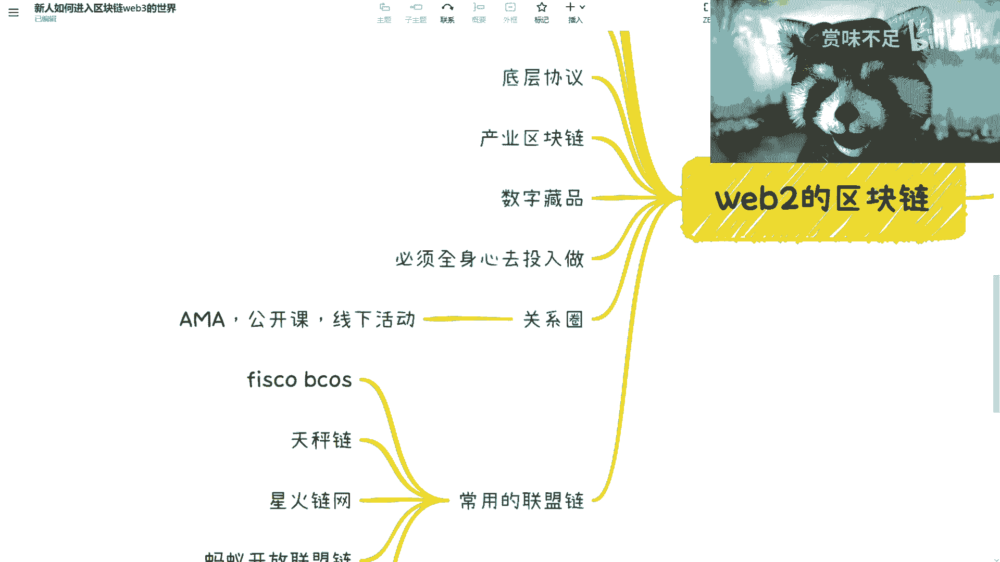

那我们往下啊，这一点是非常重要的。

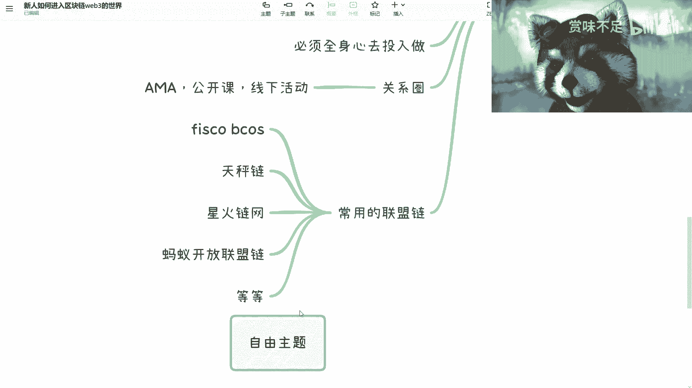

哎呀这个软件做的就有点渣了，对吧啊啊非常重要，要命，对吧好，那这一点为什么这么说，是因为呃区块链这个东西啊，它里面所涉及的内容太多了，所以呢我一直会跟所有的人说，就是你要去做这件事情。

你一定要全身心投啊，不要想着说哦，我主页做A对吧，我我我我兼职去做B，或者我哎看看今天看看B站内容对吧，明天看看赏味不足的这个视频对吧，后天怎么样，没有用的，我跟你们讲没有用的，就是你单纯的这么去了解。

你是touch不到，就是你是了解不到它的核心的啊，所以说呢就是说如果你真的要去做，要去了解，你，一定要全身心的去投入，就是你叫我们行业里的话，就叫做你必须下水对吧，下海对吧，你两只脚都踏进去对吧。

你不要这个站在水，这个站在岸上来看，大家其实没有用啊，那这是一个好。

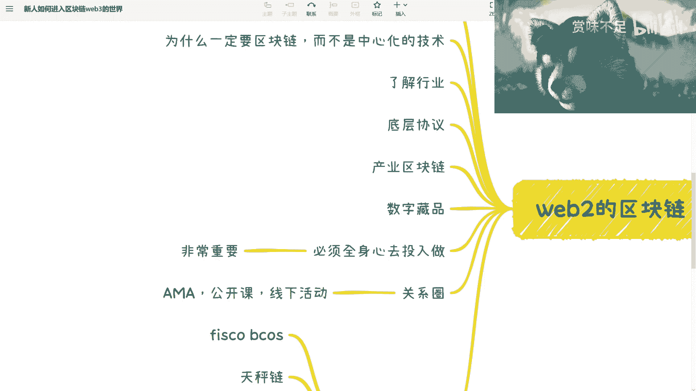

我们再继续往下讲，啊你比如说web2对吧。

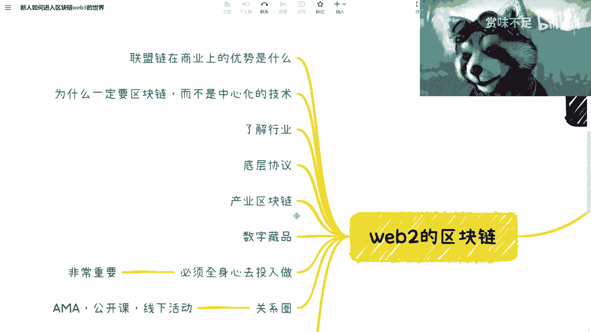

区块链那收藏也是个很重要的一个点，他为什么老是要把我往下移呢。

这是看看啊，可以可以，那我们来看啊收藏对吧，收藏你比如说这个呃平台啊对吧，特点啊啊这个这个价值啊，对吧啊啊行业趋势对吧，那你说你你去做这个web的这个区块链，那收藏。

你是一个肯定那个这个这个跳不过的对吧，那竖长你比如说什么是竖长数藏，跟我们以这个web3的NT有什么区别，那当然这个我后面才会开单独的课再来讲啊，我就不在这个地方讲了，这个地方你要扩展我。

我我可以过六个小时出来对吧，那这个就没有意义了啊，那比如说啊我们就随便说啊，就是说特点有哪些，跟FT的区别有哪些，那数藏为什么用区块链阻，为什么不用去中心化技术去做对吧，那数藏对C端的价值是什么。

C呃数藏对这个品牌的荒谬价值是什么对吧，收藏对政府的价值是什么对吧，这些你都得去了解对吧好，那么你比如说再往下产业区块啊，好那什么叫产业区块链对吧，那产业区块链里面你比如说有什么呢。

有比如说产业加区块链，有区块链加产业对吧好，那么区产业区块链里面最大的点在哪里呢，就是你得去知道对，就是说每一个不同的产业，我们举例子，比如说农业对吧，你比如说医疗对吧，舆论对吧。

这个这个这个这个叫什么，就是餐饮，你每一个地方你能不能用区块链，那你首先先问自己能或者不能，或者你到网上去查对吧，然后能为什么能，他区块链能能给他带来什么不能，那为什么不能，他是因为投入产出比低呢。

还是因为他根本就不合适对吧。

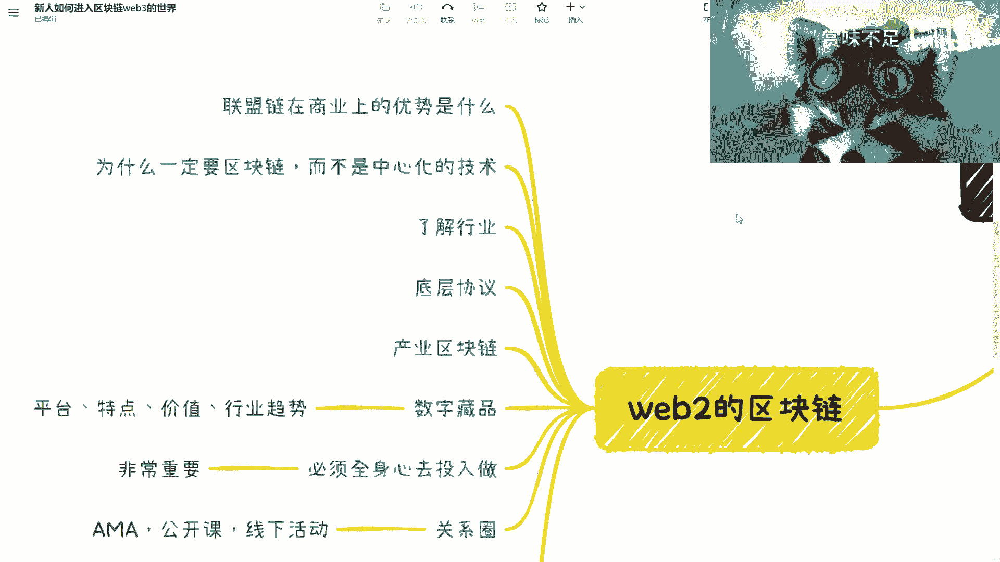

你都得去思考这些问题，对不对好，那你比如说底层协议好。

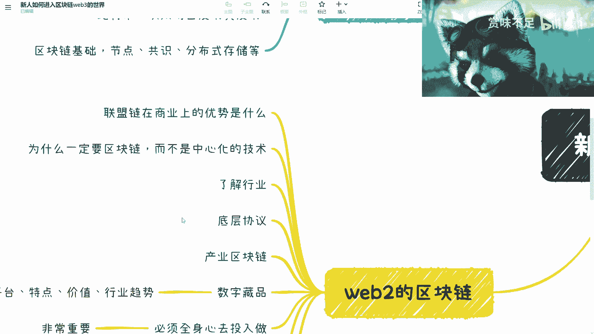

那底层协议现在比如说打个比方啊，比如说这个比较知名的。

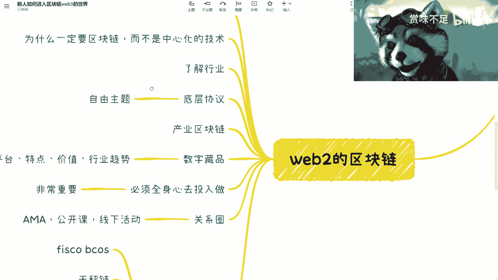

比如说别森是吧，他是个PROTOCO啊。

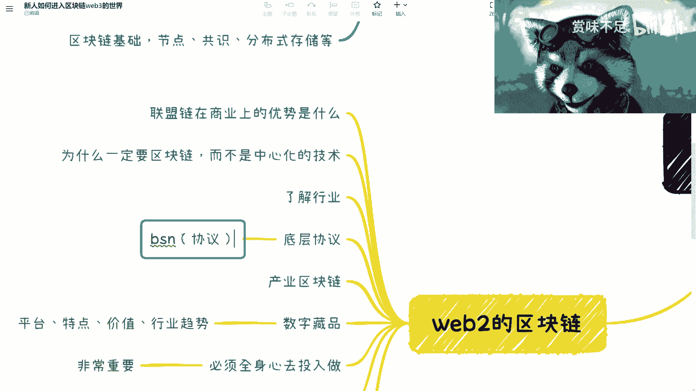

protocol好，那别森是什么对吧，别森的特点是什么，别森现在在做什么对吧，那这个你也得去了解吧，就像就像我跟很多人说，你新人去做去进入一个行业，其实无非啊，我们说他面临的这个这个这个这个叫什么。

就是困难是什么，一就是我总感觉我进不了这个圈子。

二我找不到工作对吧，那我们说啊，现在我给你们列的这些。

你都是可以通过网上寻找到的信息，那首先第一点就是说，你得先自己去学习这些东西，你才有可能进入选择，你才有可能找到工作，对不对，否则你说你跟别人去聊聊什么呢对吧，你其实一聊你别人就知道啊。

你可能就不懂对吧，那你你你你你指望就说啊，有人对吧，从天而降对吧，然后来带你一步步往前走，这不不可能的嘛，对不对啊，这毕竟行业里面没有没有中国人像我这么对吧，有良心是吧。

那你比如说往下，你比如说了解行业对吧，那了解行业这个地方其实就非常关键。

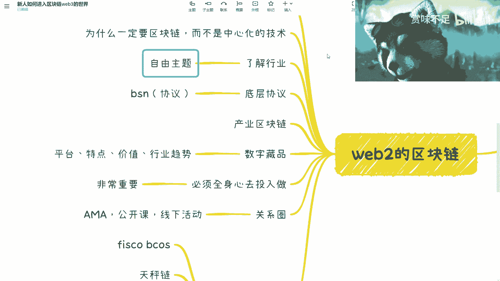

我后面也会单独再去开啊，你比如说哪些，比如说政策是吧，你有很多人啊，他是这样子的，他说我了解政策的政策，我很了解啊，不好意思，你不了解，为什么，因为我们这边说的政策是实打实的，什么叫实打实的。

一他必须要有红头文件支撑，二他必须是真正给过钱的，第三就是说我们实践过的，你不要说啊，拿出来个什么新闻稿，就说啊这个叫政策，这不叫政策啊，你比如说政策对吧，然后比如说行业的这个发展趋势啊。

以前发生过什么啊，对吧对吧，等等等等等等对吧。

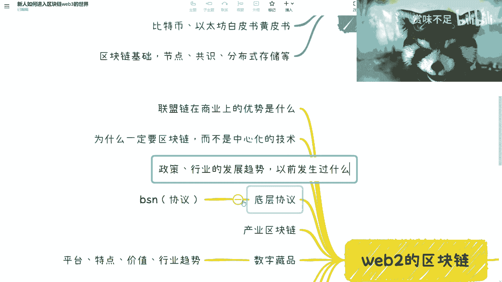

那这些你都是要去了解，是吧好那你比如说这个web的这个区块链啊，最终你得问自己两个问题，就是我跟很多人都说，我说你怎么来判断你学的好不好，或者你怎么来判断你了解的到不到位对吧。

哎你看这个小浣熊这个很可爱，我笑的时候他也笑，嗯啊然后你比如说你你你你问自己两个问题，第一个问题是什么，就是为什么一定就是不管哪个业务啊，为什么一定要用区块链这个技术，而不是用中心化的这个技术。

那请问我今天用中心化的技术怎么了啊，我比如说我用中心化的技术只要20万，我用区块链技术要80万，那请问我为什么一定要用区块链，你能不能说服我跟你说，我所有的人都会跟我讲，哎呀这个这个很简单嘛对吧。

你比如说要可信啊，要要有共识啊，要这个不可篡改呃，我在这个地方，今天啊我在这个视频里面，我也肯公开和大家讲，不可篡改这件事情没有人关心啊，我可以明确告诉大家，不好意思，没有人关心对吧。

你跟我说可信什么什么信任对吧，怎么样也没人关心，什么意思呢，你呢你如果这样说的话，那按照这么个说法，去中心化技术就不可信了，中心化的技术，就就大家就就很关心这个数据篡改吗，有吗啊。

你看到过谁是举着牌子拉着横幅到这个腾讯，阿里百度门口说好，我你不可信啊，你作为一个中心化技术，你是垃圾，你一点都不可信，你们看到过没有对吧，就是我觉得大家去思考一个问题的时候。

不要太就是说过于这个叫做呃，就是叫做理论化，但你你你你稍微说出这个理论的时候，你稍微问问自己可不可可这个落不落地对，接不接地气对吧，你别接地府，也不接地气对吧，你接不接地气啊，所以说一样的。

你说现在中心化技术难道不可信吗，啊还是说中心化技术老百姓担心数据篡改，我拉个横幅啊，你改我数据啊，你是一个中心化的企，你们看到过没有没有，所以不要拿这种东西来忽悠我，对不对。

因为我最近真的我们面试了三个三周，我碰到各种各样的人就都拿这个来忽悠我，没有意义好吗，这第一个第二个问题在哪里呢，就是这个啊，当然啊其实说到这边也有人肯定会讲，哎那你怎么不说呢对吧。

你怎么不说一下价值呢，嗯我可以说好吧，你可以你们收费来问我啊，这个收费这个付钱来问我好吗，这个我就不在这个地方，就那联盟面在优商业上优势是什么，也是一个道理，就是比如说你今天的客户啊是C端，是政府端。

是企业端，那还是那句话，你怎么说服对方去用这个东西啊，不要跟我说给对方画饼啊，但是当然你跟对方画饼也可以，那请问你怎么画对吧，那你你你你你，你要把自己放到客户的这个位置上，你能不能说服你自己。

为什么这两个东西很重要啊，我在这个地方也提一嘴啊，为什么很重要，是因为呃区块链的发展可能是一个15年，20年30年的一件事情，你今天作为一个新人，你要选择web这个方向好，没问题，我支持你啊。

但是如果你想不明白这两个问题，那么你很有可能在两三个月半年就打退堂鼓了，那这件事情其实对你来讲就没有意义，所以说我很希望所有的人在选择之前，你得先问清楚，先了解清楚，先想清楚这两个问题，你再去做。

否则的话说的直白点，就是你在你未来的这个发展过程当中，是没有一个东西能支撑你走下去的啊好吧，然后这个是一个啊。

好，然后我们再来看这边我的三这样好像过了一点。

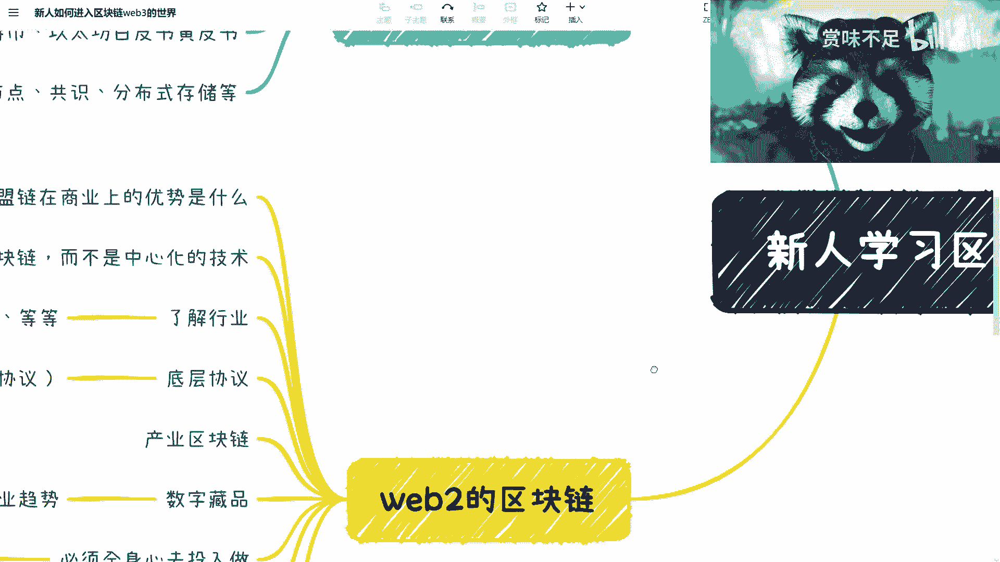

这样子啊，就这样子我得扩展好吧。

就web3啊，Web3，那我们再来看啊，首先是这样子的，web3这边呢有有也是一样的，我们首先来说啊，首先你比如说NT对吧，NP好，那问题来了，NTNT它的价值是什么，价值是什么对吧。

商业逻辑是什么对吧，有哪有就是过去有什么什么呃，这个这个这个有名的事件，然后有哪些有名的，这个这个这个系列等等等等等啊，我问这里写不下了，我就不写了，写写下来大家就看不见了对吧，那这个你得去了解吧。

对吧好，那底层协议，那web3这边底层协议有很多很多了对吧，那当然比如说我们说there one there to，那你得至少得要知道大家在讨论的，刘文跟聊求是什么吧。

对比如说以太坊这边now to到底要突破什么，比如说以太坊最近的升级，它到底是要升级什么对吧，你我不说你对于这个技术上有多大的了解，而是说你得对这个，你对这个东西脑子里有个概念对吧。

你不能说对方讲这个东西，你不知道对方在讲些什么东西，对不对，然后行业事件就更不得了了对吧，你比如说以前有交易所有有这个ICO，然后有比如说这边黑客到倒闭了对吧，那边呢什么合约有漏洞啊对吧。

这边呢可能这个这个有个什么新的项目对吧，就是说他比web2这边，他要了解的东西要多得多得多得多得多，而且他的信息很散哦，他的信息很散，所以说你在这个里面，你更要去抓紧时，这个这个这个这个叫做神经紧绷。

去了解这个东西，web3相比web高达还有一个点是什么，就是他比web更强关系群，那有很多人会问我，他说这个作为web3的区块链，我是这么跟大家讲的，包括昨天晚上有朋友咨询我，我也会，我真的。

我实话就这么说，我说你要但凡跟我说，你要进入web3去赚钱的，去割韭菜的，我双手双脚支持你对吧，你千万不要来跟我说，到web3里面去做什么什么事业，这件事情我就要打问号了，也就是说你要去割韭菜。

你要去赚钱的，我绝对支持你立马去对吧，但是你但凡跟我说，你要去做事业，我就会跟你说，你三思而后行，为什么，因为他就是个强关系圈的东西，你要切入web3的圈子，其实你要说难不难，但你要说容易不容易啊。

那么这件事情里面，比如说你你你你肯定像目前比较火的硅谷啊，对吧，新加坡啊啊那个迪拜呀对吧，那你这些地方得要去吧对吧，你你得去接触啊，你不能说我所有东西我都靠线上对吧，靠线上你最多叫一个维持关系。

你不能切入这个关系，因为你是一个新人对吧，你是个没有感对吧，那这个就是个问题啊，那么呃这个是个混账强关系权啊，那么这个时候就是还那个那个，就还有另外一个问题是什么，就是如果你是一个相对内向的人。

其实你就不合适啊，我个人觉得你就不合适好，那么这个是一个，那么另外一个呢就跟web是一样的，你得全身心投入对吧，你得学生性投入吧，你不能说我又是一个这个主主业对吧，副业对吧。

那你这个不叫做你要切入这行业，你这个就叫做就说我就是过来了解了解吧，赚个钱啊，这个也没问题啊。

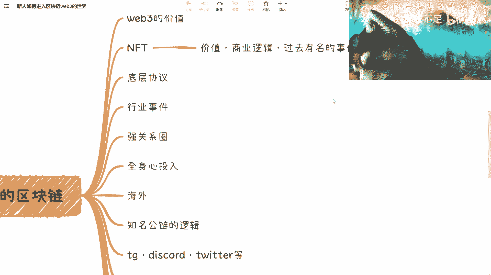

但是我这边所讲的就是说，你得就是我这边所讲的，是说这个要进入这个圈子啊。

然后呢我们再来看啊，呃这个攻略对吧，如果别的别的咱这个很多了对吧，你比如说索伦那对吧，这个EATHERING吧，BTC啊对吧，以前以前还有US啊对吧，你比如说以前的那个那个那个那个叫什么。

就是啊诶还有什么还有好多好多呢啊，你比如说那个叫什么稳定币啊对吧，那个呃die啊对吧，然后呃工业BSC啊对吧，ho对吧，就很多很多很多对吧，你得去知道，就是说他到底就是说啊这个背后有哪些逻辑。

它到底底层有哪些区别的吧，为什么你说啊我我我我大家都是公链，那为什么我要有这么多对吧，那当然这个地方写等等对，那为什么要这么读，那它到底有什么区别啊，这个代可能不能称之为功力啊，这个就只能是一个合约了。

我把这些放到define这里，对吧唉好那你比如说还有对吧，我说你这个了解信息，那你常用的工具你要知道吧对吧，你比如说这个这个telegram telegram tg啊，诶我没卡住吧，啊没有。

你比如说telegram discord对吧，这个twitter有各种各样的，你得知道吧是吧，包括现在很多直播都在twitter space上面对吧，你你得去关心吧对吧，就是我们说叫混圈子。

但你混圈子你得先把平台选好对吧，你不能跟我说我在微博上滚，那没有用啊，对不对，你像我这种垃圾对吧，然后你比如说DEFI啊，那么你比如说define下面还有很多F，就我那天之前的课程里面。

视频里面我也提到过对吧，你比如说give me fy social fi对吧，还有各种FI对吧，Define，那define里面就很大嘛对吧，那你比如说合约啊，这个稳定币，稳定币下面比如说保险是吧。

你比如说这个这个这个叫什么就是理财啊，然后那个很重要的DEX对吧，去去中华交易所啊，稳定币保险理财啊，然后你比如说那个叫好，还有一些什么呢，叫做那个叫做石坛啊，你比如说实盘的这个软件对吧。

盯盘软件啊等等等对吧，那这些你总归都要知道吧对吧，那他分别是什么对吧，你比如说去中心化的合约啊，去中心化的稳定币对吧，我们叫stable coin，stable coin对吧，你去中央稳定币是什么对吧。

去中心化的保险又是什么对啊，去中华理财是什么，去中华交易所这个是一个很大的东西，这个DEX是个很大的东西对吧，那它是它又是什么对吧，实盘盯盘它又是什么对吧，你都得知道吧，然后到到这边，要交投票对吧。

然后呢你分别分成区，分成这个叫链上啊，还有练下对啊，那这个地方呢其实还有一个很重要的东西，我其实哎这个东西就不太不太就没写进去，是什么呢，就是那个oracle啊对吧，那有很多人说哎你比如说你不学习对吧。

你就就就不知道很多人就说啊这个数据库对吧，那不太干啊，没有关系，这不是数据库，这叫预言机啊，不好意思，这不叫数据库啊，预言机，那预言机里面有哪些呢，你比如说怎么收啊，我们举个例子啊，预言机的共识是什么。

好流程是什么对吧，那怎么怎么收费啊，经济模型又是什么啊，对吧等等等，那这些你也得去了解吧对吧，或者说现在有哪些火的预言机，那为什么这些预言机会火对吧好，那还有什么呢，你比如说以前的ICOIEOIFOI。

什么OI各种O对吧，那I各种O，不是说你要去了解这个IOO是什么东西，而是说你要去回顾一下I各种模拟前，到底发生过哪些这个有名的事件对吧，啊然后各种共识共识就多了，这个PBEFT对吧，POWPPS对吧。

DPOS是吧，raft对吧，等等等等对吧，你共识我别的咱细的不说啊，就是说一些大的这些共识，你肯定得要知道的对吧，那好那那再回到上面，那那跟web是一样的，最终我们回学习完了之后啊，你了解完了之后。

你回过来问自己一个问题，就是web3的价值到底在哪里，那为什么要用web3，web3跟元宇宙又是什么关系，web3为什么会有这么大的价值，那web3里面的呃。

这个这个这个比如说啊他的NT就像CATBOX，像那个centralized land对吧，像那个以前的CRYPTOKITTIES啊，像这个crypal punk啊等等等等等啊，那为什么他没有价值对吧。

那就像你你一定要去问自己，比特币的价值在哪，对吧，你不要告诉我，因为它价值高，这不叫这不叫价值，这是一个因果关，就你已经把果说出来了，我想知道就是你得自己去说清楚，想明白它的价值在什么地方好。

那么这个也是说能够说服你，真正的能够长期在web3这个领域里面支撑下去，也就是说坚持下去的这么一个原因，那当然这些呢就是回头你们想想看。

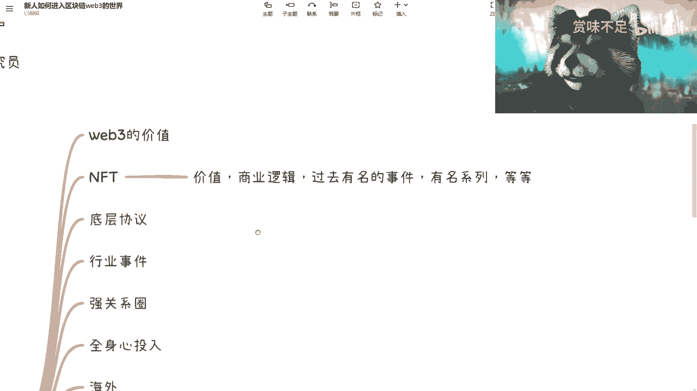

就是如果我把这里面每一个细分开来，那我其实后面能讲的东西太多了啊。

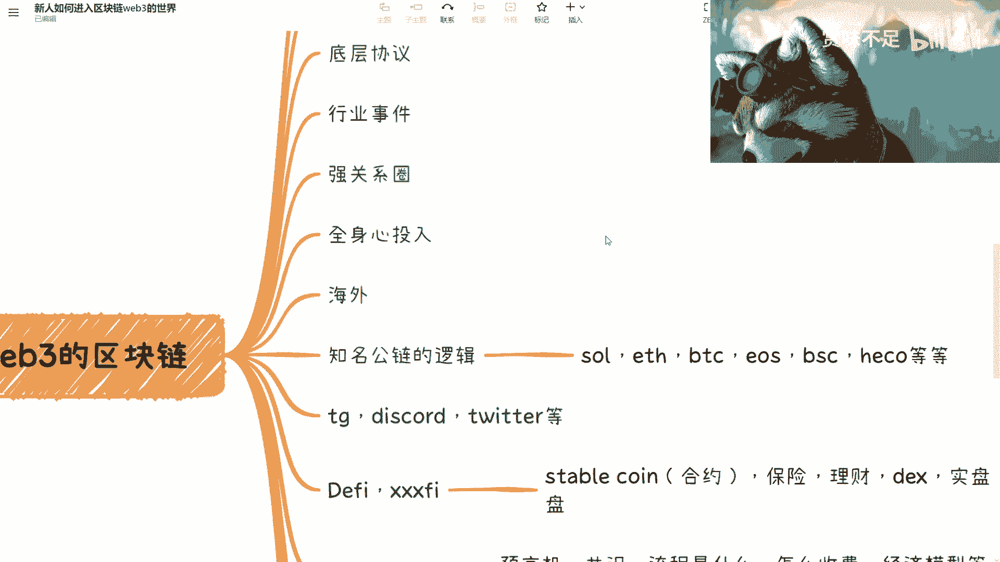

当然我的确会啊，但是由于这是个免费的视频，所以我也不会讲，这太生好吧，你看我这还没讲完，都已经半个小时了，我也很焦虑，我昨天我昨天晚上这个这个那个微信上面吗，微信那个视频号啊，他说只能支持30分钟。

然后我就卡在29分29分58秒，然后他就不让我上去，我就特别的生气，然后我最终只能把它切分成15分钟，15分钟，所以我我估计今天这个视频我也只能切。

然后你比如说岗位啊，然后有很多人就说了，哎呀我这个作为一个新人对吧，我要进入这个行业，哪些岗位适合我呢，对吧好，往往会问这些问题的，他肯定不是做开发的，因为如果他做开发的，他往往也不太会问这个问题。

对吧好。

那问这个问题呢，那我们来看啊，如果不是开发，有哪些比较合适的运营啊，销售啊，研究员啊，当然这个研究员可能是比如说某些research的专业，专业啊，或者怎么样的这样子。

但是呢就是说在这里面啊，大家还要区分一下，就是嗯就是说你就像我刚刚说的，就是你web3里面的这些岗位，没办法，你们这些岗位其实很不一样啊，其实很不一样，就是我我们这个粗俗粗略就是通俗点来讲。

就是说web2的这些岗位，它相对来讲还比较集中，也就是说相对来讲是那种比较垂直领域的，就是你可能做运营，你就是运销售，你就是销售对吧，就是相对来讲是一个web2的销售或web2的运营。

但是你在web3领域里面呢，你往往这个运呢就会比较杂，你你需要会的东西很多，好销售也是一样的，你不能说啊，我仅仅有销售的技能对吧，我仅仅把web的这个销售技能把它搬到web3，其实不够啊。

就不够，你可能必须要把这些东西了解，那当然有些你可能不知道。

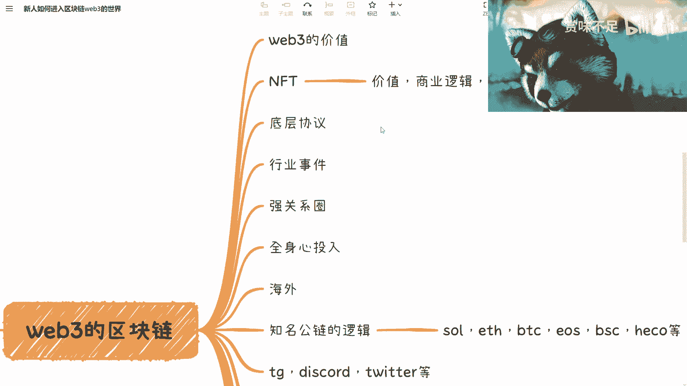

比如说底层技术啊啊这些呃什么预言机啊。

对吧，刀啊对吧，你可以不知道，到底有哪些优势啊，相比别人有什么优势啊，你得头头是道吧对吧，那这些东西其实web3我们目前来看，真正做得好的那些人，他的要求反而要比web来的高啊，微博来的高。

但是呢web微信web3，现在这个叫做呃面试的时候呢，它相对来讲可能这个，门槛啊可能会比微博来的低啊，这个是因为为什么，是因为维吾尔这边的照片，他往往还是走那种传统的这种企业型的招聘，Web3。

现在招聘呢，因为它毕竟是decision alize嘛，所以说呢他相对来讲，招聘大家还是那种就是以介绍为主的啊，或者说以这种叫做远程面试为主的，所以说相对来讲，它不会对于一些硬性东西卡得很紧啊。

所以说呢我觉得这个有有好处有坏处呃。

我把这个东西今天已经补充了这么多了啊，我有点惊讶，有点惊讶，OK那反正就是说这个内容呢。

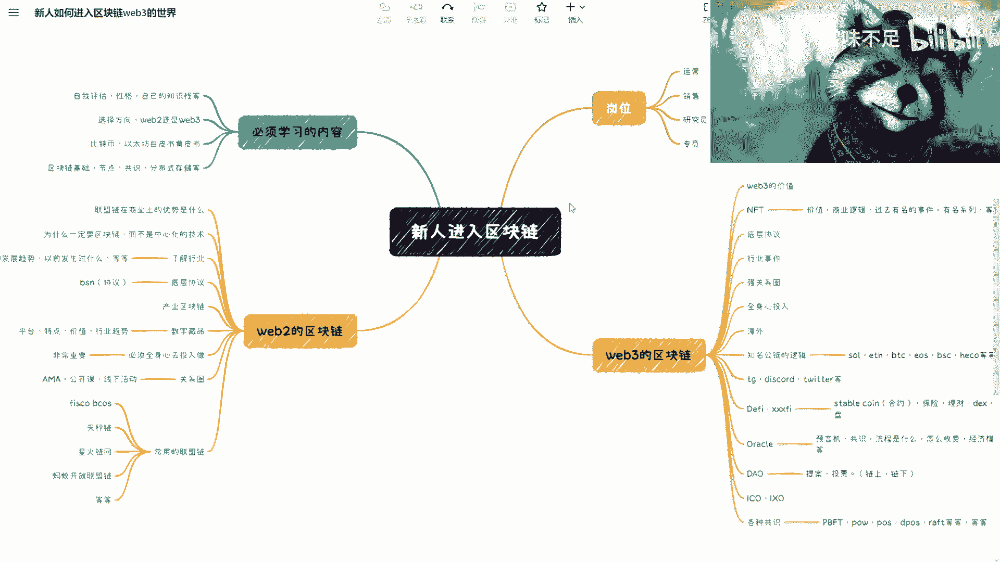

我觉得讲也差不多啊，这个半个小时，我觉得我讲了大概也有五六个小时内容，如果展开的话，呃，回头呢反正我会再一个一个在做展开好吧，一个再做展开，OK那希望对大家有帮助吧，那正好30分钟，拜拜拜拜。

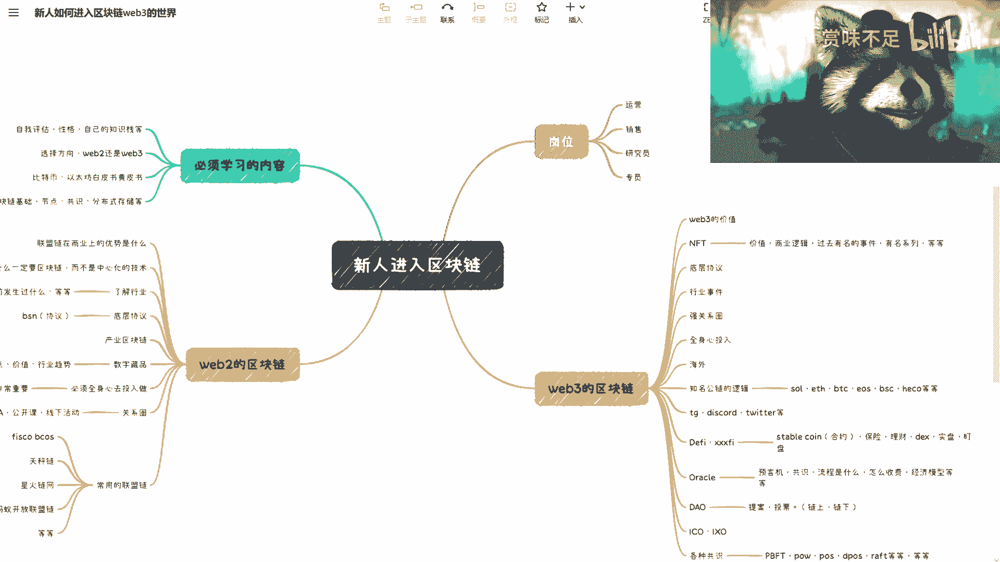