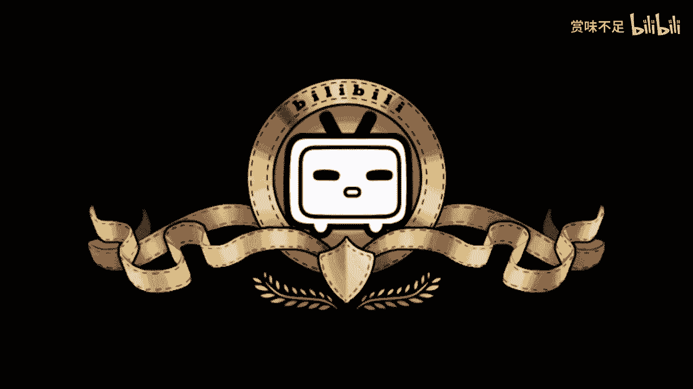
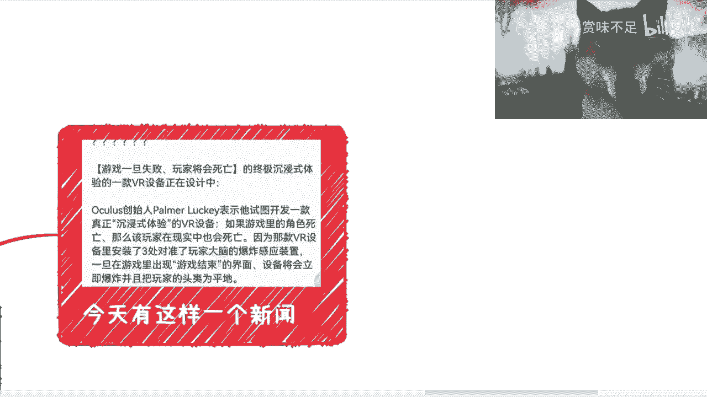

# 赏味区块链——元宇宙并不是只有ARVR - P1 - 赏味不足 - BV1vG411w7vL

哎哟喂，啊。

好啊，大家看到今天换了一个狗头对吧，就我我想换一个试一下，诶我这狗头好像嗯稍等哦，可以的可以的，昨天就是大家也看到，就是出了这么一个新闻，我不知道大家有没有看到，就是说啊我们现在要做一个游戏对吧。

这个游戏一旦失败，原玩家将会死亡对吧，就试图开发一款真正沉浸式体验的vr设备，如果游戏里的角色死亡，那么该玩家在现实当中也会死亡，因为这款vr设备里安装了三处对准玩家大脑的爆炸，是感应装置对吧。

巴拉巴拉巴拉，然后呃今天呢就把那个艾伦马斯克也说了，就是在推特上会推出余额宝，呃然后就整体的一个就是哎我，们可以不叫元宇宙啊，其实无所谓叫什么啊，就说他整个生态呢其实已经布局的呃就比较清楚了。

从目前看这个我可以下期再来说，就推特了这边的一些问题啊，呃然后呢就是说我主要这一期的这个主题呢主要是想说一下，就是说呃吴宇宙并不是只有a r vr的，呃，因为在海南这边沟通的时候呢。

我也发现其实政府很多的这个领导呢，他也觉得就是说啊元宇宙其实就是a r跟比亚，本质上我觉得并不是这样子，那当然啊这个事情呃并没有说一定对或一定不对啊，所以我就阐述一下，我的一个观点啊。

呃a r v e r这边呢我们能看到我这边列了几个啊，我看看看不看得到啊，一个是头号玩家类似的对吧，就是说它是一个纯vr设备对吧，vr设备加上那个呃头盔对吧，和衣服体感，服装对吧啊这个是纯vr的。

这是一种一种啊，那另外一种呢是刀剑神域的剧场版对吧，纯a啊，那当然纯a啊，这个东西说实话还没想好，就是哎呀我们现在比如说之前的那个宠物小精灵对吧，或者其他的这个是比较清晰的。

但是你说哎呀能不能把整个的一个就不单单到指定地点，或者不单单扫指定的一些东西，它能不能把整个的一个比如说我眼前的这个景色啊，城市啊都扫描下来，这个还不知道啊，那么另外两个呢就是跟这个新闻一样的。

就是刀剑神域神域的第一步对吧，就是刀剑，神域当时第一部里面写的就是跟这个新闻一模一样啊，就是说呃他放的是那个电磁波嘛对吧，然后你死了之后呃，这游戏角色死了之后你也死了对吧，然后这个是跟这个一样的。

然后刀剑神域其他的那个类型呢，他这个通用的类型是潜行，那潜行跟a2 跟vr又不一样，那潜行是属于跟盗梦空间是一个类型的啊，潜行啊，那当然你说这个到底是一个什么这个技术的一个原有。

就目前不清楚到底是以比如说催眠为原理，还是说是脑电波自己为原有，这个不清楚啊，但是不管怎么样，这两者，都是潜行的，那也就是说如果你真的要从元宇宙这个词去出发的话。

其实我觉得a r v r未必呃一定是一个比较合适的啊，一个样式，可能目前来讲的话，呃这个诶啊这个潜行是比较更合理的一个一个说法啊，那我把我这个狗头拉大一点，狗头看不清楚哈对吧，然后呃啊到这啊。

然后呢就崭新形式展现形式这边呢我觉得就是说有几种嘛，比如说虚拟空间对吧，然后游戏对吧，a r v r的，然后现在呢就比如说虚拟空间这边可能很多的是什么呢，比如说什么，我们举个例子啊，比如说社交，对吧。

然后那个会议啊，然后比如说博物馆啊，但其实你会发现这个呢它并不是一个很什么很突破性的一件事情，因为对于这种东西来讲啊，就其实以前都有，只不过他没有，就是说他没有往元宇宙上面这概念上靠。

所以很多人觉得哎呀，就我们称之为他没有出圈啊，就比如说虚拟空间以前做的那些行业的人，他现在就说实话，他现在看元宇宙就像看片子一样对吧，就他们会觉得这是一个原本就存在的东西。

那凭什么你们套上一个元宇宙的概念，就好像觉得很不可思议对吧，就相当于我，本质什么都没换，你就换了一层皮啊，然后你就跟我说这是个新的东西对吧，所以说其实本质上呢就目前来看，它像一个出圈之后的一个东西啊。

那么游戏呢就更不要说了，因为游戏的话其实对于你比如像我这种一直玩游戏的人来讲，他整个里面的这个这个虚拟空间啊，包括其他东西元素做的再怎么样，在我看来他也就是一个就是游戏类型的几个技术。

就以前就非常成熟啊，他不是说因为现在网友宇宙发展了，所以大家拼命往这方面走，那也不是，那当然a r vr不一样，a r vr的确是，近几年可能发展的比较快啊，但是嗯就是就怎么说呢。

就是说ai vr本身它只是一种展现形式，呃你不能说今天我们比如说呃全息投影了，或者说就a r和vr了，就元宇宙了，这个我觉得无论从我的角度还是说从这个其他的一些这个角度上面，就就不太说得过去啊。

那我把这个狗头稍微移一下啊，ok然后这边呢还有我大概说了一下，就是关于这个元宇宙本身啊，就我们会看到，不管我们的这个展现形式到底是什么啊，呃其实本质上我们关心的应该是我们到底是一个生态还是多个单个。

的生态还是多个联通的生态，还是一个经济的生态，这个事情呢就跟我比如说我今天就刚刚刚刚把发了那个微博，说推特啊，twitter的这个事情，这个我下一期再来讲吧，好吧，这个就单独开一期，单独开一期，对不对。

那为什么要说twitter呢，是因为是这样子的，就是呃你说ella mask对吧，现在这个说我要退出余额宝对吧，然后有很多人就说呢，他说你是抄那个叫什么支付宝的，对不对。

但其实呢我觉得这个本质上还是不一样的，就是为什么呢，因为你支付宝微信也好，或者其他的一些产品也好，它属于单独，的产品，它连生态都不算啊，就单独产品，那你说现在呢国内其实有的就是多个多个单独的产品。

那多个单独产品呢他之前还不连通对吧，对联通还非常的扭扭捏捏，就是不连通，那你说经济吧就更没有了对吧，就说你比如说微信有社交，但他有经济嘛对吧，他最多给你个支付，你说它能不能称之为经济。

称能不能称之为生态，那肯定不能对吧，那支付宝更不更不要说支付宝连生连生态都没有对吧，它它纯粹就是个工具，那所以说呢其实本质上我觉得你要往真的元宇宙这个概念上说啊，呃，你不能说a r vr是元宇宙。

因为a r vr只是元宇宙的一种展现形式，但是元宇宙本身它应该是一个叫做联通的啊，叫做我可以把多个生态联通起来，或者我就是一个完整的联通的生态，那你就像推特，为什么我会去说twitter。

是因为twitter从目前的整个发展来看，它就有一个很大的一个趋势，就是我就是要把比如说特斯拉对吧，n f t web web 3 ism对吧，然后那个那个那个支付对吧，商城啊。

交易所我就是要把它集中在一起，就我就是要做个集成的东西对吧，elon musk，现在整个的一个对外披露的信息已，经很明确了，就是我们先不管它底层到底是一个还是多个，但是他要的是什么。

就是我既是多个联通的一个生态，又是一个经济生态对吧，那这个我们称之为元宇宙，那很多人会觉得啊，他就是抄了一个余额宝，你说衣服这么简单吗对吧，那当然你从行为上面是这样子的啊，所以说这就好像什么呢。

这就好像就是这就好像什么呢，就是我们说呃你推导一个数学公式对吧，或者说你那个验证的一个数学猜想，你在当中可能会运用到已经很多已经被验证过的数学数学猜想和公式，那你说我，今天用一个数学公式去解一道题。

跟一个正在呃，就是就是解除一个还没有人解除的一个数学猜想的一个人，引引用了这个公式，这两件事情本质上是一样的，但这两个事情结果是一样的，那截然不同，对不对，那你说你说我去跑步跟刘翔去跑步，大家都在跑步。

那结果一样吗，那也不一样啊对吧，所以说呢其实本质上我们不能看他这么一个事情，就像我们看元宇宙是一样的，就是就是a2 比亚，因为大部分这个人的接受度比较高嘛，因为他知道a2 b2 是什么。

就是你比如说这句话当中，对吧，他不知道原理就是什么，但他知道这个东西是什么，所以他就会往上套，但其实并不是这样子啊，所以我觉得就是这一期的话，我就想说一下这个，那当然啊这个事我还是蛮期待的啊对吧。

就真的有人做蛮好的，那多好呀对吧，我觉得就很好，大家这个活一次对吧。

