# 赏味区块链——浅述web2和web3 - P1 - 赏味不足 - BV1TW4y1q7hi

哦，好，大家好啊，我是那个肠位不足。

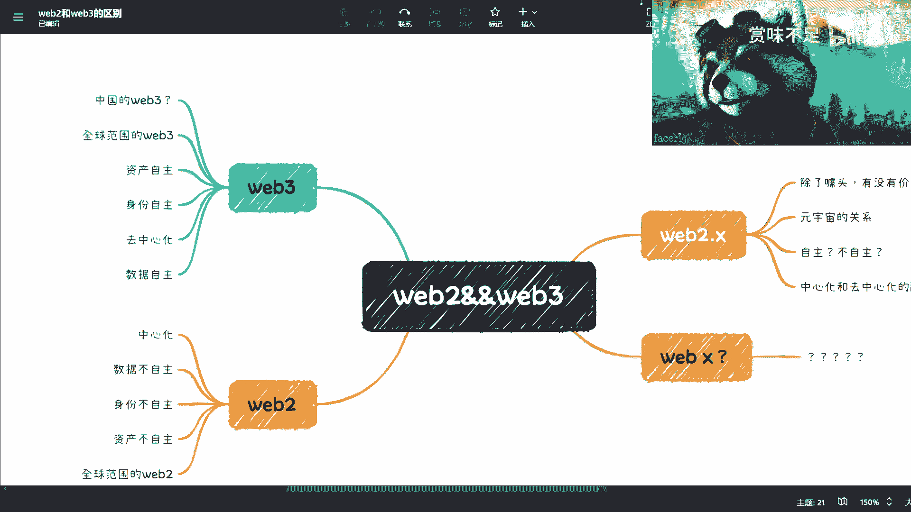

呃，因为最近呢在就大家这个注意力先不要放在我的小浣熊上。就为什么放小朋友？是因为我这样讲的时候甩头，你们可以看不到，哎呀，甩脱了。稍等，我看一下我的小浣熊。啊，就是因为最近呢在那个这个平台上面啊。

其实蛮多的人会来问就是这个关于we2we3啊，区块链元宇宙对吧？各种各样的一些这种。问题啊，然后呢我就想着说弄这么一个视频啊，可能会弄一个系列。我，给大家简单的讲一下。

我们在这个地方可以看到我做的这个ex mind。

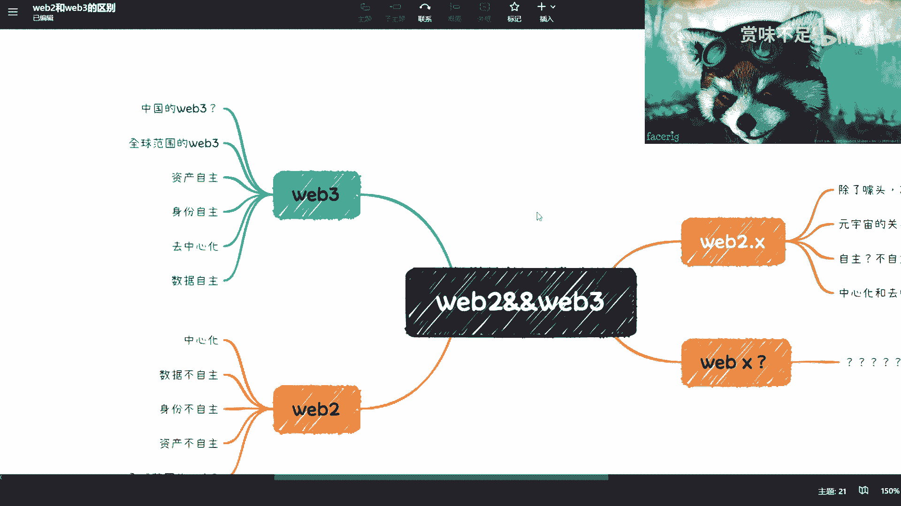

哦，那么这个S find呢就是这一次啊。作为第一期啊，我先给大家来讲一下这个we8跟we3。因为。有非常多人都听到过这么一个词啊，然后所有的人跟我聊的时候，其实都会问到这么一个内容啊。哎呀。

为什么这个小黄牛老是往旁边甩呢？哦，我知道是这样子。

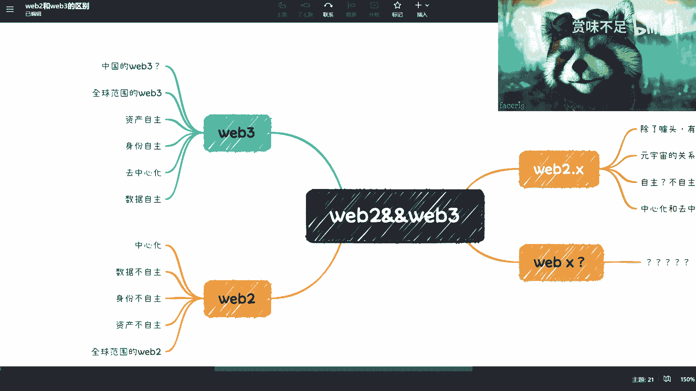

啊，呃OK然后我们来看啊，首先我们先来说维巴2对吧？we82呢，我们在这个地方主要呢是把它称之为呃传统互联网，或者说互联网或者说中心化的世界，对吧？那么在维博2这边呢，我们啊会看到有那么一些。

我把它放大啊，就维巴2这边呢，我大概列了几个啊，第一个就是这个中心化，对吧？是它的这么一个特点啊，然后数据不自主，身份不自主资产不自主，对吧？好，那我们所说维博2呢是怎么一个东西呢？

就是比如说我们现在用的微博啊、微信啊对吧？这个支付宝啊，所有的这些中心化的互联网的产品都叫维巴2啊，那么我们说。

为什么数据不自主，身份不自主，资产不自主？那很简单，我们举个例子啊，比如说你今天对吧？这个微信啊呃，里面有钱包对吧？然后有有你的聊天记录啊，然后呢，还有这个各种各呃各种各样的这个数据啊。

那么包括你这个人啊，你叫什么名字啊，你啊这个加了的什么群啊，对吧？各种各样的一些这个这个身份能够证明你身份的这么一些这个数据，你在用的时候，虽然是你在用。

但是你的数据是存在腾讯的这个微信的所在的那个服务器上面。😊，对吧？好，那么这个时候呢，你说数据自主嘛，你肯定不自主，对吧？这个数据说什么时候删就什么时候删，对吧？

这个是我们说Y82这个叫做中心化的这么一个这么一个点啊，那么啊首先这第一个第二个呢，身份身份也一样，对吧？他说什么时候消耗什么时候消耗，对吧？对吧？这是第二个啊，然后第三个呢就是我们说资产。

那资产这件事情呢，其实呃可能会有些敏感，为什么呢？因为我们这个看到过微信这边的这个这个有很多人也会提啊，他说如果我今天号对吧？没有了，或者我今天这个突然之间由于什么原因啊，不可抗力，对吧？这个号消失了。

那我里面的这个钱还有没有对吧？从目前大部分的这个情况来看呢，就是说。😊，当然，微信一定会告诉你，okK你的钱是安全的对吗？对吧？但是呢你需要通过比如说呃你的身份证啊，或者其他的供水账信息来保来去申请。

比如这笔钱能不能下来。对能不能把这个钱退下来，对吧？那当然有很多人这个之前也提到过，他说他说有没有另外一种方式什么呢？他说你可以在里面先借一笔钱。那这样的话消耗的时候，他一定会这个主动来跟你做沟通。

对吧？那当然这个我们就当一个玩笑来听啊，但是从这个情况来讲呢，我们说啊数据不自主身份不自主，资产不自主，对不对？那我们we巴2呢这个东西呢，为很多人对它有误解啊，他会觉得we巴2就代表国内啊。

其实也并并不是啊，因为we2本身它只是一个统称啊，我们称之为所有的中心化的这些业务或者中心化的服务或者中心化的这些产业都是归类在2的也就是说在全球领域里面，你所有的中心化。我不管你facebook也好。

google也好或者其他的一些也好，他其实都属于we巴2的这么一个范畴啊，所以说我们并不会去把这个we2限制在这么一个国内的这么一个情况下面。😊，啊。

啊，好，那么我们讲完we8来讲web3啊。

啊那啊我补充一点啊，就是we82这个地方，大家因为我们现在所有的人其实都在we82里面嘛，对吧？那对 web82大家都是比较了解的啊，这个we博有哪些优点，对吧？优点其实很简单。

就是说很呃就比如说你去用一个产品，we82响应一定是很快的。比如说双十一啊，对吧？这种抢购啊直播啊，你在 web博2上面很好做啊，然后另外一方面呢，就是说你的维权也好做，对吧？

虽然你说维82这个容易出现很多问题，但是你相对来讲也容易维权，对吧？你你比如说有客服啊，有投诉啊啊，可以做法律程序啊，各种各样的问题，对吧？😊，当然相对的，你说我Y有什么缺点，那缺点也很简单嘛。

就是他说消耗就消耗嘛。他说你数据不存在就不存在，身份不存在就不存在，资产不存在就不存在嘛，对吧？那你说这个怎么怎么弄呢？对吧？你说。😊，这个中心化跑路了。对吧你拿他也没办法。对吧所以说这个时候呢。

你的优缺点是一个共存的。对吧这就好像有很多人去买理财产品是一样的。他说呃我既想收益高，但是呢我又不想很麻烦。那这个时候就变成了怎么一个逻辑呢？就变成了你希望有个人来给你托管，对吧？

但是呢他又要承诺你有很高的收益回报。那这个时候你说如果有一个人能给你托管，同时他又承诺你有很高的收益回报。😊，这个两个结合起来约等于跑路，对吧？没有什么区别，对不对？

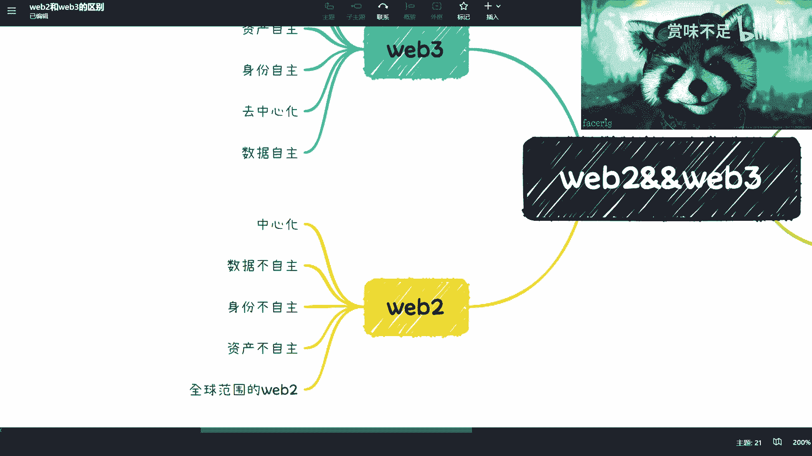

好，我们来看we3啊，我看一下这个小球会不会挡住啊不会对3那3我们来看啊web3现在叫什么呢？因为有很多人也会提到啊，他说we3呢叫做去中化，对吧？或者说叫做完全的ralize对？

然后呢资产自主身份自主数据自主，对不对？好，那这个时候呢我们说它跟2的区别在什么地方，区别在于说b3的生态，它是一个链，对不对？好，而这个链它是一个多节点来形成的。

那简单来讲就是说如果我们还是拿微信来举例子，就比如说今天啊假设微信是一个3的应用，那这个时候呢，它就不在微信的腾讯的中心化的服务器上面。

它可能会在100家1000加1万家的这么一个企业或个人所形成的链上面，对吧？那么这个时候呢它跟从架构上面有个很大的区别是什么呢？就是。😊，我们之所以说他的资产身份数据能够自主。

是因为你的资产数据身份它是存在链上的。而这个。资产身份数据它怎么能去改呢？或者怎么才能去定，就是就是去调或者去运用呢？必须所所有呃拥有这些资产身份数据所对应的私钥。对吧就称之我们称之为密钥，对吧？

key。那么这个时候呢，就这个key在we3世界里面，它是在用户手上的对吧？那么简单来讲就是说你还是拿微信来举例子，简单来讲就是说如果是we3的一个应用的话，如果微信今天是we3的应用。

那么就是什么意思呢？就是说。😊，哎。腾讯只是做了一个服务，但是呢它无法去存储，或者来说它是通过11万个甚至2万个不同的这种互不相干的啊这种机构或者个人来存储你的数据。

而这而且这些数据绝对不是其中的一两家或者几千家说改就改的对吧？那么这个时候呢，就是说你会发现它只是架了微信这么一个服务。至于这个服务里面所要用到的资产身份和数据全部从链上来获取。

而这个链上获取的前提是你得用你的私钥去授权，或者你每一次都得用你的私钥去做一次这个加签，就所谓的签名啊，你才能去用。那这个时候你会发现它的整体架构就变得非常的去中心化，同时也比较安全，对吧？好。

那这个时候呢，你会发现，那如果从 web博3的角度，它有哪些优缺点呢？优点，我们刚刚已经说了，对吧？就是这。

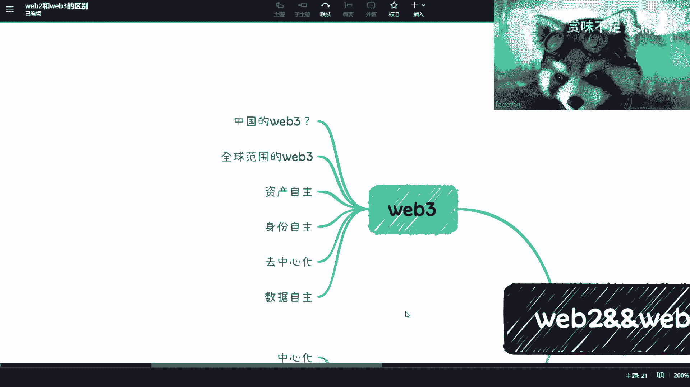

三个东西都是自主的，但它的缺点也很明显，缺点是什么呢？就是。😊，你。并不代表你用了区块链，你就和你就安全，而是说它的核心是什么？

啊，我们在这个地方写一下，对吧？哎呀。掉掉了。核心是什么？核心是他的共识机制和他的合约。对吧那我们简单来讲共识机制是什么？共识机制就是告诉你我这个链上数据到底怎么才能改。😊。

对吧或者我这个链上怎么才能部署合约，怎么才能撤合约，或者来说我这个链上的规则怎么来制定，对吧？那这个是共识机制，那如果来说今天就算你有一根链，它的共识机制跟sht一样。

那你说你的数据会你的身份资产数据会安全吗？不会对吧？那么这个是它的一个很大的一个点。而另外一个缺点是什么呢？就是说。😊，一旦在we3的世界里面出现了一些，我们说跑路啊。

或者说你的这个数据资产身份被侵权了，对吧？或者说被盗取了，你很难在当下的情况下面去找到维权的。这个切入点。因为。客服没有用，因为客服他没有中心化去可控的一个权利。项目方有吗？也没有，对吧？

法院法院更不会来管。对吧所以说呢我们记得前两周吧，有我看到微博上有一句话说的是很对。他说we2到3到目前为止最大的这个成功的进化点在哪里？是黑客，而不是他所谓的生态啊。

因为的确生态到目前为止是一个还在对吧？萌芽期或者还在高速发展期的这么一个那个过程当中啊，那我们再往上来看啊，我还列了两个一个叫全球范围的一个叫中国的我还打了个问号，对不对？

那首先全球范围的we3是什么呢？就是我们称之为纯正的deralized的那些。那哪些呢比如说deef socialial吧？或者我们说以前的就目前最火的以太坊啊，以前的比特币啊。

所有的那些就正常的正规的供链，或者说做。😊，做零知识证明，做做做各种各样。呃，基础建设的。那些我们称之为都称之为weign。而中国的weign在这个地方有一个问号啊，或者我们在这个地方不能叫中国啊。

我觉得这个可能描述的不太对啊，叫做主权化国家。啊，我们叫做主权化国家的web3。为什么这么说呢？是因为web3本身它就和主权化的国家哦，就这么一个政府的这么一个定位，它是完全违背的，就完全是相悖的。

它没法共存。为什么我们举个例子来讲，很简单就是。正因为we3的巨大特点是在于区逐硬化。那么这一点上面呢，就是说意味着整个区块链上的因为区块链面就是个账本嘛，大家也都知道嘛，对吧？就整个链上也好。

合约也好，里面所存储的很多的数据和逻辑，它是没有办法由中心化的某一家机构去做掌控的那这个时候我们就说我们别的不说啊，这个时候我们就说黑产对吧？包括一些这个黄赌图，对吧？包括其他一些问题。

这些是无论哪个主权化国家，你不要跟我说哪个国家特别开放或者怎么样子，他在它再怎么开放，他在在法就是明面上的法律法规上面，他还是会告诉你，我有很多东西是红线，你是碰不得的。

但是我们说如果把这些红线放到了we3的世界里面。那你说他能不能控，它就控不住了。所以说从主权化的国家来讲，他是没有办法去我不管他这个这个这个这个叫什么就是背后是怎么来支持的。就是它无法。

在一个表面和明面上面公开去支持说我是支持webite的对吧？好，那这个时候呢，我们说如果主权化国家来提webite，比如说现在中国有很多人提webite，那么它的点在哪里呢？它的点只能说。

要么是他不懂we3啊，要么就是说他拿着we博3这概念在国内圈钱啊，无非就这两个切入点啊，否则就不要去提we博3，或者说他自己在那边哦，对，或者说我朋友跟我说的很好。他说他们就在自己创建一个概念叫we3。

而且是一个新的概念，而且是一个就是说国内很多人对we博3还不了解，他们正在对这些人进行洗脑，进行PUA对吧？那也可能啊。

但anyway我觉得就是说我们从正常的一个we博3的这么一个这个这个这个切入点来讲啊，他是这么来区分的。😊。

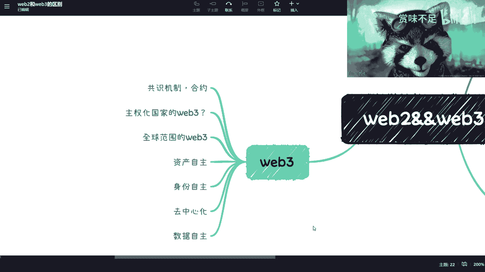

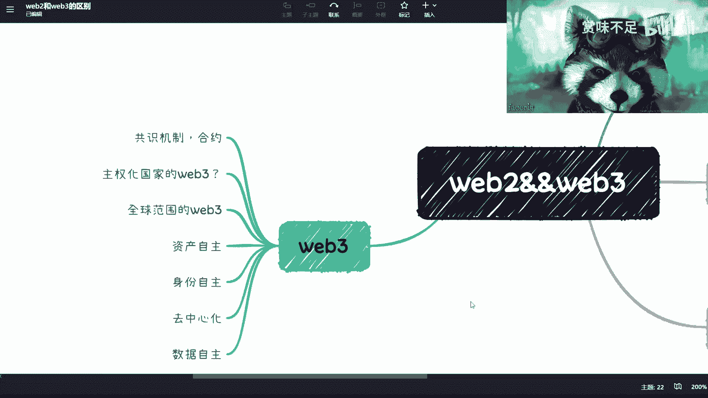

那么我们再来看啊。我们再来看在这个地方呢，我还写了一个叫Y82。叉啊，2。叉，我看一下这个是不是被我挡住了啊，稍等敲他妈的。呃，没有啊，就就就就尾82。叉Y82。

叉呢是其实还是目前中国造出来的这么一个词啊。但是呢就是我们来说它有几个特点，第一个就是说它是一个中心化跟区中心化的一个融合。也就是说。大家各退一步啊。

就是你呢还是能掌控一部呃大就是所有的这个这个这个数据身份和资产。但是呢我们也开放一一部分以前在维巴事件里面没有办法开放给用户的一些自由度给到用户。对吧那我们在这里面可能会有所谓的激励呀，对吧？积分啊啊。

钱包啊对吧？这些概念。那这些在we包可能是没有的啊，那么这样子呢就是说我们这个可以给到一定的自由度，但是它又不不能完全和 Web部3划等号，对不对？那这是一个。第二个呢就是说自主和不自主，对吧？就是说。

😊，相对你以前只能找客服或者找这种叫做呃法院的情况下面，可能他给了你更大的一些自由度。那这个我就不在这里展开了啊，那么第三个呢，就是元宇宙，对吧？因为因为目前来讲，元宇宙本身呃。

你就先不要说跟VRAR吧，就元宇宙肯定会单独开一期啊，元宇宙本身跟区块链还有跟数字人民币跟我们说的这个这个NFT就是所谓的数字藏品。都脱不了干系啊，但是他内部的关，就他们自身内部的关系又很复杂啊。

所以回头就是因为咨询我的人现很多嘛，就他们也会问嘛。就第一个问题就是说哎，你跟我讲元宇宙区块链数字藏品对吧？那个这这几个东西什么关系，对吧？包括就是说这个这个这个这个跟比特币啊，跟以太房到底什么关系。

对吧？这个是所有这个问的人最多的一个问题啊，那最后就这个地方我提了一点，叫做除了噱头有没有价值，这个问题我还是那句话，你从我角度来讲啊，因为我现在毕竟是个商人嘛，对不对？那我觉得从我角度来讲很简单。

答案是什么呢？我我在微博上这么说的，我说你只要赚钱。😊。

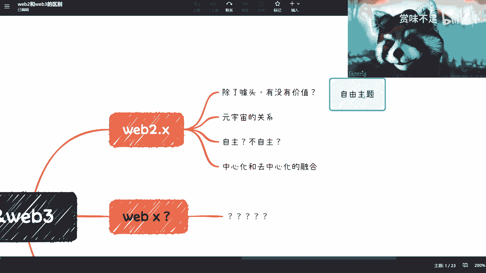

就是价值。

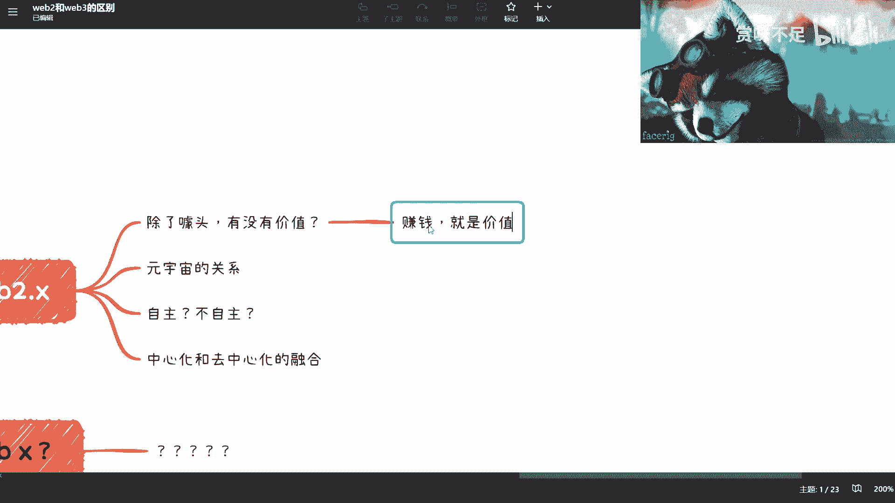

对吧你不要跟我扯有的没的啊，扯那些虚的没用没有用，对吧？好吧，然后呢，还有weip叉we叉是个什么东西呢？就比如说。😊。

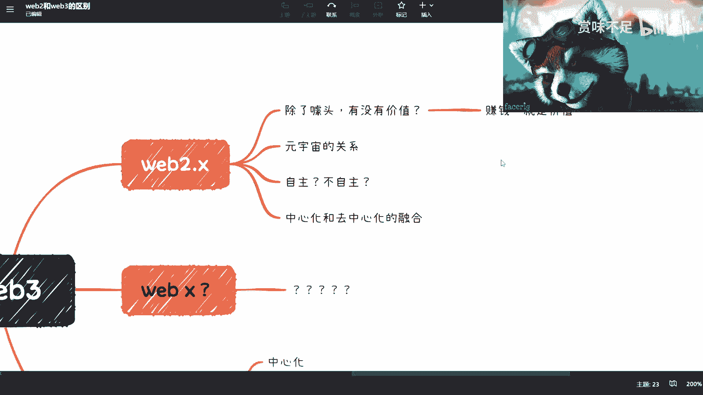

啊，就比如说有很多人说web3啊，不是5we1对吧？你们也会听到过的，可能现在这个说的人不多啊，但是也有人会这么讲，就这个东西呢就真的是一个玄学啊，就这个地方我打了一个问号，打了打了5个问号，对不对？

就这个东西就是个玄学。就是就是你明明可以用去讲语宙或者你去讲公业互联网，讲这个讲了个各种各样别的东西，对吧？你非要去造一个看似那么玄幻的一个东西，在那边去讲，那我觉得其实就没有必要。

因为本身啊其实说实话经过就毕竟我还是个互联网领域的博主啊，就经过这个大家只要经过互联网这种洗礼，大家都知道啊，其实互联网里面就就是这些人啊他就喜欢造概念，你会发现明明他可能本质是同一个东西。

他他非需要去造10个不同的词出来，让你觉得好像这是10个不同的东西，但其实就是一样的东西啊，所以说呢我们说。😊。

综上所述啊，我们来看一下，我把这个东西缩小一点。

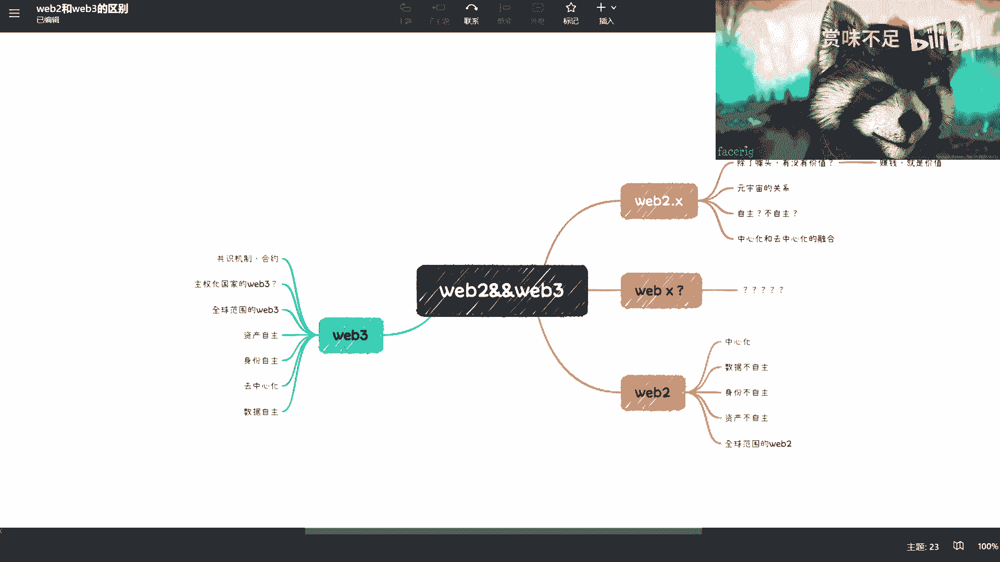

对吧啊，这个好像所过小啊这样子。被我小浣熊挡住了一部分啊，不重要。就综上所说，我们说本质上啊这个让大家能够了解一下，到底就是说尾巴2Y83啊，包括we巴22。5就吧V82。叉。

啊，到底有哪些很大的一些这本质上的区别？同时呢就是说呃我会后面把它单独拎出来。就比如说我单独会把web3再拎出来，we博2再拎出来，包括元宇宙啊，对吧？包括其他数字藏品，我单独都会拎出来。

但是不会不会说太多，因为毕竟我觉得两方面原因啊。第一方面这毕竟是一个免费的视频。我希望大家能够呃从最基础最真实的情况去了解这个这个这个这个里面的一些内容，也希望大家就是说有不同的一些问题呢。

你们可以微博私信我或者怎么样。反正你们问对吧？我我肯定答，对吧？肯定这样子的，那另外一方面呢，就是说我也希望啊就是呃大家有真的啊想要去做这方面的这个朋友呢，你们也可以来做一些这个付费的咨询。

因为这个我也要赚钱嘛，对吧？所以我我也非常的公开说这么一个点啊，就是呃我可以跟大家看一下一个呃这个服务。

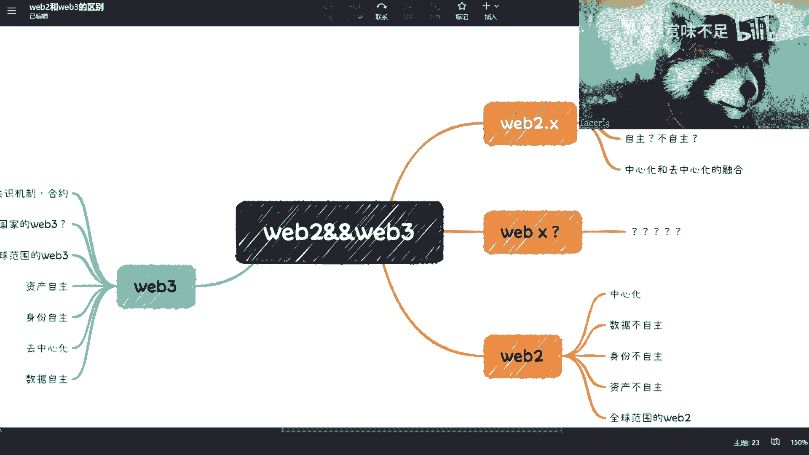

啊，大家可以看一下啊，就是我在这个地方呢列了三个服务啊，这个有兴趣的朋友呢，你们可以扫码，我看一下扫都扫不扫得到啊。😊，哎呀，却他妈的让我看一下，我我自己能不能扫得到，回头不要你们扫不到，很傻。哎。

我把鼠标拿掉。😔，好像扫不到呀。呃，我要不把它放大一点。

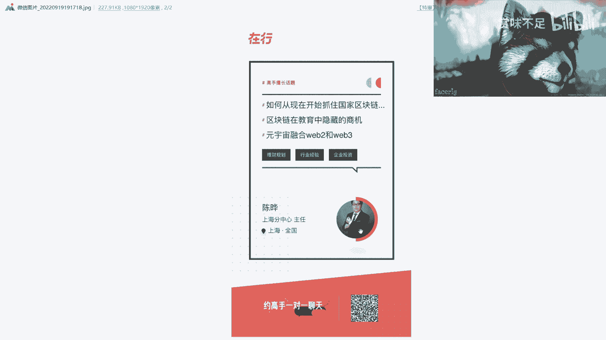

看看能不能扫得到啊。啊，可以可以这样就可以了。对，大家可以在在行在行上面可以找到我好吧，在在行上面可以找到我。然后呢，我现在是开了这么三个主题，一个是如何抓住国家区块链一个新基建的一个发展。

第二个呢是在教育当中隐藏的一个商机啊，第三个呢是元宇宙融合8跟W3啊，这么三个。然后呢我简单这个这个介绍一下，就第一个呢可能是从新基建，就中国这么一个国家切入点来讲的啊。

包括就是说我后面那个免费的课程里面，我相信就是我我我也会那个就是搞一些就在做一些这个政策相关的啊，因为有很多人其实对政策其实并不了解，就他们可能更多的是哎我今天到道听途说，对吧？这里怎么样，那里怎么样。

对吧？就我觉得政策上面还是比较比较有说服力的啊，这是第一个第二个呢就是。😊，呃，那个交易当中隐藏商机。因为目前来讲呢就是呃关于这个商业闭环啊，其实有很多人你不要看他做。这个这个这个国内在做区块链。

但是其实你问他有哪些商业闭环的这个合适可去赚钱的。这种商业逻辑它是很难去回答你的啊，那这是第二个啊，就是教育当中，它其实隐藏了蛮多的一些这个这个固定商机的啊。第三个呢就是元宇宙融合we2跟3啊。

这个呢就可能我我们会从元宇宙啊，从2啊3啊，从区块链这几个角度大的角度去看啊，怎么结合你的比如说你所在的行业啊，对吧？你想创的业啊，或者你想做的公司啊，对吧等等等啊，所以基本上就这么个情况，好吧。

我后面反正看我时间吧，就每隔一两天我应该都会出一些这个免费的视频吧，好吧，这样子，然后围绕就是我们说的这个数藏啊啊2啊3啊，对吧？就是我不希望就是说大家嗯就是说听到这个东西。

就像很多人说听到元宇宙我就觉得是个骗局，对吧？就我觉得没必要就是正就是叫做正正确的啊真实的去理解这个东西就可以了啊，但而且我讲东西呢，就是就是大家也知道啊，就是工信部啊，人社部啊，教育部啊。

这个国家一些标准啊，也是我参与制定的啊，但是呢我讲这些东西呢就是啊我也不怕得罪他们，对吧？就该怎么讲怎么讲，就比如说有些东西就是忽悠人的那肯定就是忽悠人的对吧？好吧，OK那么。😊，嗯，反正大家看吧。

好吧，这个微博上都找得到我，你们要想加我微信的，你们私信跟我讲。😊，好吧，那么先这样，后面我会时不时的再更新一些这个视频。

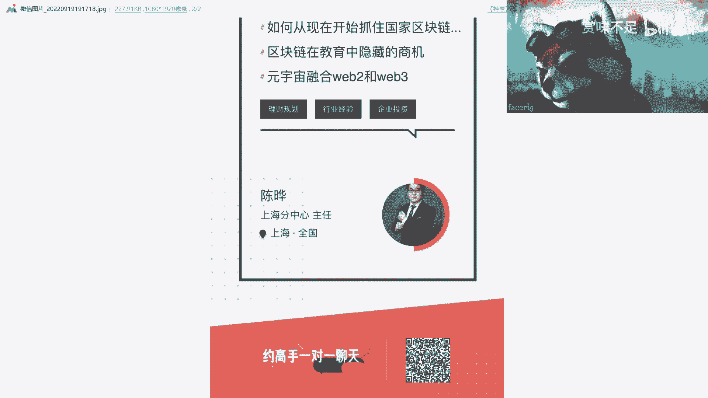