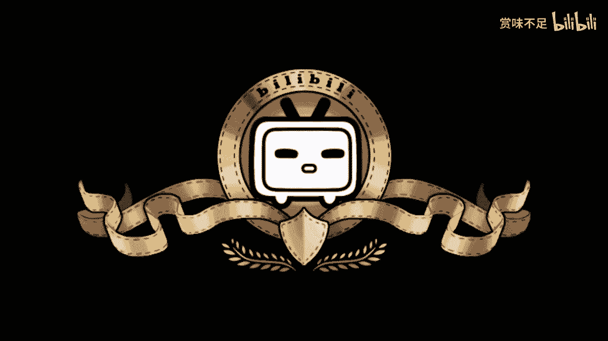

# 赏味区块链——游戏行业+区块链（不含token） - P1 - 赏味不足 - BV19e4y127Dk

啊大家好呀，我最近实在太忙了，然后就更新的比较慢了，然后这个接下来肯定就可能更忙，因为我一号要去飞海南了，海南这边呃，给那个海南政府这边会做几天的，这个关于元宇宙啊啊NFT啊，这个数字藏品啊对吧。

包括区块链啊这个相关的一些培训啊，有一说一啊，我真的是觉得我在这个政府层面这个讲解，我也不知道，跟web3我也算做了很大贡献啊，然后另外一方面呢，就是说这个最近大家也都知道，我也提一下。

因为ALMASK收购了twitter对吧，然后那个深圳还有香港这边呢也出呃，出台了相关的，比如像NFT的一些怎么说呢，是规范吧，好吧，大家有兴趣可以看一下，回头我这个视频会单独在做。

因为今天这个内容呢我之前就做好了，虽然我今天也不是很想讲这个内容，但也没办法对吧，呃是这样子的，就是我呢会把一些行业再加进来，那么这一期呢我是打算讲一下游戏跟区块链啊。

当然这个token呢在这个地方我写了，就单独再写一期啊，就不再放在一起了好吧，然后呃，游戏呢其实跟区块链结合也是比较天然的啊，首先在这个地方是这样子的，我首先写的呢就是并不是一个炼，有什么意思呢。

就是说呃我更想去讲的是一个web2的一个产品，但是用的是用的是web3上面的一些数据啊，那么简单来讲，就比如说twitter，它是支持在呃ISRAM上面去使用，那个以太坊上面资产，然后来作为头像的对吧。

那我相信就是说头像只是第一步嘛，那他后面比如像twitter也宣布了，就是说可以支持NFT的一些交易，对不对，好，那么呃所以说呢在这个地方，我觉得就是说纯5B3的应用，我个人啊觉得就是说也比较成熟了啊。

或者说能探索的呢，其实呃他这个模式也比较多了啊，所以说我会把它放在这个web2上面啊，那么我们先来看，就说像头号玩家，头号玩家里面呢其实有绿洲对吧，大家可以看一下，就忘记绿洲是什么的。

回头可以再去重温一下电影啊，其实绿洲里面呢它就是无数个元宇宙对吧，就是大家在电影里面其实可以看到嘛对吧，就是比如说啊这个主角对吧，在游戏A对吧，游戏B游戏C啊，那么呃有很多人呢。

他是沉浸于这个游戏的画面啊，包括主角的一些这个体感啊，包括VR对吧，但其实呢它的本质呢我觉得不是在这个地方，而是在于说你们会发现在头号玩家里面，他有一个点是非常的注重的啊，注重就是说呃。

这个主角从无论他在哪个元宇宙里面，他的身份，他的资产，他的数据其实是可以继承的，就你会发现他比如说呃，你可以去重温一下电影啊，就他在里面，比如说他的一些金钱啊，金币啊对吧，包括他这些形象啊。

虽然就是说不同的宇宙里面，就是你比如说在一个怪兽元宇宙里面，你总不能给他弄一个奥特曼出来对吧，你比如说在一个原始部落里面，你总不能给他弄一个这个这个叫什么，就是未来科技能给出来。

就是说它会符合这个元宇宙里面的一些背景，但是他的一些资产啊，数据啊，其实是可以那个啊继承的啊，那么这一个呢其实是叫做区块链，在未来尤其是元宇宙层面啊，就非常注重重要的一个方面啊。

包括今天我在跟那个山东这边啊，这个相关的呃产知识产权的这个领导沟通时候，我也提到了这个点啊，就是说元宇宙是非常的重要的啊，那么那么接下来呢还有几个关键点啊，第二个第一个关键点呢就是游戏道具。

就是呃本质上来讲，游戏道具是一个非常天然的可以使用token啊，不是并不能说token，就是，而是说使用智能合约而来生成的这么一个东西，因为呃本质上来讲NFT也好，NF2也好啊，游戏道具也好啊B也好。

它都是token啊，因为我们从技术角度来讲，你不能对吧，你不能说BROCKCHAIN这个词啊，这个不好对吧，那他都叫token对吧，好，那么所以说呢其实游戏道具呢，本质上它就是一个这个特殊的一个协议。

所引申出来的这么一个token啊，那么这个token呢我们说道具啊，他可以从攻略上获取，它也可以从联盟链上获取啊，我觉得这个都是可以的，就是就是我其实不是非常的，这个就是我觉得九一开吧对吧。

就一乘它其实是一个纯5F3的生态啊，那么就说啊九成呢，我可能会觉得是一个这个V82啊，就是WEY比较成熟的这种产业啊，去引用啊链上的一些数据，我不管他是联盟链还是公链啊，这并不重要啊。

呃第三个就是自我创造对吧，自我创造创造，那么在游戏里面呢，其实它有个很天然的一个东西，就是你其实游戏更贴近于现代元宇宙对吧，那么在游戏里面我们举个例子，比如说你有很多人是这个沉迷于游戏，捏脸的对吧。

像之前那个叫老头环啊，老头环老头环里面的大家都沉迷于捏脸对吧，包括那个那个巫师三对吧，也是啊，那你每个人捏出来的脸不一样吧对吧，就算一样，他也不可能完全一样对吧，那其实每个人捏出来的脸。

其实都是可以是一个NFT啊，我们也可以叫数字新闻创啊，这个都可以，当然现在生态可能也不是那么健全啊，但是我们举个例子嘛，就比如说以后推特越来越开放了对吧，那推特上可以很多的一些比如说回复啊。

like啊对吧，或者其他的一些东西啊，说不定就直接可以铸成NFT对吧，然后上open c是吧，那我觉得呃游戏你比如捏脸啊，游戏的视频啊，游戏截图啊，其实都可以对吧，那比如说我今天玩任何一个游戏。

哎这个游戏我觉得里面这个画面特别好对吧，然后比如说我打一个篮球足球对吧，我觉得这个team啊这个组合特别好，那每个人都不一样啊对吧，就像就像我刚刚说的，就算完全一样呃，他就算一样。

他也不可能完全一样对吧，所以说呢其实就是就是随着这个时间推移，随着所谓的基础建设的这个完善，其实后面就是UGC嘛，就是用户可以慢慢慢慢去形成整个生态，那我们说呃其实在这个地方呢。

就是我我们说嘛就说结合token他，我就放下一期对吧，因为你会发现嘛，就我们以前也一直说，就是说呃区块链分成有必区块链，无必区块链对吧，就你会发现无必区块链，他只能就是他可能只只有这个板块板块了啊。

他不可能再往下走了，但是其实这些板块呢，你说他有往下那个那个走的那个潜力嘛对吧，他其实有很大的潜力，你就比如说游戏视频游戏截图对吧，token啊变成了那个NFT对吧，然后DIY的人物也变成NFT。

那我们再往下想啊，我们比如说这个token里面经济模型是什么对吧，那这个token是不是可以交易对吧，那这些就是说呃游戏的迭代过程当中，这些token相互之间是怎么个那个迭代对吧。

是兑换呢还是怎么样对吧，那其实这些就包括就是说，虽然这个token是我从web2的游戏里面生成的，但是这个token我也可以让他上攻略啊对吧，那上路攻略之后，其实他就融入了web3的生态，对不对。

其实这些呢其实就往后还有很大的一些，就可讲的东西啊，但是就是说你会发现就是如果我不去讲token，那其实他没什么可以讲的对吧，就是对于游戏而言，他要做的是什么呢，就是想就是两无非就两点。

一点是从游戏里面创造NFT去上面，一种是从链上去获取对应的东西去放入游戏，对啊，这些都是可以的，那包括我们说现在那个比较火的啊，像之前比较火的crypto punk是吧，无聊源啊，那个黑猫啊对吧等等等。

那呃你中心化的游戏，你也可以从联盟链上或者公链上面，去获取对应的这个资产啊，然后呢你说哎我放到游戏里面，那其实在商业层面这个逻辑也很简单，就是如果我们说今天啊你拥有这个token，不是你拥有这个形象。

我不管你是联盟链还是攻略上面拥有对吧，那你就可以在这个游戏里面，在这个开放世界里面，你拥有一个独一无二的一个头像啊，那你在这个世界里人家就知道哦，你这个人哎特别厉害对吧，你可能头像是有光环的对吧。

那还有一种就是什么呢，你说哎我没有资产，但是我也想要他那个可不可以啊，我觉得在游戏里面也可以，那怎么弄呢，你就直接到攻略上面去获取，但是由于你不拥有这个资产，那怎么办呢，你可以付钱对吧。

你比如说通过合约啊，你有80%的这个这个这个付费，你是给出这个叫做拥有者的，那不叫拥有者吧，创造者对吧，20%的里面的付费，给到目前的这个拥有者，那就OK了，整个产业整个这个生态就非常的健全对吧。

所以说呢就是我是觉得呢，就是说呃随着埃隆马斯克收购twitter，随着整个基础建设的一个发展，呃整个web2的东西，因为推特也是个web2的产品嘛对吧，你整个web2这边的产品去引用web3。

无论是获取web3还是还是创造在上，web3这个生态才是越来越大了啊，而不是说我们所说的纯web3，我嗯我看好纯web3web3，但是纯web3的生态，很有可能在未来就是那么一个很小的一个。

一个一个一个生态啊，呃OK那么就就这一期我就讲到这儿好吗，后面的话我会再讲先加一期游戏加呃，就就区块链加token能啊，然后后面我还会再去讲一下，就这次收购推特，包括后面还有其他的各种各样的一些事情。

