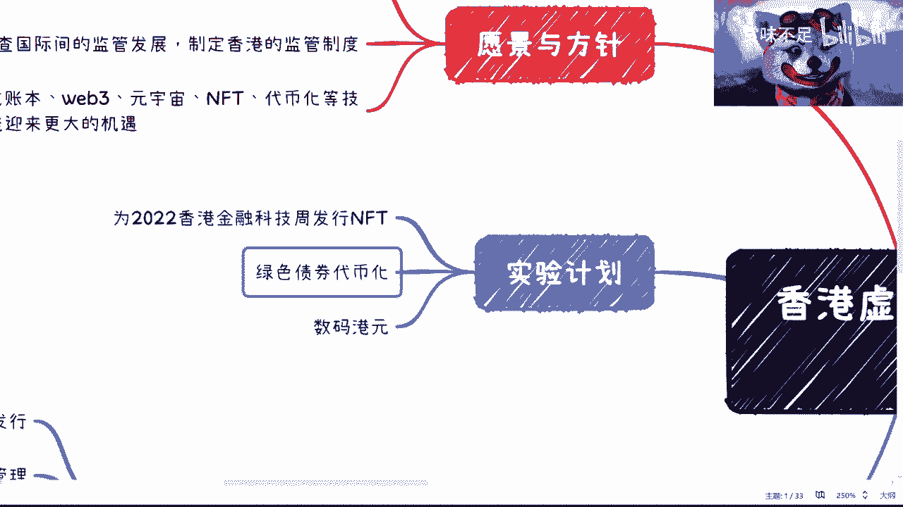

# 赏味区块链——简述香港虚拟资产发展的政策宣言 - P1 - 赏味不足 - BV1Gg41167Nq

啊好啊，大家好，因为这两天在海南开会，所以就可能这个更新了晚了晚了一点，然后声音因为我也没带那个专门的设备出来，所以这个声音可能有点空洞啊，嗯这次呢主要还是来讲一下。

就是这两天这个香港虚拟资产发展的这个，政策宣言，呃，首先呢这个源文件大家网上都能看得到啊，其次呢我是觉得呃香港的这次宣言呢，嗯总体来讲啊，我觉得我没有很多人那么乐观，但也没有很多人像很多人一样说啊。

这个这个说什么割韭菜聚集地对吧，怎么样，呃我觉得是这样子的，首先呢香港的这个行为啊，有一点做的很好的，是什么呢，就是他清清楚楚能告诉你能做什么，不能做什么，不是说藏着掖着啊。

所以说大家可以从整个的文件当中可以看到啊，就是就该叫B的，叫B对吧，该叫NFT的，就叫NFT，别去搞那些有的没的对吧，就不像有些时候说哎呀就是这个想做吧，好像又又不敢做对吧。

这个做的边界在什么地方不清楚啊，啊OK那我们继续往下看啊，首先先看这个文件里面所提到的愿景与方针啊，我们可以看的很清楚，首先它的整体的这个目标，都是为了所谓的那个虚拟资产啊，都叫做虚拟虚拟资产。

那么我们会看到比如说法律的监管啊对吧，包括这个监管的国际的监管制度啊，啊分布式这边账本等等等，各项技术迎来更大的机遇啊，那个这个是愿景跟方针，好那么我们来看这里啊，啊这边提到几个一个叫稳定币对吧。

就像我说的，就是说直接一点对吧，就是稳定B啊，那么稳定B这边呢我觉得就是哎点错了，好稳定地，这边呢我们能看到啊，就是当监管的，由这个政府这边所出现出面的，主导的这么一个稳定币，那么在这里面也没有写很多。

因为稳定币其实是一个很大的一个，一个一个话题嘛，那么这里呢也是恰到好处啊，这个进一步后续再说，那么代币化资产产权呢，我们来看一下啊，对代币化资产和虚拟呃智能合约的合法性不好，开放态度对吧。

那么其实这个你说代币化资产产权，其实就等于告诉大家说，OK我们的这个以前一直所提到的，打个比方啊，提到的这个叫呃资产通证化，那个那个对资产通证化对吧，或者说资产证券化对吧，有很多。

那就是有可以试的这么一个方向对吧，或者说我觉得我觉得再退1万步来讲，可能就是能够合法合规的，或者在一定框框下面去做ISO对吧，其实也不是不行，在我以前的视频里面，我就说过，我说我是支持SU的，只不过啊。

那个视频好像被被被被各个平台下架了，我也很焦虑啊，然后呢就这个地方比如说投资对吧，那投资者呢这个地方大家也能看到，比如说啊对ETF保持欢迎啊对吧，今天会展开公关咨询啊啊等等等等等。

那么这个也是一种开放的态度，那么监管呢我们能够看到啊，比如说明确清晰的全监管框架，近期开展虚拟资产的制度探索对吧，这个这些对吧，这个因为你其实最重要的还是监管，其实是最重要的还是监管。

你一旦有很好的监管的框架，其实后面有很多东西就比较好做了，那么我们来看啊，就是这个这个它最核心的实验对吧，在这地方写的很清楚，一个是什么呢，为2022香港金融科技周发行NT，第二个呢是绿色债券代币优化。

第三个是那个数码港元对吧，那那个大家不清楚的呢，可以去看一下那个原文件啊，那么在源文件里面写的很清楚，就是第一个为2022年，香港金融科技周发行MVP，他在文件里面写得很清楚，不单单会有单纯的赋能。

更多的会让参与者能够沉浸在，或者说能够进一步的进入虚拟空间对吧，或者说有这种沉浸感啊，或者说有这种这种这种未来的一些权益，那么在这上面呢，我之前这个大胆猜测啊，就觉得就是说可能这个NT是一个。

在虚拟空间里面的一个虚拟人啊，然后呢这个虚拟人呢就是对应每一个人，过去独一无二的这个NT啊，这是一种可能性，那还有一种可能性呢，就是说他可能不是一个虚拟人，但是呃他可能是在这个已有的或者。

未来的元宇宙里面，会占有一定的这种定那个定位，同时呢，它可能也会跟一定这种金融上面会做挂钩，那当然我比较偏向于第一种啊，因为毕竟在文件里面写说啊，有这种虚拟的这种体验感，那么我是觉得单纯。

如果到时候这个香港弄一个，你说ARVR，我个人觉得太low而不太现实，我觉得更多的就是说呃他可以弄啊，他也可以不弄，但是呢就是就算他弄了ARVR，那么也会让这些参与者直接在ARBI里面。

能够看到或者使用到自己的这个虚拟角色啊，然后这个角色就已经在这之前铸成NFT了，好那当然其实在文件里面写的很清楚，就是如果他没有钱包，它是可以用邮箱啊存保存一些地址，然后最终用钱包去呃。

在那个地就是在那个地址里面，这个导到那个钱包里面啊，其实也是可以的，那么这是第一个，第二个呢绿色债券的代币化，那我觉得这一个呢其实是一个就像我说的，就是说这个东西很好，很直接对吧。

我不管他今天是绿色债券代币画还是以后，比如说什么商超积分代币化，还是什么股权代币化，这不重要，重要的是他走出第一步好，那么这个其实是有一个标杆意义的，也就是说代壁画之后接下来怎么监管。

代币化之后怎么去运作，包括代表了之后怎么交易对吧，那这些其实就是看香港接下来怎么来，做这件事情，那么第三个其实我觉得这更直接了，就就我们之前课程，就我之前分享那个视频里面也提到过。

stable coin对吧，那这个stable coin我相信很简单，首先它既然叫稳定B，那么它一定对标的就是USDT，想都不用想的对吧，而且他要进入的是web3，那那就是对标的是原子体系。

但是好从逻辑上来讲，我觉得香港虽然代表对标微博三，但是他不可能说我走的路线就是USDT这个路线，不可能啊，呃从目前的整个宣言上面来看，很简单，就这个代币这个那个数字港元。

他的那个前期或者大部分的一个时间，应该还是会跟自己啊这个本本土的，比如说NFT啊，或者来说这个证券化之后的一些资产做挂钩，那么从这些这个这个行业慢慢慢慢，同步的去渗透web3，我觉得是这么个逻辑。

而不是说像很多人觉得说啊，这个要跟原SD对抗了对吧，或者怎么样，其实并不是啊，所以我觉得这个其实是这样子的，那么嗯那么就这个事情来讲呢，我觉得我的态度呢就是说让子弹飞一会儿，因为什么呢。

因为呃宣言是个就是就像我一开始说的宣言，这件事情呢好是好，在它概念很清楚，就香港没有任何的藏着掖着啊，但是呢没有必要过分解读，因为还是那句话，前两天前两天这个微信群对吧，朋友圈对吧。

就搞得好像这个大家都欢天喜地对吧，然后怎么样怎么样，我觉得这个就是属于过分解读是吧，所有的事情呢你得慢慢慢慢去看，包括今天出的政策，331好，332对吧，嗯这个金融牌照对吧，3000万，然后是。

哎呀稍等啊，我来查一下，我们我那个朋友发给我的332，是怎么说来着的，求大妈点，啊332对吧，3000万3啊，3313千万美金对吧，3000页的申请材料，一到两年的时间对吧，331啊。

这个情况呢其实让我有点想到STO了，不过我之所以没有这个之前没有出一个视频，出STO呢，因为STO其实是一个很小的插曲，但是之前其实STO那个时候盛行的时候，也有很多人做T。

当然那个时候哎今天我们还在开玩笑，就说呃这个最赚这个最赚钱的，最赚钱的，到最后还是律师啊，大大改行做律师去算了，但不管怎么样吧，我觉得就是就我这两天的这个这个叫什么，就是正好在做这个事啊，我就结合一下。

就是呃我还是那句话，就是说香港那肯定会有很大发展，因为他这个宣言都已经写出来了，那么大陆这边呢我是觉得唯一也不是唯一吧，就是可能性比较高的还是海南啊，但是呢就看海南接下来怎么做啊。

那么我这两天反正也尽可能的多吧，跟这边的工信厅啊，里面领导啊多聊聊啊，看看情况好，那么这一期就先到这吧好吧，大家感兴趣的自己去查一下全文啊。

