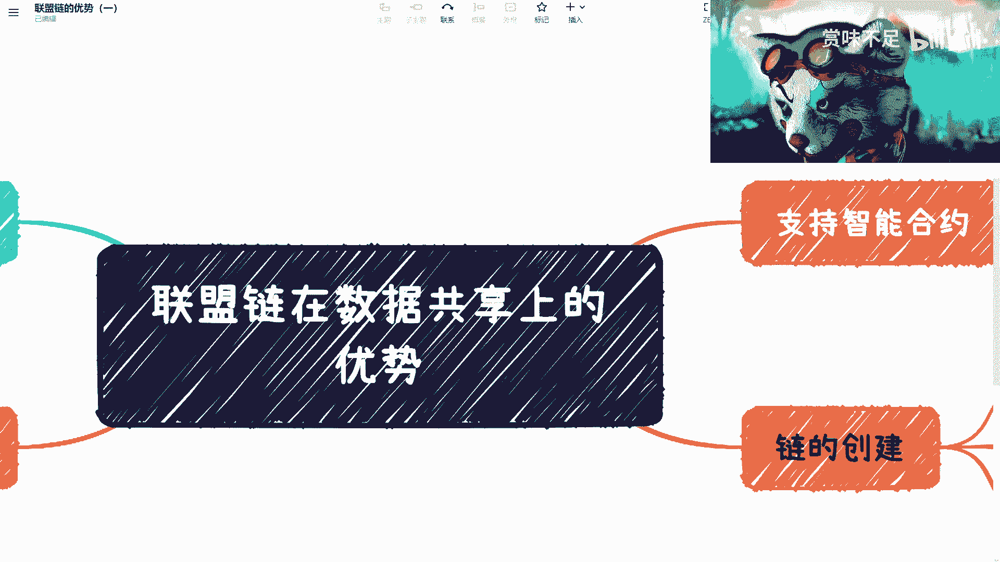
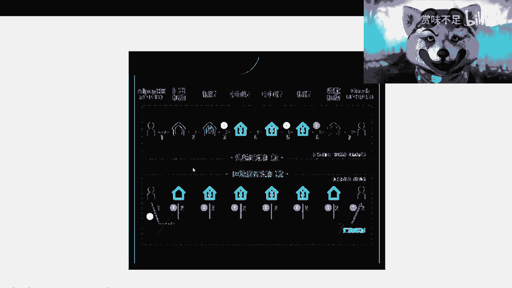
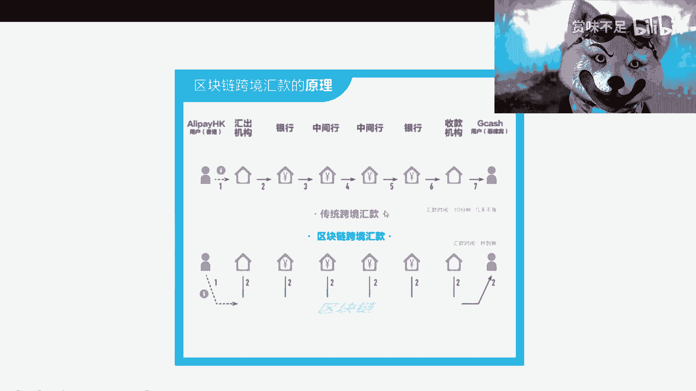
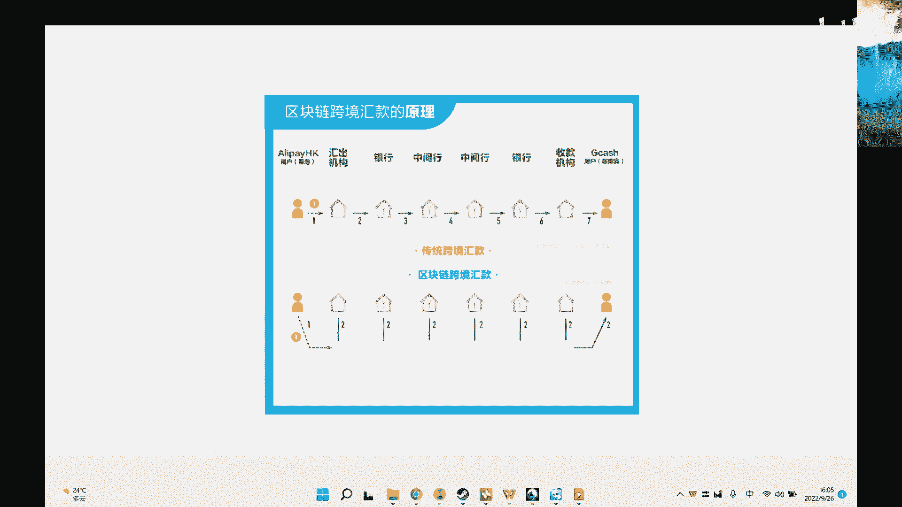

# 赏味区块链——联盟链在共享数据上的优势 - P1 - 赏味不足 - BV1Vd4y1z7bR

好今天来给大家讲这个联盟链，在就联盟链我会拆分出几期啊，然后主要是这一期呢主要是讲这个联盟链哦，联盟链上面这个数据共享的这么一个点啊，唉不是很喜欢，我还是用这个，这个就喜欢多人，就是啊。

我们我这一期呢主要是先来讲一下这个联盟链，数据共享上的一个优势啊，啊然后在这个上面我们可以看一下啊，首先我在这个地方写了几个啊，一个是呃隐私保护，那隐私保护这个地方呢就是说我们其实在以往的过程当中呢。

其实都是可以用比如说呃这种结果的方式，或者其他的这种中心化的技术方式来做数据的这么一个共享，那么在区块链这边呢，其实我们可以说啊，就一方面啊，你可以用a，你可以用比如说像那个边缘计算a啊，边缘，啊计算。

比如像那个零知识证明啊对吧，这是证明对吧，然后像那个呃联盟练的联盟链的一些这个全全新的保护啊，分组对啊，那我们说我们可以通过各种各样方式啊，来做这么一个数据的一个这个保护啊。

那么这个是相对中心化来讲会来的更可信，因为中心化现在你说呃它的一个信任程度肯定是有的，但是呢中心化现在就相对啊联盟链，联盟链相对这个中心化来讲的话呢，他会更呃通过这个边缘计算零知识证明啊。

来做这个数据上的一个共享啊，那么共享的时候呢相当于就是说，呃我既能在保证自己的这个隐私数据的情况下面，又能够啊这个做到这个数据共享的这么一层啊，同时让使用我数据的这些人或者机构都能够更好的去啊。

达到就是说这个数据共享的这么一个作用，那首先这第一个第二个就是说比纯的中心化这个更可信，那在这个地方也提到了，就在链上的数据呢，我们是可以可追溯啊，那么这些是我们说中心化的这些系统相对不可比拟的对吧。

因为你中心化现在也可以追溯啊，也没有错，也可以准，确有准确性，但是它的篡改这件事情呢，它是就是可信程度是那个打问号的啊，那么我们说呃，这个并不就我们现在来说这个联盟链的这个数这个问题啊。

并不是说联盟链当下就一定能做到这么好的一个效果，但是呢我们要来这个说，就说联盟链最终啊他能达到怎么样的一个一个一个一个目标，同时呢它又比中心化的系统就是啊有哪些优势啊，那么这个是两点啊。

那么第三个我们在这个地方，第三个就是说它是天然支持智能合约的对吧，因为我们说啊就在智能合约未来整个的一，个业务流程当中，他一定会把一就是部分的这个业务逻辑。

和它的这个交易跟金钱相关的这个逻辑写在智能合约里面对吧，那么我们说啊在智能合约这个上面，它更多的像什么呢，更多的是一个啊这个呃不同于现在的，比如说啊合同啊，就就就这个商业合同啊。

商业合同以及我们说这个系统的一些约束啊，就比如说我们今天有一个合作啊，这个合作呢是呃我们双方是签署了商业合同，比如说我我要给你多少钱，几月几号给你多少钱对吧，那系统当中呢也会有一些约束对吧，就比如说。

我今天给了你个什么系统对吧，那你在这个系统里面，还是那个叫做访问者权限对吧，那么目前呢其实只有这两个，一个是合同，一个是那个系统约束，那除了这两个以外呢，我们后面啊。

在未来我们可以结合这个数字人民币来做一定的这个智能合约，那么在这上面呢，就是说我们即还是要签这个商业合同，还是要有该有一些约束，有一些约束，但是与此同时呢，我们把比如说一些很核心的，就说几月几号对吧。

大家约定时间，约定的金额写到智能，合约里面，那这样的话呢，就是说我们说既然要写到智能合约里面，那么它自然而然就需要有个天然的一个载体，这个载体就是目前的联盟链或者未来的一个公链，那么这个是智能合约。

那么还有就是说这个关于这个链的创建对吧，比如说我们可以是国家来创建的这个链啊，可以是垂直领域，垂直领域这个大家比如说这个行业一起来创造的这个面，也可以是比如说龙头企业啊来创造的这个链对吧。

那么在整个这个过程当中，我们说相比中心化来讲，它的这个优势啊，可能有这么一些，那么我在这个地方呢还写了，还有一个这个ppt啊，大家可以看一下，啊稍等我把它切过来啊，是打不p正。

那这个我们来看一下啊，就是。

哦好那这个呢是当时哦这个图怎么这样呀呀。

唉不行不行不行不行不行不行不行不行，我不需要他gf gf的图一塌糊涂，然后等一下我换一下。

换一下，绝了，真的是人就多骂点点嗯，窗口对吧，然后是演示好，这样就好了，就是说呃当时比如说支付宝有这么一个跨境的业务对吧，我们首先来看啊，中心化的这么一个传输，它是一个串行的传输对吧，就是我今天汇笔款。

我打打打打打过来到用户对吧，汇笔款，那我练的传输是什么呢，就是它首先呢会把这个机构啊，银行啊，中间行啊，有些渠道方有些黄，甚至有些黄牛对吧，这不重要啊，我们说这些参与方只要是联盟链可允许的。

都把它放到链上，那么放到链上的时候呢，就是当我今天转出笔钱的时候呢，我相对而言啊，就是，呃只要链上数据有了，那么比如说机构啊，银行啊，中间行啊，黄牛啊，或者在一些渠道方，它是同一时间能看到这笔消息的啊。

这笔这笔金额的消息的，那么这样的话呢整个那个会出期会出时间就会比较快啊，首先这第一点啊，这是第一点，第二点是我们说在整个的一个这个运行过程当中啊，我们说所有的这种串行的流程。

它都会面临一个很大的问题是什么呢，就是这个串行流程往往就是比如说我今天会出十块钱对吧，那会出机构银行到三可能还是十块钱啊，到四这个地方呢，哎我们可，能犹豫一些人为的因素。

或者由于一些就是有人就是要来要来作恶对吧，把这个十块钱改成了五块钱，那么这个时候呢比如说后面的中间行银行收款机构，他就知道哦，这个人会出了五块钱对吧，那么整个这个链条就断了啊。

那么当这个就是人比如说收款及收款的这些，这个人他发现诶我在菲律宾啊，我说诶我怎么只收到五块钱，明明我的朋友是给我汇了十块钱对吧，然后呢他开始往前追溯，直到追溯到这个中间行哦，发现可能问题在这个地方对吧。

但是呢这，些问题，你说目前啊通过合同也好，通过一些票据也好，他能不能达到一个就是说防篡改，或者说达到一个叫做风险前置的这么一个效果，它很难，但是呢他也的确受到了法律约束，这没有错。

但是你要把它做到做成风险前置，这很难对吧，也就是说有人出现问题啊，他要开始往前追溯，那练这边呢是什么呢，它主要是规避了两个问题，第一个问题就是说当我今天有笔钱到到这上面，大家说这啊。

那这个时候不是当中的某一个机构或者某两个机构在那，边开口信口开河，就说唉这个人这个不是给十块钱，给五块钱，就单纯的一些机构，或者来说有一定数量的机构，它不可能去篡改这个数据，首先是第一点。

第二点是这个数据本身上来了之后啊，那么所有的这些机构是同一时间看到这个数据的，那么也就意味着什么呢，也就意味着就是说虽然练他不能保证完全数据不被篡改。

但是它篡改的成本会比上面的这种中心化的串行串行的方式来得高哦，而成本来的高的高的高，非常的高啊，那么这个时候呢就是说我们说这个链本身它其实主，要做到的就是这么个作用，那么在这上面呢。

其实我们说在整个系统运作过程当中，其实还有就是啊就是很多细节问题，就比如说我们怎么保证这个数上链之前的数据是准确的对吧，我们怎么保证这个链啊，它的共识是比较合理的对吧。

我们又怎么保证这个链子这个效率是比较高的，对等等等等等，其实它有很多细节，但这个不在我们今天说的这个数据共享的这个问题里面啊，好那么我们往下来看，这里还给了一个啊，就是啊你比如说时间对吧。

就像我们刚刚说的，你串行的时间肯定是慢的啊，毫无疑问，那练相对还是比较快的对吧，因为它是一个分布式节点嘛，就节点上面同时都能看到对吧，第二就是说呃跨境业务，那跨境业务呢在这个地方。

比如说晚十点后转账要等到次人，为什么呢，是因为它需要有一个串行的传输对吧，那这个时候呢，你你练这边由于它更高效的或者更可信的去做了这个数据的共享，那么它有这么一个优势对吧，来源于哪里呢。

来源于大家的一个就是就是创新的一个传输，那如果你现在用了一个链，你的整个的数据是同一时间在这个链上所有的节点都能够看到的话，那么呃这个钱可能丢这件事情呢，它是一个安全性的问题啊，安全这些问题。

那我们说在这个上面呢，就是说它不是完全的安全，但是呢它相对中心化会来的安全不少啊，那么透明性也是一样的，就是说我们很，我们很多时候这个时候是需要就是说啊这个数据要去公开，或者我来问你要数据，你来给我。

银行方也是链上节点对吧，然后比如说那个中间好像也是链上节点，那大家同意谁就能知道哦，这个这笔账到底是多少钱对吧，甚至是多少时间，几点几分，那个要转账的，几点几分转出去的对吧，那等等等。

那么这个呢其实是呃不我们在这个地方，说啊就是它不仅仅是啊就是跨境跨境支付这么一个应用场景，所有的串行的那种业务场景，都可以触类旁通的放到这么一个这个区块链的这种联盟链的，数据共享的场景里面哦。

所以这个其实是未来联盟链希望达到的一个，我们叫我们现在可以说是一个理想化的效果啊，但是目前因为大家怎么说呢，就是还在这个呃萌芽当中嘛对吧，还在打基础当中，就是新基建过程当中，所以大家可能很难去看到哦。

这个效果到底怎么样子，但是未来最终是希望达成这么一个啊效果好吧，那么这，个数据共享，我们就先讲到这儿啊，后面我会再把其他的一些优势啊，各个方面我把它拆开来啊去讲，ok然后这个地方就接下来就要打广告了啊。

稍等啊。

啊打广告，那打广告呢就是这样子啊，首先呢是我们说在行啊。

在杭这边呢大家可以有需要有咨询的呢，可以找我啊，就是就是你比如说啊国家新基建啦对吧，这个国家新基建啊对吧，这些啊，就大家都可以找我啊，这个二维码可以扫，那另外一方面呢就是这个，这个知识星球啊。

知识星球呢大家也是一样的，就是其实两个价格我设置都一样的啊，然后知识星球呢大家可以加入，加入之后呢可以随时问一些问题啊，然后我呢也会时不时的往这里面放一些各种各样的信息，好吧。

也希望大家能够就是嗯在这么一个玩，就是并不是纯web 3的这么一个区块链世界里面，大家能够共同进步，共同努力。

ok那这期就先到这。

