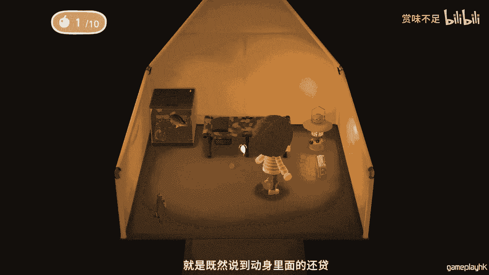
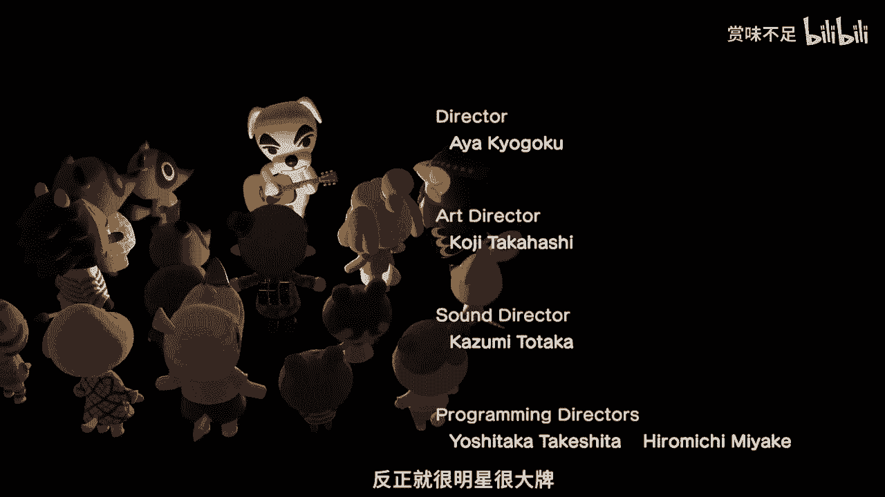

# 赏味知识集--为什么那么多人误会动森就是元宇宙---P1-202202211619---赏味不足--

## 概述

在本节课中，我们将探讨《动物森友会》这款游戏与“元宇宙”概念之间的关系。我们将通过分析《动物森友会》的游戏机制、经济系统和社交互动，来理解为什么许多人会将其视为元宇宙的雏形，并澄清两者之间的异同。

---

## 课程内容

### 1. 课程引入与内容规划 📋

从本期开始，我将制作一系列视频内容。这些内容主要分为三大板块：第一板块涉及区块链、NFT和元宇宙；第二板块是影视类推荐；第三板块是游戏类，侧重于直播与总结。

本期视频旨在讨论《动物森友会》与元宇宙的关系。希望通过这个视频，大家既能对《动物森友会》有直接了解，也能借此对元宇宙概念有一个直观的认识。

---

### 2. 理解概念的挑战与切入点 🧩

元宇宙是一个虚拟概念。为了让大众统一认知，我们需要一个众所周知的参照物来帮助理解。这就好比向一个没看过《七龙珠》的人解释“超级赛亚人”，缺乏共同认知基础会导致沟通困难。这是目前解释元宇宙或其他抽象概念时面临的根本问题。

因此，我们选择《动物森友会》的宣传片作为切入点。

以下是宣传片内容摘要：
*   您将移居到一个时间缓慢流逝、自然富饶的无人岛。
*   岛的中央有服务处为您提供支援。
*   您会获得帐篷和一部特制手机，内含各种应用程序。
*   您可以收集材料，在服务处的作业台上DIY制作工具（如斧头）。
*   利用制作的道具获取新材料，解锁更多可DIY物品。
*   家具可放置在室内外，并可自由调整。
*   服务处会贩卖道具、收购物品，并鼓励玩家美化岛屿。
*   通过参与岛屿活动获取“里数”，可兑换特别物品或方程式。
*   游戏包含钓鱼、捕虫、种植花卉、制作花冠等活动。
*   使用撑杆跳杆子可越过河川。
*   吃过食物后，可以用铲子移植树木。
*   岛屿的风景会随时间（晴天、雨天）和季节改变。
*   支持最多四人本地同屏游玩，或最多八人线上联机游玩。

---

### 3. 初识《动物森友会》：印象与反差 🏝️

最初，我对这款游戏并不感兴趣。从宣传片看，它画风可爱，在日本属于“子供向”（面向儿童）内容，游戏评级为6岁以上。

其游戏性看似平淡：在游戏中重复类似现实生活的种地、造房、与NPC聊天等活动。对于许多成年人来说，这种玩法可能显得无聊且耗时。

然而，一个巨大的反差是：《动物森友会》目前是我游玩时间最长的游戏，约1100小时。这主要得益于疫情的影响，否则我可能很早就放弃了。

---

### 4. 游戏的“元宇宙”开端与劝退机制 💸

游戏开始时，你身处一座孤岛。我们可以将一台Switch主机及其上的岛屿理解为一个独立的“元宇宙”。你是岛上唯一的玩家村民，还有两个动物NPC陪伴。

游戏初期，玩家需要向NPC“狸克”贷款来扩建岛屿、升级房屋、建造坡道和桥梁。这引发了大量玩家的共鸣：在现实生活中打工已经很累，在游戏里居然还要打工还贷。

这种初期还贷阶段劝退了许多玩家，类似于其他一些游戏的硬核入门体验：
*   **《黑暗之魂》**：极高的难度直接劝退新手。
*   **《暗黑破坏神2：重制版》**：存在代际文化冲突。游戏有五个场景、三个难度，人物最高99级。但当玩家完成这些内容后，游戏才真正开始，这让许多人感到困惑。
*   **《怪物猎人》**：被玩家戏称为“猛汉传”。游戏体验并非玩家狩猎怪物，而是“怪物猎人”。游玩几十小时后，玩家进入打装备阶段；几百小时后，可能发现即使有“神装”仍会被怪物一击毙命；上千小时后，部分玩家才会“悟道”，认识到技术才是核心，一切道具都是浮云。

相比之下，《动物森友会》的画风和交互虽不硬核，但其初期的“还贷”阶段同样具有劝退效果。我个人很幸运，在游戏早期得到了网友的“经济援助”，跳过了这个枯燥的阶段。

---

### 5. 游戏内的经济系统：大头菜与多宇宙交易 🥬

既然提到还贷，就必然涉及如何在游戏中赚钱。

《动物森友会》有一个设计精妙的经济系统，核心是一种叫“大头菜”的硬通货。它构建了一套完整的经济体系：

**规则如下：**
*   一只名为“曹卖”的NPC（猪）每周日上岛，以随机价格出售大头菜。
*   每台主机（每个“元宇宙”）的大头菜买入价格都不同。
*   大头菜的生命周期只有七天，七天后会烂掉，只能低价出售。
*   玩家需要在七天内，找到商店收购价高于买入价的时机卖出，实现“低买高卖”。

这个规则引出了游戏最精髓的设计之一：**多宇宙（跨岛）交易**。
*   如果你的岛屿大头菜售价高，你可以去其他售价低的岛屿购买。
*   如果你的商店收购价低，你可以去其他收购价高的岛屿出售。

因此，在游戏热度高峰时，所有社交平台都充满了关于大头菜价格的讨论。玩家们排队访问那些收购价高的“热门岛屿”，甚至出现了专门的微信小程序来管理排队。这使得游戏从单机或展示类游戏，转变为一个充满社交和竞技属性的平台。

此外，大头菜还催生了点对点交易。如果玩家的大头菜即将过期又找不到高价收购的商店，可以用它来与其他玩家交换壁纸、稀有物品、鱼类或昆虫等。

---

### 6. 虚拟世界的构成：物品、建筑与社交 🏠

《动物森友会》的虚拟世界由以下元素构成：

**1. 建筑与居民：**
*   一个岛屿上，除了玩家，最多只能有9个动物居民（NPC）。要邀请新居民，必须让现有居民搬走。
*   这限定了每个“元宇宙”的NPC数量。

**2. 物品与自定义：**
*   游戏内有极其丰富的道具和家具，并且与许多其他游戏或动漫有联动。
*   玩家的服装（帽子、衣服等）和家居装饰（壁纸、吊灯、厨具等）都可以自由更换。
*   几乎所有物品都可以通过DIY进行改造和上色，让玩家打造具有个人风格的元宇宙。

**3. NPC交互：**
*   NPC动物拥有多种交互模式，让世界感觉更真实：
    *   索要物品。
    *   赠送礼物。
    *   对玩家的攻击行为表示不满并抱怨。
    *   抱怨岛上环境杂乱（影响岛屿评价）。
    *   因心情不好而提出搬家，玩家需要通过送礼、对话等方式挽留。

**4. 虚拟明星与文化：**
*   游戏内有一只名为“K.K.”的狗明星，它拥有自己的唱片和每周演唱会。
*   游戏的通关动画也是K.K.的演唱会。
*   游戏拥有完整的原声大碟（OST），音乐24小时不同，并且包含K.K.的专辑。
*   这创造了一个拥有自身文化和明星的、与现实割裂但又要素齐全的另一个世界。

---

### 7. 为何被误认为元宇宙？恐怖元素与官方态度 👻

许多人认为《动物森友会》是元宇宙，主要是因为它具备了一个虚拟世界应有的几乎所有元素：经济系统、社交互动、自定义内容、文化产出等。

有人可能会问，为什么不是《GTA》或《模拟人生》？
1.  **受众差异**：《动物森友会》的受众与当下热议元宇宙的人群可能有更多重合。
2.  **认知门槛**：看《动物森友会》宣传片几分钟就能大致理解其玩法，而《GTA》或《模拟人生》相对更硬核，概念更复杂。

此外，《动物森友会》玩家社区还利用游戏机制创作了大量“恐怖片”和怪谈内容，进一步丰富了其世界的可能性，这也符合一个完整“世界”应包含多元体验的特征。

然而，任天堂官方已明确表示，目前不会涉足元宇宙，因为他们“还看不懂”。这说明了关键一点：**一个成功的、具备世界感的游戏，并不自动等同于元宇宙。** 元宇宙的概念外延更广。

---

### 8. 总结与核心观点 💎

本节课我们一起学习了《动物森友会》与元宇宙的关联。

**核心总结如下：**
1.  **相似性**：《动物森友会》因其完整的经济体系（如`大头菜`交易）、深度的社交互动、高度的自定义自由以及内生的文化（如虚拟明星`K.K.`），构建了一个要素丰富的虚拟世界，这与元宇宙的某些特征相似。
2.  **差异性**：元宇宙不一定只是一个游戏，它是一个更宏大的、可能融合多种技术（如VR/AR）和生态的概念。任天堂的官方态度也表明，游戏成功与世界构建不等于就是元宇宙。
3.  **认知价值**：《动物森友会》可以作为一个优秀的参照物，帮助初学者更直观地理解元宇宙概念中关于“虚拟世界”、“经济系统”和“用户创造”等方面的内涵。

最后需要强调：**游戏只是当下更容易被理解和切入元宇宙概念的一个方式，但元宇宙的本质远不止于游戏。**