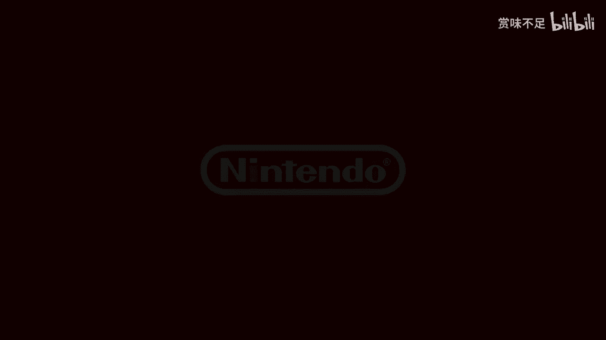
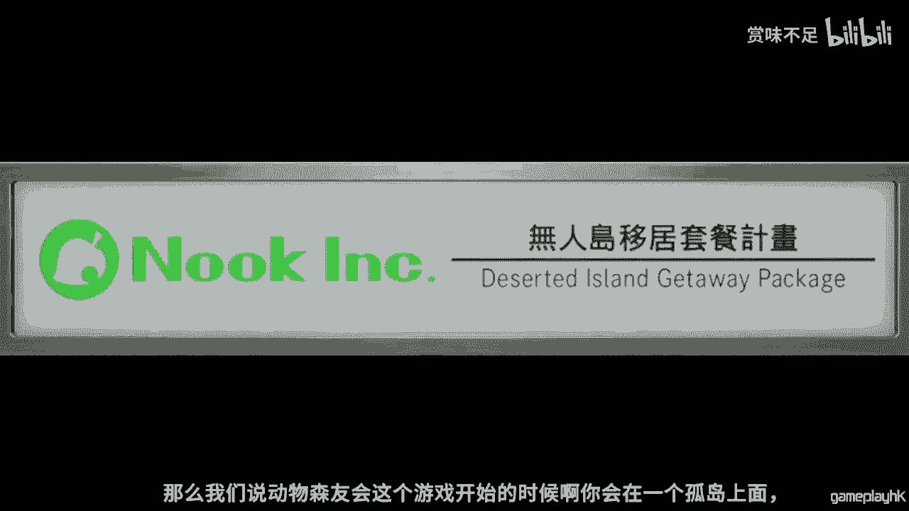
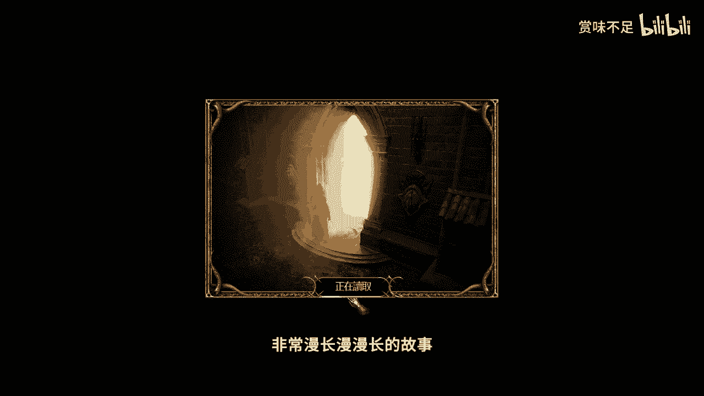
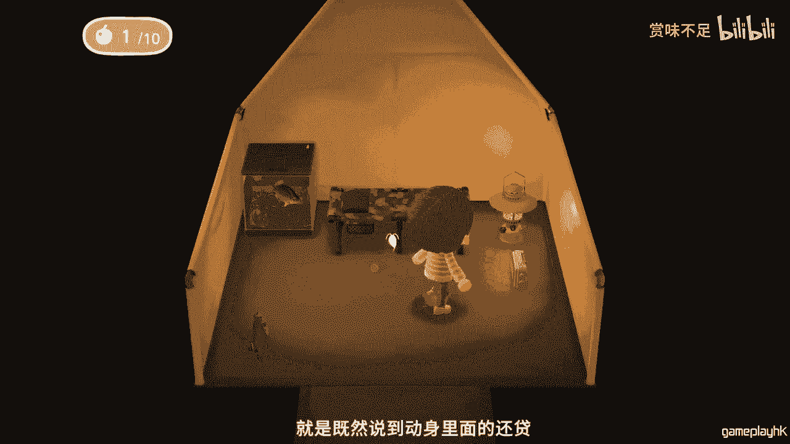
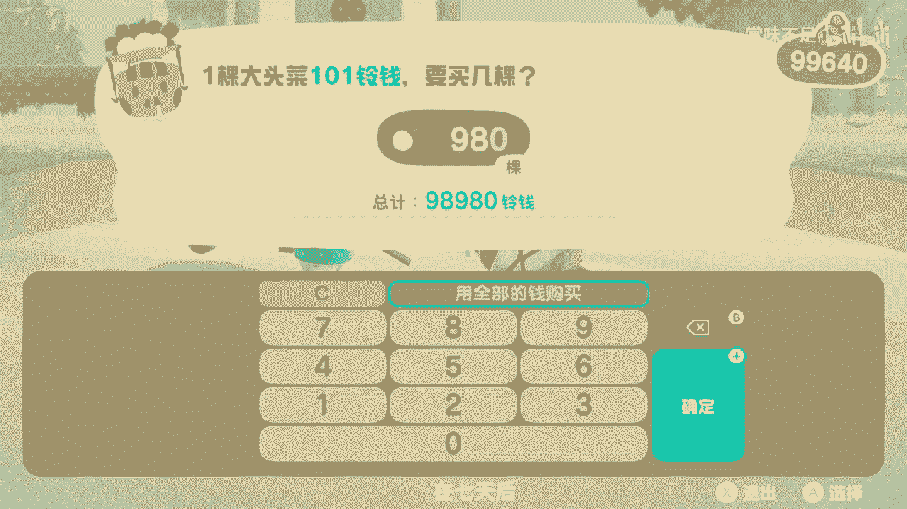
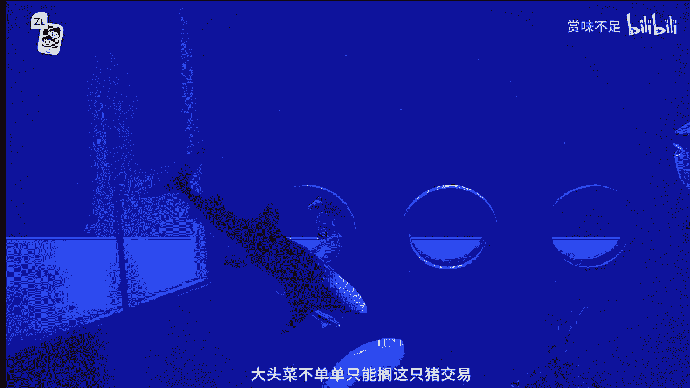
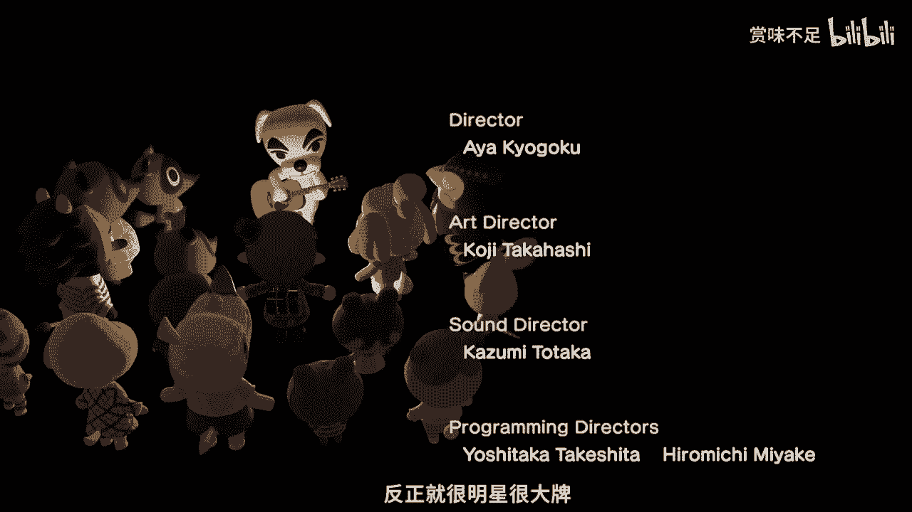
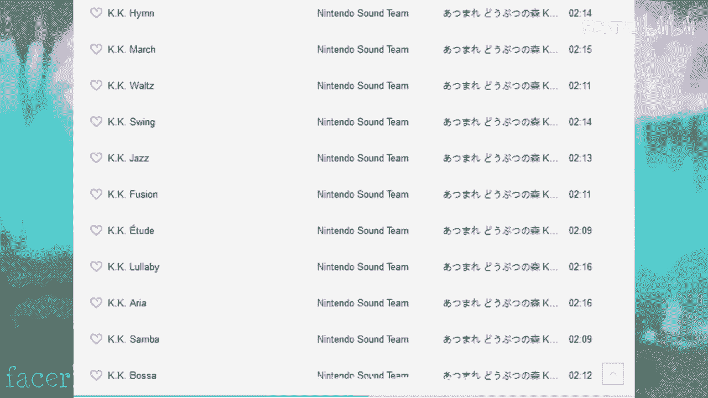

# 赏味知识集——为什么那么多人误会动森就是元宇宙 - P1：202202211619 - 赏味不足 - BV1QR4y1L7wX

哎呦喂哎呦喂，Hello，大家好啊，我是赏味不足，那么从本期开始呢，我会做一个真正意义上的视频，因为之前的话呢都做了一些呃，可能游戏直播啊，包括其他一些就类似于PPT这种模式的啊。

那么我也觉得可以尝试一下，在这当中做一些啊短视频啊，或者长视频这么一些内容，那么在这些内容里面呢，我目前是分成三大块，第一块呢可能跟区块链啊或者NFT啊，元宇宙啊相关，那第二部分呢可能是影视类的对吧。

就是我可能日常呃看一些美剧啊，或者一些神奇的电视剧可以推荐给大家对吧，然后第三个呢是啊游戏类的，那游戏类的话可能更多的会偏向一些呃直播，然后会在直播后面可能做一些总结类的啊，基本上是这个样子。

那么这一期视频呢我想先和大家说一下，动物森友会和元宇宙的这么一个关系啊，那么也希望大家能够多多支持，因为毕竟第一次做嘛，当初有些什么呃瑕疵啊或者披露啊，也欢迎大家评论或者弹幕来发给我。

那么首先呢其实大家都知道啊，就当下呢元宇宙非常火对吧，然后有非常多的人呢提到元宇宙就会说到啊，动物森友会，那么对于非常多的人来讲呢，就是这两者呢属于呃名字都听到过啊，但是这两者到底是什么东西呢。

其实基本上都不知道哦，所以我想在这里呢先做一期动物森友会，跟元宇宙的这么视频啊，同样的呢其实大家能够看完这个视频呢，一方面能够通过啊，动物森友会对元宇宙能有一个直接的了解，第二方面呢也能够通过这个视频。

对动物森友会呢有个很直接的了解对吧，那么啊我们继续来讲这么一个内容啊，好这么好，那么首先呢元宇宙是一个虚拟的一个概念对吧，大家为了让认知能够统一啊，我们需要找到一个呃，比如说大家知道的一个东西啊。

能够去统一理解的对吧，那么这就好像我今天如果跟你说，我说啊超级赛亚人啊，你说我根本就没看过七龙珠对吧，我也不知道超级赛亚人长什么样子，那么我花了很长时间给你做这么一个，春夏人沟通。

那么到最后你可能就根本就不知道啊，我们到底在讲什么怎么一个内容对吧，那么这个可能是目前来讲就是在元宇宙啊，或者在讲其他一些内容上面，最根本的一个问题好，那么首先我们先来看一下宣传片。

参加了无人岛移居计划的您，将拥有时间缓慢流逝，自然富饶的世界，和一同参加了移居计划的动物们，在无人岛展开悠闲自在的生活，虽说是无人岛，不过大家不用担心，岛的中央将会有locking的服务处。

为大家的生活提供支援，为了让大家开始新生活，我们准备了帐篷，请您先选择喜爱的地点，还有一样东西我们将提供locking开发的特制手机，里面有各式各样的应用程序，为无人岛生活提供支援。

还可以确认制作道具和家具的方程式，那么马上就来试试制作这个斧头吧，收集树枝，石头做材料，在服务处的作业台上DIY吧，做的很好呢，利用制作的道具，可以像这样获取新材料，能够DIY的物品也会随之增加。

家具可放置在屋内，和室外，也能做出细微移动，请自由调整，改变家居风格，体验无人岛的生活，服务处会贩卖道具家具，收购玩家不用的物品，还会收购杂草，鼓励玩家美化岛屿，除了货币，通过not及理由收集礼数。

可以交换特别物品或方程式，在岛上参与各种体验就能获得礼数，请务必使用这项服务，当然无人岛生活的乐趣还有很多，比如悠闲垂钓，捕捉虫子，种植花卉后做成花冠，连野生的杂草也可以透过DIY改头换面。

利用撑杆跳杆子，一下子就能轻松飞越河川，吃过食物后，还可以利用铲子挖起树木，移植到其他地方，让岛上环境焕然一新，随着时间流逝，岛上风景也会有所改变，晴天阴天雨天风大的日子，甚至连树木也会沙沙作响。

在不同的时间和季节，能够遇见不同的生物，哦呼另外若有其他玩家在岛上居住，可以透过分享游玩，让最多四人同时游玩，居民们互相帮助，在同一个空间享受生活，透过临近主机通讯或线上通讯，触发到其他人的岛屿。

最多可以聚集八人一起游玩哦，相遇是一种缘分，机会难得不妨一起拍张照当作纪念吧，怎么样，这次介绍的生活内容只是其中一部分，还有数之不尽的故事，生活乐趣与居民的崭新相遇等待着你。

衷心期待大家参加king开发的无人岛移居计划，怎么动物森友会呢。

其实最早的时候对对我来讲，我其实是一点都不感兴趣，那为什么呢，因为大家从这个宣传片上面就能看得到对吧，它是一个子贡向的对吧，从日本来讲，它是一个叫CODM啊，可多摸这么一个方向的这么一个内容。

也就是说它是一个儿童向的，怎么在我翻阅各方资料之后呢，我发现他是一个因为在游戏那个封面上面，它应该是一个六加啊，是一个呃六岁以上儿童游玩的，那么我们能看到在宣传片里面，能够看到这个画风对吧。

这个游戏性对吧，你说你让我玩啥啊，就是我们每天在世界上已经活的这么累了，你说你让我在这么游戏里面再去活一遍，而且相对来讲没什么很大区别的，这么一个生存啊，生活环境是吧，这第一第一点。

第二点呢就是说我在这个世界里面干什么，就是说我在动物森友会需要去干什么啊，那么对于很多人看完之后，他就会发现哦，我可能是啊种种地对吧，造造房子对吧，种种菜对吧，和我们的这个电脑小伙伴NPC聊聊天对啊。

这个可能是他会去做的，那么但对于很多人来讲呢，就是对于我觉得很多成年人来讲，他会觉得这种非常无聊的游戏性，以及即将消耗的时间哦，他去思考之后，他就会觉得我没有任何想法，才去玩这么个游戏了对吧。

因为他就会觉得我到底在玩什么东西对吧，我根本就不清楚，那当然啊我在这个地方也得说一嘴对吧，就是虽然我是这么想的，但谁知道到现在为止，就是动物森友会在我所有游玩游戏里面呃，时间占就是占比是最长的啊。

动物森友会站了，现在大概1100个小时啊，就难以置信，你说我玩怎么游戏，竟然能玩1100个小时是吧，然后呃除了这个以外呢，怎么可能排名第一的就在我玩的游戏里面玩，排名第一的可能是怪物猎人啊，那么当然在。

为什么说动物森友会会玩这么长时间呢，是因为啊主要还是因为疫情的原因啊，要不是因为疫情这么一个客观的影响，可能我觉得嗯买吧我还是会买的，但是玩的话可能属于打开啊，然后第一个阶段还没结束，然后就不玩了。

放弃，然后就机会啊，可能会这么一个结果，啊，那么我们说动物森友会这个游戏开始的时候呢。

啊你会在一个孤岛上面，那相当于你在一个元宇宙里面嘛对吧，那你现在说我有了那个任天堂的NSS啊，我有了这个买了东兴友会，你打开对吧，然后呃任天呃就动物森友会的这个岛呢，跟NS的这个id它是一一绑定的。

虽然它没有云备份，但是它就是一台主机，一个岛对吧，那么我们可以理解为就是一个一个主机啊，建了一个元宇宙，对不对哈，你是唯一的一个村民，然后呢还有两个东NPC陪着你对吧，就长得这个不太像人的啊。

这么一个NPC陪着你，而且呢这个NPC非常的不要脸啊，然后借着各种管理带来借给你，然后呢，让你就是为了让你在这个岛屿上进行，元宇宙的开发啊，比如说把这个岛扩起来啊对吧，比如说这个造造房子啊。

对吧好那么在动物森友会刚兴起的时候呢，就几乎网络上所有的玩家都在吐槽，说我生活中打工已经这么累了啊，万万没想到我在游戏里面还要打工，而且我在游戏里面还要还高利贷啊，那个我们在动物森友会当中需要扩建岛屿。

升级自己的房子对吧，建造各种上下坡以及桥梁等等，各种各样的一些内容啊，怎么这些都是需要，像我刚刚提到的那两个NPC去贷款，而且不停的贷款，你会发现你越贷越多啊，而且还都还不清哈。

怎么在如果你哪天还清了之后呢，当你还清了这个贷款，开始这个游戏才刚刚开始啊，这和我们很多就是初学者，或者来说就刚玩游戏的朋友接触到的另外几款，就很多款游戏很像啊，怎么像黑魂这种退就劝完全劝退的。

我就不去说了啊，我记得我当时刚开始打黑魂是这样子的，就是一和二我没玩啊，我直接玩的是三，然后呢我就说啊这个游戏名头很大啊，然后我就去买，买了之后呢是这样子的啊，游戏画面嗯很好，操作感嗯还可以好。

然后上来啊NPC也没看到几个对吧，然后路上小怪小兵我也没见到几个，上来就第一个boss，第一个boss我就劝退了，就我觉得连我这么一个就是从超级玛丽对吧，FCSFCSSPSXBOXPS2PS三啊。

NS3DS对吧，就这么拉巴拉巴拉这么一套一套下来的对吧，我都容易被劝退，因为我如果没记错的话，我在第一个boss起码死了20多次啊，然后我才后来后来比较，就是顺畅的去虐虐了他啊。

但是最前面的几次就你就会有一种什么感觉，就是呃这个游戏我玩不了啊，我承认我的智商不够，我也承认我境界没有到啊，可能是这样子，就最近来讲吧，可能和另外几款游戏会比较像啊，第一个就是暗黑破坏神的重置版。

就暗黑破坏神二重制版呃，网上吐槽无数对吧，然后还有怪物猎人，暗黑破坏神二这个重制版，这个重置版开发了这个发布之后啊，简直就是冰火两重天，就是骂的人非常的就是极端，然后喜欢的人呢也非常的极端。

那过了大概一两个月啊，就简直就是说炸了啊，那么与其说很多人在吐吐槽，其实不如说这是两代人，或者说几代人的这种，思想上和文化上的一种冲突，因为啊当然了，就是关于暗黑破坏神，如果大家感兴趣的话。

回头我可以再开一期，这个是一个非常非常漫长的故事啊。

非常非常漫长的故事啊，好然后我们说啊简单说一下，在暗黑破坏神里面，人物最高等级99级，整个世界有五个场景，然后有三大难度啊，那么对于正常人来讲，他说我把人物练到99级。

那首先你几乎我认为你是练不到99级的，因为从开服到今天，我都还没有练到99级，或者我的团队的小伙伴都没练到99级，我觉得是很难的啊，这是第一点，第二点是，几乎所有的人都会觉得我是不是满足啊。

比如说我90多级了，我把这三五个场景都打完了，三个难度都打完了，是不是我就通关了啊，那事实告诉你，就是对于暗黑破坏神这么一个游戏，你把这三个元素达成之后，这个游戏才刚刚开始啊。

这个就是我觉得很劝退的一个地方对吧，这是第一点，第二点是怪物猎人就更不要说了对吧，就是怪物猎人这个游戏，但凡只要玩过的，他简直就知道就是怪物猎人嘛，这个名字很好，就是这个游戏绝对不是你去打怪物。

是怪物来打你的啊，就是他整个一个游戏感想，就会让你感觉到他是来打你的啊，好那么我们把怪物猎人叫那个monster hunter嘛对吧，怪物猎人嘛，monster hunter也被玩家称之为猛汉传对吧。

MH这么猛猛猛汉汉汉猛汉传，当你玩了几个小时的猛汉传之后呢，你会发现这个游戏简直槽点无数啊，我敢打赌就是呃怪物猎人应该也不算小众游戏，但是相对整个就是这个人人群基数来讲，他可能还算是个小众对吧。

那么我觉得但凡有朋友以前没有玩过的，你去玩过怪物猎人，你就会发现这个游戏的槽点简直是无数啊，无数的槽点你你会非常匪夷所思的，无法理解，这游戏为什么能被很多人称之为神作对吧，总结一下啊。

就是当你玩了几十个小时的猛汉传之后，你会进入一个打装备的阶段啊，你会认为跟DOTA跟其他的游戏一样，它是一套神装走遍天下的，当你玩上几百个小时的猛汉传之后，你会发现这是个垃圾游戏。

就就算你已经有了一套神装，对面的怪打你一拳还是就是一就挂了啊，就是一击毙命啊，这就是你会发现这些装备是没有任何意义对吧，然后等你玩了几千个小时，就1000个小时以上的猛汉传之后。

你就会发现其中的部分的这个玩家，已经悟到了啊，就是他会发现一切都是浮云，整个游戏里面所有的东西都是浮云，怎么解啊，解毒药啊，怎么回血的装备啊，都是浮云，只有你的技术才是真正的。

所以说这个游戏最终你会发现，磨练的并不是游戏当中这个人，而是现实当中的这个人，当你真正悟道之后，你也可以无伤通关啊，这么就当真正的悟道啊，但是这是非常困难的好吧，那么我们回过头来讲，就是相对来讲啊。

动物森友会啊，我们从整个画风啊，交互啊上面来看，他虽然没有这么硬核对吧，但是呢他的确从第一阶段的借钱还钱，还贷之路开始，他就劝退了很多人，当然我表示我运气还是很好的对吧，就是我在打动森的时候呢。

有这个网上有些朋友对吧，然后在早期资助了我很多钱，也就资助了很多这个啊动森里面的这个钱，让我直接就是跨过了第一阶段，这么打工还款的这么一个过程，好那么我们接着来说。

就是既然说到动森里面的还贷，那么我们就会说到所谓的赚钱对吧，那么你在游戏里面怎么去赚钱，这是一个非常重要的事情啊，那么按照一般的这种游戏来讲，你往往是什么呢，就是打怪啊，卖装备对吧。

然后打怪怪直接掉钱对吧，这是几种方式，那如果像开心农场这种呢，你就是那个种菜卖菜对吧，然后怎么偷菜对吧，基本上这种情况，那么在动森里面呢，他的确有个我觉得非常好的设计，而且就我了解。

应该是在呃前两座东升里面就有了，并不是NS这个东升才有的，那么在东升这个游戏里面，他有个硬通货叫大头菜啊，大头菜，那大家也可以看到这个大头长长什么样子啊，挫的就不能报粗口对吧。

就我相信大家只要都度过第一个阶段的玩家，就能听到这个简就听到这个东西啊，基本上就是PTSD了啊，就是说大头菜的设计我觉得是非常精髓的，它单纯的通过这么一个东西啊，它在游戏当中就构建了一套呃。

完整的这个经济体系啊，首先我们说呃呃简单列举一下，首先我们说出售大头赛的这个猪，我不知道他是不是猪，因为我很久没玩了，忘记了，每周应该只会是周日出现啊，进行大头菜的售卖，怎么就像我们刚刚说的每台机器呢。

它对应的是一个元宇宙，那么每一个元宇宙里面的这个猪啊，它的价格都是不一样的，它是个随机价格啊，那么你购买大头赛之后，它的生命周期只有七天，也就是说这个价格它只能维持七天。

在七天后这个大头赛就会烂掉啊，就会烂掉，然后招招招来非常多的蚂蚁好，怎么这么大头菜，你回头卖就卖就能卖掉，但是它的价格就很低很低好，那么这第一点，第二点呢就是说第二点呢，就是说你会发现它整个的一个流程。

就像我们刚刚讲的，你有你可以去买卖哦，然后你就七天时间，那么在这么一些，就是对于所有人都非常公平的，这么一个因素之下，条件之下，那么问题来了，我们应该怎么去赚钱，根据这么一个规则，我相信所有人都会知道。

就是它是一个低买高卖的一个流程，对不对，但这里我们就要说到，说到动森最最精髓的一个设计，就是类似于元宇宙这个概念，或者说叫做多宇宙的这个概念，因为我们会发现你今天比如说你今天周日啊，这只猪来卖了啊。

这个价格非常低非常低，你根本就不想就这价格非常非常非常高非常高，你根本就不想买对吧，你根本就不想买，你买了肯定亏，比如说你你是500多买的商店的，收购价只有200多，你明知道亏300块钱。

你肯定不会去买，对不对，那这个时候呢你就会发现诶，那我这个元宇宙里面的这个猪，它卖500多，别的圆柱里面租，它会不会卖便宜点呢，对吧好，那么同样的，当我卖的时候，我的商店是200多价格。

那有没有一些商店卖的时候能500多，600多700多呢，对不对，有没有可能呢对吧，所以说在整个这个设计之下，几乎在所有的社交，就是在那段时间里面，就是所有的社交平台，大家就会发现诶，所有的人都在问啊。

你今天大头大大头才多少钱，你今天商店里没卖多少钱对吧，然后只要我们找到一家，就是我们只要找到一家，比如说大头菜这个售价特别低的，同时就是你买入价格特别低，同时卖出价格特别高的这种元宇宙这个岛屿。

所有的人都排队进啊，我记得当时我有过几次。

就是岛上面啊价价格，比如说买入价格特别低对吧，卖出价格特别高的，然后就排队啊，然后甚至呢在那个小那个微信的小程序上面，我们看到动森他是有那种排队小程序的，就大家已经是把它变成了一个从单机游戏啊。

或者说大家相互岛上能够看来看去，一个展现类的这种游戏，变成了一个完全纯社交，同时带有竞技属性的这么一个游戏哦，甚至就是说能够开发出一定的周边，一定的系统，让他去排队，让他去交易啊。

那么这个就是非常非常神奇的一件事情，所以大家就会发现，虽然他一开始是是一个大头菜的一个交易，但后来我们就会发现，大大头菜不单单只能跟支持猪交易。

我们还能点对点交易要求，好像我今天手上有200万的大总裁，我实在用不掉了，而且时间就要到了七天就要过期了对吧，我也找不到好的下家，哎有的人就直接点对点，他说哎我现在这个这个有200万的大头菜啊。

你愿意拿什么东西来换对吧好，那么有的人说我拿壁纸来换，有的人说我拿一些小物，那个那个稀有物品来换我，有的人说我拿这个啊鱼啊，拿这种这这这个叫什么，那昆虫啊来患有非常多啊，那么这个就是呃。

我觉得它设计非常好的这么一个经济系统，那紧接着我们要来讲的是他的这个物品和建筑，在动森里面，我们能知道就是这个建筑里面有我自己的家啊，有有我们可以开小号的家啊，有帐篷啊，有小动物的家啊。

包括有小动物的这个交互啊，怎么在这里面呢，我们能知道就是啊动森只是给了一个上限，比如说你一个岛就十个建筑啊，你要再有新的建筑，或者在有新的小动物，你必须把现有的小动物赶出去啊，他会有这种。

那也就是说我在这个元宇宙里面，我限定了除了玩家以外，剩下还有九个是NPT啊，那么这个是一方面，第二方面呢，就是他在这种呃道具上面设计是非常丰富的，而且有非常多的联动啊。

就比如说在这近的一些他跟超级玛丽啊，或者跟其他的一些就是游戏或者动漫，都会有些联动，那这是一方面，第二方面是呃他的服装对吧，就是他的呃这个身上的帽帽子啊，衣服啊，就从头到尾啊，从头到脚。

所有的这个装饰品你都可以换啊，包括家里的壁纸啊，吊灯啊对吧，这个厨具啊，所有的所有的所有的一切，因为你这个房间最早的时候，它就是一个毛坯房啊，就什么都没有啊，你就是相当于你要装修对吧。

你要硬把家具放进去啊，所有的东西他都可以换，而且几乎所有的这些啊，这个装饰品啊，包括道具他都可以DIY啊，就是自己上颜色啊，或者说用他给你的一些颜色来做变换，来打造出你属于你的这种这么自己风格的。

这种元宇宙啊，那么同样的我们说在NPC这种交互，因为你在一个元宇宙里面，你得有一个就让你感觉到，好像你是在一个真实世界的这种感觉嘛，对吧，那么在东森里面，它的小小小动物也会有很多交互啊，我总结了一下。

基本上有这么几种，第一种是我不开心，我想问你要东西，第二种是我开心的，我给你的东西，第三个是你打我对吧，因为有些玩家就比如像我对吧，没事情做，我就会去打小动物哈对吧，然后他说你打我，我不开心了。

我要找你抱怨，我要和你pk，那还有一种呢就是你说我乱扔的东西，因为你倒上啊，他每一个宇宙里面他是会给你标平行的，就是你岛上的东西放的越好，越整洁对吧，这么大你的新书也高，那反过来。

如果你岛岛上的这么杂草丛生对吧，这蟑螂乱爬对吧，那基本上就岛上这么有一颗星啊，那么如果你种东西乱扔呢，有很多小动物会跟你抱怨啊，就你的这个岛民会跟你抱怨，那同样的呢就是还有一种就是他说我不开心。

我就莫名其妙就不开心啊，我就要做啊，我就要搬家对吧，那么这个时候呢，你就你你需要去给他做出很多的这种交互，就比如说啊你不开心了，那我挽留挽留你对吧，你啊我送你一些礼物对吧，我和你交换交换。

或者我给你唱首歌，我甚至可以唱首歌给你听对吧，它有很多种方式啊，好怎么最后啊我们还得要提到什么呢，动森里面它还有它，它这个元宇宙里面他还有自己的虚拟明星啊，是的就你们现在看到这只狗子呃，就是这只狗子。

我而且我很有理由相信，这只狗子绝对是走后门的，那凭什么他能做明星，我不能做呢，对不对，凭什么我们这个岛上，其它都很可爱的小动物不能做呢对吧，而且这个明星这个明星还非常的牛啊，这个KK对吧。

他KK他还能有自己的唱片啊，他还能自己演唱会啊，你每周晚上都能看到他在开自己演唱会，而且动森你有通他有通关的嘛，就是他比如说呃你到了某一个时间，比如说你到到到了五星，或者说是到了某个阶段，我忘了啊。

他是有个通关的，他通关通关动画都是他的演唱会啊，而且它还有它的类似于像这种什么，就是稀有的照片啊，壁画啊，还有什么明信片之类的，反正就是嗯就很明星很大牌啊。

那么同样的紧接着这个话题啊，我们我们可以看一下动森的原声大碟，我们称之为OST嘛啊，也就是它的BGMOST原声大碟，在原声大碟里面，我们能够看到就是他的音乐是一个24小时，就每个小时会有不同的音乐。

同时还有KK这么一个大牌的唱片在这里面，那就非常的就是你会发现，这就是一个另外一个世纪啊，就跟你现实世界完全割裂的，但是它它该有的东西都有了啊。

该有的东西都有了啊，那么我们说我们回到元宇宙啊，就是我们既然讲了这么多，我们回过来看，为什么很多人会觉得动森是元宇宙，是因为它具有了一个世界里面该有的所有东西，那很多人就要说了。

那你怎么不去说GTA对吧，你怎么不去说模拟人生呃，我觉得相对来讲，可能是因为GTA的受众人群，的确就是受众人群的确很多吧对吧，但是他跟现在在吹嘘那些元宇宙的人，首先这是第一点，第二点是GTA跟模拟人生。

我觉得还是比较硬核的啊，还是比较硬核的，它不像说，因为你今天看到一个gt的宣传片，和看到一个呃模拟人生宣传片，你可能不知道他是干什么的，但是你看到一个动物森友会的宣传片，你看个半个半30秒对吧。

一分钟你大概就知道哦，就大概是这么个东西对吧，然后呢他就容易把它挂上钩，而且另外一方面呢，就是动物森友会的确拥有了几乎所有的，就是一个世界里面该有的一些元素，甚至还有恐怖世界啊，我们感兴趣的小伙伴。

你们可以到B站，到B站，其他地方可以去搜一下，就是关于什么呢，就是动森玩家利用动森里面的这么一个，游戏机制，所做出来的各种恐怖片以及各种神奇的怪谈，而且我觉得还非常有趣，甚至有一些我都觉得非常的合理啊。

啊我们可以看一段啊，我可以给你看一段，前方没有高能，放心吧，哦呼我也爱吃牛，哦呼那么我们就会发现这种恐怖的内容，这就好像怎么，这就好像有一个人套着个猪头对吧，在远处远处看着你啊，前方也没有高能。

啊总而言之呢，我觉得呃就动森跟元宇宙呢，的确有比较大的一个一个怎么说呢，就是你说它有关联性吧，有一定关联性，那你说他没有关联性吗，你从我角度来讲也没有什么很大关联性，为什么呢，是因为有很多人会觉得。

动森跟元宇宙现在就差一个A2或者VR，但事实上呢，其实嗯任天堂在前两天给出的官方的回答，我觉得已经证明了这一切了，就老老任的确是一家很好的公司，他已经说了，他说无论大家怎么来说。

这件事情我们都不会做元宇宙，为什么呢，因为我们看不懂，至少当下就for now啊，我们是看不懂的对吧，那我觉得老人说的就是实话对吧，那你不能说啊，动物森友会做的很成功，他就元宇宙对吧。

你莫名其妙把就因为舆论，你说我把这两个东西划等号，这这不合理啊，对不对，所以说我觉得呃，当下呢我觉得就是大家通过这个视频呢，也可以了解，一方面呢也可以了解东森友会是什么啊，第二方面呢，就是呃。

可能呢就是当我们一起去聊元宇宙的时候，有这么一个参考物啊，怎么更好的能让大家去了解，可能元宇宙是这么一个东西，那当然我在最后还得提一点啊，就是呃元宇宙不一定只是一个游戏啊，这个从大家从我别的视频里面。

多多少少也能够听到啊，我一直强调这个观点，就是游戏呢只是一个就相对来讲，当下更容易被人接受，更容易去切入的一个方式，但是元宇宙本质上面它不是说只有游戏啊，好吧。

那么OK那么希望我这第一个视频做的很成功啊，也希望大家听下来感觉还是比较顺好吧。