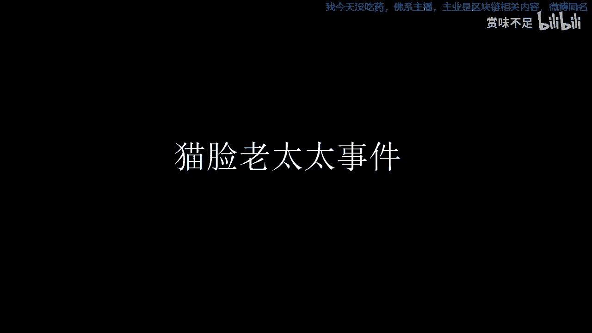

# 赏味都市怪谈故事集ep1——猫脸老太太 - P1：20220319-13165636 - 赏味不足 - BV1PR4y1c7Xa

好啊，大家好。那么从这一期呢，我是打算开一个新的一个栏目啊，这个栏目是主要来讲各种都市传说啊，都市怪谈。呃，最近大家也都知道啊，就我基本上可能在B站上啊就有有的没的在直播一些恐怖游戏。

那之前的话林啊这个巫女基本上是快了吧，我还有最后一张，然后甜蜜之家和那个叫港鬼识录，反正已经打了无数遍了，对吧？然后。那但是就是前两天因为我在直播当中也跟大家说了嘛，就是说因为可能我最近去医院。

然后医生说这个眼睛不能太高强度的这个去去去做一些可能也不叫高强度吧。就是平时也得多稍微就是省力省力这样子。那所以我就打算开一个新的这么一个内容。这个内容呢就相对来讲不是那么费眼睛。

对吧然后就是讲一些这个故事吧。啊，我在wiki啊在百度google上面就搜到了很多，但是相对来讲呢就是可能同质化比较严重啊。然后我也看到了，其实在喜马拉雅上面有一些这讲这种故事的，但是就非常长啊。

你说一个故事可能有20分钟才能讲完，对吧？他给你分个时段，然后呢，就每一段有那么20分钟，然后时段200分钟，这个就感觉太累。啊，那么呃当然啊因为我因为是从小在上海长大的，对于很多的这个呃传说。

我基本上都不太清楚啊。但你说我自己可能有感觉的是什么呢？也就是大家日常知道的，就比如说什么什么呃这个隔间里面永远就天花板上永远有珠子掉下来声音啦，对吧？然后什么什么东西找不到啦，对吧？

然后就发现可能有些呃，你比如说明明你一个人住着，对吧？然后突然发现一些这个莫名其妙的东西啊。啊。那么呃。今天呢我在呃这么一个内容调查下来呢，我就先讲一个故事啊，然后这个故事呢听说是发生在哈尔滨的。

我不知道啊有没有哈尔滨的小伙伴对于这个东西就比较了解，叫猫连老太太啊，那么据说啊当时是引发了东北三省巨大的社会恐慌啊，当然我也不知道啊，然后说如今80后、90后对此印象深刻啊。呃。

那说的是怎么一个故事呢？他是说啊当时在哈尔滨啊，有有老太太啊买菜回家，然后在路上的时候呢死了啊，但是正巧旁边呢有一只猫走过啊，老太太突然就坐了起来，身子没变，但是半边脸变成了猫的脸啊。

人们就说这个人刚死的时候呢，有动物从身边路过就接尸还魂啊，那他他这个核心啊，我看了一下他这个源头应该就这么件事情。但是通过这个事情呢。这个出现了非常多的这种传说，就就变就变化的版本啊。

甚至有非常多的人呢说这个自己已经目睹了啊，自己是事件的这个。亲身经历者啊，而且他版本有很多。我们一起来继续往下看啊，就是这个说这个呃有了这么一个故事之后呢。他就开始传说啊。

这个猫脸老太太呢通常是夜间活动啊，行动敏捷，力大无穷啊，喜欢吃这个小孩的肉，喝小孩的血啊。这段在那个传说就疯狂这种就流行的时候吧，就是有人不断的声称自己目击到了猫脸老太太，就这一半脸啊。

一半人脸一半猫脸，对吧？那迅速弥漫到了整个东北三省。然后呃按照目前我在网上看到的信息啊，就是当时CCTV焦点访谈呢对猫腻老瘫的事件还进行了报道啊，这个我是比较震惊的。你要放在现在，我怕不是不会报道啊那。

我们说这个东东西到底比如说这个故事到底真的假的呢？其实这个是没有办法考察的啊，但是从目前来讲呢，其实有这么啊几个版本啊，那么时间那个跨度呢基本上是发生在1995年到1996年啊，然后在这个哈尔滨啊。

然后呢就是说啊据说啊当时有这么一个正在上小学五年级的孩子啊，也是猫脸这个老太太受害者啊，目击者这个所以说在这个里面呢，就是有一个原始的故事，那慢慢慢慢慢慢演发出了这个非常多的一些版本。

那另外一种版本呢就是说猫脸老太太一家人呢住在黑龙江北部一个小村里。那一家人呢过着这个平淡的日子。啊，但是自己的儿子儿媳妇呢对他不怎么好啊，过日子。呃，过程当中有些问题嘛总编总归难免的对吧？

后来因为一些小事情呢，反正啊老人跟儿媳妇可能就就就矛盾越越演越烈啊，然后老人晚上起不过就上吊了。那老人被儿媳妇气死之后呢，家人准备把遗体放一晚上啊，等到明天下葬啊，这个也正常啊。

当时老人这个死相很恐怖啊，眼睛半睁着舌头伸在外面都有些发黑，面目狰狞啊，当时人们都不敢靠前。说起来呃也奇怪啊，老人的儿子赶来了，然后跪到老人面前，大家才敢把老太太给就从这个绳子上放下来啊。

这个按照这个村里的习俗呢，意思就是说你含冤而死的人呢，必须让自己最轻的人啊在身边才能露观安葬啊，但是这个事呢，最终从这个传说版本来讲呢，他并没有这个阻止后面这个老太太变身啊，这么一个事。

那晚上你说老人换上兽衣之后啊，儿媳妇也很伤心回娘家，老人的儿子觉得自己对不起自己妈啊，晚上给老人守孝。啊，然后呢就是。这个到了晚上就按照整个故事原版嘛，对吧总归有得得有只猫嘛，对吧？

这时候老人家养了一只花猫，从老人遗体上跳了过去，落地后就不动了啊，老人就坐了起来啊按照原本呢这个传说大家也都知道，就是说啊说这个人死了啊，就只动物在旁边走过，他就结尸还魂。那这个魂呢就从这个猫的身上呢。

到了这个老太太的身上啊，那么这个老人就变成了半脸斑猫啊，那么。这个老人变身之后呢，把自己邻居抓死了啊，他儿子趁着这个抓死这个邻居给他这个。嘲讽的时候呢就跑了啊，然后边跑边说就是诈尸了，对吧？然后这个。

晚上对吧？然后他就一直在里面叫叫了呢，也没有人回他，对吧？就整个村里面也没有人回应他，也没有也也比如说那些狗啊，对吧？鸡啊，也没有任何的这种反应啊，那所以就是最终呢就是啊就就一晚上就这么过去了。

那么一我天亮之后呢，就一群人啊回到儿子家发现这个邻居呢肚子已经被抓开了啊，老人肯定是不见了嘛，就跑掉了嘛，对吧？那么后面整个村子就变得很阴暗啊，然后呃时时时不时的啊，所有动物不见啊，然后一些孩子没有了。

弄得人心惶惶，大家告诉自己的孩子没事不要乱跑，对吧？要是真碰到那东西就绕着弯跑。那为什么呢？因为从这个。习俗啊角度来讲呢就是啊说这个还魂的啊这个东西呢它是不会绕弯的，他只会直着走，对吧？

就各种传说组组组合在一起呗。啊，那么啊我们就是我从网上啊也看到啊，就是这个传说呢，它其实有非常多的这种呃所谓的亲历者。啊，口述。当时的这个情景啊。呃，我们从网上能看到这么几个几个这个情况。

第一种呢就说啊有人说当时正在上小学啊呃呃电视里最火的就是8点多的焦点访谈。因为是夏天啊，那么一般这些小朋友都在外面玩啊，第二天上学时候听到大家疯传传什么呢？就说昨天焦点访谈里面演的特别吓人。

说是有猫人啊，就搬猫拜人嘛，对吧？好多人都在说啊，包括大人说焦点访谈里面都演了，是真实还放着，说是女的啊，就猫脸老太太是吧？专门掏小孩吃啊，就是哈尔滨我就还在齐齐哈尔。

当时不知道这个哈尔滨离齐齐哈尔有多远，家里父母也没人说这个事，要知道离两个小时车臣啊，就是得吓死。然后这个当事人就说啊，当时以为是在外地没我啥事啊，还很好奇，想到第二天回家看重播。因为都是早上8点重播。

所以没看成，很遗憾。啊，那么另外一个另外一个事儿呢，就是说这个呃春都肠大家当时都很穷啊，没有吃过，就是春都肠这种高档的食物啊，还很便宜啊，所以很快就风靡了起来。那个时代啊。

春都肠和方便面从来都是没有吃过的，特别美味的一种食品啊，一般人家也吃不起，只能过就偶尔去吃。后来大家说焦点访谈啊，焦点访谈说了啊，春都肠都是割死人啊，割死人大腿上这个肉做的，大人们也都这么说。

想想春都肠那个样子，就真跟死人肉差不多啊，心想那特殊美味味道，原来是人肉的味儿就没敢再吃啊，这个事当时呢也没有下文啊，那么。所以说呢就是这个是这个当时有有这个口。当事人啊这个说自己是亲历者啊。

说的这么一个情况。那么还有一个呢，就是说事情有另外一个经过。那经过是什么呢？就是说啊当时大家在这个50年代啊，大家三家共用了一个这个厨房和走廊，各家都不安走廊门走啊。

门屋里也用一个呃什么铁将军象征性的这个锁一下。啊，然后慢慢的呢，社会质安出现变化啊，各家以前放厨房里厨具，放在了那个门口的皮鞋开始出现了被盗的现象啊，其中有纺织厂的女工住在街区啊。

出现了比较频繁的盗窃事件。后来大家都怀疑就是某楼住户啊去做的。因为有人怀疑他经常无事在楼道里乱转，啊趁着别人家这个家门不锁的时候呢，无故进出别人家，经常把脑袋呢从没锁的走廊缝里摊进去。

看别人家有没有人啊，大家都怀疑是不是偷窃家呃偷窃家有什么偷窃的贼。啊，那么我们说呃他这个当事人呢，就是说有一天啊一个孩子呢从家里走出来到走廊走廊上啊，然后往厕所走，突然发现呢门缝里探着个脑袋啊。

小孩之前听到过这个故事，以为就是那个盗窃贼啊，来爬蒙缝了。因为当时走廊太黑啊，啥也看不见，就把灯打开了。一看吓一跳啊，原来不是那个盗窃贼，而是个老太太啊，留着一头散乱的淡黄色且又偏红的乱发啊。

五官挤在一起，却没有什么皱纹啊，嘴里叼了一块，不知哪儿捡来的这个窝窝头啊，小孩一害怕，喊着声妈，那老太太纹身就缩头跑了。随后，他爸妈来了就再也找不到了。啊。

那么当时呢就是以为这个老太太呢是那种那个人口贩子啊，全员这个动动员这个全街人去找呀，也没找到人啊，然后。这个都市传说就是从这种开始传出来的那你说他其实就是一个人家就是一个要要犯的对吧？

然后这个那个扒门缝，然后来看，你说这事儿有啥呢，对吧？那慢慢慢慢传呢，就开始传的，就跟这个猫林老太太有那么一瓶啊，传到后面呢，大家普遍认为啊有这么一个版本，什么版本呢？就赶上正好赶上这个。

说这个某一个住户是盗窃贼，对吧？那这个盗窃贼呢正好是住院了，大家都疯传说这个。这个盗窃贼为什么住院了呢？他有一天啊正在盗窃，那么正趴在走廊门缝里东张西望，突然发现身后不对劲，就回头一看。

那一看呢差点没把他吓死啊，他看见一个老太太似乎学着他的样子，在扒他后面那户人家走廊的门缝，不过与他不同的是什么呢？他这个是脸朝前，脑袋塞在屋子走廊里面。那老太太呢是后脑勺啊。

是往那个就相当于后脑勺朝屋啊，就好像有人呢是被他是被一个人硬塞到门缝里卡住了啊，然后脸呢是朝着那个盗贼啊，那个。到贼一看就对吧？就就吓得半死，然后回去呢就住医院了啊，他是这个版本。啊。

那后来还有这个也有人说呢，他是一天傍晚回家啊，抬自行车从楼梯上楼，总有人觉得呢在后面拽他这个车后座啊，他以为遇到的是什么流氓，就拼命大叫。呃一会儿呢，他家里人啊，他爸呢，他弟弟都出来了，就四处去找流氓。

结果路路过一垃圾堆啊，看到一个老太太，那就就另外一个版本了是吧？看到一老太太啊披这个麻袋，裹这个破棉袄，没有脑袋还在那动，然后呢可能冷嘛，脑袋缩在里面嘛，对吧？还在那动，他们一开始吓吓坏了啊。

后来仗着人多就跑过去。那你就说嘛，原来那老太太就是一只这个脑袋猫。啊，就是相当于是这个脑袋，就像我刚刚说的脑袋呢，它是这个在这个大衣领子里面的，不是没脑袋，你说在那边动，对吧？这个就是鬼故事了是吧？

在那看起来有啥就捡起来吃啥，大家一看呢是一个要饭的，也没说啥。然后呢，老头就突然觉得不对劲啊，因为那垃圾附近呢，垃圾堆附近呢是个国营商场，一天总往那那边倒什么玻璃渣子就没有等于吃。

那他老太太里老太太吃啥呢，对吧？那你越想越不对劲，立马就走了。😊，那那这个故事呢其实有非常多的版本啊，就感兴趣的这个小伙伴也可以到网上再去查。呃，令我比较震惊的是呢。

这个事儿吧好像后面变成了一个比较知名的IP在2016年4月15号竟然还被翻拍成了一个惊悚电影叫猫脸老太太啊，然后这个百度百科上这么写的啊，该片根据1924年啊，哈尔滨老太太灵异事件改编，讲述猫附身人啊。

然后这个怨声载道啊，诈尸还魂午夜索命的恐怖故事啊后他说我看了一下啊，就是这个啊他剧情姐姐这么说的，他说周家四兄妹啊，母亲在一个大雪之夜被冻死啊，黑猫跨世而过。

周家老太太借气还魂华师猫脸老太太神秘这个出现于古镇。周家这个春夏秋冬四姐妹因此陷入猫脸老太太死亡诅咒啊，那个老太太还魂之后呢，猫那个黑猫附身传说。再度显灵。啊，这个周家四姐妹啊。

四兄妹啊这个尝试逃出古镇。嗯，基本上就这么一个事儿。啊，那么在这个里面呢，其实也提到了什么呢？提到了就是上海啊，他说这个上海90年代呢有过一个叫什么吸血鬼事件，我表示我也没听到过，对吧？

那么他在这个吸血鬼事件里面呢，有提到过。那，有一个版本有一个版本是什么呢？就是说啊吸血鬼吸血老太婆啊，传说是传说是专门吸这个穿红色衣服，女孩的鲜血吓得班级里面女生都不敢穿红色衣服。

连红领巾做完早操后都得全部摘下来，胆小的就去厕所要结伴而行啊，校长更是开会来集体辟谣啊，然后奇怪的，但奇怪的是，每天都安排老师检查厕所，并且不许外人进校。放学后呢都安排家长护送回家。

没人接到有老师统一送回去。啊其实上海这个传说呢，其实更偏向于向哈尔滨这个毛脸老太太的这么一个桥段啊，然后通过一些变种把她这个这个这个这个转述出来。那好，那关于这个猫脸老太太呢。

我觉得基本上我们就今天第一期讲到这儿啊，然后我后面会根据这个wiki啊，这个wikiwiki上wikey上这个内容还是比较多的。有这个啊就像我说的啊，中国香港啊。

然后泰国、新加坡、马来西亚、印尼、菲律宾啊，中国台湾然后是这个。啊，然后是这个这个欧美啊后日本网络段子对吧？各种各种啊，那我觉得这个里面他讲的我可以从网上多找找啊，基本上也是非常多里面。诶。

感觉这些故事啊比我打这个恐怖游戏还是有意思多。好吧，那这一期我们就先讲到这儿啊，这个感兴趣的朋友也可以这个到网上去查查基本上这么一些内容。

