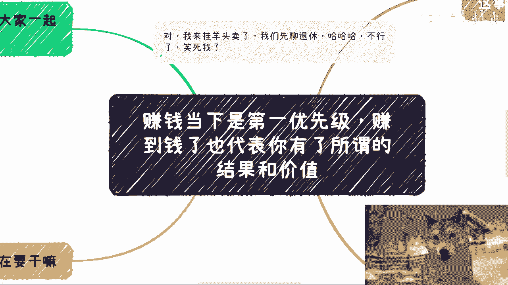
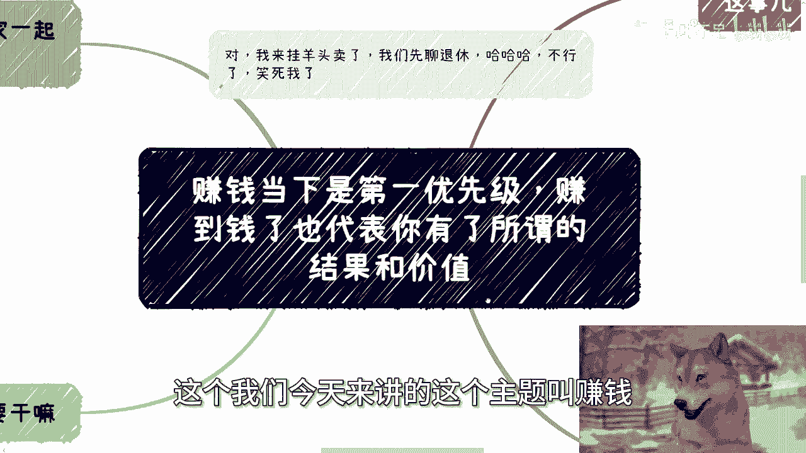
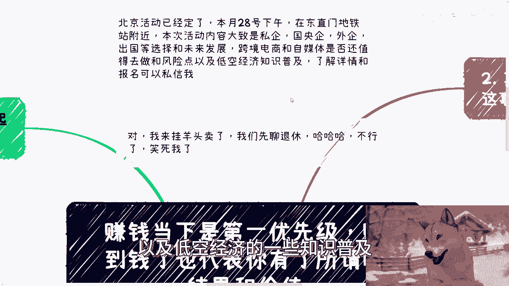
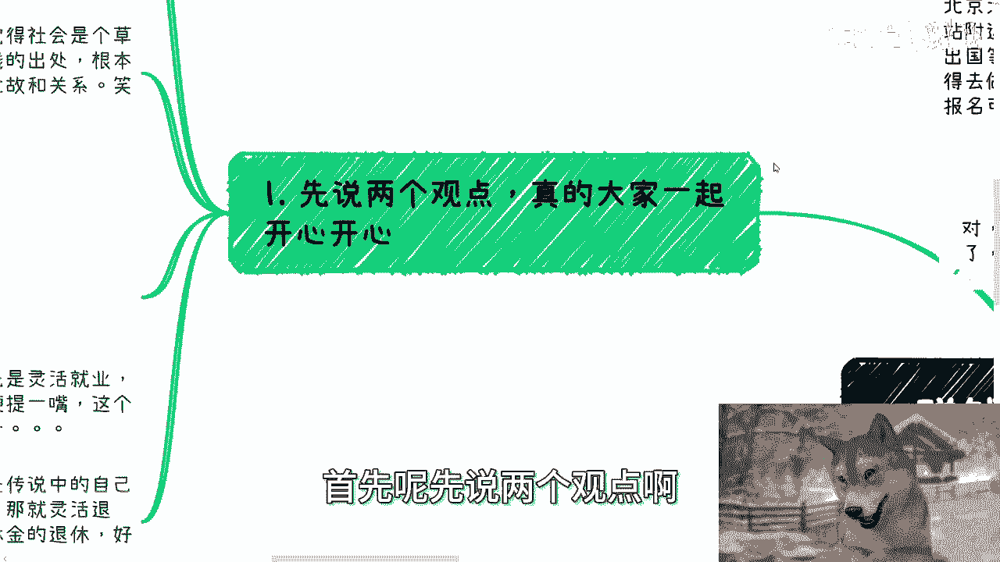
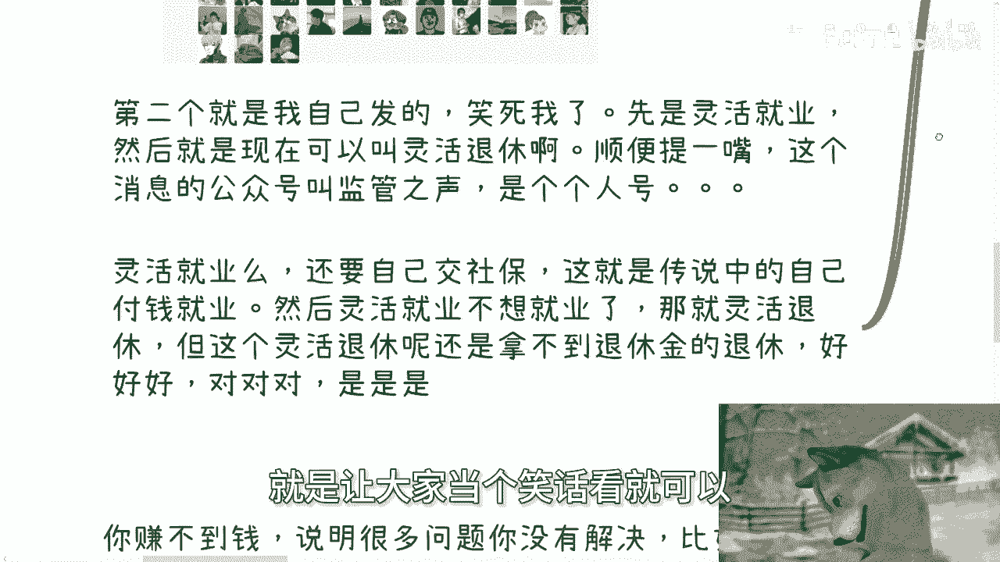
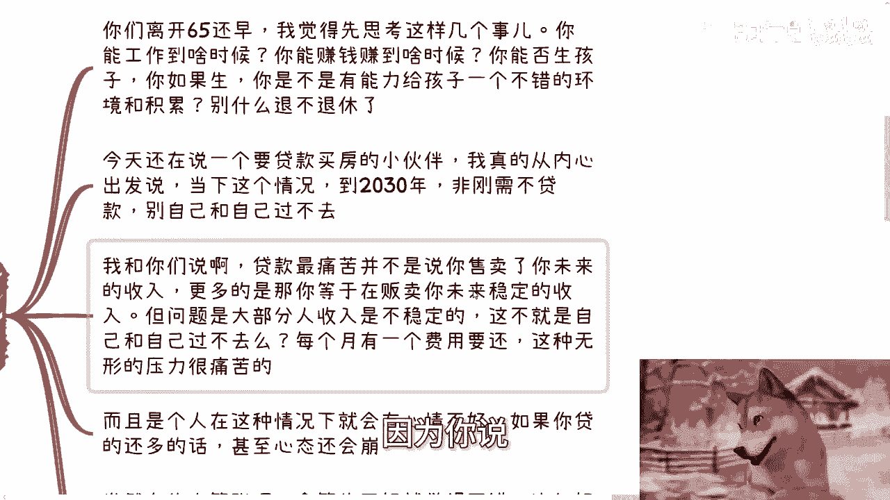
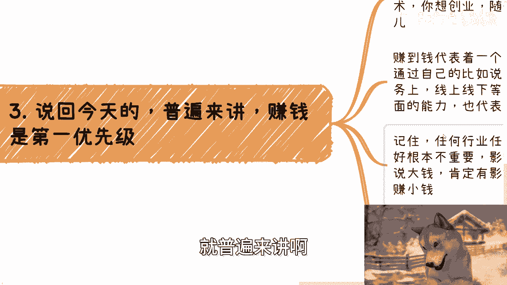
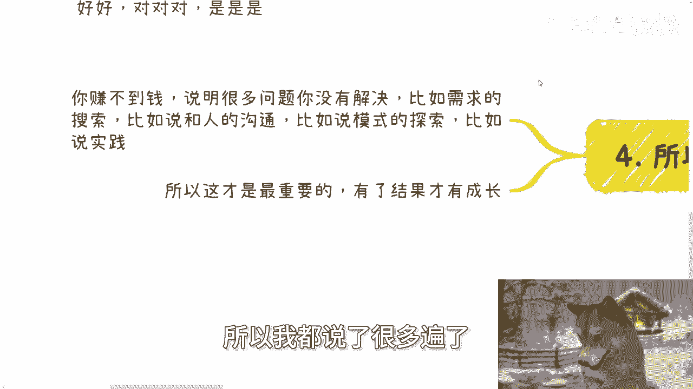
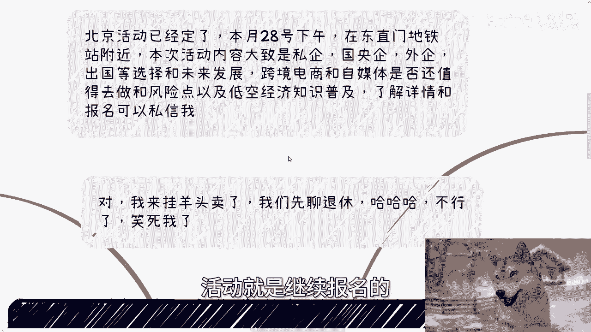

# 课程 P1：赚钱是第一优先级 🎯

在本节课中，我们将探讨为什么赚钱是个人成长和价值验证的第一优先级。我们将分析赚钱背后的意义，并讨论如何通过实践获得结果与成长。

---

## 活动通知 📢

本周日（7月28日）下午，将在北京东直门地铁站附近举办一场线下活动。

本次活动将涵盖以下主题：
*   私企、国央企、外企及出国等offer的当前选择与未来发展。
*   个人从事跨境电商和自媒体的价值评估。
*   当前市场的主要风险点。
*   低空经济领域的知识普及。

了解详情与报名请私信。

---

## 两个观察视角

在深入主题前，我们先分享两个相关的社会观察。

### 观察一：现实中的“草台班子”现象

一个观点认为，即使在最好的医学院，也只有不到五分之一的学生能让作者放心地将自己交给其诊治。另有五分之一的学生甚至不应获得驾驶执照，更不用说行医执照。然而，这些人中绝大多数都毕业并成为了医生。

这种现象并非孤例。在我过去的经历中，无论是项目申报、资金审批，还是政企事务，决策往往不依赖于技术或方案本身，而更多取决于人情世故与关系。这就是我所认为的“草台班子”现象。

当然，这并非否定技术的重要性。但对于我们大多数人而言，所从事的并非造核弹、光刻机或芯片这类尖端技术工作。

### 观察二：关于“灵活退休”的思考

我近期有一个感悟：失业的那一刻，即代表我退休了。这可以称为“灵活退休”。

顺带一提，近期网络上关于“65岁退休”的讨论，源自一个名为“监管之声”的公众号。需要明确的是，这是一个**个人账号**，并非官方发布渠道。

大家可以将此当作一个笑话看待。这本质上是一种“自己付费就业”的模式，而“灵活退休”则意味着可能还拿不到退休金。

---

## 核心讨论：为什么赚钱是第一优先级 💰

上一节我们分享了一些社会观察，本节中我们来看看今天讨论的核心。

普遍而言，赚钱应被视为第一优先级。

假设你拥有远大理想，无论是读博、田园生活、周游世界、学术研究还是创业，这些都是未来的目标。而你现在距离那些理想还很遥远，无需为此过度纠结。

当前，你只需要专注一件事：**赚到钱**。

### 赚钱代表结果与价值

赚到钱（无论多少）代表着一个结果。它意味着你通过非打工的方式（如营销、服务、项目运作等）证明了自身具备相应的能力，并成功迈出了第一步。至于后续如何发展，你可以自由选择。

如果不赚钱，你将无法真正理解社会的许多层面。记住一个关键点：任何行业或产业的大趋势，影响的可能是赚取数亿或数千万的规模，但**它影响不了你赚几百、几千或几万块**。如果连小钱都赚不到，那问题往往在于自身能力。

### 赚钱过程带来认知升级

赚钱本身的过程能让你看到、认识到并学到更多东西。相比之下，其他许多行为可能是南辕北辙。

很多人会问现在该做什么。我的观点是，如果赚不到钱，说明一系列问题尚未解决：

以下是赚不到钱可能暴露的问题：
*   **需求探索**：未能发现真实的市场需求。
*   **平台使用**：不熟悉或不会利用各类平台。
*   **营销能力**：缺乏有效的推广和销售方法。
*   **沟通技巧**：与他人的交流合作存在障碍。
*   **模式探索**：没有找到可行的商业模式。
*   **信息检索**：获取关键信息的能力不足。
*   **风口把握**：对市场机会不敏感。
*   **市场了解**：对整体行业缺乏认知。
*   **实践行动**：缺乏将想法落地的执行力。

没有结果，谈论其他都缺乏基础。许多人做了各种事情，唯独不赚钱，这便是在绕圈子，远离核心目标。

### 重要的是“赚到钱”这个结果

需要强调的是，我并非认为“赚钱”这件事本身有多神圣。我们都明白，赚小钱靠能力，赚大钱看风口。

**重要的是，“赚到钱”这个结果必然会促使你成长**。它会让你结识新的人，看到新的世界，洞察以往看不到的事物。而没有赚钱这个闭环结果，你很难获得这些认知突破。

---

## 对贷款与未来规划的思考 🏠

讨论赚钱时，不可避免地要谈到财务规划，特别是贷款问题。

结合多方信息，在2030年之前，一个基本的建议是：**非刚需，不贷款**。

贷款最痛苦之处并非预支了未来收入，而是**售卖了你未来“稳定的收入”或“稳定的时间”**。问题在于，这种“稳定”对大多数人而言并不可靠。无人能预测未来，任何黑天鹅事件都可能将你击垮。

每月固定的还款会形成无形的巨大压力，影响个人心态与生活质量。有些人会进行精确计算，认为依靠父母资助或变卖资产可以很快还清。

以下是这种计算忽略的关键因素：
*   **日常开销**：生活本身需要成本。
*   **未来规划**：如果未来养育子女，将产生教育等大额支出。

将财务状况置于“刚好凑巧”的钢丝上是危险的，这会导致抗风险能力为零。如果没有强大的赚钱能力，对于在外乡打拼的人而言，回归老家或许是比勉强留下更舒适的选择。尤其考虑到未来子女的教育环境，竞争势必更加激烈。

---

## 总结与行动建议 📝

本节课中我们一起学习了将赚钱视为第一优先级的原因和意义。

总结来说，**赚到钱是一个关键的验证节点**，它代表了能力、结果和价值。通过赚钱的实践过程，个人才能获得真正的成长与认知升级。与其空谈理想或抱怨大环境，不如先专注于获得一个切实的经济结果。

对于未来的规划，如购房贷款，需极度谨慎，确保留有足够的抗风险空间。

---

## 后续支持

1.  **线下活动**：对职业选择、跨境电商、自媒体或低空经济感兴趣，可私信报名本周日北京线下活动。
2.  **个人咨询**：如果在工作、合作（涉及合同、分红、股权等）或个人发展规划上需要更接地气的建议，可整理好个人问题与背景，通过咨询进行深入沟通。