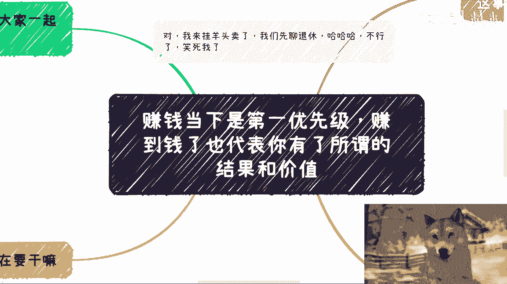
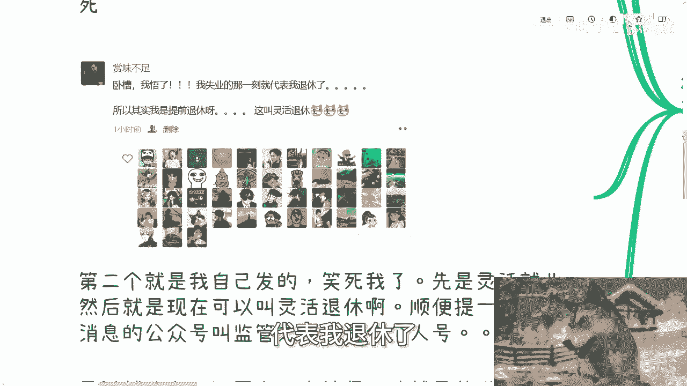
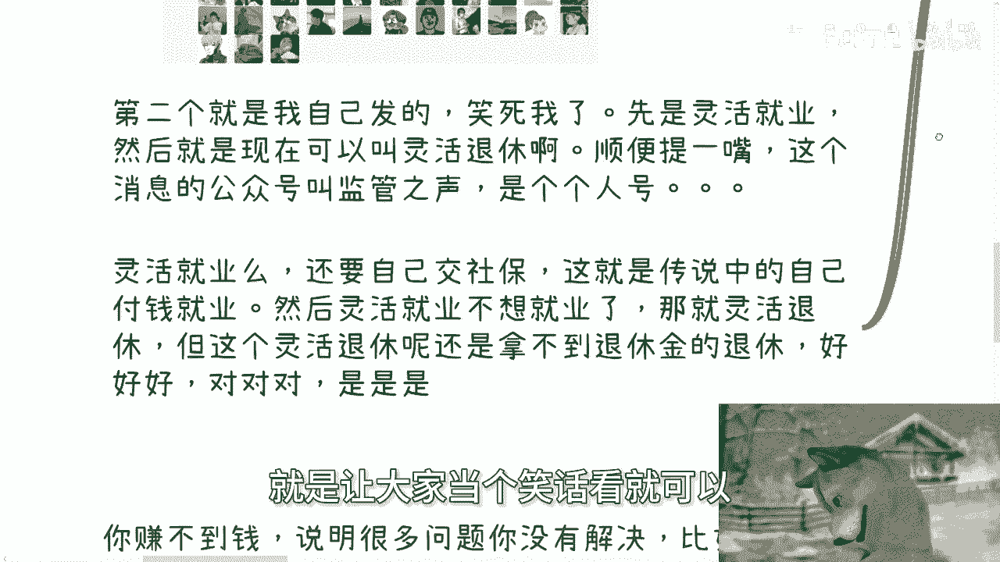
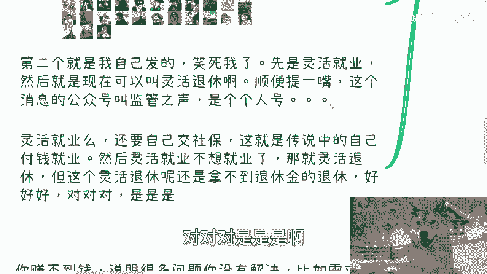
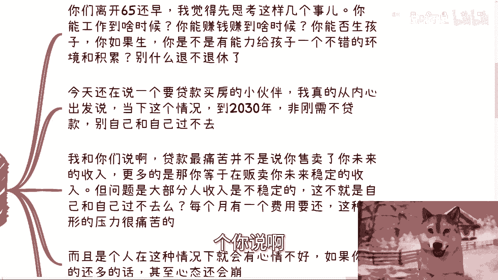
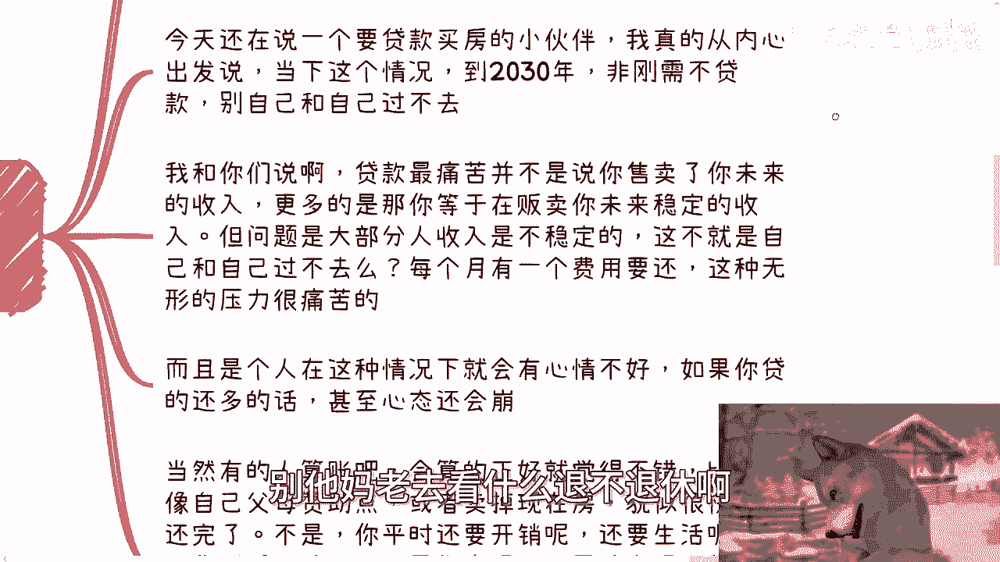
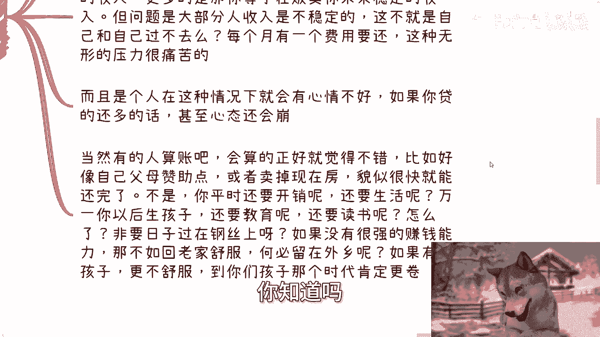
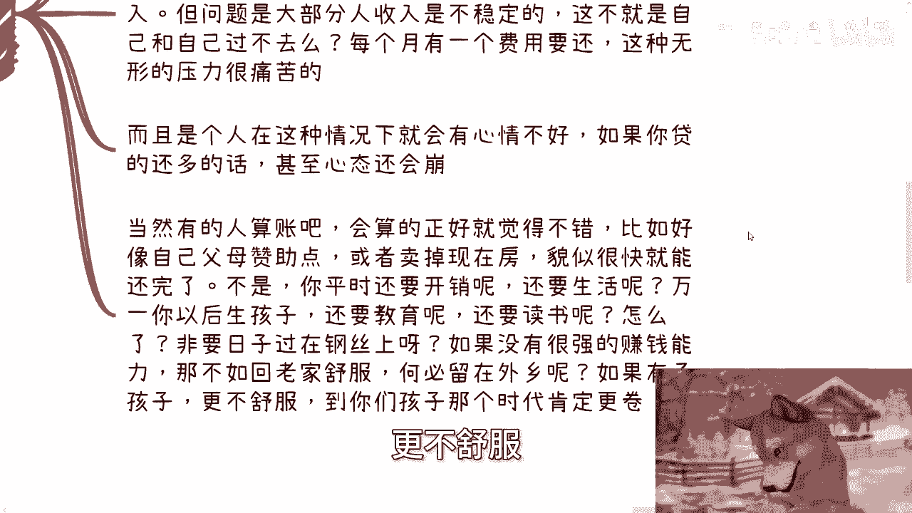
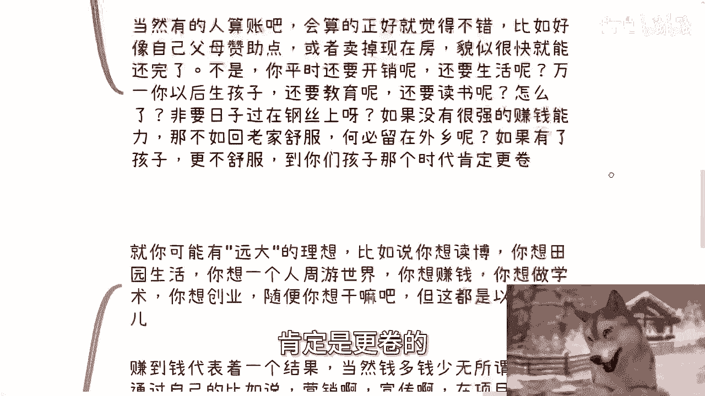

# 赚到钱了代表你有了进步，结果和价值 - P1 - 赏味不足 - BV1Lm42137Wc

好大家好，这个我们今天来讲的这个主题叫赚钱。

当下是第一优先级的额，你赚到的钱呢代表了你有所谓的结果跟价值啊，没有就没有啊，这个剩下有的没的，你关心没有用，别人不关心啊，呃然后呢这个我跟你们讲啊，首先呢两个事啊，我要来挂羊头卖狗肉了啊。

就是我这个退休这个事呢，聊呢是要聊的啊，我跟你讲他妈也笑死我了，真他妈草台班子啊，哼然后北京活动已经定了是吧，本周日本周日就是7月28号下午，在东直门地铁站附近好吧。

然后本次活动呢就是我会给大家来讲一下，这个私企啊，国央企，外企出国呃，等这个offer当下的一些选择，还有未来的一些发展，然后个人的话做跨境电商，还有自媒体是否值得啊。

然后目前一些风险点以及低空经济的一些知识。

普及好吧，然后了解详情跟报名的可以私信我啊，首先呢先说两个观点啊。

我觉得大家开心开心好吧，第一个呢是这样子的啊，就是之前有这么一个这个这个文字啊，他说啊我读的呢是我们省最好的医学院啊，扪心自问啊，我能放心把自己交给他们的呢，在我自己同学当中大概占1/5不到。

还有1/5的人呢，连驾驶执照都不应该发给他们，别说行医执照了，但这些人呢99%都毕业了啊，90%呢都当了医生，都穿着白大褂坐在医院里面，不知道在给谁看病，对吧啊，哼就很好玩啊。

呃不过呢我倒不是因为这个事啊，我也不是说因为类似的这种事，我觉得是个草台班子，而是说各种在我以前所经历过的，什么项目申报啊，各种钱的出处啊对吧，包括就是说啊这个这个这个政企啊，各方面做事情啊。

就是基本上不看技术啊，也不看什么申报书啊，全是人情世故跟关系啊，这就是我觉得很草台班子的地方啊，那当然啊我也不是说技术不重要对吧，我们大部分人又不是造核弹对吧，又不是造光刻机。

又不是造芯片对吧，那那我们能有啥技术呢，对不对啊，然后第二个呢就是我自己发的啊。

我说卧槽他妈我悟了啊，我说我失业的那一刻呢，代表我退休了。

所以呢其实我是提前退休啊，这叫灵活退休啊，然后第二个呢我顺便提一点啊，就是呃你们所看到的那个退休的那个信息，他的公众号叫监管之声，监管之声是个个人号啊，是个个人号，没有官方的账号。

说那个65岁的这个今天的这个事情啊。

我顺便跟你们提一点啊，就是那大家当个笑话看就可以了啊。

这就是传说当中自己付钱就业啊，怎么办呢，那就灵活退休啊，但这个灵活退休呢还拿不到退休金啊，那么对吧啊，好好好，对对对，是是是啊。

但是个个人号啊，大家不要被怎么说呢，不要被带节奏啊，呃然后第二呢真的啊要我说呢，不用太纠结这个事，为什么呢，因为你说啊我觉得首先离开就就算啊。

因为现在这个是个笑话嘛对吧，那我们就打退1万步来讲，就算啊，65岁这个你说啊今天这个东西是真的啊。

我觉得今天先思考这么几个事啊，第一你能工作到什么时候，第二你能赚钱赚到什么时候啊，或者说你能工作到几岁，以及你能赚钱赚到几岁，你是否生孩子，以及你如果你生，你是不是有能力，给孩子一个不错的环境和积累啊。

别妈老去看什么退不退休啊。

今天还有一个呢，就是今天聊的时候啊，聊到一个那个贷房啊，贷贷款买房的那个小伙伴啊，我跟你们这么说啊，就当下这个情况真的到2030年之前，当然不是说2030年之后怎么样啊，不知道啊。

我只是说到跟综合聊下来的信息来讲，到2030年之前非刚需不贷款啊。

别自己跟自己不过不去，我跟你们这么讲，贷款最痛苦的并不是说你售卖了，为你售卖了你自己未来的收入，他其实痛苦的是在于，你等于售卖了你未来所谓稳定的收入，或者说稳定的时间。

但这个问题是这个稳定对于大部分人来讲，他可能并不可靠啊，因为我们没有人能预估未来到底发生什么事情，如果出现一个任何一个黑天鹅的事件，那可能就把我们打垮了，对不对，那么那么你每个月有一个费用要还。

这种无形的压力，其实是很痛苦的，而且在就是个人在这种情况下面，他也不可能有好的心情对吧，如果你贷款还比较多的话，那么甚至心态会崩啊，当然有的人会算账啊，他是这么算的，哎我跟你讲，他妈的牛逼是牛逼的。

他算的正好你知道吗。

哎觉得不错，比如说哎好像自己赞父母赞助点啊，或者卖掉现在的房啊对吧，貌似很快的就能够去什么还完了对吧，我跟你讲啊，第一你算账不是这么算的啊，你平时要开销吧，你还要生活吧对吧。

那万一你以后有了孩子还要教育吧，还要读书吧，怎么了呢啊你你非要把这日子过在钢丝上啊，就就非常凑巧，碰巧啊，非常的正好对吧，没有这样过的啊，你这样过你这个抗风险性就是零对吧。

所以说如果没有很强的赚钱能力啊，我我还是那句话，如果你们是在外乡的话，你还不如回老家，何必留在外乡呢，对吧你你以后如果有了孩子更不舒服。

为什么，因为到了你们孩子，比如说什么啊，上小学上初中那个年代肯定是更卷的。

你想都不用想了啊，然后第三说回今天这个主题啊，就普遍来讲啊。

赚钱是第一优先级的，为什么，因为假设啊，我就说你可能有远大的理想，比如说你想读个博，你想田园生活啊，你想你想这个隐居山林啊，你想一个人周游世界，你想赚钱，你想做学术，你想创业啊，我不管你想干嘛啊。

但这个都是以后的事情，对不对，就是说你现在离那个梦想，离那个理想还很遥远啊，你没必要为了那个事情所这个纠结，你现在做什么，你现在要做的只有一件事情是什么，就是赚到钱，为什么，因为赚到钱代表着一个结果。

当然你赚到的钱可能有多可能有少，但这无所谓，你通过自己，比如说不打工的情况，比如说啊通过你的营销，通过你的宣传，在项目方项目上，服务上，线上线下，等你赚到钱了，这代表着什么，代表着你有这方面的能力。

也代表着你走出了第一步对吧，至于你说你后面怎么做，随便你，你明白吗啊，没有说你你你一定要去赚钱啊，但是你不赚钱，你不了解很多东西啊，你了解不了啊，为什么，因为社会就这吊样子，你怎么办呢，对吧记住啊。

任何行业，任何产业方向好也好啊，好好和不好，大趋势好和不好根本不重要，它影响的可能是你赚几个亿，几千万，但是它影响不了你赚几百块，几千块，几万块，你明白吗啊你要说赚大钱是有影响的。

但别觉得好像什么一天到晚拿大局势，大趋势，什么产业发展来影响你，赚小钱影响不了你要但凡赚不到，那就是你的问题，所以其实说白了，你需要去看你是不是有赚钱的能力，然后这就是一个节点，这就是个关键性节点。

而不是一直在那边说啊，这个原因那个原因，赚钱本身的过程才能让你看到更多东西，才能让你认识到更多东西，才能让你学到更多东西，剩下所有的行为都是南辕北辙，就这么简单对吧，你想通过什么看到你，你很多人问我说。

爱看书，看什么东西是没有错，但是你能看到多少呢，冰山中的冰山一角对吧，所以说你说很多人问我现在要干嘛，我跟你们讲，你赚不到钱，说明很多问题你没有解决，比如说需求的探索，比如说平台的使用。

比如说如何去营销，比如说跟人的沟通，比如说去模式的探索，比如说信息的一些检索对吧，比如说风口的把握，比如说对大对整个市场的了解对吧，比如说实践你这些都没有，你肯定赚不到，那你赚不到你。

你谈别的有什么好谈的，对不对，就是你一定是需要有个结果来证明来验证的，对吧哦，然后很多人做事情是这样子的，他就是就是乱七八糟事情都做，但他就不赚钱啊，那你干嘛呢，对吧你你你你一边跟我说啊啊陈老师。

我时间很宝贵对吧，我觉得我现在时间来不及，一边你就在南辕北辙，在绕圈子，不朝着那个目标走，我也不知道在干嘛对吧，所以我都说了很多遍了。

就是这是一个最重要的，有了结果才有成长啊，嗯嗯不要单细胞的，或者说不要就是二极管的去理解说哦，就是陈老师说赚钱很重要，赚钱很重要，我从来没有说过赚钱本身这件事情多重要，因为赚我们都知道啊。

赚小钱是看你的能力，赚大钱，这是要看风口对吧，重要的是什么，是你赚到了钱，这个结果一定会让你有所成长，一定会让你有所和一些新的人认识，一定会让你看到一些新的世界，或者以前你看不到的东西对吧。

但是你不赚钱，你肯定看不到啊，你整个闭环，整个一个结果都没有，你看得到个屁，对不对啊，好那么那个退休这个事啊，这个大家反正仔细看一下啊，这是个个人账号啊，不是官方账号，那另外一方面呢就是活动啊。

活动就是继续报名的。

可以继续私信我，那么剩下的话呢，就是说你们现在自己工作上面啊，或者还说跟别人合作上面啊，比如说什么合同啊，分红啊，分润啊对吧，商业计划书啊啊股权啊，期权啊对吧，包括你们啊这个这个这个手上有什么牌啊。

没有什么牌啊，你们希望通过跟我的沟通啊，以我的一些视角，或者以我对当下市场的一些理解，给你们一些更接地气的，或者更符合你们个人情况的一些规划，和这个这个方向的话，那么你们可以整理好个人的问题跟背景好吧。

我们再来走咨询啊，行啊。