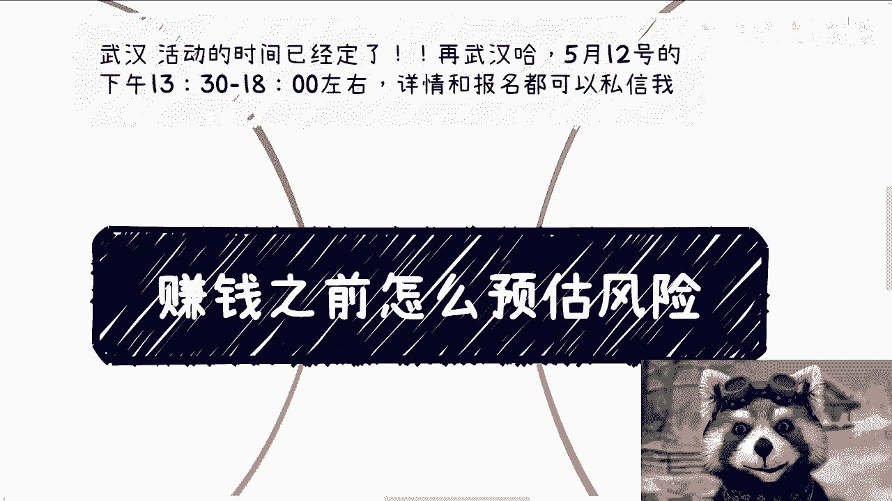
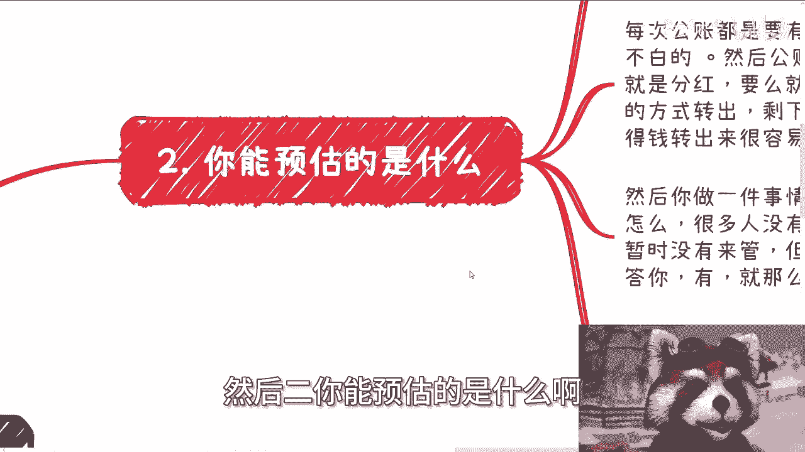
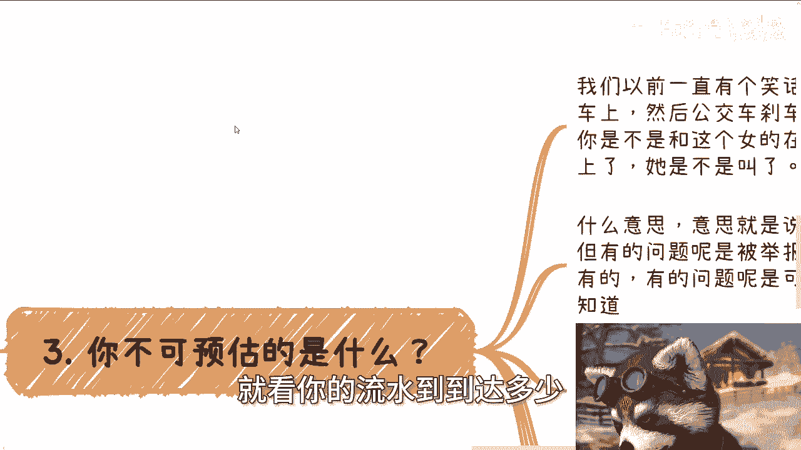
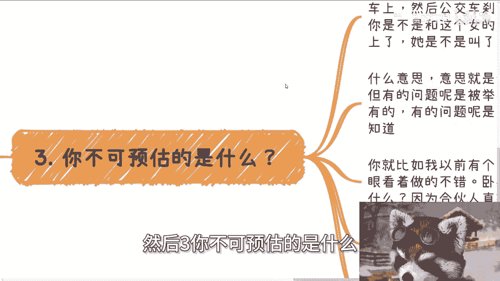
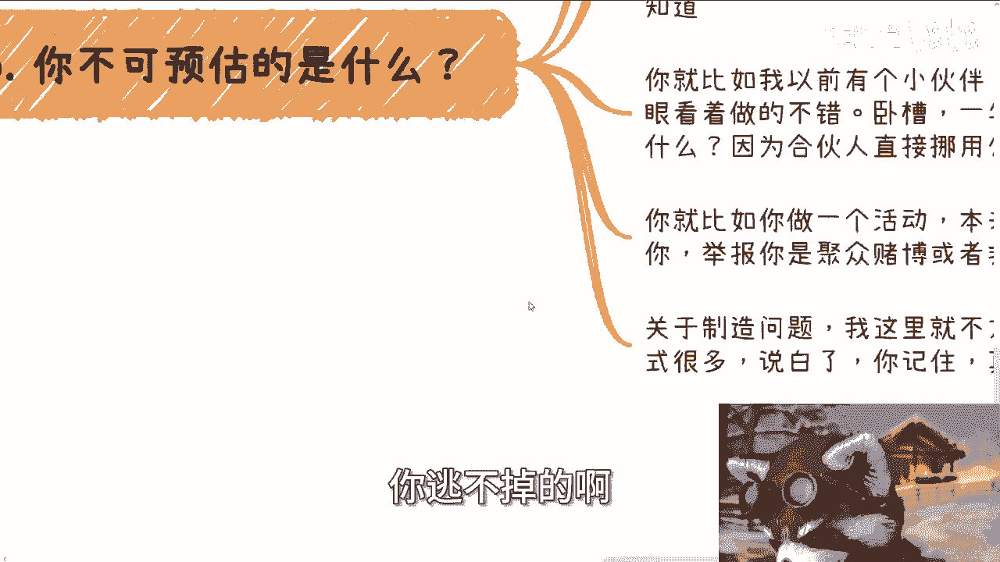
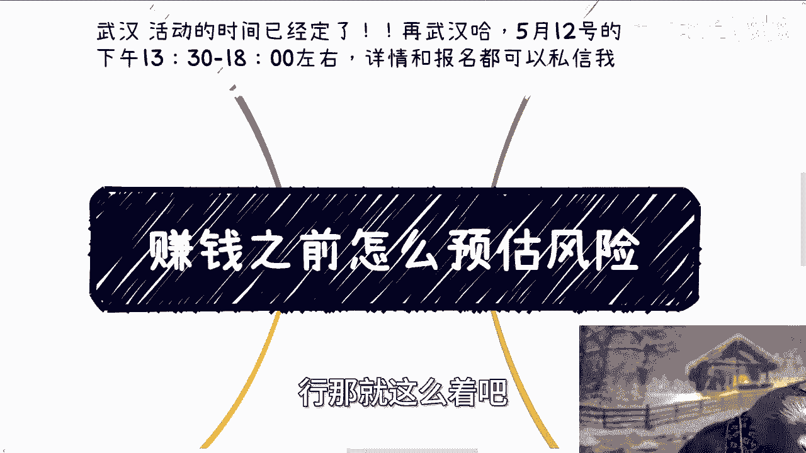

# 赚钱之前怎么预估风险 - P1 - 赏味不足 - BV12C41177JR

大家好，今天我们来讲的是叫什么，赚钱之前怎么评估风险，这个问题提的很好啊，我们待会儿来讲啊，首先呢这个武汉活动已经定了啊，武汉活动5月12号下午的01：30到六点左右，好吧。

详情跟报名你们可以继续私信我啊。

呃首先呢今天这个主题来自于，昨天有这么一个问题，就是我们很多人聊着聊着吧，说到赚钱，他就问我风险呃，你们想想看啊，你但凡问我风险，我能怎么回答，我只能告诉你有，我总不可能跟你讲，没有吧，对不对啊，有好。

然后对方就问我有什么风险，我说所有的风险都有什么意思，就是你能够预知了的风险，跟你预知不了的风险都会有，为什么，因为这就是社会啊，很正常啊，对不对哦，你难道跟我说哎陈老师有风险。

我们能不能预预预料到对吧，有ABCDE啊，然后呢所发生的风险就在ABCDE里面，要死了，可能吗，那他们按你这个说法，我今天出去每一步我都能很明确，未来有什么风险对吧，那我就能避开所有的风险可能吗。

不可能的呀，对不对，你要赚钱怎么可能没风险啊，我跟你讲啊，我发现大家真的啊，你问他是不是双标表，他说不是啊，肯定不是啊，但是呢你会发现你跟他们聊啊，就是他们会跟你表达出一种他很想赚钱。

但是一丢丢风险都不愿意承担，那他妈你不是双倍呗，谁是啊，对不对啊，然后对方就问我啊，他说那做之前呢我能不能预估啊，我跟你讲怎么说呢，有的可以预估，但真的到落地过程当中，很多风险呢。

你根本就不知道怎么出现的这个东西，我说实话有点看命啊，有点看命啊。

嗯你甚至出现的时候，你甚至还一脸懵逼啊，更何况预估也不是你自己来预估啊，你肯定找律师或者找我啊，别我就不说，我了吧，你肯定找律师或者找一些你觉得靠得住的人啊，来进行预估，你自己肯定不可能能预估。

要是能懂得预估你，你你肯定也就知道怎么避开这些问题，对不对啊，当然你找别人预估呢，你也没有能力判断预估出来的风险靠不靠谱，所以我跟你讲一样白搭啊，就是你说有没有方法有，我跟你讲有。

但这个这个有的方法我告诉你，这大概率也白搭，因为你不懂啊，对不对啊，好然后二你能预估的是什么啊。

很简单，很多人觉得没有风险，是因为呃我跟你这么讲啊，很多人觉得没有风险，我跟你讲是因为无知，最大的风险什么地方，最大的最通用的风险是什么，就出路径很简单，你收款怎么说，你出金怎么出，你公对公账户怎么走。

公对私账户账户怎么走，就这么简单对吧，你比如说按照正常的逻辑来讲，你每次的公账你都是要有合同对应的，否则这笔账他就是这笔账的钱，他就是不明不白的，然后公账转到个人，除了我们所熟知的劳动合同。

就是劳务合同对吧，你要么就分红，要么就是法人自己用发票去抵，或者通过借款的方式转出，剩下的他都是要有对应的合同的，哎我跟你们讲啊，真的很神奇的，我跟很多人聊下来，我发现很多人啊他就有种莫名其妙的自信。

他就会觉得哎这个钱进公账啊，然后拿出来很容易，我我操，我也不知道怎么解，怎么怎么会有这种错觉啊，然后你做一件事情，我就问你，你有没有资质呢啊，你别来跟我说别人怎么样怎么样的啊，很多人没有资质。

很多人是没有资质，但是他没有资质，是是因为他们不懂，或者说国家暂时没有时间来管，但但是你想想你但凡问我有没有风险，我只能回答你有对不对，你但凡问我要不要辞职，我只能回答你有我他妈怎么回答你啊，我说没有。

不要，那不好意思，那那那这回答肯定不对，对不对哈啊，然后你包括营业执照范围啊，包括拍卖啊，你需要拍卖许可证的人挂名啊对吧，你一级市场，二级市场的支付，还需要去走三方支付或者四方支付吧对吧。

我相信你们很多人连三方支付，四方之珠是什么东西，你们都不知道啊，然后你们也没接触过，当然你要问我不通过多方支付行不行行啊，我回答你行啊，有啥不行的了，可以没问题啊，但是你早晚都被都会被封。

这个支付渠道早晚都会被封，就看你的流水大到达多少。

就这么简单啊，就没有这么多的，很多事情就是一定怎么样，一定不怎么样的，你说我今天什么姿势都没有，什么东西都没有，我能不能干，能干啊，能干啊，但是能干，你说有没有风险有啊，那说什么时候有风险。

那我不知道啊，这这也还得看你做什么业务，在什么城市，什么模式，卧槽这里面他妈的变数多了去了。

对不对啊，然后三你不可预估的是什么。

我跟你讲啊，那不他妈不可预估的真的是多了去了啊，然后碍于很多敏感信息，我也不可能在公开的视频里面跟你们讲啊，但是我可以给你们举个例子，我们以前一直有个笑话啊，他是这么说的，他说你跟一个女的在公交车上。

然后公交车刹车了，你撞他身上啊，然后呢警察就来问你啊，你是不是和这个女的在同一个地点，你是不是撞在他身上了，他是不是叫了好，我就问你，你是不是跟这女的在同一点是吧对吧啊，你是不是撞他身上了，是吧对吧。

她是不是叫了是吧对吧。

好，那么好，我就告诉你后面啊，你很多人就是舆论也好，包括你身边的很多人也好，或者一些也好啊，或者我们说乌合之众也好，他就能得出的结论是什么，你强奸了他就这么简单，那你怎么说呢，对吧。

当然你你们听到这个笑话，或者你们听到这件事情，你们可能会觉得很荒谬，你们可能会觉得，最终事实真相总能还我一个清白，是这句话没有错，但是我就问你单纯你从这件事情上面来讲，这件事情是不是风险，你能预估吗。

你不能，对不对，就这么简单，你明白吗啊好什么意思呢，意思就是说事情很多时候他根本就没问题，就像你今天坐在公交车上，有他妈什么问题呢，对不对啊，但有问题的呢，很多时候是被举报出来的，很多问题是无中生。

有的很多问题是可以制造出来的，你根本就不知道。

你明白吗啊，你就比如我以前有个小伙伴创业很好的，一年半啊，他创业一年半，我是眼睁睁看着他做起来的，唉然后我跟你讲，唉一年半之后牛逼了，去打官司去了，为什么，因为合伙人直合伙人直接是挪用公章。

自己去签合同去了，那你说他妈的这怎么预料呢，怎么预估呢，你总不可能说啊，我他妈我这合伙人是，那合伙人，你怎么会找到合伙人，对不对，那肯定是不知道啊，啊你就比如说你做个活动本来也没啥，你是个正经活动啊。

别人非要针对你啊，举报你说制动赌博啊，居中非法集资，你能怎么办，你能怎么办对吧，我就这么跟你讲啊，他但凡举报你民警或者对应的人一定会来对吧，但是就像我们刚刚说的，你没有问题是没有问题搜，但是是风险吗。

我就问你是不是风险对你产生了干扰吗，没办法的，你怎么办呢，对不对，那关于制造问题，我这里我给你讲，真真真的就不方便说了，但其实制造的方式很多很多啊，说白了你记住啊，你们一旦出了学校。

你但凡在商业上要赚钱，这个战争和这个战斗和你面临的问题，绝对不是你们所想象的到的，也就是什么意思呢，也就是说你们现在所有想象得到的那些问题，那些风险，我可以告诉你们都不是风险。

你们根本没有见识过什么叫真正的恶，你懂吗啊，所以我跟你讲。

别的咱不多说啊，你记住一点，但凡有人真的要搞你，你逃不掉的。

你逃不掉，你只能去面对它，你不要去想没有意义的啊。

第四那就好像很多人问我，他说哎我在国企或者公务员对吧，怎么合规律做副业，哎呦，我跟你讲，这是一件牛逼啊，我跟你讲，问出这些问题的人也他妈牛逼啊，我就这么说，首先于情于理，其实根本没有合规这一说，为什么。

因为于理很多合同都写得很清楚，你就是不能做副业的啊，当然很多人也要说了，他说按合同上写的是这样做，你不能成为公司法人对吧，你们能怎么怎么样怎么样怎么样啊，他没有说你不能做副业或者怎么样，怎么样怎么样啊。

是没错，你做个看看，你做个看看，我觉得这句话你不是法人，可以你做个看看对吧，你不赚钱还好赚钱一样来搞，你没有用的，你懂吗啊，然后也有很多人说啊，他说啊，很多人说，那我做的业务跟我自己的这个主营业务。

比如说我在国企央企啊，我做公务员这个业务一点关系都没有，信不信对吧，你说比如说我本来是做财务的，我副业去钓个鱼啊，行不行，好，我跟你讲啊，这事你怎么说得清楚，我就这句话，你说没有就没有啊，那万一有呢。

谁知道里面的风险是什么，那他们万一你掏了个钓鱼的壳子呢，对不对啊，你问我怎么合规，我告诉你不可能有合规，你妈你这是做梦吗，不是对吧，舆情呢那就更不可能了，你懂吗，我就问你啊，如果你是老板，你是资本家啊。

你的员工在做副业，不跳起来啊，你心里会开心，你肯定觉得尼玛啊，工作肯定不饱和，给我干，往死里干，为什么，你是资本家，你也这么想，对不了你你你你换个换位思考一下呢，对不对，所以说你记住啊，规定是规定。

但是执行的时候最终是人来执行的，这里面就有很多弹性，但往往是对着资本家，或者说地位高的那一方去谈的，不是对着你去谈的，你明白吗啊，你要认为如果今天你真的碰到点事情，你想讲道理，你想摆出事实依据来讲道理。

我跟你讲，你真的太把自己当个人了，你懂吗啊，当然啊，就是如果我们说你的确是如果真的，我们就就就退1万步来讲，你说我是一个受害者啊，我是一个被欺负的人，那没问题，你肯定是要立这个去去摆事实，讲道理。

去为自己争取的是没错，但是你说放到这种事情上面，放到你说副业啊对吧，我到外面去搞点东西啊，赚点钱啊，这种事情上面，我就告诉你，你从一开始于情于理。

你就是站不住脚的，你明白吗，就是不要一开始就去想着说哎呀，我做一个副业，我去赚个钱，我是不是有没有很好的规避方式和合规方式，我就告诉你，你今天不被查，没有人管你，那也只是因为你的金额不多。

或者说可能大家都是睁一只眼闭一只眼，你但凡真的是要做企业，做的金额大了，你哪怕没有触犯到你所签合同上的任何一条，要来管你的方式，多了去了懂吗。

好吧行啊，那就这么着啊，嗯然后好吧，呃武汉活动继续报名啊，继续报名，你们要来的，你们就私信我，然后那个职业规划商业规划啊，然后合同啊呃呃合同啊对吧，然后呃呃分红啊，股权啊啊丰润啊对吧，包括融资啊。

包括商业计划书啊，啊包括你们现在手上有哪些牌，你们觉得这未来不知道怎么打的啊，希望通过我的这个嗯视角或者视野啊，或者认知方面，能够帮助你们更好的去打这些牌的，你们也可以整理好啊，然后我们再做咨询。

好吧行。

