# 赚钱之前怎么预估风险---P1---赏味不足---BV12C41177JR

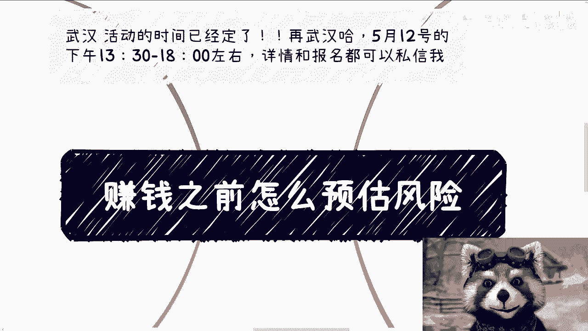

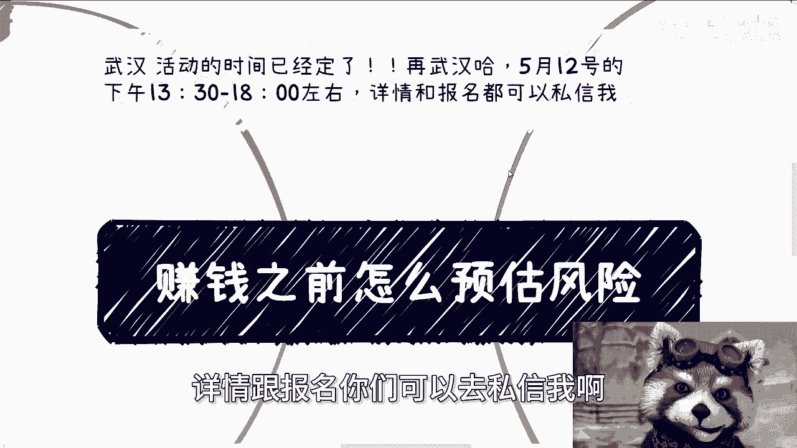

在本节课中，我们将探讨一个在开始任何商业或赚钱项目前都至关重要的问题：如何预估风险。我们将分析风险的不同类型，讨论哪些可以预估、哪些难以预料，并提供一些基本的思考框架。

---

## 概述

风险是商业活动中不可避免的一部分。很多人渴望赚钱，却不愿承担任何风险，这是一种不切实际的想法。本节课旨在帮助你理解风险的本质，区分可预估与不可预估的风险，并建立对商业风险更现实的认识。

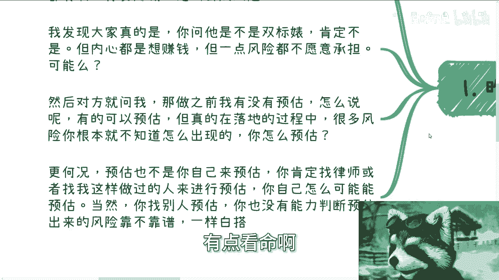

---

## 一、 风险的本质与普遍存在

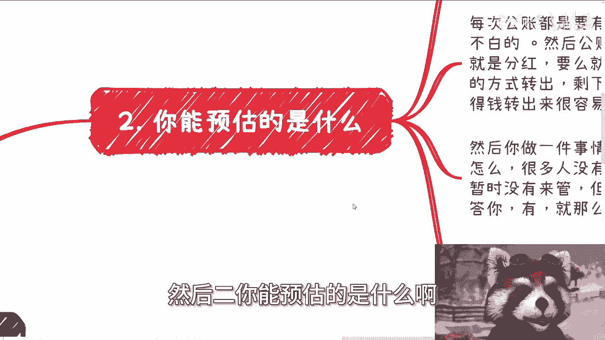

上一节我们概述了课程内容，本节中我们来看看风险的本质。

赚钱必然伴随风险。当被问及风险时，只能回答“有风险”，因为这是社会的常态。你无法预知所有风险，也不可能完全避开所有风险。期望在赚钱过程中不承担任何风险，是一种矛盾的想法。

商业世界充满变数，许多风险在项目落地过程中才会显现，甚至有些风险的出现方式完全出乎意料。

---

## 二、 可预估的风险有哪些？

了解了风险的普遍性后，我们来看看哪些风险是相对可以提前预估的。

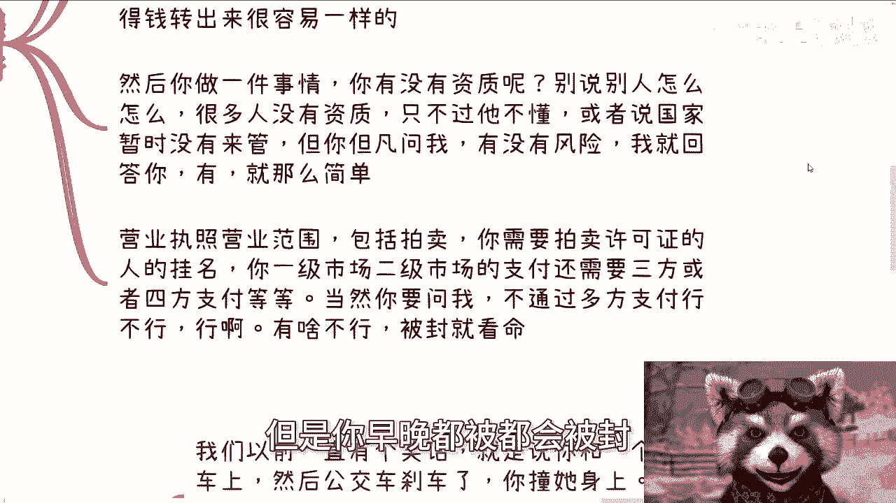

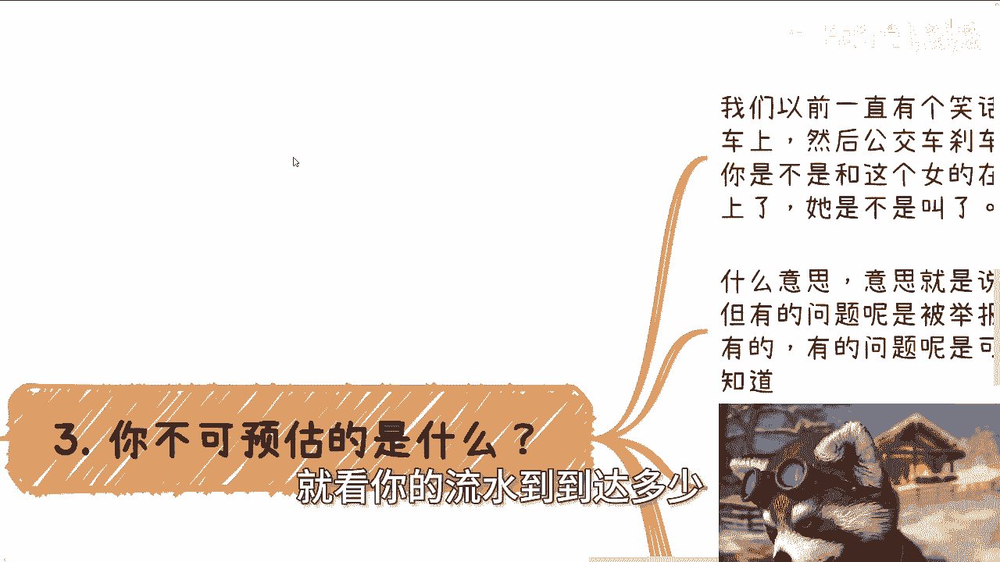

许多人觉得没有风险，往往是因为无知。最普遍、最基础的风险通常出现在资金路径上。以下是几个关键的可预估风险点：

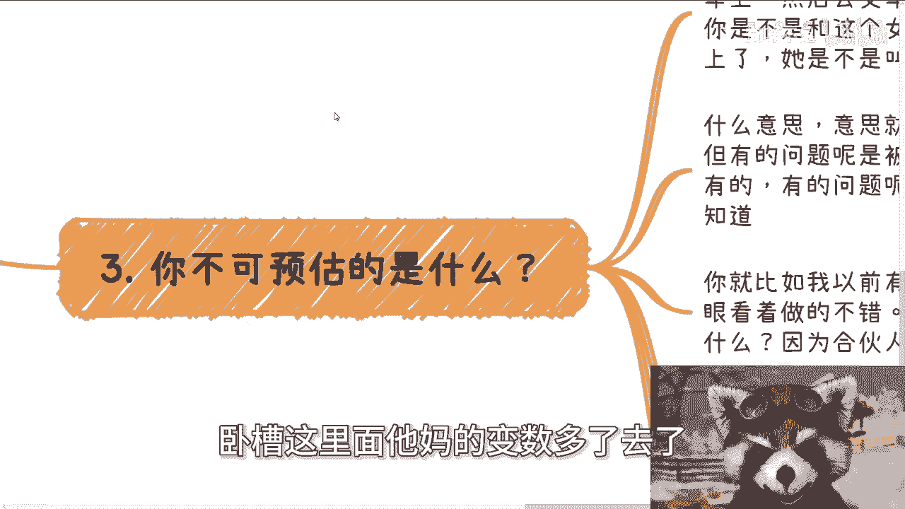

*   **收款与出金路径**：资金如何进入公司账户（公账），又如何从公账转到个人账户（私账）。
*   **公账转私账的合规性**：除了工资、分红等，公转私通常需要对应的合同、发票或借款协议。随意转账存在税务和法律风险。
*   **业务资质**：开展业务是否需要特定许可证或资质（如拍卖许可证）。无资质经营是常见风险源。
*   **支付渠道**：涉及线上交易时，是否需要接入合规的三方或四方支付平台。个人账户直接进行大额业务收款，支付渠道有被封停的风险。

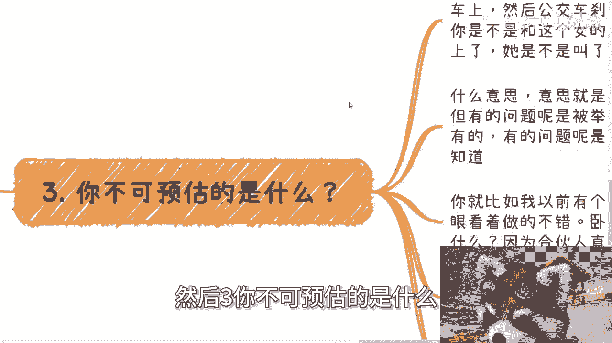

**核心公式/概念**：
`合规的资金路径 = 对应合同 + 准确记账 + 合法资质 + 合规支付渠道`

需要注意的是，即使没有资质或使用非正规渠道，业务也可能进行，但这意味着风险始终存在。风险何时爆发，取决于业务规模、城市监管力度等多种变量。

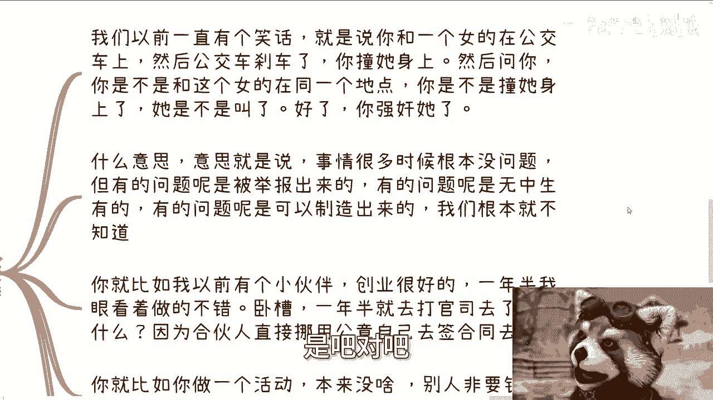

---

## 三、 不可预估的风险是什么？

认识了可预估的风险后，我们必须正视那些更棘手、更难以预料的威胁。

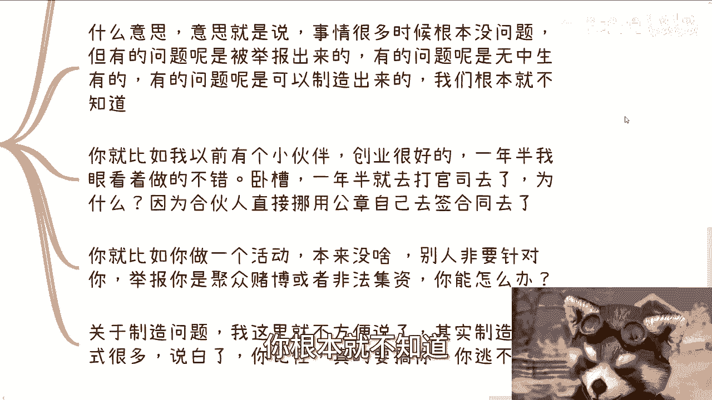

不可预估的风险多种多样，且往往更具破坏性。碍于敏感性，无法详述所有，但可以举例说明其特性：

1.  **无中生有的举报与舆论风险**：即使你的业务完全合法，也可能被恶意举报（例如，正常活动被举报为“赌博”或“非法集资”），导致调查和舆论风波，消耗你的时间和精力。
2.  **合伙人与内部风险**：例如合伙人私自挪用公章签署合同，这种来自信任伙伴的背叛极难预防。
3.  **被恶意制造的问题**：商业竞争中，对手可能利用规则、舆论或关系网络为你制造障碍。许多刚出校园的创业者，尚未见识过真正的商业恶意。

其核心特点是：**风险并非源于你做错了什么，而是可能被外部力量强加于你。** 一旦有人蓄意针对，很难完全规避，只能面对和处理。

---

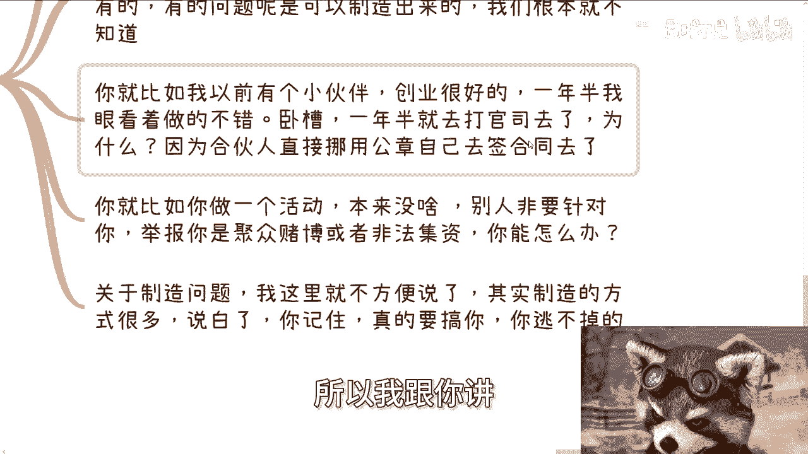

## 四、 关于“合规”副业的思考

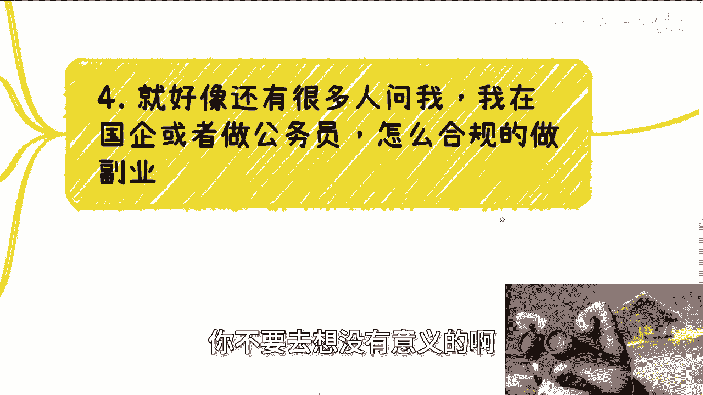

在讨论了内外部的风险后，一个常见的问题是：在职人员如何“合规”地开展副业？

对于国企员工或公务员等群体，想寻找完全“合规”的副业路径非常困难。

*   **于理（规定）**：多数劳动合同或单位规定明确禁止或限制员工从事副业、担任法人等。即使规定未明确写明，一旦副业产生影响，单位有多种依据进行干预。
*   **于情（人情）**：从管理者（资本家）角度看，员工从事副业通常意味着工作不饱和或精力分散，天然不受欢迎。

**核心观点**：规定是死的，执行是活的。执行时的弹性空间往往更倾向于资方或地位高的一方。所谓“合规”副业，很多时候只是一种未被追究的状态，而非真正的制度允许。当你的副业金额变大或引人注目时，潜在风险就会增加。

不要寄希望于找到完美的“合规漏洞”，而应清醒认识到其中的潜在冲突和风险。

---

## 总结

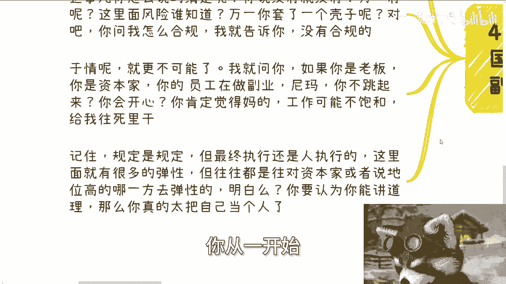

本节课我们一起学习了如何理性看待赚钱前的风险预估。

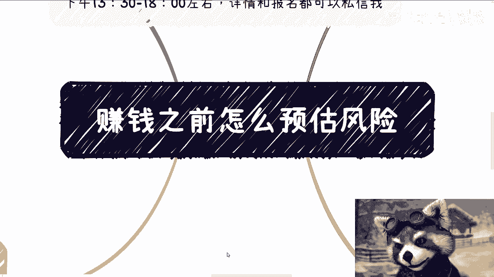

1.  **风险必然存在**，追求零风险是不现实的。
2.  **可预估的风险**主要集中在**资金路径、资质、支付**等基础合规层面。
3.  **不可预估的风险**往往来自**外部举报、内部背叛、恶意竞争**等，防不胜防，需保持警惕和应变能力。
4.  对于**在职人员的副业**，所谓“完全合规”路径极少，更多是在灰色地带行走，需认清其中的人情与规则风险。

商业之路充满不确定性，理解风险不是为了逃避，而是为了在前行时更加清醒和坚韧。真正的能力不仅在于预判风险，更在于风险来临时的应对和解决能力。

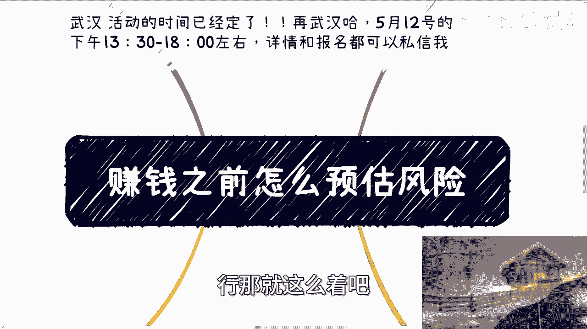

---
（武汉活动及咨询服务信息略）