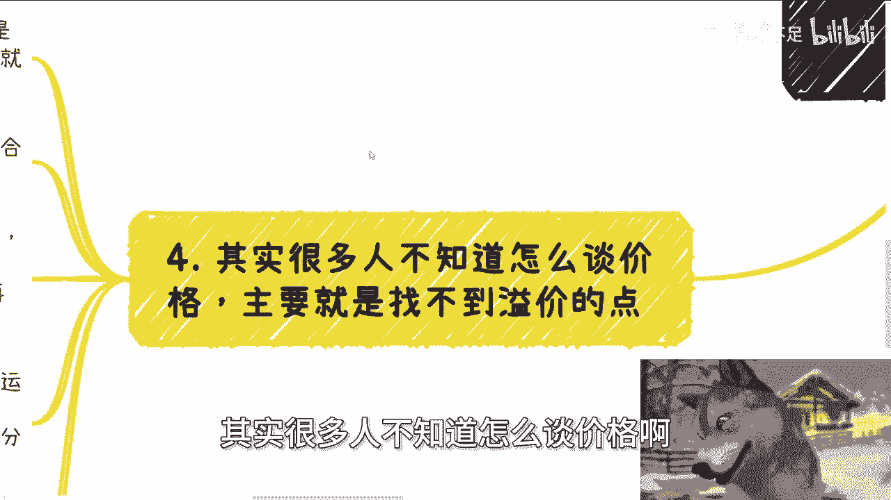

# 课程名称：赚钱的本质与溢价策略 - P1

## 📚 课程概述

在本节课中，我们将要学习赚钱的核心本质。我们将探讨“溢价”的概念，并深入分析其两大基础：信息差与满足需求。课程将结合具体案例，帮助你理解如何在商业活动中合理构建并获取溢价，从而摆脱单纯的“执行层”思维，实现更高的商业价值。

---

## 💰 赚钱的本质是溢价

赚钱的本质就是获取溢价。

许多人一听到“溢价”就本能地抵触，认为这是不合理的。这种想法需要纠正。这就像一些人，在团队内部时自信满满，但一到对外谈判价格时就变得怯懦。他们认为产品或服务应该“实事求是”地定价，不应包含溢价。

记住：如果你始终抱有这种“执行层”或“打工者”的思维，那么无论你从事商业还是投资，你的行为模式都会让你停留在底层角色，本质上是赚不到钱的。说得更直白一点，就是无法获得超额利润。

---

## 🎨 包装与画饼的必要性

上一节我们介绍了赚钱的本质是溢价，本节中我们来看看为何需要“包装”和“画饼”。

过去有些学员质疑，认为教授“包装”和“画饼”是在教一些“有的没的”。我们可以回顾10到15年前，那些与风险投资（VC）谈判的创业者，哪一个不画饼？如果你连未来的蓝图（饼）都描绘不出来，别人如何相信你能赚到钱？

请审视你自己或周围的人：一个连“饼”都画不出来的人，能赚到大钱吗？这几乎是不可能的。

第二，关于“实事求是”。你可以选择在商业中完全实事求是，这是你的自由。但结果往往是：你赚不到钱。因为你没有溢价空间。

以下是两个“实事求是”定价导致无法盈利的例子：

1.  **软件开发**：假设一个软件成本为10万元，算上税收、差旅等所有开销，总成本为15万元。如果严格按照成本报价15万元，甚至只报10万元，那么你将没有任何利润。多报一分钱都可能被指责为“割韭菜”。这样你可以完成交易，但无法赚钱，甚至可能亏本。
2.  **餐饮案例**：假设一份鱼香肉丝的综合成本是10元。如果你坚持只卖10元，那么你将无法覆盖租金、人工波动、营销等潜在风险，利润空间为零。

因此，不构建溢价，你可以做成生意，但很难赚到钱。

---

## 🔍 溢价的两大支柱：信息差与满足需求

我们明白了溢价的重要性，也知道了需要包装。那么，溢价具体从何而来？它主要建立在两大支柱上：信息差和满足需求。

**信息差**源于“隔行如隔山”。当你掌握对方不了解的信息时，就拥有了议价权。

**公式**：`溢价空间 ≈ 信息不对称程度 × 需求强度`

例如，为文旅客户提供文创产品服务。你可以不仅提供设计，还提议搭建一个“文创软件平台”，并融合区块链、人工智能等概念。客户对文创设计有预算概念，但对这样一个综合性软件平台的合理成本（比如20万）毫无概念。这时，你基于其未来价值（如高效产出、技术前沿性）报价100万或150万，是完全可能的。

对方如果拒绝，通常不是因为觉得价格高（他们不懂行），而是因为预算不足。但关键在于，你不能干巴巴地报价。你需要通过“包装”和“画饼”，将这个平台的价值描绘出来，比如：
*   它不仅能做文创，还能实现A、B、C、D等多种功能。
*   它能契合国家政策方针，满足不同区域的战略需求。
*   它为客户提供了未来的想象空间和扩展性。

**想象空间就是溢价空间**。这就像投资领域，一个初创公司如果只有当前业务，估值可能很低；但如果它有一个宏大的、有说服力的未来故事，估值就能大幅提升。

---

## 💡 如何找到并表达溢价点

很多人并非不知道如何谈判，而是找不到产品或服务的“溢价点”，提供的永远是“执行层”的价值。

例如，一个资深运营，月薪3万（日均约1400元）。如果他以自由职业者身份接项目，报价方式可能是：单次视频策划+文案+发布收费3000元，包月（如12次）收费6万元。

这个价格甲方可能会接受，但很难再提高。因为甲方虽然不懂具体操作，但会对标市场薪资和外包行情。运营工作的“可见”产出差异不大，溢价空间自然受限。

**那么，如何卖出高价？你必须学会“讲故事”，提升价值的维度。**

就像一份成本不菲的牛肉：
*   **平庸卖法**：将牛肉放在盘子里，标价1600元。无人问津。
*   **高级卖法**：将牛肉做成“千里江山图”的造型，配以汉服舞蹈表演，营造独特的文化用餐体验。这时，1600元的价格就可能被接受。

**核心在于，你卖的不再是“牛肉”（执行层），而是“文化体验”（价值层）。**

这个道理在To B（对企业）、To G（对政府）的业务中同样适用。你不能只交付一个功能软件（牛肉），而要交付一套“数字化转型解决方案”（文化体验）。你不能只提供运营服务（发视频），而要提供“品牌影响力提升与用户增长策略”（战略价值）。

---

## 📝 课程总结

本节课中我们一起学习了赚钱的核心逻辑。

1.  **赚钱的本质是获取溢价**，抵触溢价是“打工者思维”，会限制你的收入上限。
2.  **“包装”和“画饼”是必要的商业手段**，它们为产品和服务赋予了想象空间，这是支撑溢价的基础。
3.  **溢价来源于信息差和满足需求**。利用你懂而客户不懂的信息差，并深度挖掘乃至创造客户的需求，才能构建坚实的溢价基础。
4.  **找到溢价点的关键在于提升价值维度**。不要只停留在交付“执行层”的成果（如代码、文案），要善于“讲故事”，将你的服务包装成能解决更高层次问题、带来更大价值的解决方案。

希望你能理解，溢价不是欺骗，而是对价值更深层次的挖掘和呈现。掌握这项能力，是你在商业世界中从“执行者”迈向“价值创造者”的关键一步。

---
*（注：文中提到的线下活动信息已按原文保留，但非课程核心内容。）*