# 赚钱本身就不具备普适性，具备普适性的是？ - P1 - 赏味不足 - BV1MZH7eyE4q

啊大家好啊，今天我们来讲的这个主题啊，叫做你，你首先大家能看到这个线啊，今天不止四根啊，首先我们今天来讲的这个主题呢叫做赚钱，本来就不具备普适性啊，具备普适性的事啊。

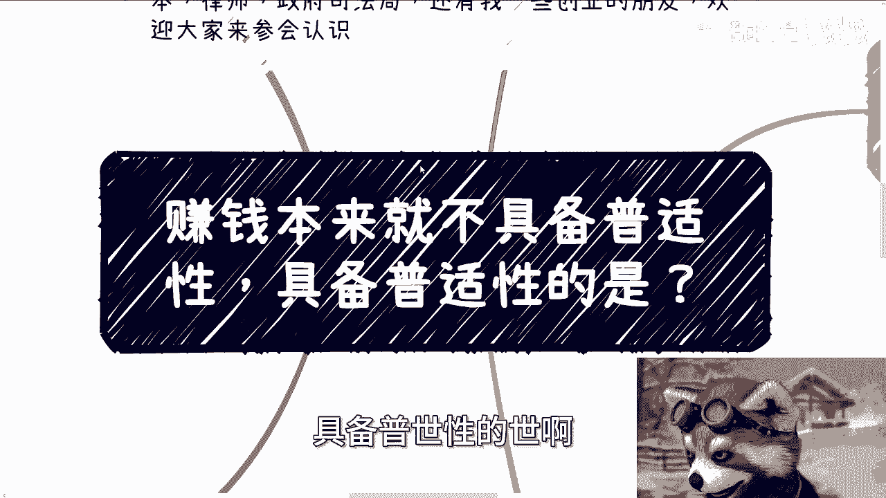

这个待会我会说，但是呢你们自己想，为什么呢，因为网络上没法说的太明显是吧。

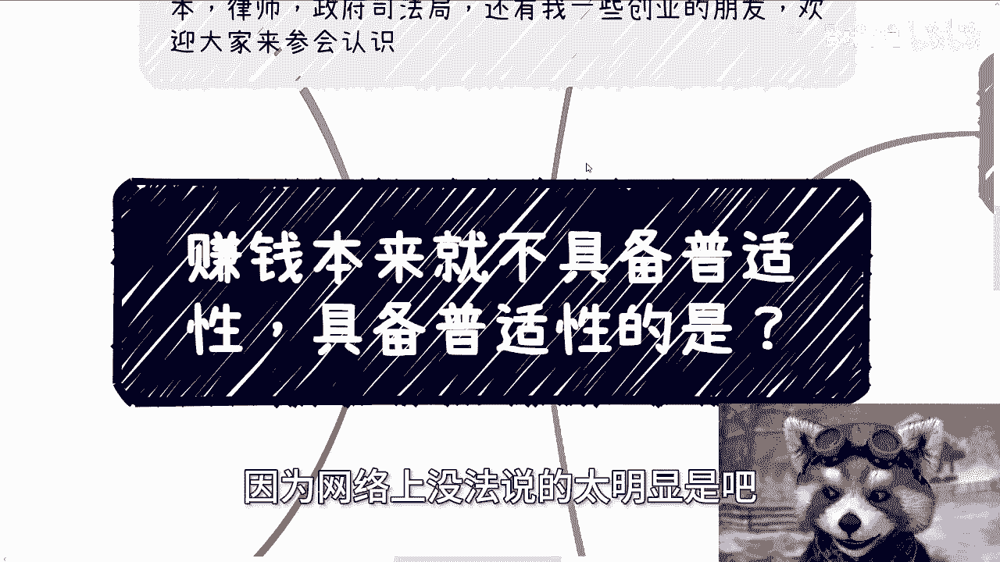

嗯首先下一期活动已经定了好吧，9月8号在上海啊，本期是2024年的第二期数字经济大会，详情的话呢可以见评论区的报名链接啊，在报名链接里面有详细的议程啊，还有我请的这个嘉宾，那么我也找了呢，资本啊。

律师啊，的这个领导的支持啊，还有我的一些这个呃创业的一些小伙伴，那么欢迎大家过来参加啊，同时能够跟这些人多认识认识啊，那首先我们今天先来说啊，就是我今天又要变成海马区博主了。

是吧啊，就你会发现啊，很多人TMD不关心自己啊，不说任何上下文啊，就是开口闭口就是普适性啊，就是要操作啊。

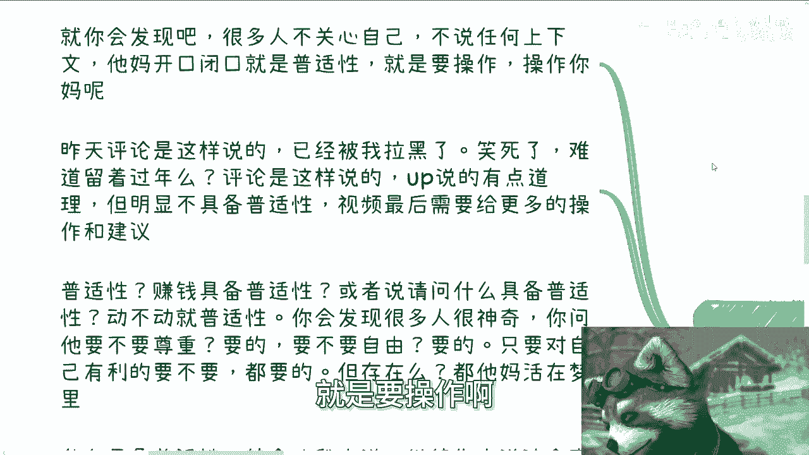

我想要实践啊，我就在妈在想嘛，实践你妈呢在实践啊。

那昨天评论是这么说的啊，虽然已经被我拉黑了啊，我就笑死呃，不拉黑怎么滴，难道留着过年吗，是吧啊，评论区是这么说的，他说啊up说的有道理啊，首先我不是一个up主啊，不不要用这种自媒体的方式来称呼我啊。

没必要，第二呢啊但就是说他是这么说，他说啊，明显呢这个up讲的东西不具备普适性，那然后他最后说了一嘴叫做视频，最后需要给更多的操作跟建议啊，哼那把我说笑了，第一普适性赚钱具备普适性吗。

啊或者请问什么东西具备普适性，对不对，你们自己想想看啊，动不动就朴实性，你会发现很多人很神奇，你问他要不要尊重要的，要不要自由要的，那请问自己的呃，就是你问他是不是说对自己有利的，都要不要，他说都要的。

但是请问存在吗，对不对，存在吗，你跟我说尊重也好，自由也好啊，然后说对自己有利的，有普适性吗，有吗，活在梦里是吧，哦什么具备普适性，待会后面我会来说的啊，我们继续先来讲这个事啊，说最后要给建议跟操作的。

我就说尼玛啊，我他妈这一年视频白做的，是不是你别的东西也不看，别的东西也不说啊，就给我来一句啊，最后怎么不不不给我一点时间，不给我的操作，别的东西不看，你问我要对不对。

你就好像另外两个事我也特别不理解啊，百思不得其解，一个呢就是我所有的描述当中，你们往前翻对吧，所有的描述当中都写了x min对吧，在在在那个描述当中啊，至今无数的人问我，他说陈老师这个软件叫什么。

而且我每次我还特别去看一下，都是些985211，然后问我爱车老师这个软件叫什么，不会看呐，啊你学校大学就是这么读的啊，然后还有那种各种私信问我要XL的文件的，哎不是就是视频里面，我所有的视频里面。

所有的文字是不是都给你们看，我没有任何藏着掖着吧对吧。

你就懒到这种程度吗。

对不对啊，第二好，我们来讲普适性啊，我们今天打开天窗说亮话啊，普适性两个问题，什么东西有普适性，以及我们为什么需要普世性啊，有的人一下子可能就会想到医医药医疗对吧好，我们首先想想看啊。

我们平时小毛小病配药，或者来说老一辈啊，我们的上一代上上一代啊，跟我们讲的一些注意事项。

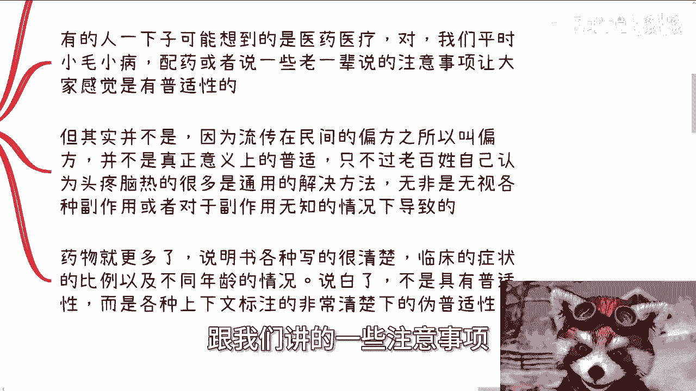

让大家感觉可能会有普适性，比如说你感个冒啊对吧，这个发个烧啊啊干嘛啊啊。

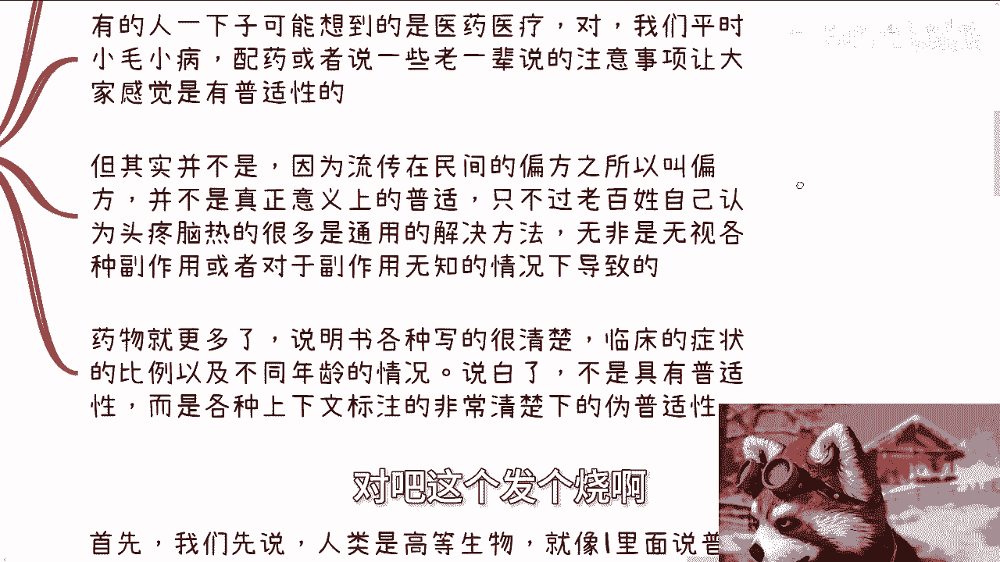

都是大家可能都会有一些叫做什么，叫做日生活日常小贴士啊。

但其实你仔细想想看，这是叫普适性吗，不是啊，因为流传在民间的这种方法也好，偏方也好，它之所以叫之所以是流传在民间，它并并不是真正意义上的普世啊，他只不过是因为以前互联网不发达，或者以前就是就是老。

就是大家都生活比较苦嘛对吧，就一一代一代人的这个经验传承下来，让老百姓自己认为，比如说头疼脑热啊，或者很多小小毛小病啊，都有都有通用的解决方法，但是是真正通用吗，并不是啊对吧，老百姓认为的通用的方法。

无非是无视了各种副作用，或者说对于副作用无知的情况下面导致的，我们随便举个例子啊，比如说今天你认为感冒发烧的解决方案是A，对不对，好，那么我们相信在地球的某一些地方，你的这个解决方案。

方法A可能并不能解决感冒发烧，甚至还会致死，你知道吗，你不知道对吧，那这叫普适性吗，不是啊，是不是，那药物就更是了，说说明书上各种写的很清楚，包括临床的症状的比例以及不同的年龄段，说白了药物本身。

也比如说你说你说大家也会觉得啊，我我今天喝个什么999感冒灵对吧，怎么样子，你说这叫朴实性吗，这不叫对吧，这更多的是什么，就是说临床的症状比例，包括他的伤害程度可能不一样对吧。

来在说明书上各种上下文都标注的很清楚，所以说你会发现这叫什么，这叫帮你已经把各种上下文已经说的很清楚，包括有害信息，包括一些副作用都说的很清楚的，前提之下的唯普实性啊，这跟这些人跟我讲的说啊，陈老师啊。

我你你你要跟我们讲一些更具有普适性的哦，我对你们也不了解，我对任何东西，你们每个人的性格，各个方面都不了解。

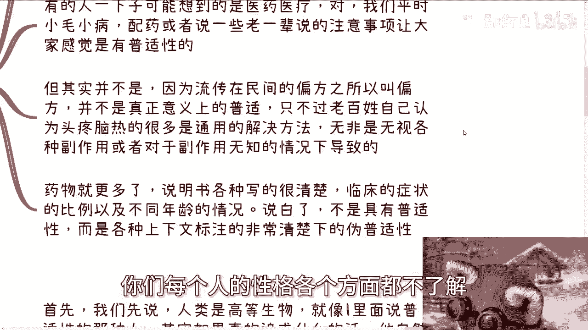

这他妈叫什么，对不对，好第三。

如果啊我们今天就来讲，如果具有普适性，无非就两种可能性，你说有没有有的啊，首先我们先这么说，人类是高等生物，就像我一里面所说的，跟我谈普世性的那种人，其实如果真的追求什么，就是如果他真的自己很。

比如说以自己为主对吧，做了很多事情，赚了很多钱，或者说达到了某些成就对吧，他真正的了解过这个社会，了解过这个这个这个人类，这个社会是什么样子的，他自然就明白不存在普世性，但如果他没有有这种成就。

或者没有这种经验的话，那么普适性本身对他也没有作用对吧，这就是个悖论哦，那么什么会具有普适性，简单来讲就是不分任何上下文，不区分任何每个人的特殊情况下，情况下面一概而论的行为对吧。

那说到这里你们仔细思考一下有哪些对吧，这也是我为什么说就是我只能点到为止，我不能往下去减，对不对，你想想看有哪些一概而论的。

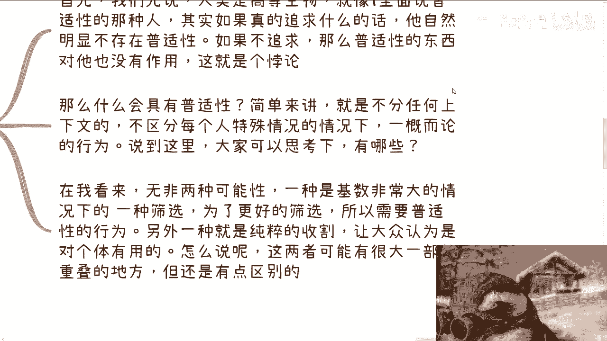

一概而论的多啦啊，那么在我在我看来无非两种可能性啊，一种是基数比较大的情况下面，它进行一种筛选，对不对，和某种行为很相似啊，那为了更好的筛选，所以需要普适性的行为，对不对，那另外一种就是纯粹的收割。

让大众认为这种普适性的行为对个体是有用的，怎么说呢，你会发现我说的前者跟后者有很大一部分，重叠的地方，但还是有点区别的。

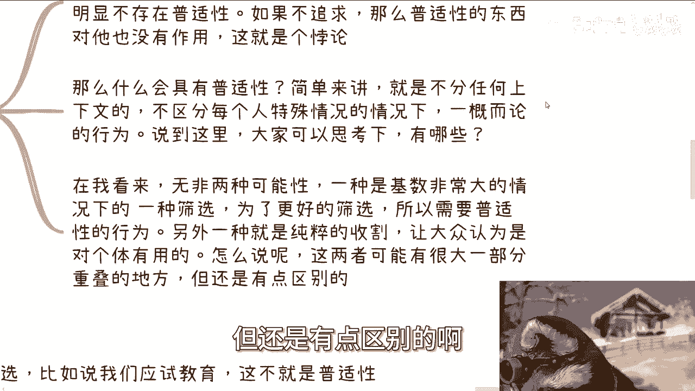

好，我们继续往下讲，我们来举两个例子啊，第一大面积筛选对吧，比如说我们说的应试教育，请问有没有普适性和个体有关吗，对不对，就是如果啊你从你个人角度来讲，你会认为他没有普适性，为什么，因为他没有关哦。

就是你从个体来讲，你你认为他是有普适性的，为什么，因为他不关心你个体是什么，对不对，他管你个体是是什么吗，或者管你管你管你个体有什么特性吗。

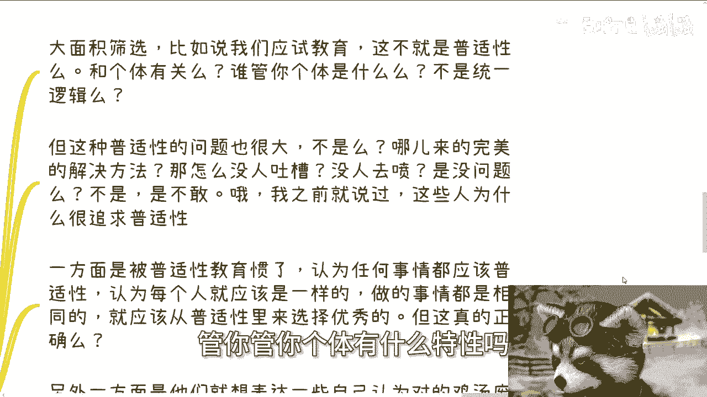

他不这不是统一逻辑吗，不就是所谓的一刀切吗，是不是。

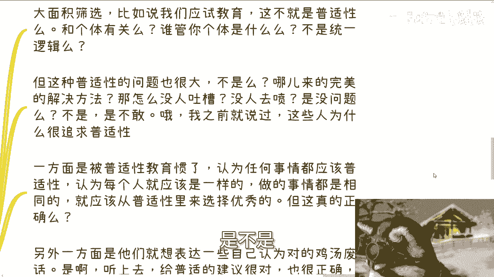

但是同样的你稍微再思考一下，你就会发现这种普世性问题是不是也很大，不是吗，哪来的我完美的解决方案，那怎么没人吐槽呢，没人去喷呢，是真的，这种普适性的解决方案没有问题吗，是吗，不是啊，是他妈不敢。

对不对啊，我之前就说过，这些人为什么很追求普适性，对吧哦，那么一方面为什么，一方面是被普适性教育惯了，认为任何事情都应该是有普适性的解决方案的，他们就是一个二那个二极管，就是认为OK要么普适性。

要么就没有没了对吧，那这就是纯粹二极二极管思维，而认为每个人都应该是一样的，做的事情都是相同的，就应该从普适性里面来选择优秀的，但请问正确吗。

对吧啊，你们用你们读过大学的脑子思考一下，正确吗，另外一方面，他们就想表达一些自己认为对的，鸡汤的一些废话，为什么，因为是啊，他听上去很对呀，比如说哎呀陈老师，你多给一些普适性的建议对吧。

很对呀啊也很正确啊，貌似这话说的很在理啊，但你碰到一些人肯定又要说了，妈的陈老师，为什么要把这种人拉黑，人家说的没没没有毛病，但本质上是什么，他不就是不把自己不把大众当众，大众当人看吗。

因为你但凡当人看，跟我说普适性有用，你不在搞笑吗，你当人看吗，是不是，那么第二种就是纯收割，为什么我说这两者会有一定程度上的交集，因为前前一种啊，从某种角度来讲，其实也是收割。

只不过没有第二种那么的露骨和纯纯粹，所以以前以前我就说过啊，所有的通用性的培训跟麦克，还有什么短视频啊啊短视频啊，电商训练等等等啊，就是说白了就是告诉大家，如果他要告诉你们，只要你去做了。

你根据我的方法论去做了，不管你是谁都会有效果，这种逻辑必然就是收割对吧，这就好像前两天还有人私信来跟我说，哎说老师我这边有一个培训啊，他是先就业后收费的，哎呦我说大哥，我管你先就业后收费。

后后还是还是先收费后就业，所有的事情都是商业利益哦，他不赚钱给你做这个什么，先就业后收费，你怎么地啊，他妈的人，你碰到人人都是菩萨哎，莫名其妙嘛啦，对不对，这就好像什么这就好像哼。

这就好像最近不是在打黑神话吗，这就好像我们就这么说，你是金蝉子啊，你每次在取经，你就觉得你就你你很特殊，你不是沙和尚头上挂着那个骷髅，那凭什么哎莫名其妙了啊，对不对，那前面九个骷髅也是金蝉子啊。

那奇了怪了对吧，然后我们继续说啊，怎么样具备普适性，我就问啊，请问这种培训具备普适性吗对吧，这种收割具备普适性吗，按照这种人这那些人的说法，这些培训这些收割呃，这些所谓的什么先就业后后收费。

怎么样子都具有普适性啊，但是请问对每个人有用吗，请问真的有用吗对吧，所以我觉得还是那句话，这些人都是只要自己不是中招，那个人站着说话不腰疼，但凡自己是受害者，自然就要说了，哎呀太有普适性啦。

这种不是根据每个人情况给的东西，都他妈是骗子，是没毛病啊，反正嘴巴两片肉。

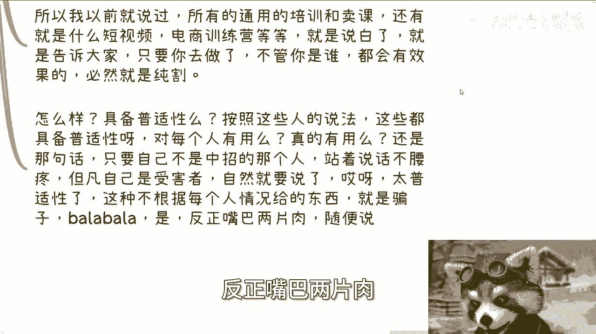

他妈的随便他们说，对不对啊，第五啊。

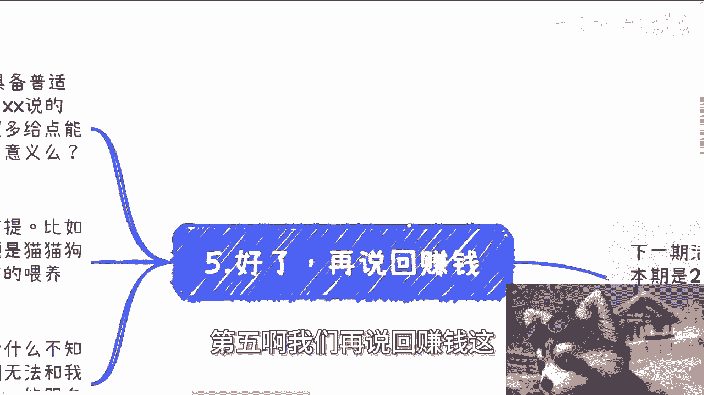

我们再说回赚钱这个逻辑啊，正确的废话真的是很无敌的对吧，他说就像我之前说的，他说up主说的赚钱并不具有普适性，屁话这他妈还需要他们说啊，那我也会讲的呀，哎某某某说的很对啊，但是清华北大并具备呃。

我就这么说吧，啊某某某说什么，9年制义务教育加高等高等教育，说的很对，但是呢清华北大并不具备普适性对吧，对于普罗大众来讲，并不是每个人都能上清华北大的，还希望啊各位专家或者相关的这些政府领导。

多给我们一点能够上清华北大的实践，我我说这句话对吗，来你们想看对不对，看似很有道理，请问本质有意义吗，本质有意义吗，对你们对我有改变吗，不影影不影响考上清华北大，影不影响整个的这种筛选的机制，影响嘛啦。

不影响他，这不是屁话吗，有什么用呢对吧。

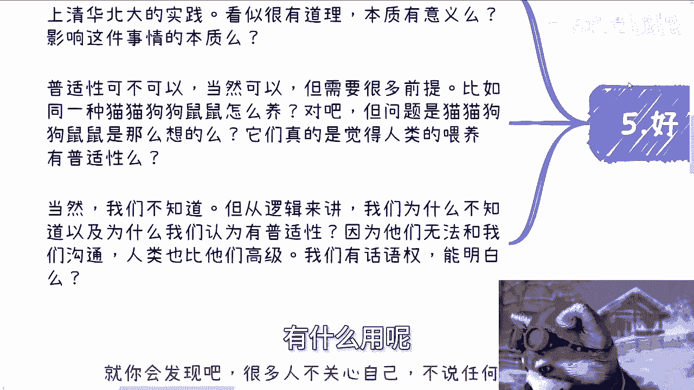

普适性可不可以啊，当然可以啊，但需要很多前提啊，我举个例子，比如说对吧，我们同一种猫猫狗狗，就同一个品种的猫猫狗狗，鼠鼠兔兔怎么养对吧，但问题是你们有没有想过人类去养这些东西，你养这些生物啊。

你你同一个类那个种类的生物对吧，懂同一个属性的生物种类的生物，你你说你问题是猫猫狗狗，鼠鼠兔兔，人类都是同一种方法去饲养的，但是猫猫狗狗鼠鼠兔兔是这么想的吗，他们真的觉得人类的喂养具有普适性吗。

或者他们真的喜欢人类的普适性的喂养吗，当然我们不知道，但是你从逻辑来讲，我你想想看，我们为什么不知道，以及为什么人类觉得有普适性，是因为他们无法跟我们沟通，是因为人类比他们高级。

是因为我们的地位比他们高，我们有话语权，你们能明白吗。

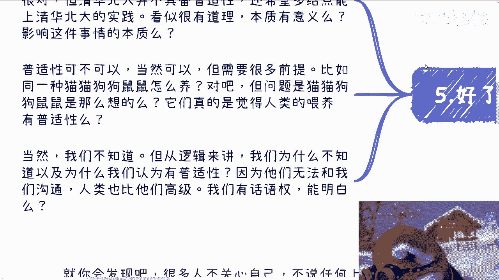

对不对，你们再仔细回想回想，所有的东西啊，我们以前一直讲过一个一个一个笑话叫什么，就是很多时候，某些组织啊或者某些人，他是既是裁判员又是运动员，对不对，而我们也知道很多东西规则也是人定出来的。

不存在所谓的真理，那你跟我说普适性怎么个普适性法啊，我说直白一点啊，我觉得我最后可以总结一下，你如果今天是个韭菜，你不要来跟我谈普适性，你如果今天是个镰刀，那请你把普适性做做好，对不对，就这么简单。

你不要来问我为什么，因为社会就是这么发展的，就是这么运作的对吧，你要是是个韭菜，你反而来跟我谈普世性，你怕不是割的还不够疼。

好吧啊，先这么照啊啊，那个下期活动9月8号好吧，在上海，然后报名的话，反正评论区可以直接报名啊，详情也可以直接评论区看，然后剩下的话就是说那个工作上面职业规划啊，包括你们做副业啊，跟别人合作做商业啊。

这个to b to g的或者to高效的啊，你们在这里面涉及到一些合同啊，呃什么分红啊，丰润啊对吧，这个估值啊啊个股份啊对吧，相关的包括一些发展规划相关的，你们希望通过我的认知，通过我的一些视野啊。

能够跟你们沟通之后，给你们一些更接地气的建议和规划的话，那么你们可以整理好对应的问题跟个人背景，好吧，我们再来做咨询啊。

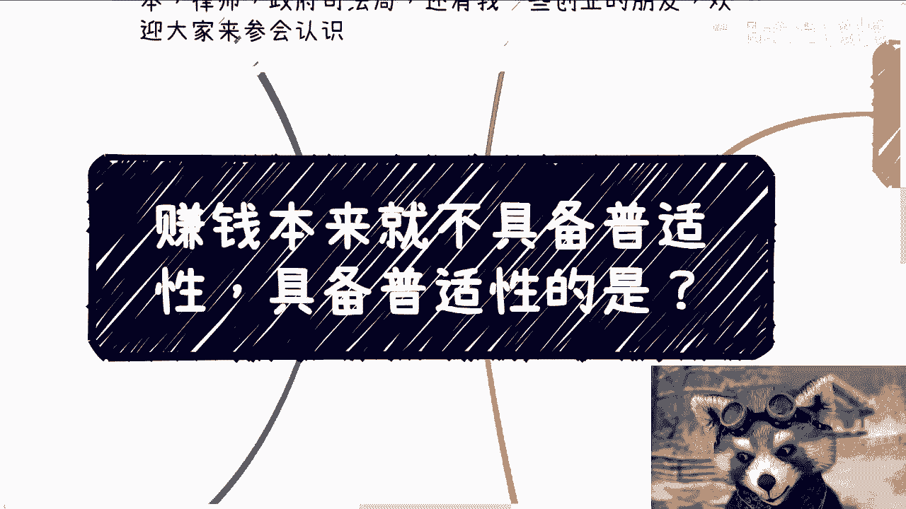