# 赚钱本身就不具备普适性-具备普适性的是----P1---赏味不足---BV1MZH7eyE4q_no

在本节课中，我们将要学习一个核心观点：**赚钱本身不具备普适性**。我们将深入探讨“普适性”这一概念的真实含义、它通常适用的场景，以及为什么盲目追求普适性解决方案在个人发展（尤其是赚钱）上往往是无效甚至有害的。通过本课，你将学会如何更理性地看待网络上的各种“方法论”和“建议”。

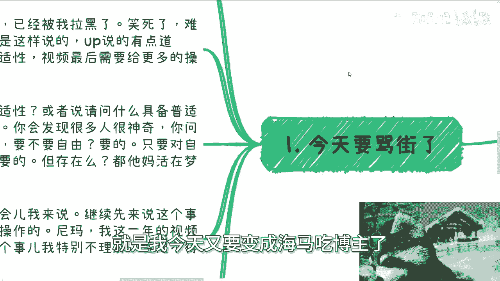

---

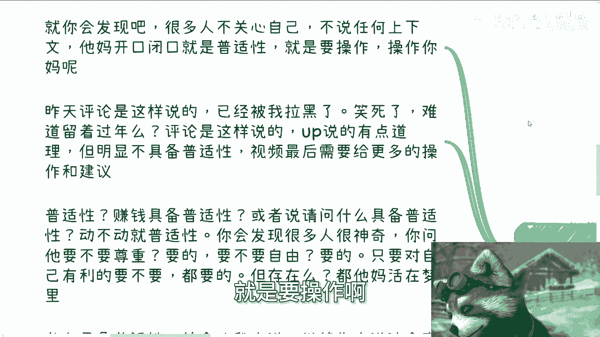

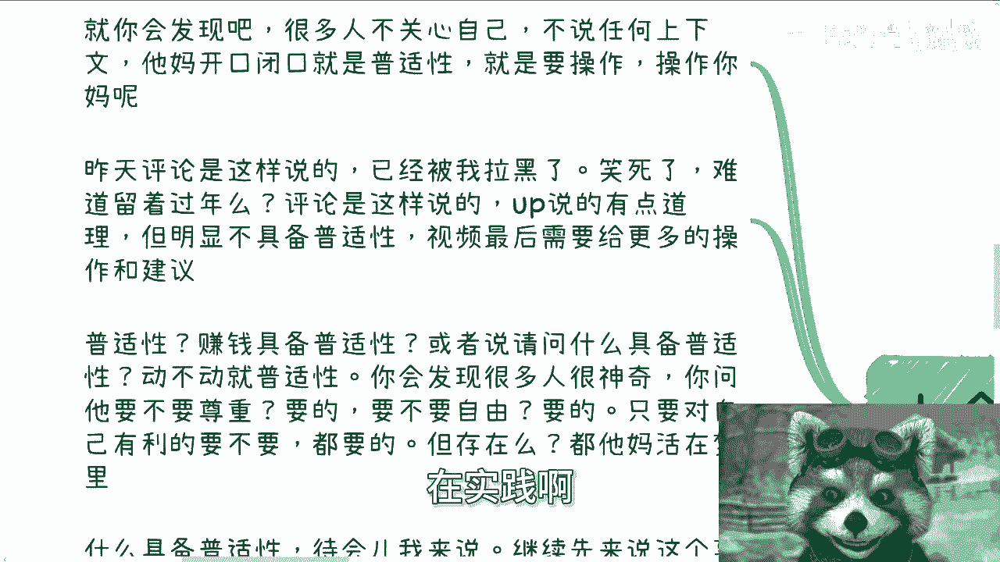

## 概述：普适性的迷思

很多人开口闭口就要求“普适性”的赚钱方法或操作建议。他们认为应该存在一种放之四海而皆准的解决方案。然而，这种思维本身就是有问题的。

赚钱这件事，与个人的背景、资源、性格、时机紧密相关，根本不存在对所有人都有效的“普适性”路径。真正具备某种“普适性”的事物，往往另有玄机。

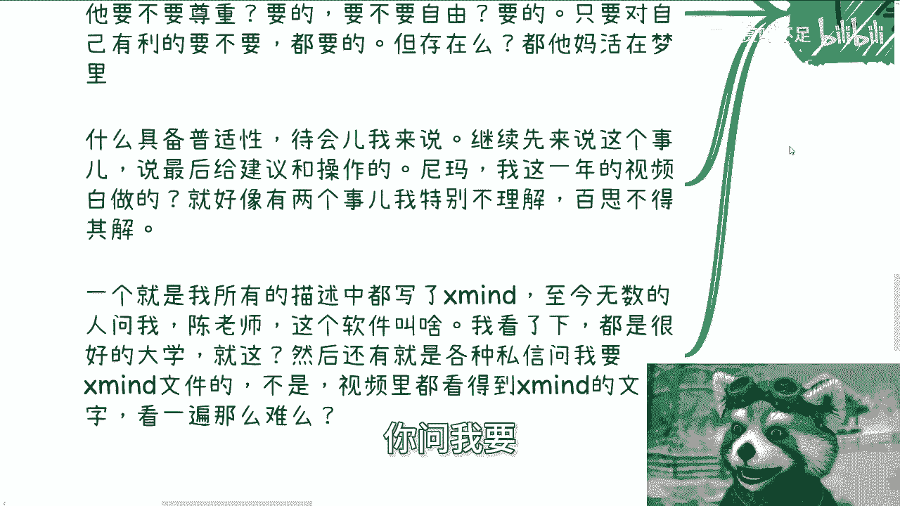

---

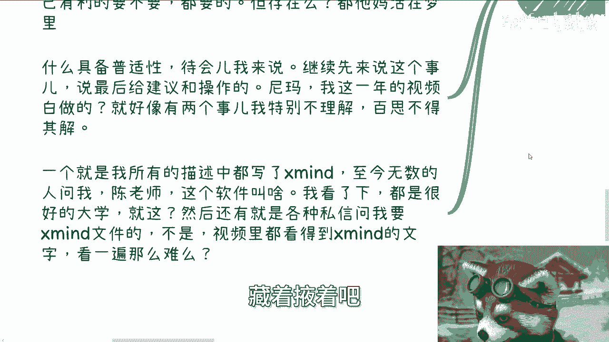

## 对“普适性”要求的批判

上一节我们概述了核心问题，本节中我们来看看那些要求“普适性”建议的言论本身存在的问题。

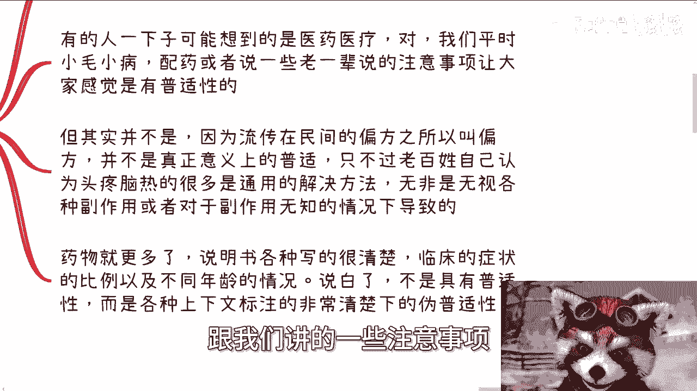

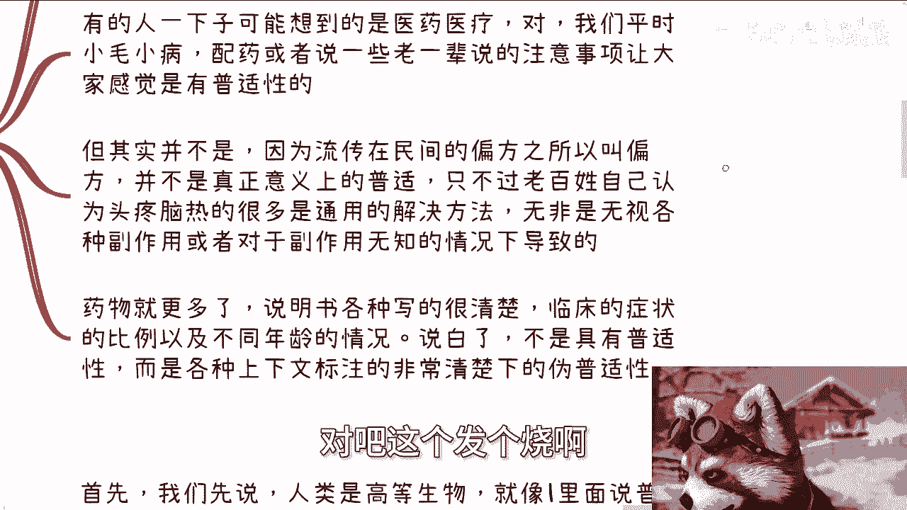

很多人不关心具体背景和上下文，只是一味地索要具有“普适性”的操作和实践方法。这种要求是懒惰且不切实际的。

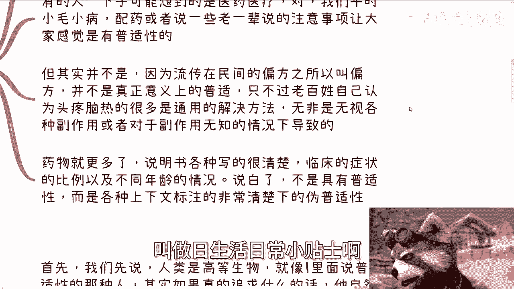

例如，有评论会说：“UP主讲的东西不具备普适性，视频最后需要给更多的操作跟建议。”这种言论存在几个谬误：
1.  它无视了UP主长期分享的大量公开信息和工具（如视频描述中注明的软件名称）。
2.  它假定存在一种无需考虑个体差异的通用成功法。
3.  它本质上是希望不经过自己筛选和思考，直接获得“喂到嘴边”的答案。

这种行为就像明知软件名称写在描述里，却反复追问“这个软件叫什么”；或者明明所有数据都公开在视频里，却私信索要原始文件。**这并非寻求知识，而是逃避主动获取信息的责任。**

---

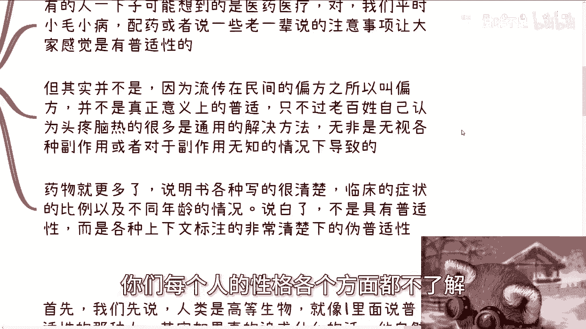

## 什么东西真正具备“普适性”？

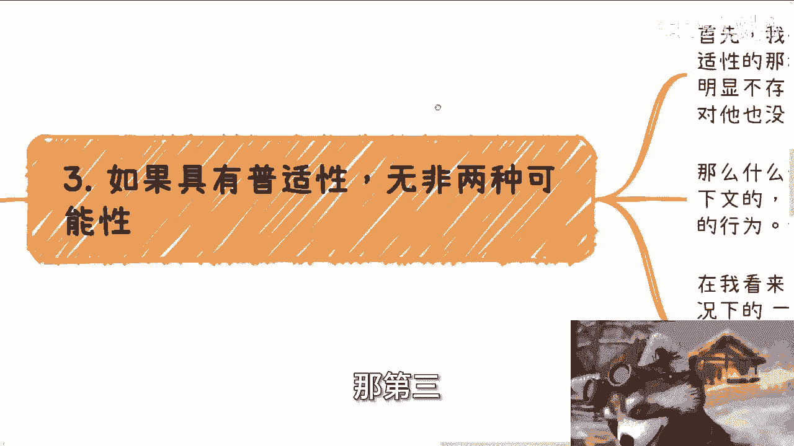

既然赚钱不具备普适性，那么什么东西会被认为是“普适”的呢？本节我们来剖析“普适性”通常出现的两种场景。

人们常认为医疗或生活常识具有普适性，比如感冒发烧的通用处理方法。但这其实是一种误解。

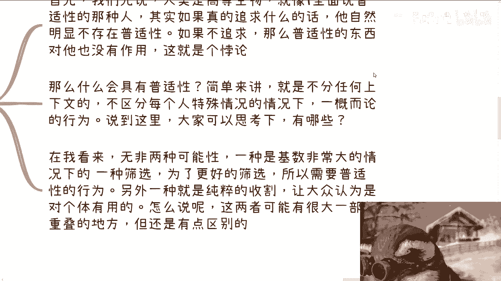

*   **民间偏方或常识**：这些方法之所以“通用”，是因为在信息不发达的时代，经验被简单传承，并**无视了副作用和个体差异**。地球上某些地方，同样的方法可能无效甚至致命。这并非真正的普适性。
*   **现代药物**：药物说明书会详细列出适用症状、人群比例和副作用。这是在**明确所有上下文和限制条件后**的“有限普适性”，与那种不分青红皂白、一概而论的“普适性”有本质区别。

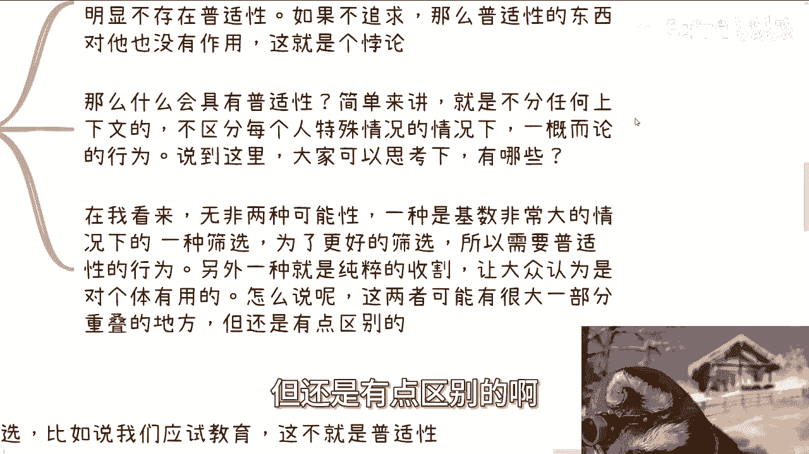

那么，什么样的事情会追求“不分上下文、一概而论”的普适性呢？无非是以下两种情形，它们通常与“为个体好”无关：

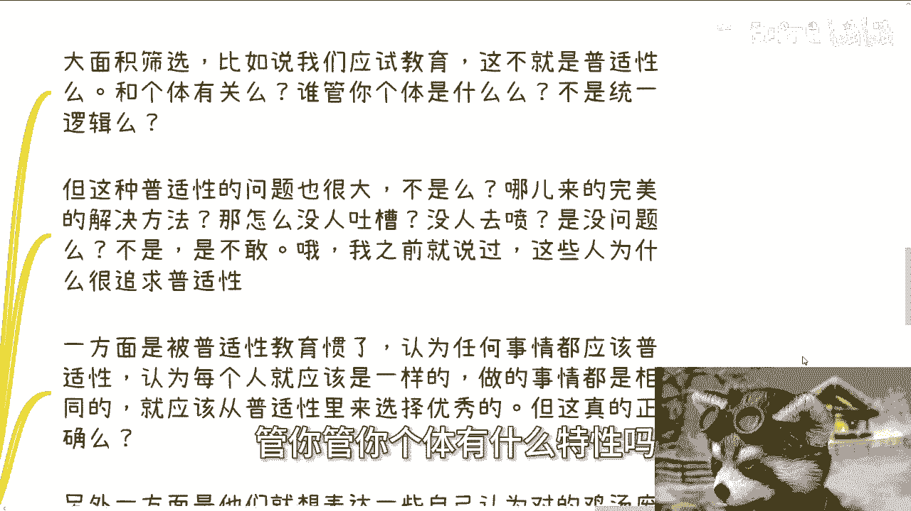

以下是两种追求“普适性”的真实场景：

1.  **大规模筛选机制**：例如**应试教育**。它不关心每个学生的独特个性与天赋，采用统一的标准和流程进行筛选。从系统角度看，它具有“普适性”；但从个体角度看，它恰恰是“不关心个体”的体现。这种“一刀切”的普适性本身问题很大，但往往因为系统力量强大而无人敢公开质疑。
2.  **纯粹的收割行为**：例如许多声称“照做就能成功”的**通用培训、课程或商业模式**。它们宣称自己的方法论适用于所有人，其核心目的不是教育，而是利用人们追求简单答案的心理进行商业收割。这种“普适性”承诺是诱饵。

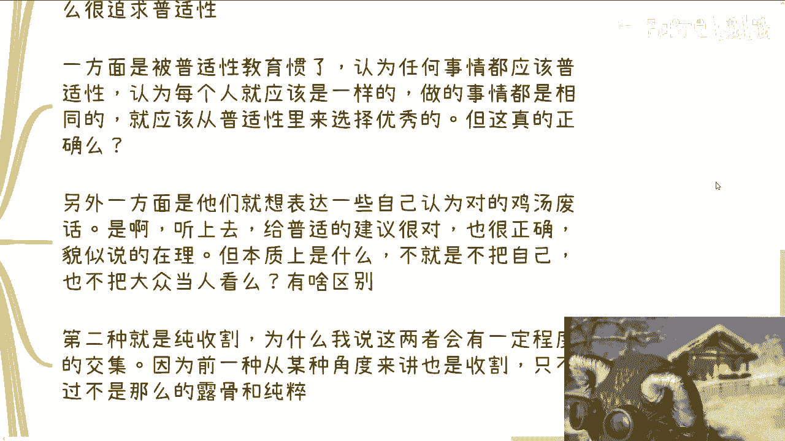

**这两者常有交集**。第一种筛选机制，从另一个角度看，对大多数无法脱颖而出的人而言，也是一种时间、精力和金钱的“收割”。

---

## 重新审视“赚钱”与“普适性”的关系

我们分析了普适性的两种常见面孔，现在让我们回到“赚钱”这个话题，看看追求普适性建议为何是徒劳的。

要求赚钱方法具有普适性，就像说“清华北大不具备普适性，请给更多上清华北大的实践”一样，是**正确的废话**。它听起来有道理，但对改变现状毫无意义，既不影响录取机制，也不能帮助特定个体考上名校。

这种思维背后有两个原因：
1.  **被“普适性”教育驯化**：长期经历“一刀切”的系统训练，导致一些人形成了二极管思维，认为凡事要么有通用解，要么无解。
2.  **表达安全的“正确废话”**：要求“普适性建议”在表面上政治正确、无可指摘，但实质是空洞的，因为它默认了“个体不重要”的前提。**但凡把他人当作有血有肉的个体来看待，就不会轻易说出“普适性”这个词。**

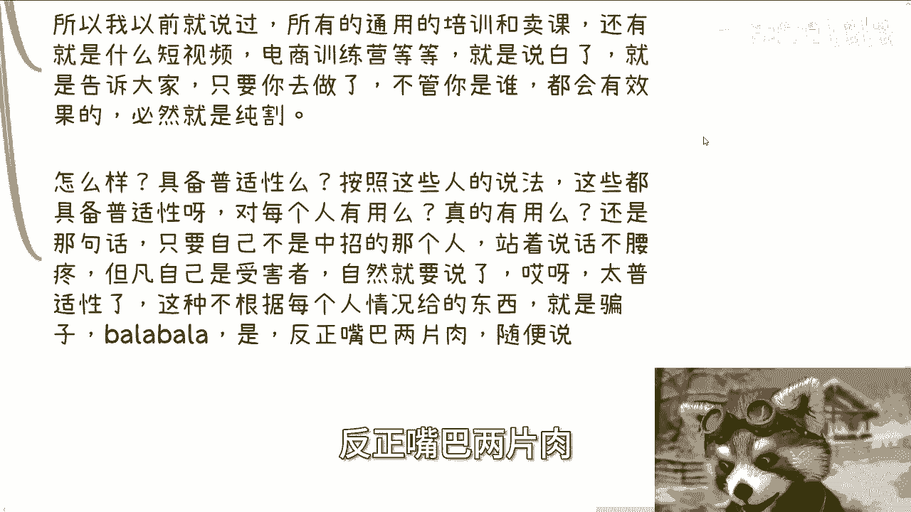

一个更深刻的类比是：人类用同一种方式饲养同一品种的猫狗，并认为这种方法具有“普适性”。但这是否是猫狗喜欢的“普适性”？我们不知道，也无须知道，因为**人类掌握着绝对的话语权和支配权**。这个例子揭示了“普适性”往往由强势方定义，并为强势方的目标服务。

---

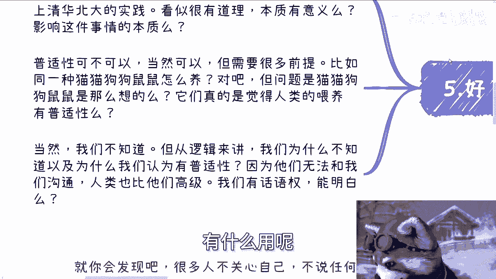

## 核心总结与行动指南

本节课中我们一起学习了“普适性”概念的陷阱与其在现实中的两种主要应用场景（筛选与收割）。

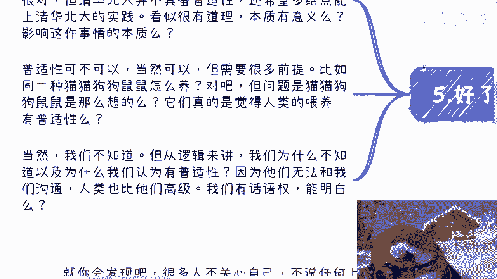

最后，我们可以总结出一个直白的观点：
*   如果你是**镰刀**（规则制定者、筛选方），请尽力完善和利用你的“普适性”规则。
*   如果你是**韭菜**（个体、被筛选方），请立刻停止追求“普适性”的幻想。你的首要任务是**认清自身独特上下文**，寻找适合自己的路径，而不是期待一个对所有人都有效的简单答案。向镰刀追问普适性方法，只会被割得更深。

对于个人而言，关键在于：
1.  **放弃幻想**：认清不存在适合所有人的赚钱捷径。
2.  **主动获取**：认真查看已有的公开信息（如视频描述、资料），培养信息检索能力。
3.  **具体分析**：任何建议都必须结合自身的具体背景（技能、资源、环境）来分析，不可生搬硬套。
4.  **保持警惕**：对那些承诺“普适性成功”的培训或模式保持高度警惕，其本质很可能是收割。

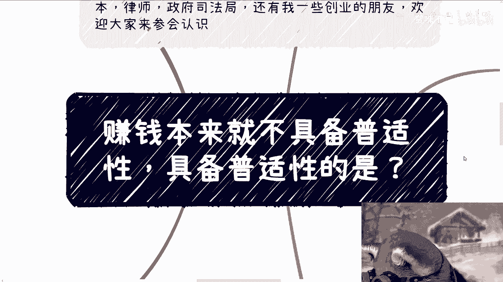

---

**附：活动与咨询信息**
下一期“数字经济大会”活动将于9月8日在上海举行，详情请见评论区报名链接。
若有职业规划、副业发展、商业合作（To B/To G/To 高校）中涉及合同、股权、估值、发展规划等具体问题，需要结合我的认知与视野进行接地气分析，请整理好个人背景与具体问题后，再进行相关咨询。