# 商业认知课 01：赚钱时想助人是傲慢的 💰➡️❌

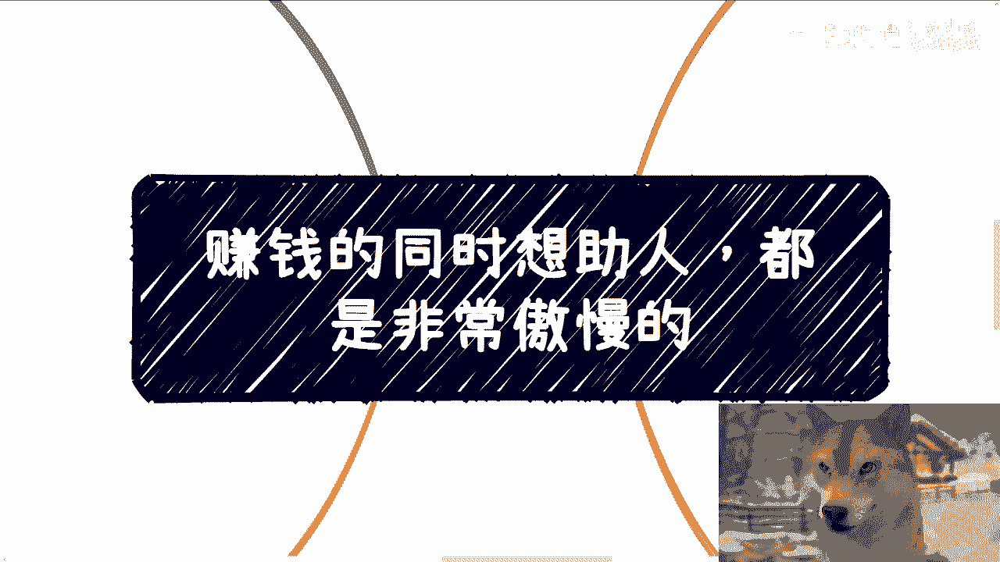

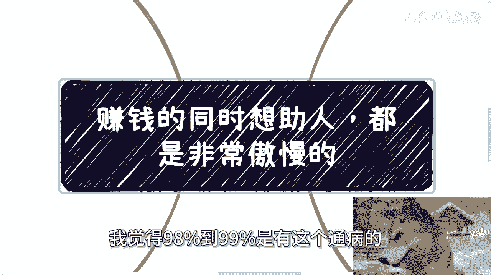

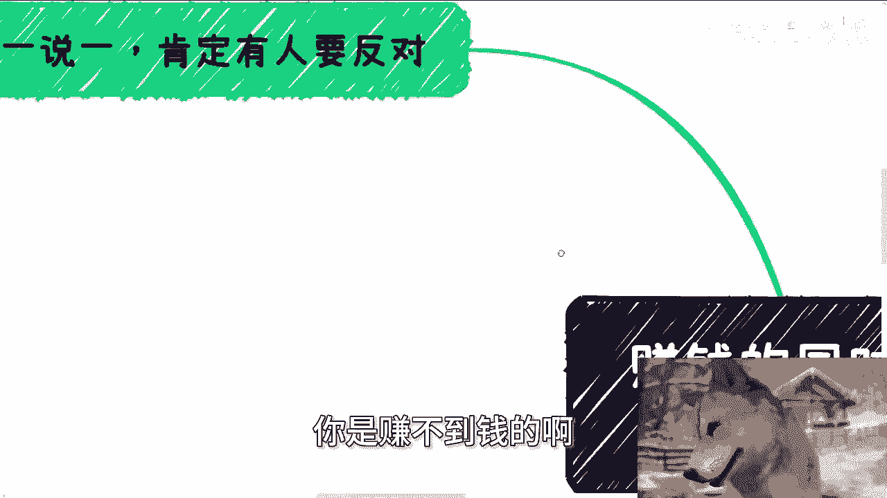

在本节课中，我们将探讨一个在商业实践中常见的认知误区：在追求盈利的同时，怀有强烈的“助人情结”。我们将分析这种心态为何是“傲慢”的，以及它如何阻碍你成功赚钱。

---

## 概述：一个普遍的认知误区

赚钱的同时想助人，是一种非常普遍的心态。根据观察，大约98%到99%想赚钱的中国人都有这个通病。这个通病如果不改掉，就很难赚到钱。

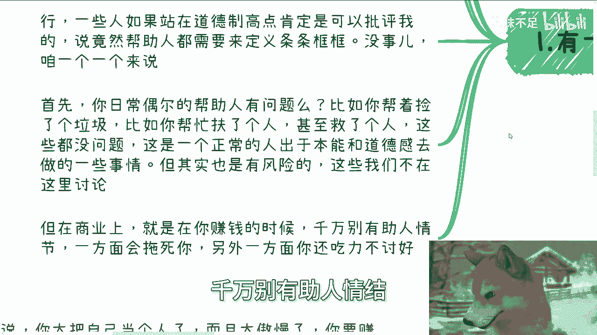

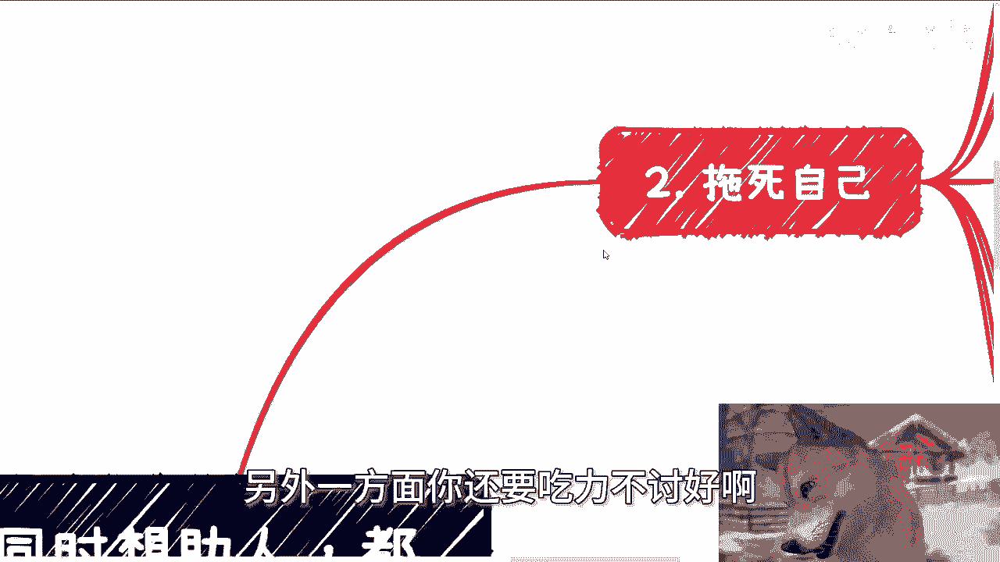

肯定有人会反对这个观点。在构思这个主题时，我也思考了很久：难道不够强大，就真的不能帮助人吗？当然不是。但这里所说的“强大”，并不仅仅指收入或能力。很多人对“强大”的理解可能局限于能力多强、收入多高，其实并非如此，这一点我们后面会详细说明。

当然，很多人会说：“我帮助别人，你管我强不强大？难道帮助别人要有前提吗？”说实话，帮助别人的确不需要前提。但当我们把视角放到每一个普通个体身上时，我认为是需要有前提的。我们不能无脑地歌颂那些愿意做出无谓牺牲的人。对每个个体而言，我们需要考虑的是你有多大的抗风险能力，以及你到底能帮助别人得到什么。

首先需要明确，日常偶尔帮助别人没有问题。例如捡垃圾、扶人、甚至救人，这些行为大多出于本能或道德观。但这些行为本身存在风险，不过这不属于我们今天讨论的商业范畴。

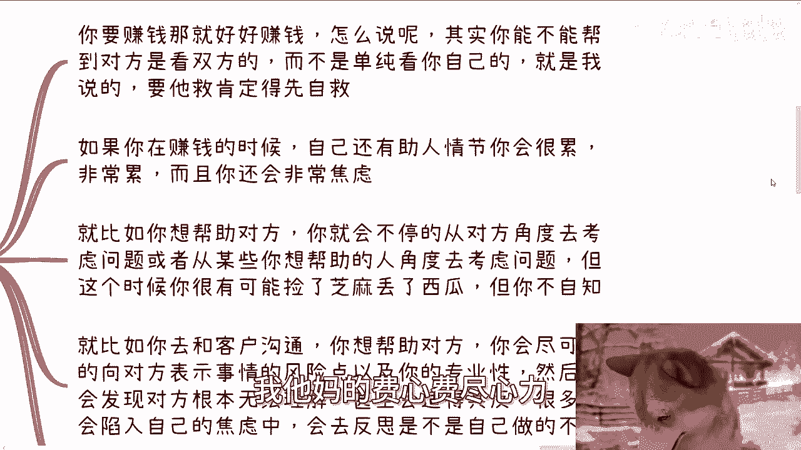

## 核心论点：商业上切勿有“助人情结”

在商业领域，如果你要赚钱，千万别有“助人情结”。有这种情结，一方面会拖累你，另一方面还会让你吃力不讨好。

### 为何会“拖死你”？

上一节我们提到了“助人情结”的危害，本节我们来看看它具体如何拖累你。想赚钱，就好好赚。你需要记住一点：**你能不能帮助到对方，是看双方的，而不是一味地看你自己**。

这就是我一直强调的。例如，有人找我咨询，我会要求他们先整理个人背景和问题列表。因为，如果连自己的背景和问题都列不出来，上来就两手一摊说“我也不知道问题在哪”，我根本无法提供帮助。遇到这种情况，我宁愿退钱也不做咨询。为什么？因为如果一个人自己都不愿意救自己，别人又能做什么？难道为了赚这笔咨询费，就要费尽心力吗？这很可笑。如果你的父母都救不了你，关我什么事？

在赚钱时如果还有助人情结，你会很累，非常累，而且会非常焦虑。因为你很想帮助对方，就会不停地从对方角度考虑问题。但你会发现，当你试图从你想帮助的人的角度考虑问题时，你已经在被动地缩小自己的格局。

如果你想赚钱，就必须扩大你的基数，否则怎么叫赚钱？如果只想着服务一小撮人，这本身就是一种傲慢。在你没有足够强大、没有若干业务为自己滚雪球、没有被动收入的情况下，你明明很想赚钱，却不停地缩小自己的基本盘，这不是傲慢是什么？

例如，与客户沟通时，你很想帮助对方，会尽可能向对方说明风险点，展示专业性。就像我在咨询时，会详细分析考公、就业、商业等不同路径的利弊。但你会发现，对方可能根本无法理解，甚至适得其反。当对方不领情时，很多人会陷入焦虑，甚至反思自己做得不好。以上这些都是赚钱的大忌。

### 为何会“吃力不讨好”？

分析了“拖累”的方面后，我们再看看为何会“吃力不讨好”。说真的，别的国家我不敢说，但在中国，有一个非常神奇的“被动技能”：**当对方非常自然、自信地一本正经胡说八道，并给出一个非常肯定的选项时，人们往往容易相信；而当对方思考很久、给出非常多分支想法或风险点时，人们反而会选择质疑，甚至质疑其专业性。**

我举两个例子：
1.  有人问我：“区块链专业还要不要选？” 不管当面还是私信，我现在就一句话：**`不要选`**。不要问我为什么，就是不要选。因为如果我花时间从行业、产业、发展、就业各方面解释为什么不要选，他听得懂吗？听不懂。我说这么多只会让他陷入混乱，让他觉得我可能为了掩盖某些事情，或者我自己不专业。我选择讲这么多是为他好吗？是。但有好处吗？没有，屁用都没有。
2.  我一个在北京做留学业务的朋友也是如此。别人问他去法国留学要多少钱、孩子某种情况该做什么准备。这时，作为服务方，你应该说：“没问题，直接准备100万，材料按我列的12345准备，大概半年帮你搞定。” 你必须这么回答，因为只有这样才能成交。如果你说：“哦，这个问题比较复杂，根据你孩子和家庭的情况ABCDEFG，有各种分支可能……” 你的确是为他好，但最后付款转化率一定很低。为什么？因为在客户看来，你显得模棱两可。你可能会反驳：“我没有模棱两可，我这是为你好。” 但不好意思，客户不懂。那么，你是要为他好，还是要赚钱？你只能二选一，两者不可兼得。C端业务都是这样，你们可以自己举一反三。

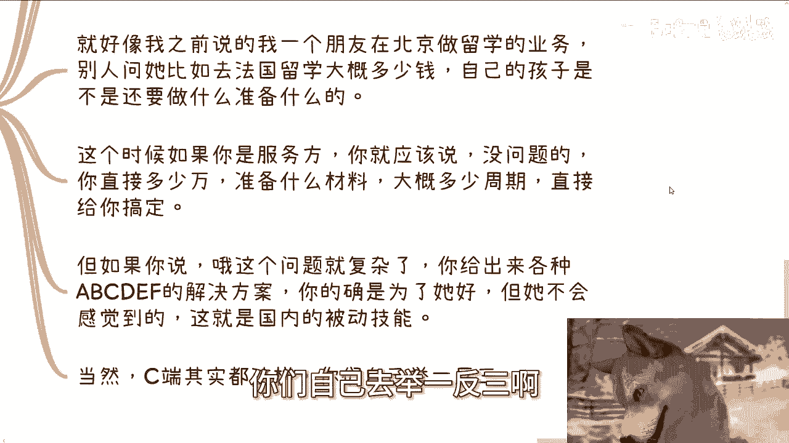

但凡做过C端业务的人都知道，就是这个样子，没办法。所以，一般和我说赚钱时还有助人情结的人，我都这么回答：“你太把自己当个人了，而且你过于傲慢。” 为什么？因为你明明自己就不够强大，也很缺钱或很想赚钱，以你现在的定位，竟然还想着去帮助别人，这不是傲慢是什么？

## 正确的关注点：商业本质

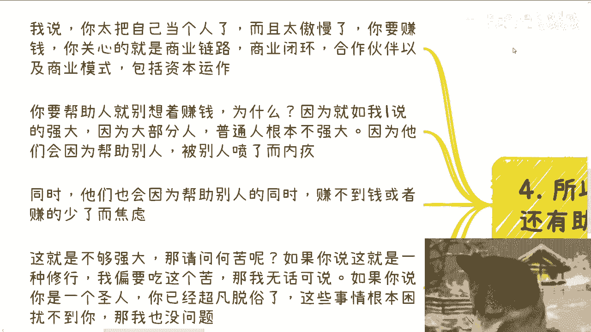

理解了错误心态的危害后，我们来看看在赚钱时应该关注什么。你就像一尊菩萨过江，自身难保，还要保别人。更何况，你保不保得住另说，别人还不一定领情。

你要赚钱，应该关心的是：
*   **商业链路**：整个业务是怎么走的。
*   **商业闭环**：客户最终为什么买单。
*   **合作伙伴**：积累那些能和你背靠背赚钱的人。
*   **商业模式**：背后的赚钱逻辑到底是什么。
*   **资本运作**：如何在自己甚至大家都不干活的情况下赚钱。

你要学习的是这些。如果你想帮助人，那就别想着赚钱。为什么？正如我一开始说的，你们够强大吗？不够。因为大部分人都是普通人，普通人根本不够强大。为什么？因为你会发现，他们会因为帮助别人却被喷而内疚，这叫普通人；他们也会因为帮助别人的同时赚不到钱或赚少了而焦虑，这也叫普通人。这就叫不够强大。

那我请问，何苦呢？如果你说这是一种修行，非要吃这个苦，那OK，随你，我无话可说，自己作死没人救得了。如果你是个圣人，已经超凡脱俗，这些事情根本困扰不了你，那我也没问题。但如果不是，你根本还不够强大，那图啥？请不要给自己增加这种无谓的困难，在自己还不够强大之前，主动缩小赚钱的基本面，最后还要抱怨“我为什么赚不到钱”，这就很奇怪了。

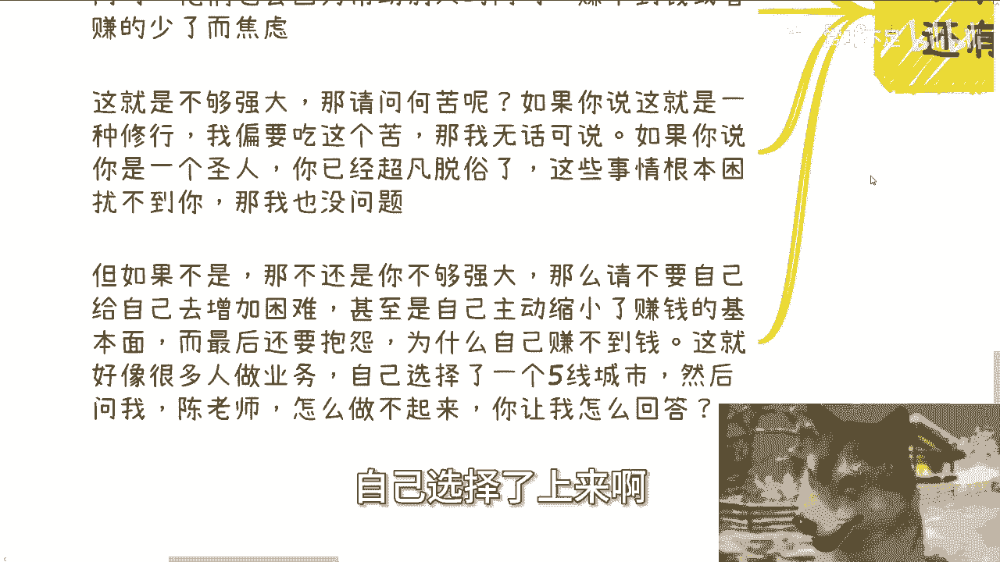

这就好像很多人做业务，自己一上来就选择四五线城市，然后问我：“陈老师，我怎么做不起来？” 你让我怎么回答？你明明刚起步，处于0到1的阶段，没有足够的积累和经验，却非要选择地狱模式，然后还问我怎么打不过。就好像你明明不是动作游戏高手，从来没打过动作游戏，上来就说要打《黑暗之魂》，结果打了一个小时跟我说，连第一个BOSS都没打过。那你让我怎么回答你？你怎么不去打《超级玛丽》呢？我不明白。

## 总结与建议：先强大，再助人

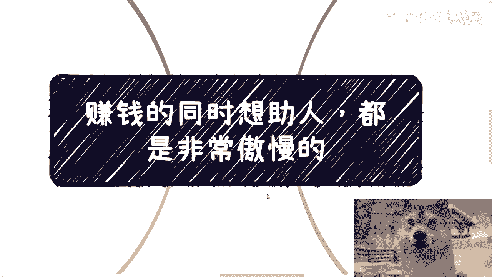

最后，我们来总结一下本节课的核心，并给出切实的建议。我还是要强调，不是说“想帮助人”这种想法不好，这是一种优良的美德，没有错。但是，从每个个体角度出发，**如果你想赚钱，就必须放弃在商业行为中掺杂“助人情结”**。

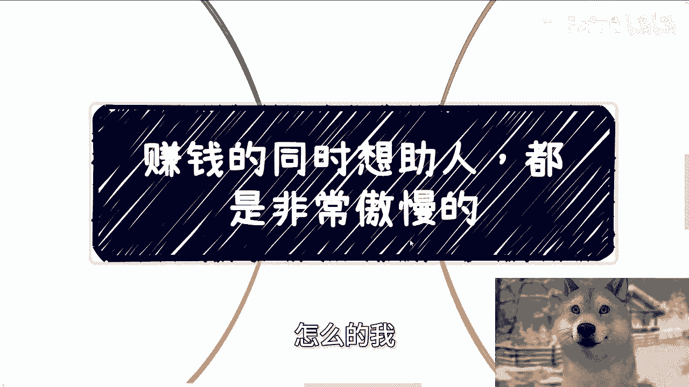

如果你真的想帮助人，请你好好赚钱，好好强大你自己。以后，你可以给别人捐款，可以给路边的乞讨者一瓶水、一顿饭。你要帮助的人很多，请直接用钱去“砸”他们。而不要从你自己的角度想着“我要帮助他们”，你这种除了傲慢，就是自我感动，没有了。而且最大概率，你最终还是一事无成，何必呢？

---

**本节课中，我们一起学习了：**
1.  **“赚钱时想助人”是一种普遍但有害的认知误区**，它源于对自身“强大”的误解，并会阻碍商业成功。
2.  这种心态在商业中会**拖累你**（让你疲惫、焦虑、缩小格局）并导致**吃力不讨好**（因客户更倾向简单肯定的答案，复杂分析反遭质疑）。
3.  赚钱时应关注**商业本质**（链路、闭环、模式、资本），而非个人化的助人情结。
4.  **正确的路径是先通过商业手段强大自己，再用资源（如金钱）去有效地帮助他人**，而非在创业初期将两者混淆。

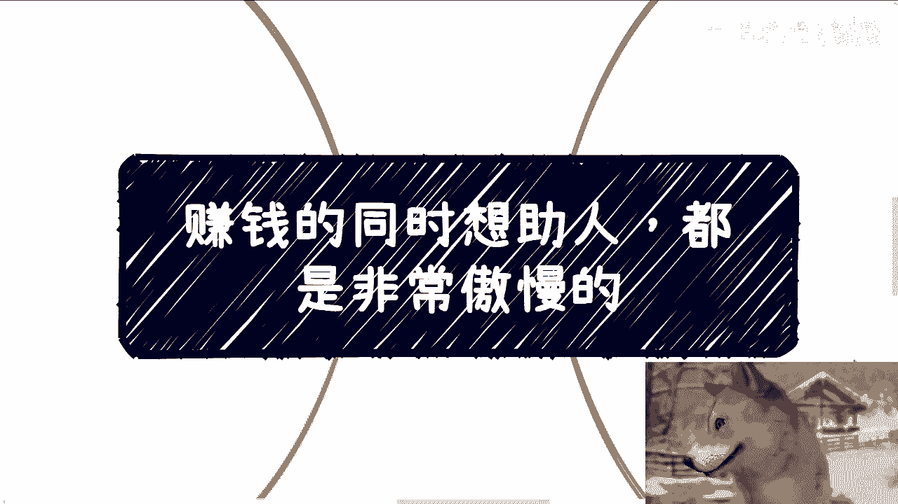

**行动建议**：如果你在职业规划、商业规划（涉及股权、期权、合同、计划书等），或希望结合当下经济认知获得建议，请先**整理好具体问题和你的个人背景**，再进行有效咨询。