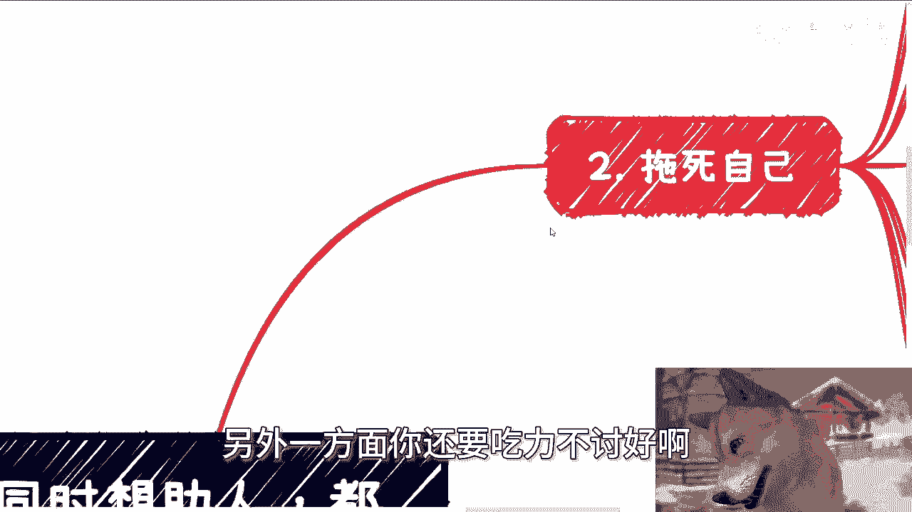
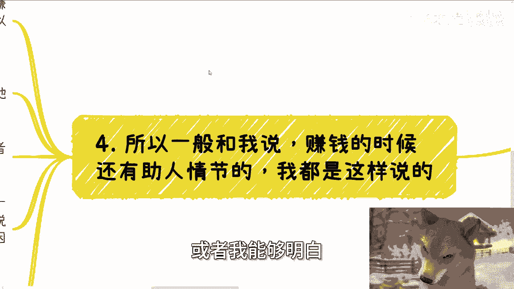
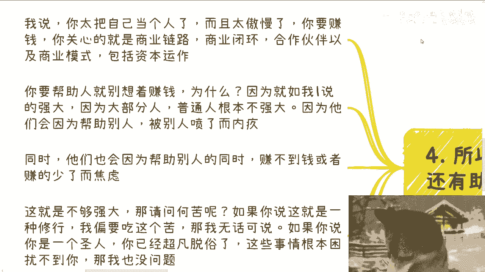
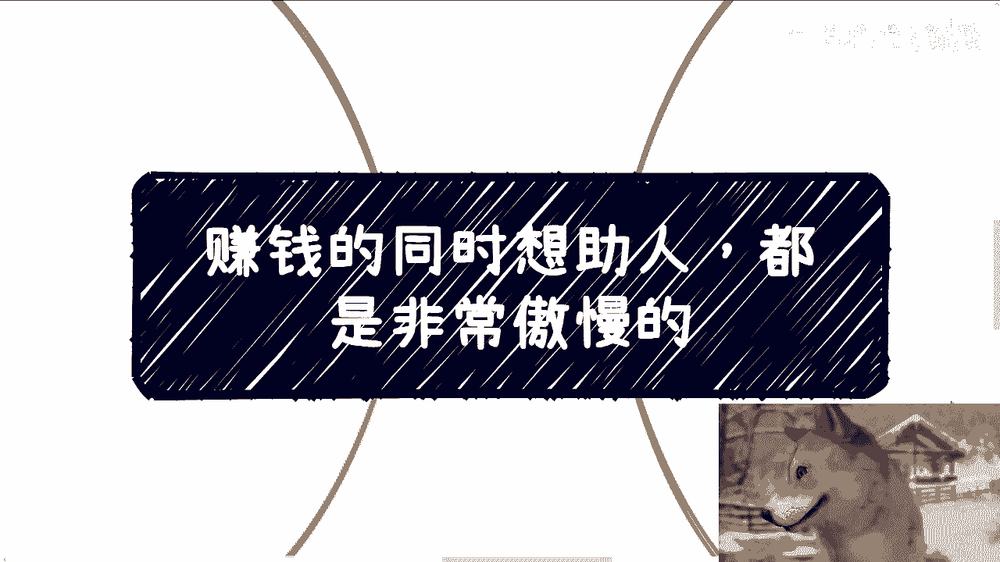

# 赚钱的同时想助人，都是非常傲慢的 - P1 - 赏味不足 - BV1fb421E7FS

好大家好，今天这个主题大家也看到了啊，叫做赚钱的同时呢想助人啊，我觉得都是非常傲慢的，呃我觉得这个点啊基本上啊我就以我的了解啊，我可以说只要是中国大家想赚钱的人啊，我觉得98%到99%，是有这个通病的。

而且这个通病你要不改掉，你是赚不到钱的哦。

那么首先啊有一说一啊，肯定有人是要反对的，那么说真的啊，我写这个主题的时候呢，我也思考了半天，就是说呃难道不够强大，就真的不能帮助人吗啊那么在我看来呢，当然不是啊，但是就我说的强大不强大。

并不是只有收入或者只有能力，因为很多人觉得强大不强大，可能就是说啊这个你能力多强啊对吧，你收入多高啊，或者怎么样子，其实并不是这样子的啊，这个后面我们会提到的，那当然啊肯定很多人要说，他说我帮助别人。

你管我强不强大对吧，难住帮，难道帮助别人要有前提吗，我跟你讲，说实话啊，帮助别人的确不需要前提，但是你放到每一个普通人的个体身上的时候，我觉得他是需要有前提的，你知道吗，就是说因为对于每一个普通人来讲。

我们不能去无脑的歌颂那些无谓的，这个愿意牺牲的那些人对吧，然后放到每一个个体身上来讲，我我们还要去考虑的是你有多大的抗风险能力，以及你到底能帮助别人得到什么，对吧啊好，那么首先啊我们这么说啊。

你日常偶尔的帮助别人有问题吗，没有问题，比如说你捡一个垃圾，比如说你帮帮忙扶个人，甚至今天你救个人对吧，那我相信这些东西都是出于一个人的本能，或者说一个道德观去做的一件事情，但其实这些东西是有风险的。

那当然这个东西不在我们今天这个主题的，讨论范围内啊，我们今天先来讨论商业上啊，在商业上，如果你要赚钱的时候，千万别有助人情结。

有的话一方面他会拖死你，另外一方面你还要吃力不讨好啊。

那我们一个个来说，首先我们先说托死你啊，你要赚钱，我跟你讲，你就好好赚啊，怎么说，其实你能你要记住一点，你能不能帮助到对方，是看双方的，而不是一味着一味的看你自己啊，这就是我以前一直说的。

就是你要我救你对吧，有很多人说爱陈老师，我找你咨询，我找你了解一些东西，我为什么会让大家去整理这个，个人背景跟问题的列表，是，因为，如果你连个人的背景跟问题列表都列不出来，你上来就给我两手一摊。

你说哎陈老师我也不知道对吧，我也不知道我问题在什么地方，你让我怎么跟你讲，对不对，我跟你们说以前出现过的，就是那种就是说我问他哎你有什么想法吗，哎我也没有，我跟你讲，这种人，我最后钱就退掉。

我都不愿意跟你做，为什么没什么好做的，你自己都不愿意救你自己，你我我能干嘛啊，哦我为了赚你这笔咨询费啊，我他妈的费心费尽心力。

也搞笑了，那你爸妈都他妈的不救你，关我吊事，对不对啊，如果你在赚钱的时候，自己还有助人情结，我跟你讲，你会很累，非常的累，而且你还会非常焦虑，为什么啊，这就比如你很想帮助对方。

你就会不停的从对方角度去考虑问题，甚至从某些你想帮助的人的角度去考虑问题，但是你有没有发现一种情况，就是你所谓的那些帮助的对方的人，或者你要你你你想去从对方考虑问题的时候。

你已经在不停的被动地缩小你的格局，就是说你如果要去赚钱，你就得把你的基数变高对吧，就得变大对吧，这否则你怎么叫赚钱哦，我今天就赚一小撮人，这叫什么，这叫傲慢，对不对，就是你在我看来，如果你想赚钱。

好好赚对吧，你在没有足够强大之前，在你没有，比如说若干跟业务在给自己这个滚雪球，在给自己能够有被动收入，有税后收入的情况下面，你明明现在已经就是也也没有足够钱对吧，你你你也很想赚钱。

你你不虽然没有穷困潦倒吧对吧，但是你说我也很想赚钱，但是在这种情况下面，你还不停的去缩小自己的技术，这不是傲慢是什么，对不对啊，那就比如说你去跟客户沟通，你很想帮助对方。

对方你会尽可能的向对方表示事情的风险点，以及你的专业性对吧，你包括包括比如说我跟你们咨询的时候，我我不停的跟你说，哎你们这个情况啊，哎比如说如果选择考公可能怎么样子，如果选择就业可能怎么样子。

如果选择商业怎么样子对吧，你会发现对方根本无法理解，甚至会适得其反，为什么对这个我们后面会讲对吧，那么当对方你帮助对方，对方不领你情的时候，那么很多人会陷入自己的焦虑当中，然后甚至会反思自己做得好不好。

以上这些东西都是赚钱的大忌哦，那么第三吃力不讨好，说真的我跟你们这么说，别的国家我不敢说啊，但是中国我跟你们就这么讲，有一个非常神奇的被动技能，那就是当对方非常自然，非常自信的一本正经的跟你胡说八道。

并且给出一个非常肯定的选项时候，中国的这些人往往会选择容易相信，而对方可能思考很久，或者给出非常多的分支想法，或者说各种风险点的时候，你会发现对方会选择质疑，甚至会质疑你的专业性哦，我给你们举两个例子。

比如说你像他们现在问我哎，陈老师那个区块链专业还要不要选对吧，我跟你们这么说啊，不管你们现在是当面问我还是私信我，私信问我，我现在就一句话不要选，不要问我为什么就不要选结束，我就这个态度。

你们知道为什么吗，是因为我但凡跟他去解释为什么不要选对吧，比如说我从行业从产业啊，从发展，从就业各方面跟他解释，不好意思，他听得懂吗啊，他听得懂吗，听不懂啊，对不对，他听不懂，我他妈说。

那说他妈的这么多东西有他妈蛋用啊，对不对，我说这么多只会让他陷入混乱，只会让他觉得可能我哎，我可能为了掩盖某些事情，或者我自己不专业，他妈的，我就这跟真跟你们这么说，对方都这么想的对吧，但是你说说说看。

我选择跟他讲这么多是为了他好吗是啊，但有什么好处吗，没有屁有屁都没有，对不对，这就好像我之前说，我一个朋友在北京做留学业务也是的，别人问他哎那个那个比如说去法国留学啊，大概多少钱啊。

包括就是哎我的我的我的狗子呢，哎哎嘿哎好了对吧，你包括就是说那个北呃那个做留学，别人问他去法国留学大概多少钱啊对吧，然后他说我的孩子可能这个ABCDEFG，这种情况应该做什么准备啊，对吧好。

我跟你这么说啊，这个时候如果你是服务方，你就应该说没问题的，直接100万啊，准备什么各种材料，我帮你列出来啊，根据我这个12345列出来，我大概比如说多少周期，打个比方，比如三个月半年我帮你搞定啊。

直接帮你搞定，结束你必须这么回答，为什么，因为你只有这样才能承担对吧，但如果你说哦这个问题比较复杂哦，那么你给出来你看啊，你你你你孩子这个情况，包括你家庭这个情况，你你可能哎比如说ABCDEFG啊。

我给你各种呃，跟他讲各种分支的情况对吧，你的确是为他好呀，但是最后我告诉你付款的转化率一定是低的，没有，为什么你要问为什么，就是因为在那边模棱两可，你懂吗，你你我但凡跟你这么说，你肯定会反驳我。

哎我没有呀，我这不是模棱两可呀，我这个叫为你好呀，但不好意思呀，客户又不懂的咯，哎搞笑嘞，我就问你，那你是为了他好，还是你要赚钱，你二选一啊，你两者不可兼得的呀对吧，当然我告诉你C端都这样子。

你们自己去举一反三啊。

你们自己去想想看，但凡做过C端系业务的，我告诉你都这个吊样子，没办法的呀，那么中国就就他妈这个被动技能呀对吧，所以啊一般和我说赚钱的时候还有助人情结，或者我能够明白他有助人情结。

我都这么说的，我都这么回答他，我说你太把自己当个人了，而且你过于傲慢，为什么，因为你明明自己就不够强大，以及你也很缺钱，或者你也很想赚钱对吧，你与你现在这么个定位，你竟然还想着去帮助别人。

那你不是傲慢是什么，对不对。

你一菩萨过江，自身难保，你还要保别人，更何况你保你保得住，保不住，咱先不去守他，别人还不领情对吧，你要赚钱，我告诉你，你要关心的是商业链路，就是整个业务怎么走的，商业闭环就是最后客户为什么买单。

合作伙伴就是你要积累的那些跟你背靠背，能够赚钱的人以及商业模式，也就是他背后的赚钱的这个逻辑到底是什么，对吧，包括资本运作，就是我们说的，就是说啊你能够在自己不干活。

甚至大家都不干活的情况下面去赚钱对吧，你要学习是这些，你要帮助人，那就别想着赚钱，为什么，因为就如我一里面说的，你们够强大吗，不够，因为大部分人都是普通人，普通人根本不够强大对吧，为什么。

因为你会发现他们会因为帮助别人，被别人喷了而内疚，这才叫普通人对吧，同时他们也会因为帮助别人的同时赚不到钱，或者赚少了而焦虑，这叫普通人，那么这就叫不够强大，那我请问你何苦呢啊，我不明白你知道吗。

我真不明白何苦呢，如果你说这就是一种修行，你我他妈非要去吃这个苦，那OK随你，我无话可说，你爱咋滴咋滴，自己作死，没有办法的啊，没人可救的了，如果你说你是个圣人，你已经超凡脱俗了。

这些事情根本困扰不了你，那我也没问题，但如果不是你根本还不够强大，那我就问图啥，请不要自己给自己去增加这种无谓的困难对吧，甚至就是在自己还不够强大之前，去主动缩小这种赚钱的基本面。

而且最后还要抱怨哎呀我为什么赚不到钱啊，诶我这么奇了怪了对吧，这就好像很多人做业务自己选择了上来啊。

就他妈选择一个四五线城市，然后就问爱创始，我怎么做不起来，唉让我怎么回答对吧，你你想想看，让我怎么回答，就是这就好像你明明就要刚起步，明明都是0~1，你明明没有足够的积累，你明明也没有足够的经验。

你非要选择一个他妈上来就跟我说，我他妈要选择地狱模式，哎然后地狱模式之后，然后还跟我说，哎喂陈老师，我怎么打不过对吧，我奇了怪了对吧，就就好像你明明不是一个动作游戏的高手。

明明不是一个就曾经从来没有打过动作游戏，就上来跟我说要唱啥，我要打黑魂，然后打，然后然后然后那个那个那个买个PS4对吧，你要比PS3对吧，你说你说光碟放进去下载好了哦，然后打打了一个小时跟我说超帅。

我他妈连第一个boss连连第一个boss都没打过，那那你让我怎么回答你，对不对，你咋不打超级玛丽呢。

对不对，你这怎么滴怎么滴。

我我也不明白，对吧啊，但是呢我不我还是那句话啊，不是说你们这种想法不好，想要帮助人都是好的，这是个优良的美德，你知道吗，没有错啊，但是呢我们还是那句话啊，从每个个体角度出发，如果你想赚钱。

你必须放弃这件事情啊，如果你真的想赚，想帮助人对吧好，我就这么跟你讲，请你好好赚钱，好好强大你自己，以后你可以给别人去捐款，你也可以给路边的乞讨的人，给给他们一瓶水，给他们一一顿饭或者怎么样子。

你要帮助的人很多哦，请直接用钱去砸他们啊，而不要说从你自己角度去想着，哎好像我要帮助他们，我跟你讲，你这种除了傲慢，就是自我感动没有了，而且最大概率你最终还是一事无成，何必呢，对不对，唉行啊。

就这么着吧啊，那个剩下的就职业规划，商业规划，然后你们自己比如工作啊，包括跟别人一起合作些什么东西啊，在当中可能有一些股权啊，商期权啊，商业呃那个分红分润啊，商业计划书啊，合同啊对吧，股权计划书啊对吧。

包括你们呃希望通过我的一些视野，或者我对于当下的经济情况的一些那个认知，能够让你们给你就结合你们当下这个状态，给你们一些规划或者建议啊，能够让你们更少走一些弯路的话啊。

那么你们可以整理好对应的问题跟个人背景，好吧，我们再来走咨询。

真的啊。