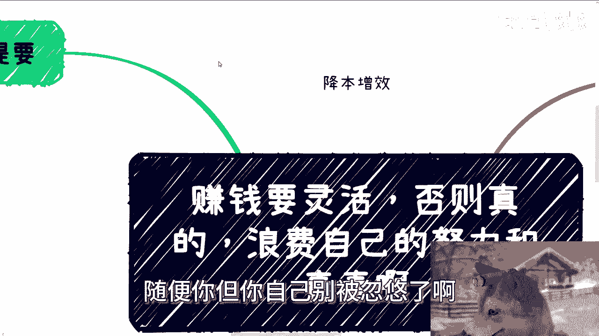
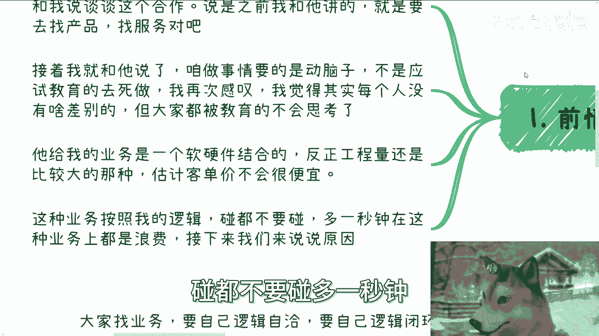
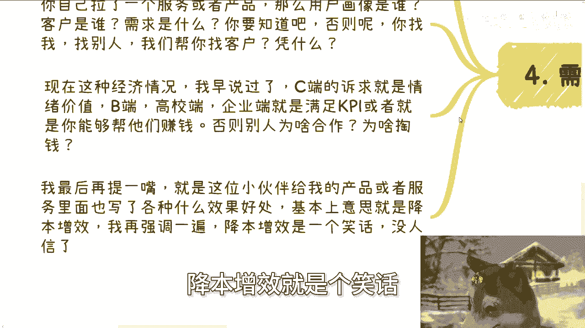

# 赚钱要灵活，否则真的浪费自己的努力和青春 - P1 - 赏味不足 - BV1n81oYUEuk

好大家好啊，呃今天是只正常的狗子啊，那么今天我们讲这个主题呢，叫做赚钱要灵活啊，否则我跟你们讲，真的就是浪费自己的努力跟青春啊，还是那句话啊，就是说记住就是之前大家也都知道嘛，叫做什么叫做嗯。

你不要因为战略上的错误啊，就是说让自己战术上的勤奋都浪费掉，那说白了就是说你只要方向不对。

你妈的做的再多，你妈没卵用啊，那么首先啊一开始啊。

在这个前情提交之前，我先说跟你们说件事情啊，就是你们一直会听到一个东西叫，什么叫降本增效对吧，我打给你们啊，你看啊叫降本增效哦，我靠什么玩意儿降本增效对吧啊，我跟你们这么说啊，现在已经是2024年底了。

基本上啊在这个时间点，市场上的人都不是啊，那么也就是说降本增效这个东西，我再次跟你们强调啊，这个东西你拿出去装逼没问题，你拿出去吹牛逼没问题，你拿出去画饼没问题，千万不要被别人骗了。

或者你自己把别人自己把自己骗了，懂什么意思吗，意思就是说降本增效没有意义，没有人关心降本增效，你懂了吗啊，不要来跟我提降本增效，也不要跟别人提降本增效，真正懂的人，真正的资本家，既得利益者。

政治家都没有人关心这东西，为什么，因为我们只关心赚钱，听明白了没有啊，不要搞这些，有的没的，你去忽悠别人，随便你，但你自己别被忽悠了啊。

好那么我们说一下前情提要啊，前情提要是这样子的，前两天呢，有个小伙伴给我就微信跟我说了个服务啊，和我说呢谈谈这个合作啊，说啊陈老师，我们看看这这东西怎么合作法啊，然后呢就我我就跟他说。

我说我说这什么玩意儿对吧，什么什么鸟毛产品和服务嘛对吧，然后他说之前我跟他讲的就是他要去找产品，找服务嘛，找到之后来跟我说嘛，然后接着我就跟他讲，我说大哥咱做事情要动脑子啊，不是应试教育的，去死做。

对不对，那我真的我再次感叹感叹啊，我觉得其实每一个人没什么太大差别，我真的我觉得没有没大家是差差别不大的，就你们跟那些清华北大的，我觉得没什么差别对吧，但是大家被教育得不会思考了，唉他给我个业务。

我一眼看上去就是个软硬件结合的，而且工程量可能还比较大，因为你软硬件一结合，你工程量肯定不小嘛，那另外一方面你的客单价可能肯定也不会低，但虽然我肯定也没问客单价，对不对啊，啊当然我问了他妈的。

他也不知道啊，那么这种业务呢按照我的逻辑，我就跟你们讲，碰都不要碰。

多一秒钟，在这种业务上面都他妈是浪费好吧，我们来说原因啊。

首先三大原因啊，第一经济情况，整体经济情况非常差，各个地方政府的财政都是斥资的，你们自己去看对吧，这东西都不用我来讲啊，那么你整一个你软硬件的产品，我就请问要花钱吗，花的小肯定不是小钱吗。

工程周期会短吗，对不对，你不可能花小钱，你也不可能会短，那他妈谁来做啊啊尤其这种经营情况谁来做，哪个冤大头来做，对不对，第二啊，那么这种情况下面谁敢做这种项目，咱说不好听听点，除了政府本身谁敢接。

谁接谁倒贴，因为接的人都不知道对方什么时候付款，也不知道对方甚至有没有钱付款，谁敢接啊，对不对啊，然后另外一点，那么从我们合作角度来讲，你敢合作吗，还是我敢合作啊，对不对哦，你在里面从要从认识到沟通。

然后花时间花精力，你在里面做做做，做多久啊，啊整个工程给你拖一两年，你拖得起吗，我拖不起，对不对啊，这是第一第二信任基础，说白了我们要找的业务尽量是软件，这句话我跟你们讲了无数遍了，尽量是软件纯软件。

然后尽量是那种现成就有产品的，改个皮或者改个几个功能就能交付的那种，简单明了啊，为什么，因为这种产品没有风险或者风险很小，而且对方也知道怎么合作，应该找谁，大概预算多少，整个都合作过了，对不对。

你要是什么人家跟你说，我们最低这种工程对吧，那个软硬件结合可能最低80万100万的，你妈做什么东西啊，现在到市场上面给我找个80万，100万的项目看看，那你不是在搞笑吗，对不对。

你扔给我或者扔给任何一个人，你都是一大堆文字，比如说这文字当中描述的产品和服务是什么啊，然后软件也有，硬件也有，然后还是那种一，我们一眼看上去可能是跟那种基础建设啊，比如说什么水电煤啊对吧。

或者新能源相关的，卧槽这他妈谁合作，你告诉我谁敢合作啊，啊我还是那句话，土老板有这钱投在区块链，投在虚拟货币不香吗，投在A股不香吗，他妈投这玩意儿啊，对不对，你们找谁谁敢跟你们合作，你就拿你。

你说他找我，我敢我敢合作吗，我连对方有没有能力落地都不知道，我敢找吗，对吧，我但凡去找任何一个资源，我就是，明白不对不对，好，第四就是需求，我跟你们这么说啊，大家找业务要找自己逻辑自洽的。

你至少自己逻辑是闭环的，你再出去找合作，你能听明白吗，哦我还是那句话，你们今天找了一个东西找我，我最多就跟你们说和不合作，同时我也会告诉你们原因是什么，但是你们要是这样去找别人，别人只会觉得你们是。

而且别人也不会告诉你们，你们是，能懂吗，哦那么你自己拉了一个服务或者产品，那么你自己得要知道这个产品的用户画像是谁，我们说了，整个地球上面用户画像就五类，个人企业资本，高校政府没了，就这五类。

那你告诉我你的幻想是谁，客户是谁，然后他需求是什么，他为什么要买单，这你总得知道吧，哦你不知道，你找我，你找别人，我们知道吗，都不知道，我们怎么会知道，对不对啊，那么现在这种经济情况我早就说过了。

C端的诉求就是情绪价值啊，B端高效端企业端就是满足其KPI，或者你能够帮他们赚到钱，听得懂吗，啊，也就是说要么你就能够很清楚的，能够帮助他们在年底写好很好的报告，要么你就是说他们买你这个东西。

花了10万能赚100万，否则别人为什么合作呢，为什么掏钱呢，那么奇了怪了啊，好然后最后啊我最后再跟你们提一遍啊，就是这位小伙伴给我的产品和服务，里面也写了各种各样的什么好处啊，优势啊，效果啊。

我看上去基本上意思就四个字叫降本增效，我再强调一遍啊，降本增效就是个笑话。

为什么我今天我们假设啊，你是既得利益者，你是一个资本家，你是一个政治家啊，好你今天是一个，我们打个比方，你今天是一个流水，比如说11年流水1000万的一个老板，然后我跑过来跟你说，哎那个啊某某某啊。

我说你要么花个100万来买这个东西，你问我有什么好处，我是降本增效，你们自己想想看，你会买吗，你会买吗，啊我早就跟你们讲过了，任何一个人的逻辑是什么，就是我付100万，不是不能付，我可以付。

但是我得到了什么，你要是跟我讲讲降本增效，大哥啊，你是出来诈骗的吧，对不对，哎降本增效这四个字能不能再虚一点啊，啊对吧，你不你包括啊，你包括之前那个上海大会那个现场也是的，也有个小那个小伙伴就跟我说。

他说跟我拉了个资源，说什么，好像是那个做那个奥数那个呃，传统传统的那个线下物理设备，各种各样的，比如说充电桩啊，或者产业园那些数字化，我就问他，我说我为什么要做数字化啊。

当然我我意思是说我带我的客户问一下，为什么要做数字化，他说能增加效率，我说老板关心你，增加效率，你们在搞笑吗，老板只关心我他妈能不能挣到钱，能懂吗啊，好那这个这个事情啊，我以后再也不讲了。

我就讲这一次啊，不想再扯了啊，这种东西真的我就他妈觉得就大家做事情啊，就是你你你做事情灵活啊，哎呦我真的服了，我真的是我还是那句话啊，你们但凡不灵活，你们什么聪不聪明也好，学历高不高也好。

我跟你们讲都是垃圾，没有用的啊，好就这么着吧啊，然后那个职业规划好吧，工作上面商业规划，你们自己有些什么业务啊，或者想做一些什么副业，你们觉得需要跟我详细沟通的啊，希望我给你们一些建议的。

或者说跟你们一起规划一下的，你们可以整理好对应的个人问题跟个人背景。

