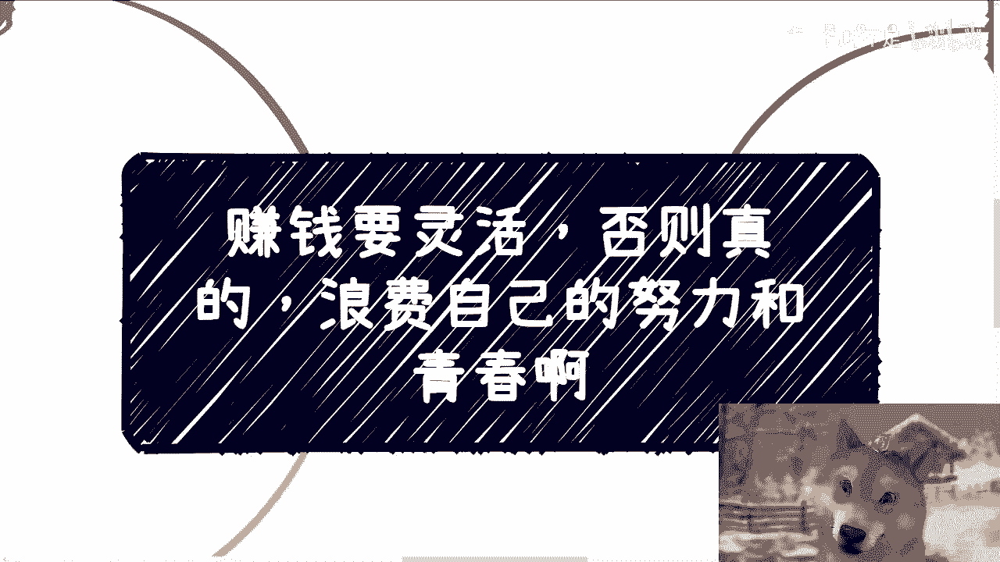
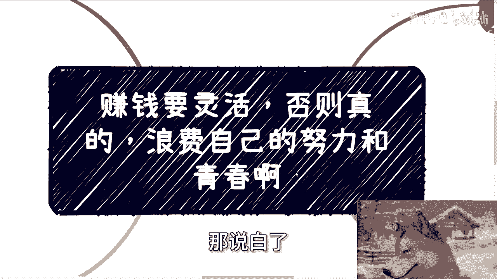
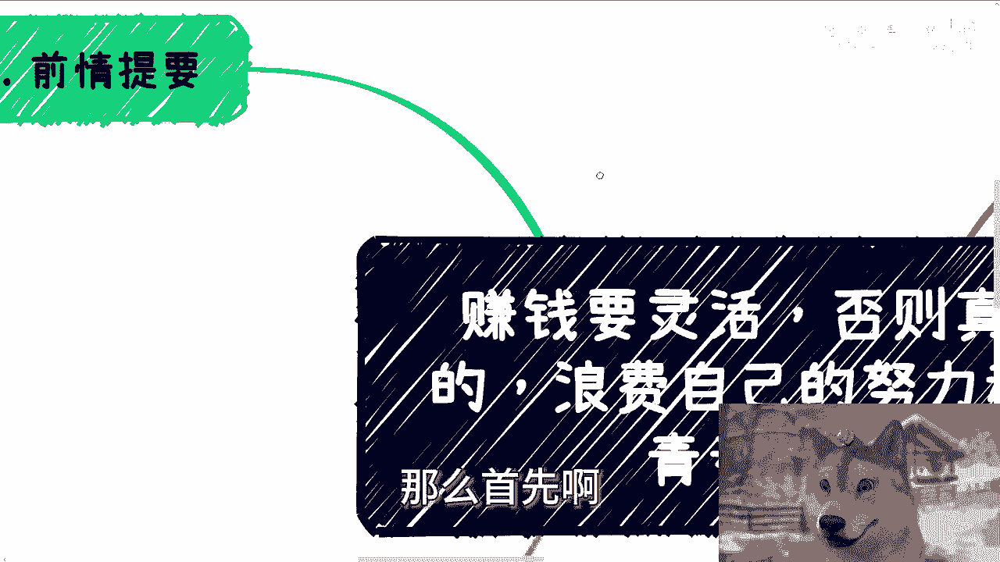
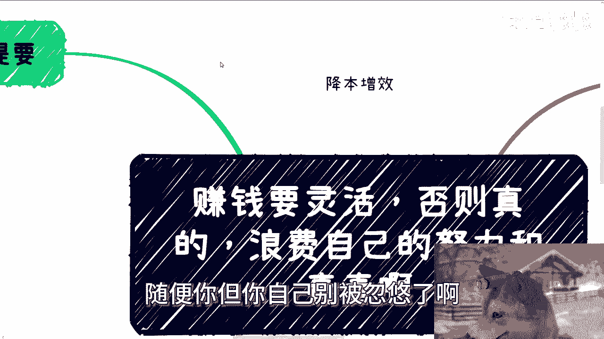
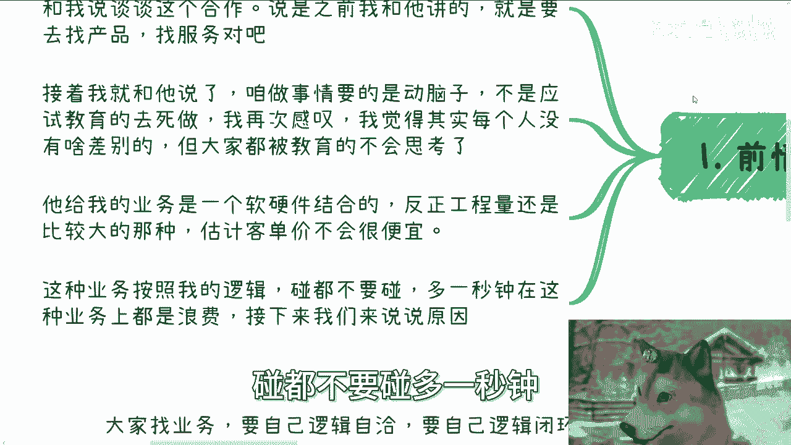
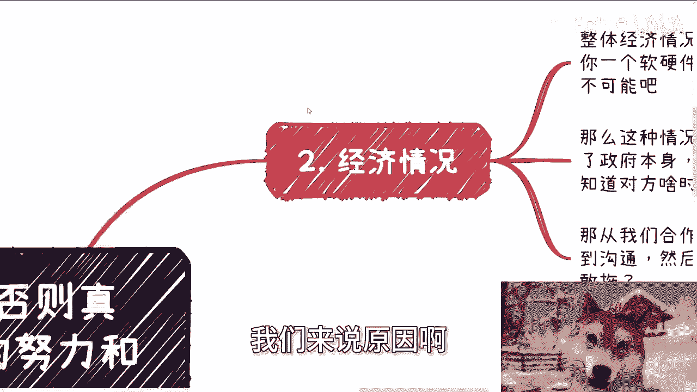
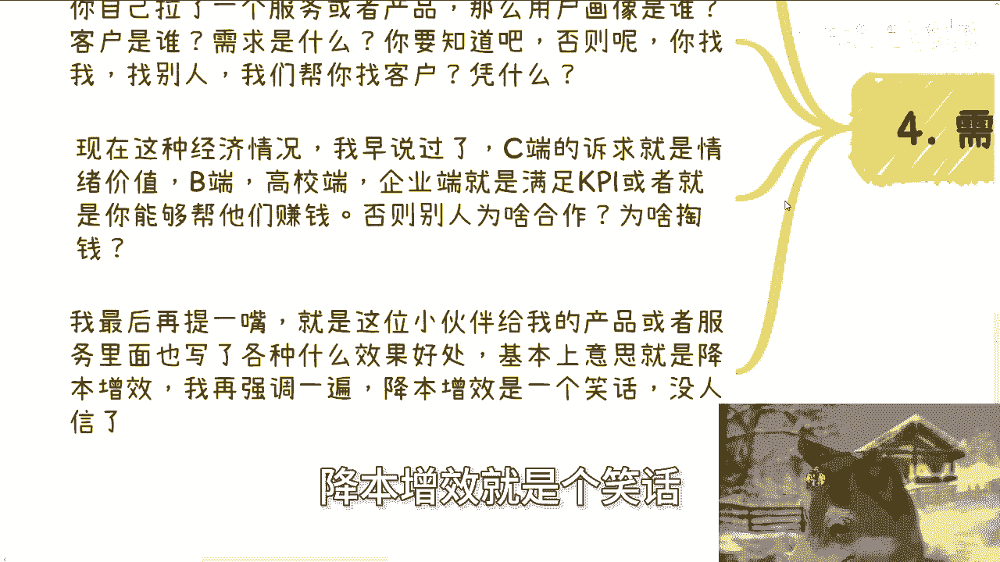
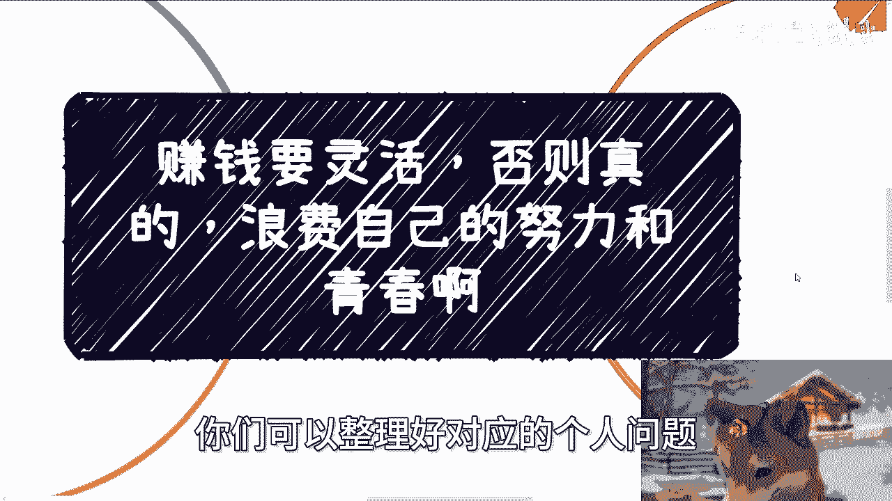

# 课程名称：赚钱要灵活，否则浪费努力与青春 - P1

## 📝 概述



在本节课中，我们将探讨一个核心的商业思维：赚钱需要灵活性。我们将分析一个具体的合作案例，并从中提炼出在选择业务方向时应避免的陷阱和应遵循的原则。课程的核心是理解“方向比努力更重要”，避免因战略错误而浪费战术上的勤奋。



---

## 🚫 摒弃无效概念：“降本增效”

在深入案例之前，我们需要澄清一个常见的商业术语：“降本增效”。

当前市场环境下，“降本增效”这个概念已失去实际意义。它可能被用于对外宣传或“画饼”，但真正的决策者——资本家、既得利益者或政治家——并不关心这个空洞的概念。他们只关心一件事：**如何赚钱**。



因此，你可以用这个概念去“忽悠”别人，但切勿让自己被这个概念所欺骗。真正的焦点应始终放在盈利上。

---

## 📖 案例背景：一个失败的合作提议

上一节我们澄清了“降本增效”的虚幻性，本节中我们来看看一个具体的案例，说明缺乏灵活思维如何导致方向性错误。



前两天，一位伙伴通过微信向我推荐了一个合作项目。他找到了一项产品与服务，希望探讨合作可能性。



我初步了解后发现，这是一个**软硬件结合**的项目。这类项目通常存在几个明显特征：
*   工程量巨大。
*   客单价高。
*   交付周期漫长。

基于我的经验，我立刻判断：**这类业务碰都不要碰**，多花一秒钟考虑都是浪费。接下来，我将详细阐述原因。

---

## ⚠️ 为何要避开此类业务？

以下是必须避开上述软硬件结合项目的三大核心原因。

### 1. 宏观经济与支付风险

当前整体经济环境不佳，许多地方政府财政紧张。软硬件项目需要大量资金投入且周期很长。在这种经济形势下，谁愿意且有能力充当“冤大头”来投资？更重要的是，除了政府，谁敢承接此类项目？承接方可能面临无法收款或收款周期极长的风险，这等同于“倒贴钱”做生意。从合作角度，漫长的沟通与开发周期（可能长达一两年）是任何人都难以承受的。

### 2. 合作模式与风险过高

我们应优先寻找的业务模式是：
*   **类型**：纯软件。
*   **状态**：已有现成产品，只需修改界面或少量功能即可交付。

**公式表示理想业务：`纯软件 + 现成产品 + 轻度定制`**

这种模式风险极低，合作流程清晰，预算范围明确。相反，一个张口就要80万、100万且涉及软硬件的复杂项目，在当下市场极不现实。这类项目描述往往涉及基础设施建设（如水电、新能源），不确定性太高，没有任何资源方敢轻易合作。

### 3. 需求不清晰与逻辑不自洽

开展任何业务前，必须保证自己的逻辑是闭环且自洽的。你需要清楚知道：
*   **用户画像**：客户是谁？（全球客户无非五类：个人、企业、资本、高校、政府）
*   **核心需求**：客户为什么买单？
*   **价值主张**：你的产品如何满足客户需求？

在当前经济环境下：
*   **对C端（个人）客户**，核心提供**情绪价值**。
*   **对B端/G端（企业/政府）客户**，核心是帮助其**完成KPI**或**直接赚钱**。



**代码表示客户诉求：**
```python
if 客户类型 == “C端”:
    核心价值 = “提供情绪价值”
elif 客户类型 in [“B端”, “G端”, “高校”]:
    核心价值 = “帮助完成KPI” 或 “帮助赚钱”
```

如果对方无法清晰说明产品如何帮助客户赚钱或完成关键指标，而只是空谈“优势”和“效果”，那合作基础就不存在。例如，案例中的项目其宣称的好处最终可归结为四个字：**降本增效**——这恰恰是我们已论证过的“笑话”。

---

## 💡 核心思维总结：为价值买单，而非概念

本节课中我们一起学习了灵活赚钱思维的重要性，并通过一个案例分析了需要避开的业务陷阱。

最后，我们通过一个假设来强化这个思维：假设你是一位年流水千万的老板，有人让你花100万购买一个产品，理由是“降本增效”。你会买单吗？显然不会。因为决策逻辑是：**支付成本，必须获得明确、实在的回报**。“降本增效”过于虚无，而“能帮我多赚钱”或“能帮我搞定年终汇报”才是实实在在的价值。

**总结来说**：做事必须灵活，紧盯“创造价值”与“盈利”的本质。否则，无论个人多么聪明或学历多高，在错误方向上的努力都是徒劳。如果你在职业规划、商业策划或副业探索中需要具体建议，请整理好你的个人背景与具体问题。



---