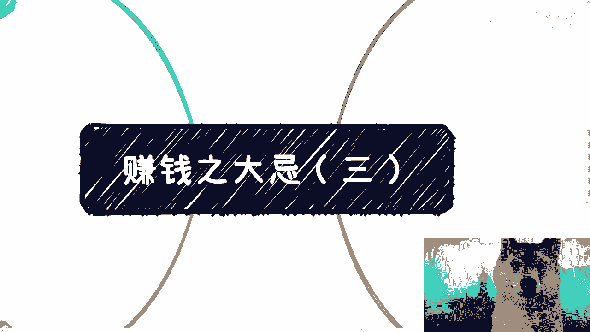
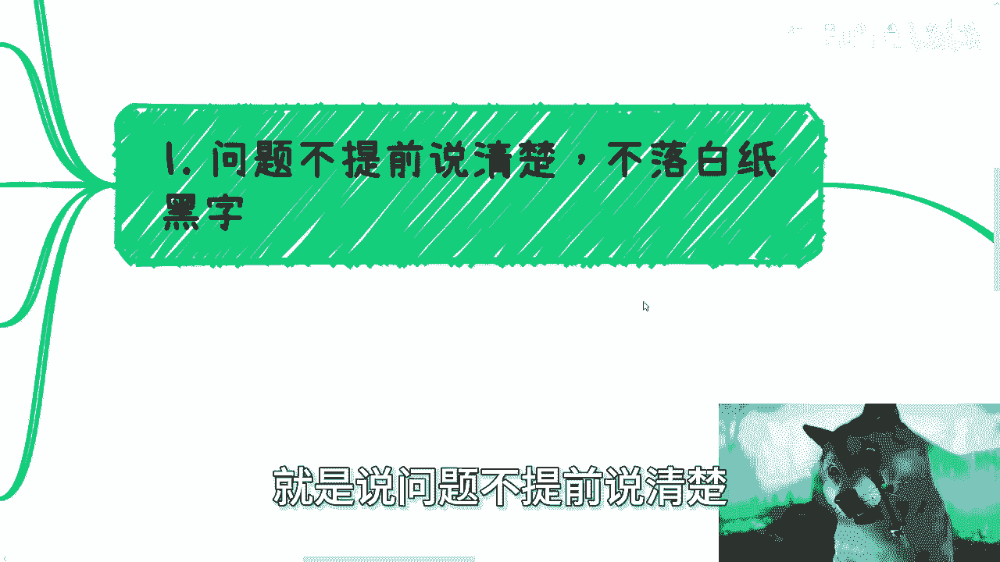
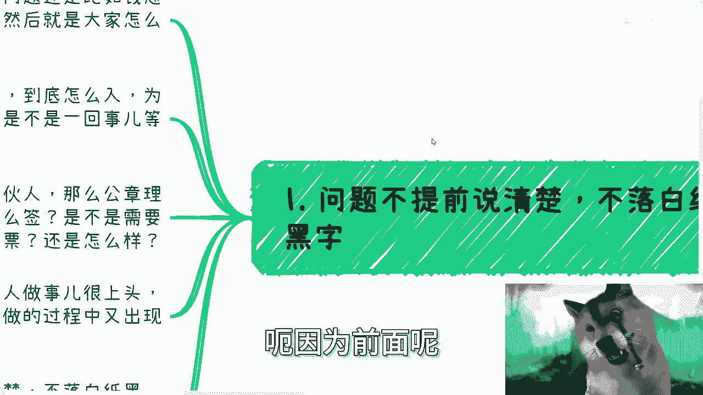
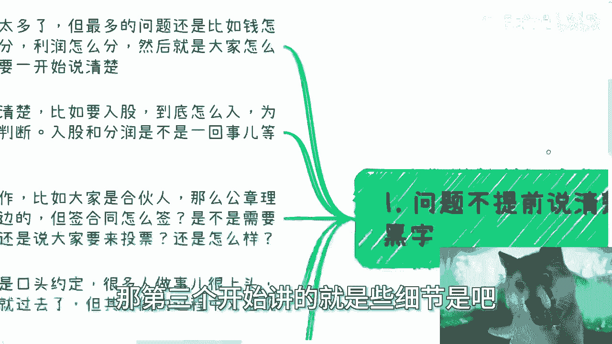
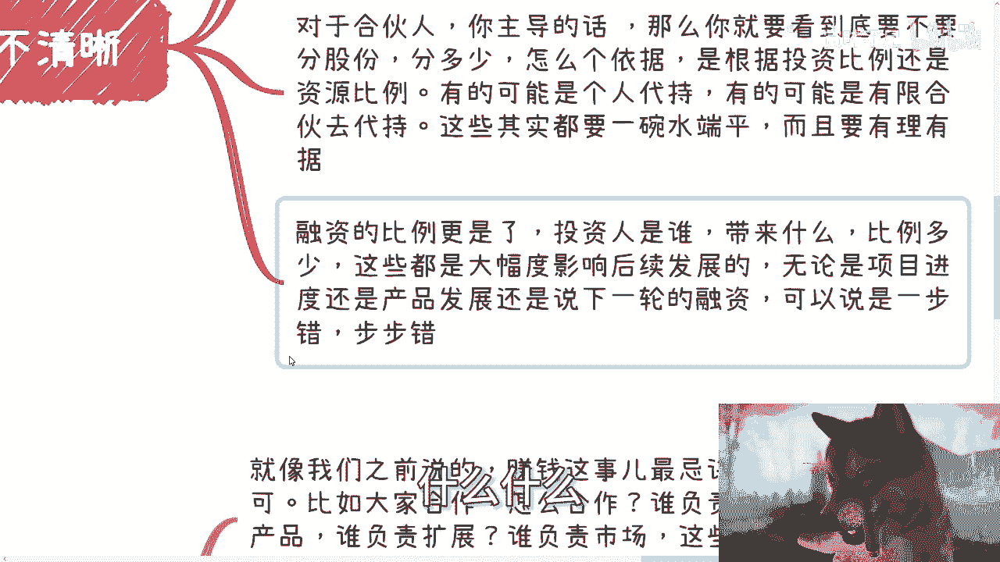
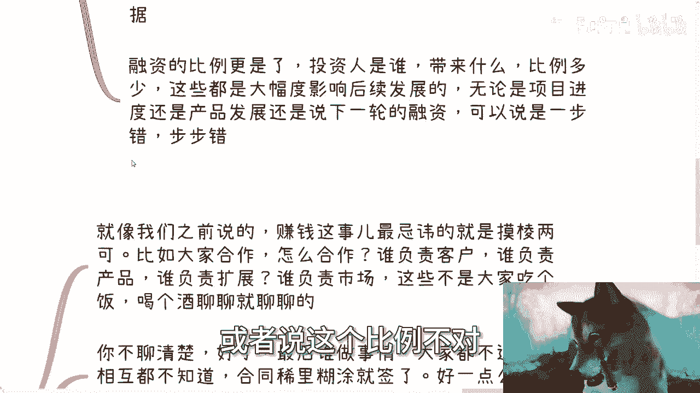
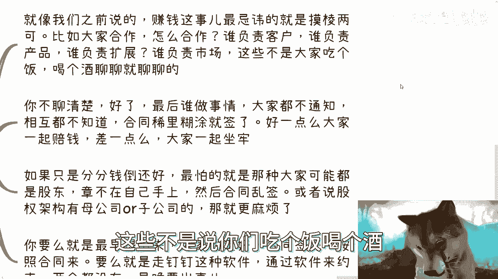
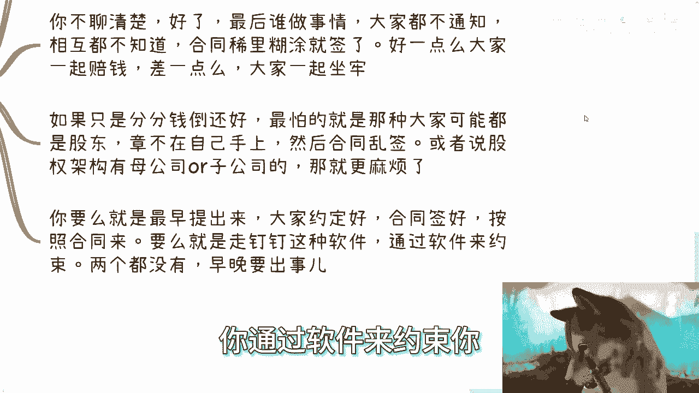
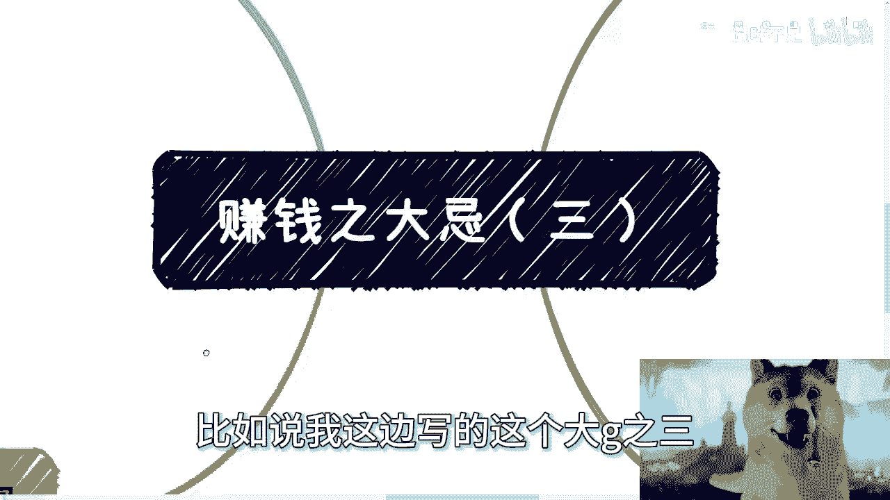

# 赚钱路上的大忌（三） - P1 - 赏味不足 - BV1dW421N71g

哈喽大家好，今天我们来讲大吉之三啊。

我还特地翻了前面两个，我他妈讲的，我就忘了对吧。

尽量不要重复是吧啊，然后第一个呢说什么就说问题不提前说清楚。

不落白纸黑字，这个事呢，呃因为前面呢第一。

第二节讲的基本上都是比较宏观的，那第三个开始讲的就是一些细节是吧。

这事其实细节很多，但是呢你比如说啊在这里面我们举例子啊，比如说钱怎么分啊，股权怎么定啊，利润怎么分啊，大家怎么合作啊，这些东西一开始都要说清楚，就很多人啊做事，包括他们合作事情，包括我聊事情都是的。

我现在你们知道吗，我现在说的跟别人沟通，我说的最多的一句话是什么，就是我说你别讲虚的，你就实际点跟我讲，就是每次沟通跟我讲了半天讲了，讲来讲去全部都是空话对吧，你就像他们跟我说啊，我们这个合作对吧。

我就问他，我说你别跟我逼逼这些，你就告诉我你们比例怎么分的对吧，是怎么签的，有没有签签过没有对吧，合同上怎么写的，我每次这么说哦，没有什么都没签，哎我说那你说半天说了。

有卵用没卵用啊啊很多人在这块不清楚。

比如说入股啊对吧，然后到底怎么入啊，为什么要录啊对吧，怎么判断入不入啊，入多少啊啊包括就是露骨跟丰润。

它是不是一回事啊啊等等等啊，然后呢就是怎么合作，你比如说大家是合伙人，那么公章本身啊，理理论上来讲，要么在法人证，要么就在大股东那边对吧，但签合同怎么签呢，是不是需要去通知，直到其他股东呢。

还是说大家来投票呢，还是怎么样呢，啊就是这种规则到底是大家口头约定了，还说是签合同了，还是说是通过一些别的方式来约束了这些东西，你一开始都得提出来，大家可以放到台面上来讨论，但是你不能默认大家是知道的。

你也不能默认你是知道的，那很多东西你自己都不知道啊，那么很多时候呢其实都是口头约定，那很多事，很多人啊就是年轻的时候啊，做事其实很上头，就是大家聊着聊着啊，牛逼对吧，就像我之前跟大家讲的对吧。

就动不动什么什么啊，呃就马上财务自由了，马上就要赚到大钱了，马上就要怎么样子了，就很上头，那一开始说说呢其实也就过去了，但做的过程当中呢，你就会发现，就是说呃就很多人一开始可能没什么想法啊。

但做的过程当中呢就出现了很多猜忌，那么咱就这么说啊，如果你不把事情说清楚，不落白纸黑字，你又去猜忌的话，那你别怪别人啊，包括就是说如果最后出问题了，你也别怪别人，这一切都是你自己的问题。

那当然如果一个商业合作，你不提，他也不提，那么你可能觉得你是一个这个叫什么啊，小白对吧，那么他也不提，那么对方我告诉你，要么就是完全跟你一样，不懂得商业的婴儿，要么对吧，他就是故意来坑你的。

因为正常操作正常合作。

大家把事情说清楚，是对你也好，对我也好的啊，何必就是说啊我非要藏着掖着，那藏藏着掖着无非两种可能性。

要么就是我也是，要么就是我是故意的，那你想想他对你有什么好处呢。

那么第二就是股份比例，股份比例这个事，还有融资比例这个事也是大忌，就是以前就说过啊，估值这件事情你可以拍脑袋，就是你可以定出来，比如说一算出来一年的成本，一年的利润对吧，你可以拍脑袋没问题啊。

但是你你做的这个业务，比如说你做医疗的，你做农业的，你做互联网的，你做新能源的，你总归会有个大概的范围，你比如说大部分的，你比如说以前的互联网的公司，它估值一般按照比如说5000万起步吧。

或者2000万起步，你说我不行，我他妈上来就一个亿，那你凭什么呢。

那凭凭凭你有张嘴没有用的啊，那么股份比例这个事呢，一方面是对合伙人，另外一方面是对投资人，这两边思考方式截然不一样的，对于合伙人你主导的话，那么你就要看到底要不要分股啊，就是你要不要分一分多少。

因为没有规定说你一定要分嘛是吧，你就算大家是pattern，也没有说一定要封啊，没有哪条规定说要付呢，就是就就我还是一直说那句话，就是我们不是应试教育啊，所有东西你是根据实事事实情况来的好。

要分要不要分分多少，怎么个依据，是根据投资比例还是根据资源比例啊，有有的呢可能是个人代持有的，可能是开个有限合伙去代吃，那这些其实都是要一碗水端端平的啊，就是说你要综合考虑。

因为融资这件事情不单单是融资，你还要考虑到比如说啊股东啊，哪些人露出啊，哪些人不要露出啊对吧，哪些人代持啊，哪些人是作为激励啊，啊哪些人是就是说怎么样怎么样怎么样，就是说你一碗水端平。

那么这个人为什么带吃，为什么这个人是是要激励，或者为什么这个人是露出了股东，对你都要有说法的，你不能说凭感觉，凭我跟他关系好，没有用的，所以我才说很多人做事情像过家家一样，他但凡这种没有任何依据。

没有任何理论依据的。

没有任何实际依据的，都没有用的，融资比例我给你讲更是了，投资人是谁，投资人带来了什么，投资人如果只带钱，基本上我跟你讲，你可以让他管啊，那么它带来什么比例多少，这些都是大幅度影响后续发展的。

那这个东西我之前有视频讲过，你们可以详细的去看啊，无论是项目进度还是产品发展，就是还是说下一轮融资，我跟你说啊，投资人这件事情你一步错就是错。

步步错啊，什么产品什么什么。

你流量多少，什么产品没有没用的，都他妈傻傻没用的，你知道吗。

就是你融资这个事情，如果当中找错了人，或者说这个比例不对。

这是致命伤啊，那么第三就风险意识的模糊，就像我们之前说的，赚钱这个事呢，最忌讳的就是模棱两可，你比如说大家合作，OK那你就像他们和我说，我们合作我们合伙人，我说这他妈就是屁话，这就是空话。

你别跟我说这些，你告诉我你怎么合作的，具体大家是怎么分的对吧，然后也比如说分工怎么分的，钱怎么分的对吧，股份怎么分的，你告诉我细节，你不我不知道你们合不合作，合不合作，关我吊事啊，对不对。

那你告诉我怎么合作，谁负责客户，谁负责产品，谁负责相互商业拓展，谁负责市场，这些不是说你们吃个饭喝个酒。

你们就是关系很好，聊聊就聊聊，没有用的，你不聊清楚，我跟你讲好了，你最后开始往后做了，大家落地了，大家都不通知，相互都不知道，他做他的，你做你的合同，稀里糊涂都签了，好一点，就是大家一起赔赔钱。

差一点就大家一起坐牢，对不对，不就这么回事吗，啊如果我跟你讲，如果只是分分钱，其实也还好，最怕的是什么呢，就是大家可能都是股东章呢，不在自己手上，然后合同乱签啊，或者说股权架构由母公司或者子公司呢。

我跟你讲，那就更麻烦了啊，你要么就是就反正还是从你个人角度来讲，你要么就最早提出来，大家约定好合同签好，按照合同来，你要么就走钉钉这种软件，就是现在不是有这种软件，比如说做层层审批啊对吧。

股权架构那个那个设置啊，或者怎么样的，你通过软件来约束你。

两个都没有，你单纯靠口头没有用的人是不可信的生物啊，啊那么最后一点就是很多事咨询还是要咨询的。

那这不是我说我啊，就是说你其实很多事问题他都在细节里面，不是那种宏观的，就就就我还是告诉你们，你们去看看你们身边的人，包括你们自己，可能你们平时讲话的时候，很容易就是讲那种空话，就讲的时候很爽。

但是没有用啊，啊你找个靠谱的人，你比如我对吧，或者找一个律师大家聊聊，你基本上问题就都暴露了，接下来你就逐个去解决问题就好了，你有些事情不是说一定要去踩坑才去学习的，你可以通过咨询啊，没问题啊。

但是你得找到靠谱的人吗，而且你咨询完了，你怕就怕什么呢，换句话就是说你心里面可能第六感对吧，感觉说哎有问题的，有些模棱两可的，不清楚的，但是你拖哦，就是你不果断，你拖，那么最后大家只会闹得不开心。

不欢而散啊，那么其实我跟你讲，核心呢就是赚钱的事，无论你做什么，你不管小打小闹，过家家也好，还是做大了也好，任何事情细节你都要清洗，就是我做这件事情到底为了什么，他后面会影响到哪些东西。

然后在整个业务过程当中，有什么事情是我不清楚的，是我的知识盲区对吧，就是说就像你今天跟我合作，比如说我们两个人做一家公司，那么你怎么知道合同我签不签，你怎么知道公章我用不用对吧。

你怎么知道我我拿了多少钱，你怎么知道公司流水是什么，你你你怎么知道呢，你不能说每次来问我哎，陈老师每隔一个月你来给我一下，没有这样做事情方式的啊，所以说别人听不清楚。

咱别管你自己得清楚，所以说你会发现，就是你比如说我这边写的这个大G之三。

就我可以说一啊234，我可以这么说。

至少看我视频的这些就是你们所有的受众里面，大部分人搞不清楚的，我觉得这句话你们搞不清楚对吧，因为搞不清楚正常，因为你们没有相关经验，但是你要靠踩坑去走，这个风险性代价太大，啊反正这些我就给你们提个醒。

你们回头要是真的要做了或者怎么样了呢，有个概念啊，回头我们可以再聊好吧，那个杭州活动好吧，有兴趣的继续报名，然后就是其他的就是商业啊，或者职业规划或者其他的一些上面啊咨询的。

反正你们整理好问题的list好吧。

