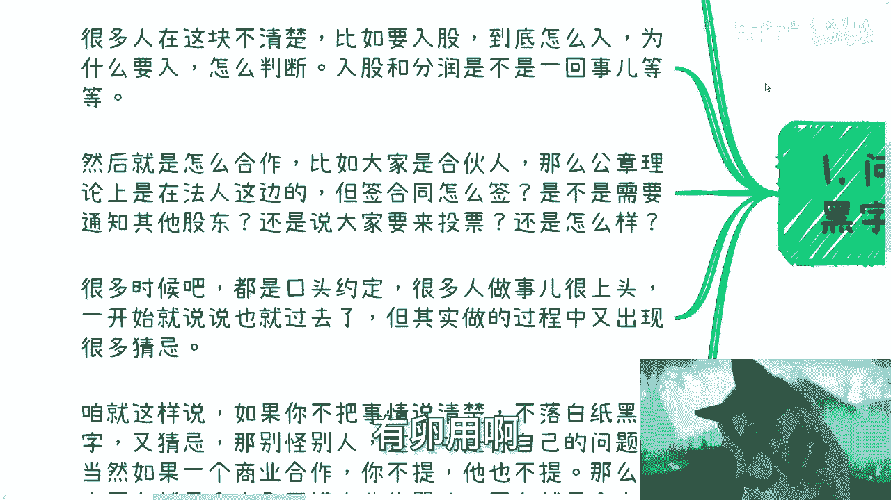

# 课程三：赚钱路上的大忌（三）🚫

在本节课中，我们将探讨在商业合作与创业过程中，因细节不清、规则不明而导致的常见陷阱。我们将重点关注合作前的约定、股权分配、风险意识等关键环节，帮助你避免因疏忽大意而造成的重大损失。

---

上一节我们讨论了宏观层面的商业思维误区，本节中我们来看看具体操作中的细节禁忌。

## 1. 问题不提前说清，不落白纸黑字

商业合作最忌讳的就是口头约定和模糊不清。许多人在合作初期因热情或信任，忽略了将关键条款书面化，这为后续的纠纷埋下了隐患。

以下是合作初期必须明确并书面化的核心事项：

*   **利益分配**：钱怎么分、利润如何分配。
*   **股权与权益**：股权怎么定、入股方式与比例、入股与分红的关系。
*   **合作规则**：公章由谁保管、合同签署流程（是否需要其他股东同意或投票）、决策机制。
*   **约束方式**：上述规则是口头约定、签署合同还是通过其他法律形式约束。

如果双方都不主动提出并明确这些细节，通常只有两种可能：要么双方都缺乏商业常识，要么其中一方有意隐瞒。清晰约定是对所有参与方的保护。

## 2. 股份与融资比例设定随意

股份比例（针对合伙人）和融资比例（针对投资人）的设定需要严谨的依据，而非凭感觉行事。这一步走错，可能对项目发展造成致命影响。

以下是关于比例设定的核心要点：

*   **对合伙人**：主导者需思考是否分股、分多少、依据是什么（如出资比例、资源贡献）。需要考虑代持、激励池等安排，并确保有公平合理的解释，不能仅凭关系好坏决定。
*   **对投资人**：估值可以有一定弹性，但需符合行业常规范围。需要评估投资人带来的除了资金以外的价值（如资源、渠道）。投资人的背景和所占比例将极大影响后续的产品发展、项目进度乃至下一轮融资。

错误的融资选择或比例失衡，可能导致“一步错，步步错”的局面。

## 3. 风险意识模糊

赚钱忌讳模棱两可。一句“我们是合伙人”是空洞的，必须细化到具体可执行的层面。

模糊的合作会带来巨大风险：

*   **分工不明**：谁负责客户、产品、市场拓展？若不清晰，落地后各自为政。
*   **权责不清**：合同乱签、公章管理混乱，轻则共同赔钱，重则涉及法律责任。
*   **约束缺失**：仅靠口头约定或人情维系是不可靠的。必须通过**签署正式合同**或利用**协同办公软件（如钉钉）设置审批流程**来进行约束。

## 4. 忽视专业咨询

许多问题藏在细节里，而非宏观口号中。当遇到知识盲区或感觉事情“模棱两可”时，寻求专业咨询是成本最低的避险方式。

关键行动建议：

*   **主动咨询**：寻找靠谱的业内人士或律师进行咨询，提前暴露问题。
*   **果断决策**：咨询后，对发现的问题要果断处理，切忌拖延，以免问题发酵导致不欢而散。
*   **厘清细节**：无论项目大小，都要不断追问：我做这件事的目的是什么？会影响什么？有哪些是我不清楚的？

**核心公式：成功合作 = 清晰约定（书面化） + 合理比例（有依据） + 明确权责（可执行） + 专业把关（避风险）**

---

本节课中我们一起学习了商业合作中的四个关键禁忌：**约定不明、比例随意、意识模糊、忽视咨询**。赚钱的本质是处理复杂关系和细节的过程，任何环节的含糊都可能付出巨大代价。请记住，在商业世界里，清晰的规则和协议不是不信任的表现，而是对所有人负责任的基础。