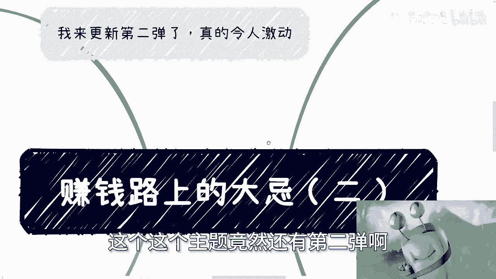
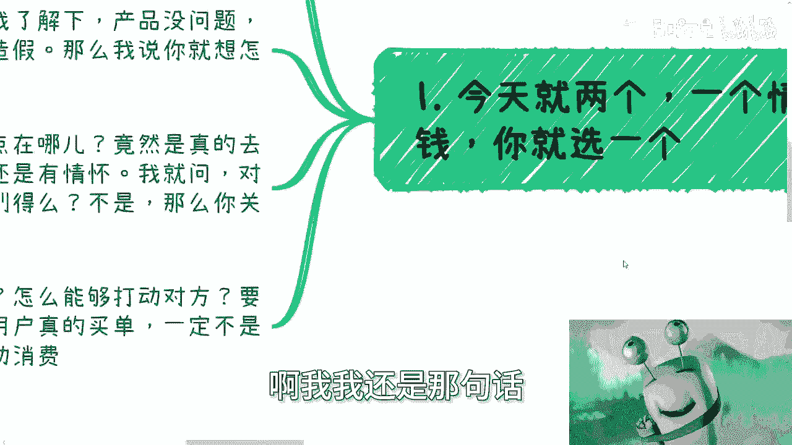
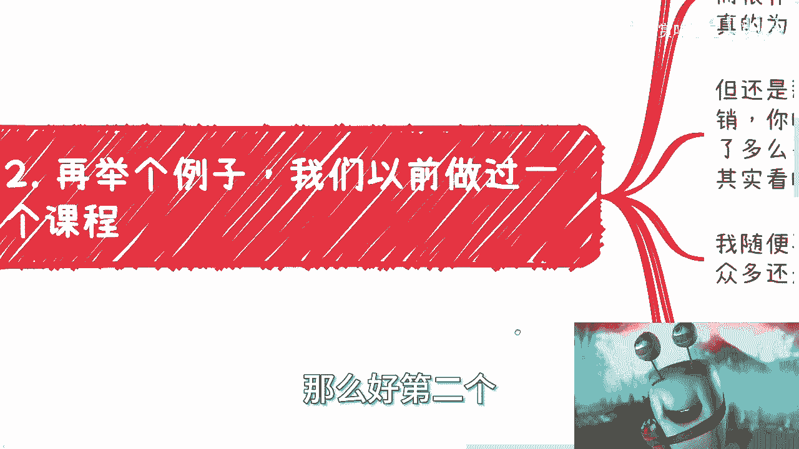
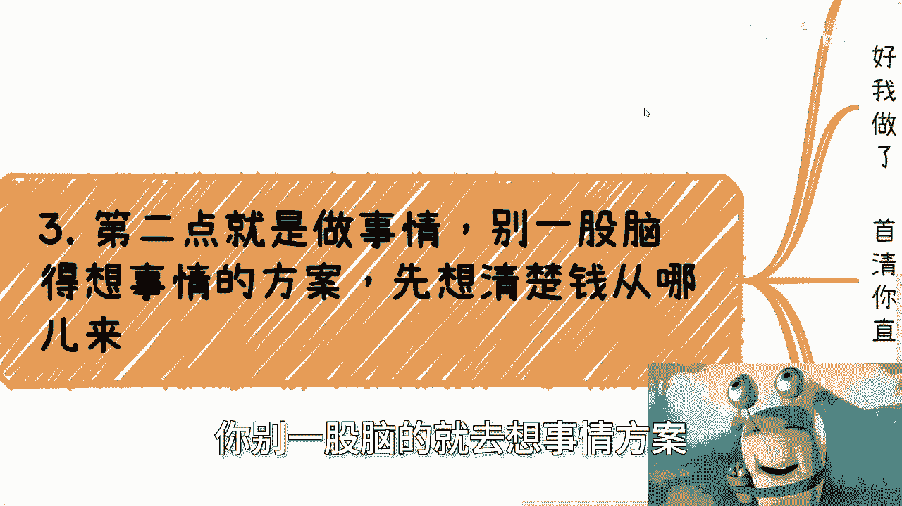
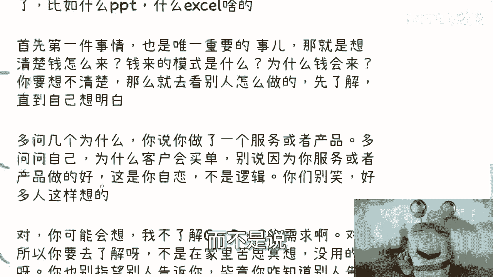
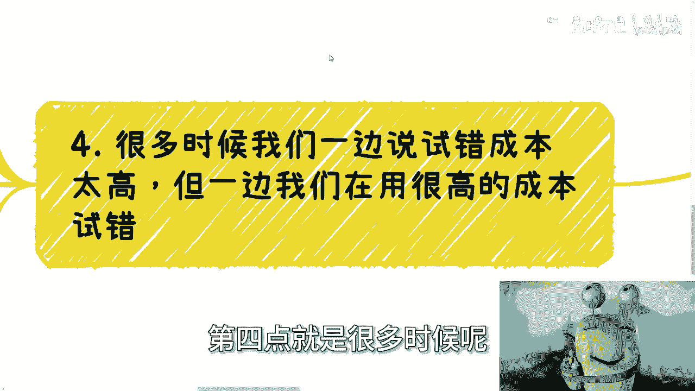
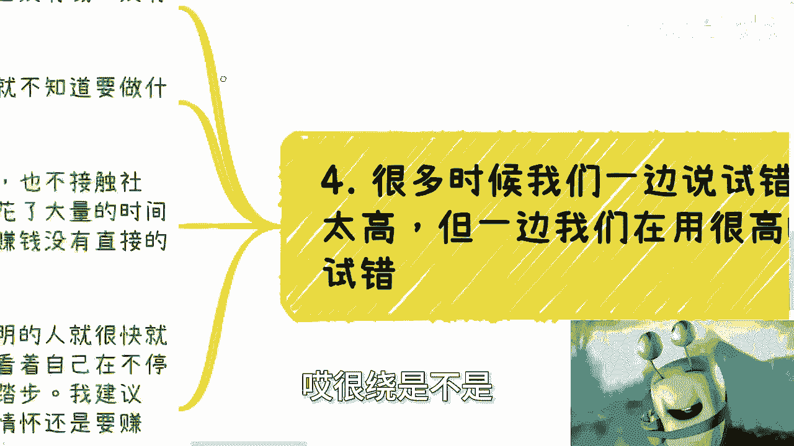
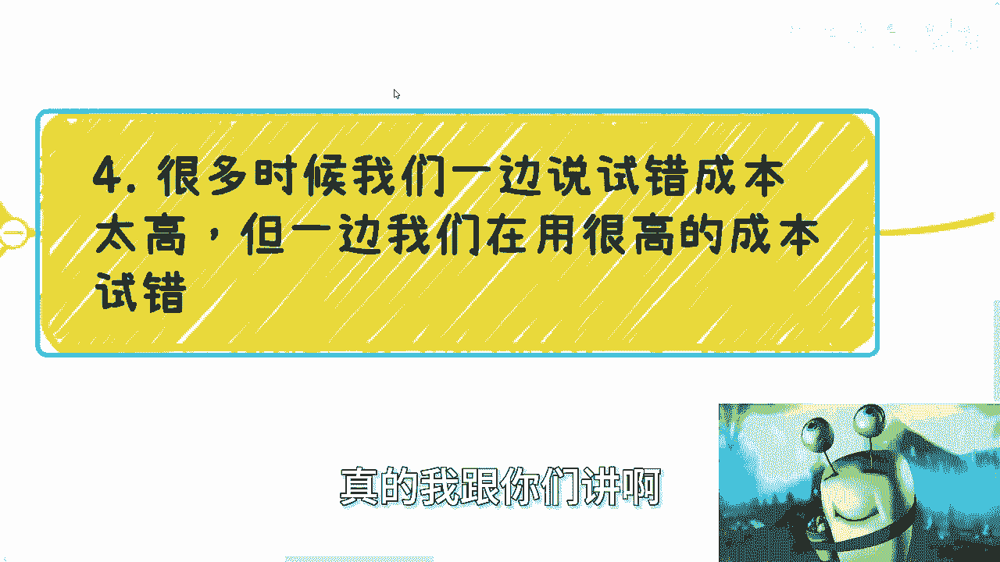
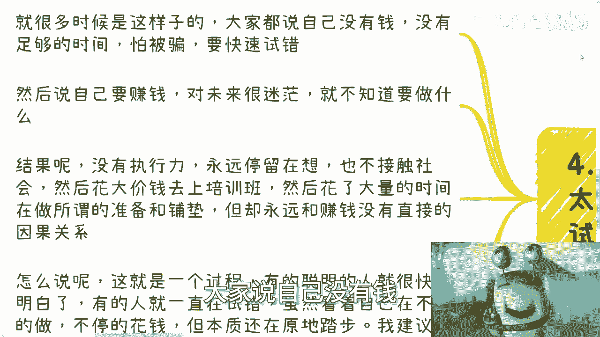
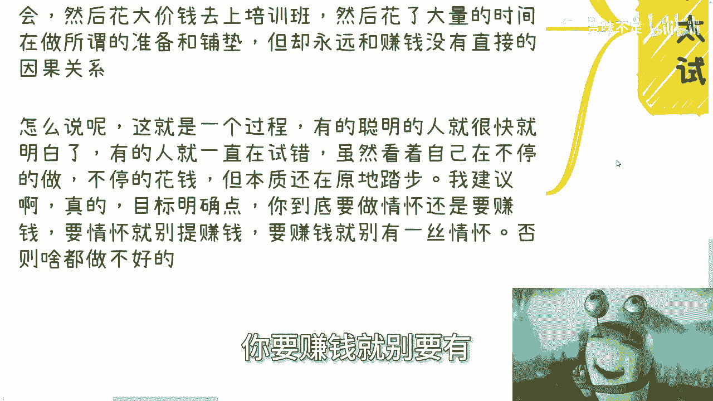

# 赚钱路上的大忌（二） - P1 - 赏味不足 - BV1DZ421z7MR

好呃咳咳咳。

我们来讲第二个，这个这个主题竟然还有第二弹啊。

令人感动啊，令人激动，我也很激动啊，因为我也没有想到有第二弹是吧啊，就是最近总结下来发现诶好像可以啊，可以啊，搞搞是吧，诶诶我这个头像可以啊。

这次呢主要是两个问题啊，一个呢是情怀与赚钱对吧。

你得选一个啊，你得选一个，而且得彻底啊。

这事吧我觉得道理大家都懂得都懂啊，但是在做事情当中呢，他就不懂啊，就是我碰到过无数的人啊，我问他们说你的目的是什么，对方跟我说我的目的是赚钱啊，然后我就说我说那我说我聊下来啊，你给出的方案也好。

你的想法也好，你的计划也好，我说我不管你说什么，你给出来的东西没有让我感觉到你想赚钱，对吧啊，比如说啊有的人卖自己的产品，我了解了一下啊，产品没问题啊，蛮好的蛮好的，也没有昧着良心去欺骗或者造假啊。

就都很好，那么我说啊，我说你想怎么赚钱呢对吧，你想怎么赚钱呢，就像有很多人跟我说，我有一技之长对吧，我会画画，我会唱歌，我会做手工制品对吧好，然后呢，他告诉你啊，我营销嘛也营销了，但重点在哪呢。

我跟你讲，这就问题来了，重点是他真的想要去指望教会对方，并且还要跟对方说明，试图来说说服对方自己是牛逼的，嘶这个事就很奇怪，你知道吗，就是这说明你还是有情怀，为什么，因为那我们以前说过啊，你要对中国。

你要对网络环境有了解，网络环境是什么，网络环境就是也不是网络环境嘛，你要对整个人类要有了解对吧，就是百分之我们就这么说，5%是有脑子的，95%都是对吧好，那么我们就分开来说。

你想跟那5%的人说你多么牛逼，那说实话，那5%的人未必买单，对不对，好，你想跟他95%的人说你多么牛逼，那不好意思，他们他们没有这个脑子来理解，那我就问你说了有卵用吗，没有。

那我请问你做这些事情干什么呢，你跟我说陈老师我想赚钱，我鬼信啊，对吧，诶那我就问对方那个认不认为你牛不牛逼，以及对方能不能觉得呃呃对方能不能学得会，这是你能控制的吗，这是我能控制的吗，如果你不能控制。

我不能控制，那么你去关心它干嘛呢对吧，因为在我看来，你你做的所有的行为只要跟赚钱没有关系，你就在浪费时间，不就这么回事吗，如果你跟我说，陈老师不是的，那我只能认为你不够缺钱，就这么简单，你不要跟我逼逼。

你知道吧，你逼逼半天，我跟你讲很多的言语，都是为了修饰一个本质对吧，你逼逼半天的意义是什么，意义就是你不缺钱，你要跟我说，你缺钱，那你干嘛不赚呢，对不对，你跟我说，哎我不会转，我转不来，那不好意思。

这个不是借口对吧，因为你做事情当中没有让我感觉，你对钱非常渴望，就这么简单哦，你我在我看来，大部分的人，包括我在内，我们难道不应该更关心怎么赚钱吗，我们难道不应该关心如何去打动我们的客户吗。

对吧你要明白所有所有的自媒体的东西啊，我们先把它单独拎出来啊，就是所有的自媒体的东西，用户真的买单往往一定不是因为自己觉得有用。

往往是因为冲动消费，你一定要明白哦，我我我还是那句话。

就说你今天冲动消费买到一个对方，你觉得有用的，那是你命，好对吧，你买到一个没有用的，这他妈叫常态啊，这说白了你被割，这叫常态，你不被割，这他妈才是奇迹啊，那么好。

第二个再举个例子啊，我们以前做过一个课程，比如说啊我们以前做过一个课程，就是客单价很高很高啊，同时呢逼格也拉得很高啊，反正就是说想想要做那种客单价很高的课程嘛，对吧。

诶为什么我的这个眼珠子老是从上翻的啊，你能往下翻啊，大哥诶大哥诶诶诶嘿妈的太他妈粗糙了，哎往下翻哥算了，就这样吧，那么但课程呢你看啊课程表课程的细节啊，茶歇接待反而很朴素啊，那么说白了什么意思呢。

说白了就是说课程本身还是有很好的，打磨的内容啊，也就是说是真的为用户去想的，是真的从从客户，客户本身课程本身去想的，是真的希望对方得到东西，但就像我们第一次，就刚刚一里面所说的，你面对那百分之百的人。

5%的人觉得你在装逼，95%的人不知道你在说什么东西对吧，就说白了你的装的逼，让那5%的人觉得你是个骗子，但是让那95%的人呢，又不足以让他们冲动消费，那我就问你，赚个屁钱，对不对啊，对方会不会买单。

主要是看你营销和你的话说，我早就跟你们说过了，中国早就过了那个叫什么，酒香不怕巷子深的时代了对吧，现在是什么，现在是你把酒他妈摊出来再香也没用，得他妈靠营销，对不对，你的话术。

比如说你请的多么牛逼的嘉宾，你的背书如何，至于你的内容，至于怎么就是有很多细节，你真的以为用户会去看吗，啊你真的以为一张海报从上到下这么长，有人会看吗，有的有多少人呢，极少数啊对吧。

你更别说那他妈95的人根本就看不懂了，对吧，然后然后我再随便举个例子，比如说我我做数字经济对吧，你说你们讲啊，我是做数字经济，内容受众多还是做商业，咳咳，内容受众多，可想而知，对不对。

但是你从我个人来讲，你从情怀来讲，我肯定做出的评价，因为我觉得这是未来对吧，甚至我想做情感，因为我也觉得诶情感蛮好玩的对吧，我也我也很适合讲，但情感这个事很敏感，你一不小心就性别对立。

一不小心就要被冲对吧，所以你为啥你为啥说商业呢，是因为商业做你是从用户基数来讲，商业的用户基数是最大的，虽然情感用户基数大，用用户基数更大，但是它它风险高对吧，所以我们做事情一样的，你但凡要赚钱。

你从用户角度去考虑啊，你别从我们有什么东西考虑啊，啊你要我我真的我跟你们讲，你要从我这个你要从我这个说段子的角度来讲，那他妈我我我肯定是做说情感段子来的。

说得好啊，对吧啊，那那听的人更有趣啊，但是我我敢讲吗，我不敢讲啊，卧槽我不是说什么，我要是连续说五期以上，早晚五期内肯定是要被冲奶啊，然后三呃第二点就是说什么，就是说做事情你别一股脑的就去想事情方案。

你先想清楚钱从哪里来，你看啊，去政府，现在有很多人跟我讲方案去政府，去企业，去高校啊，to个人，对不对，好，那么很多小伙伴呢做完整的方案，我跟你讲，我真的我看出来了，我就有种什么感觉啊。

就是就是我跟你们讲啊，我们既然已经做自己的事情了，就不要再用那种应试教育，跟公司里面那种为老板做事情的思维，再来做事情，什么意思，就是很多人做做方案啊，竟然还在更，就是很好的用什么做了个PPT啊。

做了一个excel哦，那我在我看来是这样子的，你要有这个功夫去做这些形式的东西，不如多思考一下你怎么赚钱，你这些形式的功夫，这个这种功夫花在形式上面干嘛呢，没有用的对吧，你首先第一件事情。

也是唯一的重要的事情是什么，就是你想清楚钱从哪来，钱来的模式是什么，为什么钱回来对吧，你要想不清楚，你就去看别人怎么做的，你先了解，直到自己想明白了，你多问几个为什么，就比如说你今天对吧。

比如比如说你PPT excel啊，一个方案做的很好，你说你做了一个服务或产品对吧，你多问问自己，为什么客户会买单，你千万别来跟我说，因为你的服务和产品做得好，哎我跟你讲，你们还别笑，我。

操真的很多人跟我说的，他说陈老师，因为我觉得我这产品做的好，大哥你好不好，他妈的不是你说了算的啊，付钱是别人付的，你要觉得你好，那是你自恋，这不叫商业逻辑，你这没有逻辑对吧哦，而且我跟你讲啊。

你可能会想，我不了解企业，我不了解政府，我不了解用户的需求，对吧对呀，你是不了解，所以你要去了解啊，你不是坐在家里苦思冥想，你也不是花钱去买那个被割，对不对，你没有用的，你也别指望别人告诉你。

毕竟你怎么知道别人告诉你是真的呢，对不对，做事情就这样子，你不了解，那你去了解啊，是不是对吧，而不是说而不是说就是说我现在聊下来。

而不是说你其实不了解，但是呢你在不了解的前提之下，已经做了非常好像看似很牛逼，或者看似啊啊，这个这个这个这个想的很多的一些方案，用PPT用用excel或者用我的这个XMIND的这个脑图，但其实没有用啊。

你知道吗，就是我说的不客气点。

你在我看来就是自我感动，你你你我们做事情难道不是直捣黄龙吗，啊哦难道你跟我说说，我难道你跟我说，老师我缺钱，但是哎不这样子哦，我缺吗，是缺的，但是我想先慢慢来，你慢慢来，也是先慢慢赚钱开始来啊对吧。

就像你今天先赚的用户19块钱，你明天赚29块钱，后天赚39块钱，不是说你今天一年哦，你说我做免费的，我开始试错，你试错你也得赚钱啊，对不对啊，然后很多第四点就是很多时候呢。

我们一边说试错成本太高，但是一边呢我们在用很高的成本试错，哎。

很绕，是不是，但是我跟你讲，你仔细想想看是不是有道理，哎真的我跟你们讲啊。

就是很多时候你看啊，大家说自己没有钱。

没有足够的时间怕被骗啊，要快速试错，也没有这么多的成本啊，没有没有啊，没自己，没有这么这么这个不足以承担这么高的成本，对吧好，然后呢说自己要赚钱，对未来很迷茫，就不知道做什么，对不对，好没问题啊。

好结果既没有执行力，也永远停留在想，也不接触社会，然后花大价钱去上培训班，然后花大量的时间去做所谓的准备和铺垫，但永远你问他怎么赚钱，不知道诶，我不知道啊，啊那就吃很奇怪，你知道吗，就很奇怪。

他哪怕我问那种就是说交交交钱，交了45万的，也是，我说那你做了这么多事情，你怎么赚钱呢，哦看流量，那他妈看流量跟你赌博有什么区别，你怎么赚钱，逻辑通不通不通对吧，就怎么说呢，就是说这只是个过程。

是个变化的过程，就是有的聪明的人呢很快就明白了，有的人呢却一直在试错，你虽然看着自己在不停的做，不停的花钱，不停的去尝试，但是本质上你你还在原地踏步啊对吧，我建议啊真的目标明确一点。

你到底要情怀还是要赚钱，你要情怀就别提赚钱，你要赚钱就要有。

不要有一丝情怀，你懂吗，你否则什么都做不好，而我跟你讲啊。

我跟你们讲啊，你们不要去觉得哎呀，陈老师一直跟我们说要虚的要空的，我跟你讲很搞笑的一件事情，就是有些人会跟我讲，陈老师，我不想做虚的，我也不想包装啊，我也不想做中介，我就跟你们这么说，我想吗。

我也不想啊，谁想啊对吧，我跟你讲，我听到这种话，我真的我我每次都反问我说大哥行，那我就问你会啥，你那你先告诉我，你会啥，你别放屁，你对啊，你这种屁话谁都愿意说，谁都会讲呀，那我就问问你会啥对吧。

唉你们也好我也好，我们没有这么强的屠龙之技啊，就我们不会造光刻机，我们也不会造火箭，那你说我们不去弄一些虚的，我们不来包装，我们不去怎么样，我们怎么赚钱，怎么生存啊，诶奇了怪了，真的是，对吧。

真的我我我我很多时候说人活着明白啊，不是说活的仅仅开心，而是说不要用那些有的没的想法，有的没的语言来迷惑自己对吧，很多东西都是面子上，唉就就好像就说明明核心在那边，你说我不碰的啊，我就开始在面上。

开始在那边扑扑扑很多东西来掩盖那个内心，何必呢，那自己骗自己有什么意思啊，对不对，咳咳咳啊好，我觉得这个第二个大忌啊，就是这么一些内容啊，回头要是我再想出来什么，再给你们补充吧，嗯有啥。

反正我们在走咨询好吧。

