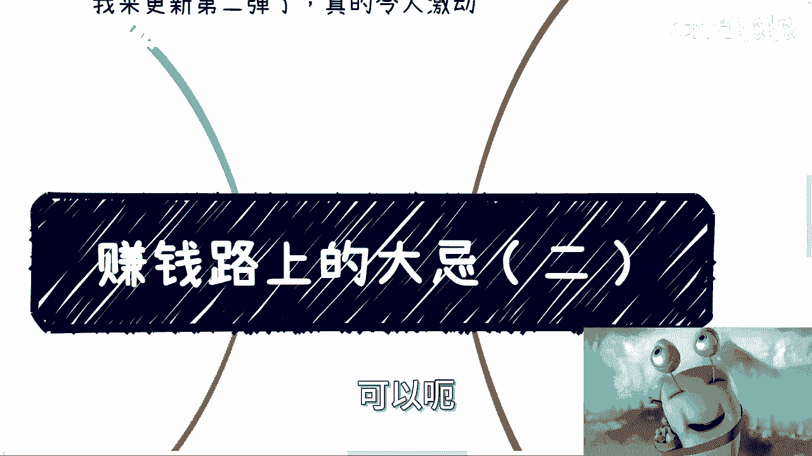
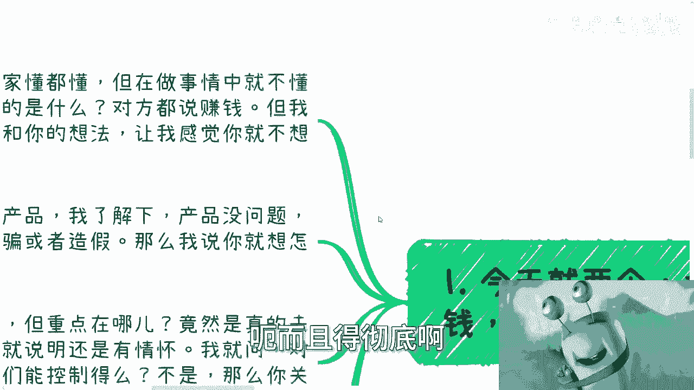
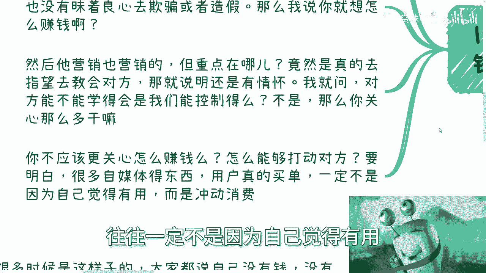
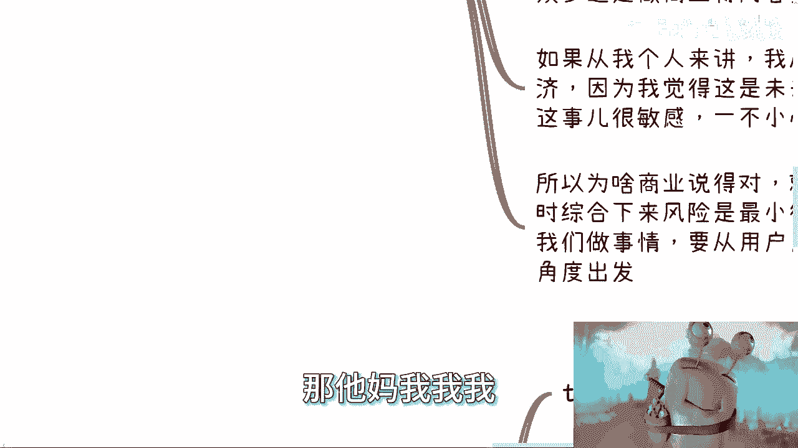
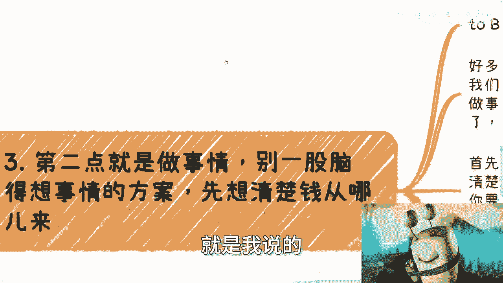
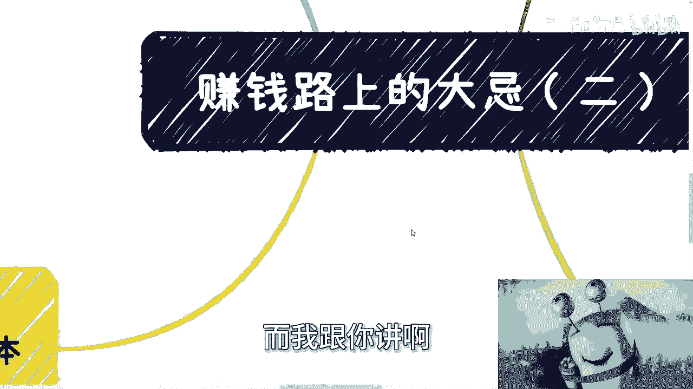
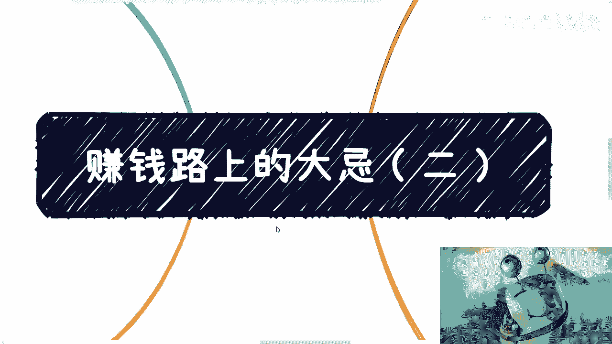

# 课程：赚钱路上的大忌（二）💰 - P1







在本节课中，我们将要学习在追求商业成功时，必须警惕的两个核心思维误区。课程内容将围绕“情怀与赚钱的抉择”以及“行动前的关键思考”展开，帮助你理清思路，将精力聚焦在真正能产生收益的事情上。

## 情怀与赚钱，必须二选一 🤔

上一节我们介绍了赚钱路上的一些常见陷阱，本节中我们来看看第一个大忌：在情怀与赚钱之间摇摆不定。

许多人声称自己的目标是赚钱，但其实际行动和方案却透露出浓厚的情怀色彩。例如，拥有技能（如绘画、手工）的人，在营销时总试图向客户证明自己多么专业、产品多么出色，并期望客户能理解和学会。这本质上是情怀思维。

你需要明白一个现实：网络或大众环境中，仅有约 **5%** 的人具备深度理解和判断能力，而 **95%** 的人决策往往依赖其他因素。试图向这95%的人证明你的“专业”和“价值”通常是无效的，因为他们可能无法理解，也未必关心。




**核心公式：**
```
有效行动 = 行动 × 赚钱导向系数
```
如果你的行动与“让客户买单”这个目标无关，那么 `赚钱导向系数` 就趋近于0，整个努力便是徒劳。如果你感到赚钱困难，或许应该审视自己是否真的对金钱足够渴望，行动是否足够聚焦。


在商业中，尤其是自媒体领域，用户买单的核心驱动力往往是**冲动消费**，而非理性判断产品“有用”。买到有用的产品是幸运，买到没用的才是常态。因此，营销和话术的重要性远大于单纯展示产品细节或自我证明。

以下是基于此点的行动建议：

*   **明确首要目标**：问自己，当前阶段的核心目标是满足个人情怀，还是获取商业回报？两者路径截然不同。
*   **放弃无效证明**：停止向客户（尤其是那95%）费力解释你有多牛、产品有多好。这不会显著提升转化率。
*   **聚焦冲动触发点**：研究你的目标客户因何冲动消费。是权威背书、氛围营造、恐惧诉求，还是限时优惠？将资源投入于此。
*   **选择最大基数赛道**：从潜在付费用户基数出发选择领域，而非个人兴趣。例如，“商业”内容比小众的“数字经济”受众更广，比敏感的“情感”内容风险更低。

## 行动前，先想清楚钱从哪里来 💡




明确了目标在于赚钱后，我们来看看第二个大忌：在没有想清楚盈利模式时，就沉迷于制定复杂的执行方案。

许多人在创业或开展副业时，会花费大量精力制作精美的PPT、详细的Excel计划或思维导图，这常常是过去职场或应试教育中“为老板做事”思维的延续。然而，在为自己奋斗时，形式主义的准备是低效的。

第一且唯一重要的事情是：**想清楚钱从哪里来**。你的客户是谁（To 政府 / 企业 / 个人）？他们为什么愿意付钱？付钱的逻辑是否成立？如果自己不清楚，就应该先去市场了解，而不是闭门造车。

一个典型的误区是认为“产品好客户就会买单”。这是典型的一厢情愿。商业逻辑是：**客户认为好并愿意付钱**，才是真的好。你的自我感动式准备，在无法回答“钱为何来”时，都是成本高昂的试错。




更矛盾的现象是，许多人一边声称试错成本高、缺钱、怕被骗，一边却又在持续进行高成本的无效试错——比如花费大量时间和金钱去上不明所以的培训班，或做永无止境的“前期准备”，却始终说不清具体的盈利路径。


以下是避免此点的具体步骤：


*   **直指核心问题**：在动手做任何复杂方案前，先用最简洁的方式回答：我的第一个1元钱将如何赚到？客户是谁？为什么付钱？
*   **验证而非空想**：不要臆测客户需求。通过快速、低成本的方式（如简单沟通、最小可行性产品测试）去真实市场验证你的赚钱想法。
*   **拒绝自我感动**：警惕那些看起来详尽、专业但脱离市场验证的文档工作。它们可能只是让你感觉良好，却无法推动业务前进。
*   **接受“虚”的必要性**：除非你拥有“屠龙之技”（尖端硬科技），否则在起步阶段，适当的包装、营销甚至中介角色，都是连接你的能力与市场需求的必要手段。生存是第一要务。

## 课程总结 🎯


本节课中我们一起学习了赚钱路上的两个关键思维禁忌。



首先，**必须在情怀与赚钱之间做出清晰、彻底的选择**。若选择赚钱，就应将全部注意力集中在如何触发客户购买冲动上，而非执着于自我证明或教育市场。



其次，**在行动前务必想清楚最根本的盈利逻辑**。避免陷入制作精美方案的形式主义陷阱，通过快速、低成本的方式验证“钱从哪来”，并坦然接受在起步阶段运用必要的营销和包装策略。


核心在于目标纯粹、思路清晰、行动聚焦。摒弃自我欺骗和无效努力，才能更有效地在商业道路上前进。