# 赚钱道路上的大忌 - P1 - 赏味不足 - BV1k2421w7Ny

大家好，你们看到没有看到这个线，看到这个线这么多，就知道不简单，是不是这个我们来讲一下啊。

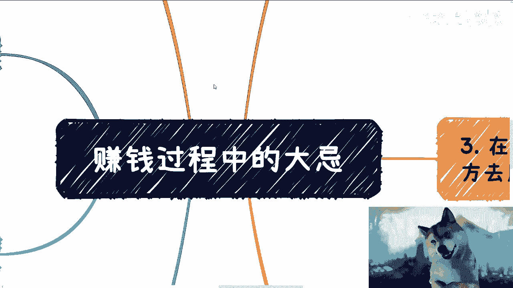

这个赚钱过程当中的大忌啊，大忌啊。

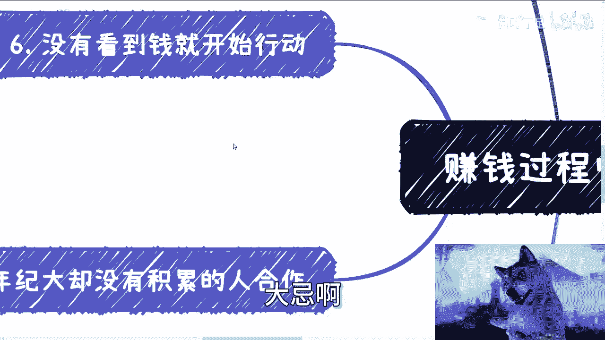

卧槽一，我都找不到了，尼玛哦，哦这里啊。

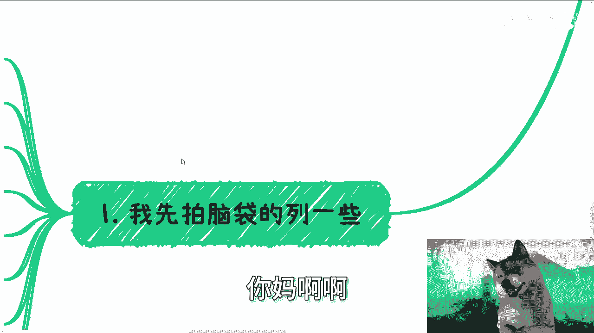

我先拍脑袋列一下啊，呃我想了多少是多少啊，回头想到别的，我再补充好吧，以下排名不分先后啊，第一在雷区蹦迪啊，就很牛逼，我跟你讲，我为什么说到这个东西啊，我待会会跟你们讲啊，因为有人私信我想要蹦迪啊。

第二呢在天花板过低，市场过小或者明显垄断的地方去做啊，哎我这个麦克风，等一下等一下等一下我看看我麦麦克风哦，对的对的，第三与生存都困难的人合作，第四与年纪大却没有对应积累的人合作。

第五在没有看到钱就开始行动啊，然后最后呢啊，我并没有讲任何跟政府相关的东西对吧，但是我不讲了，并不代表没有啊，我这里不提，只是为了B站的安全啊，哈因为当时给我开充电功能的时候，他们的运营就跟我说过啊。

陈老师你这个对吧，自己注意一点啊，不要让我们难做啊。

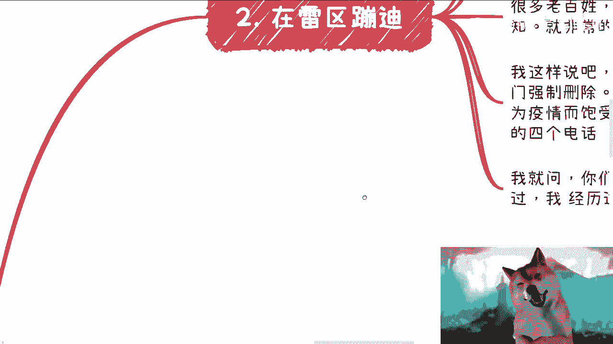

首先啊第一点在雷区蹦迪啊，前几天有个小伙伴私信我啊。

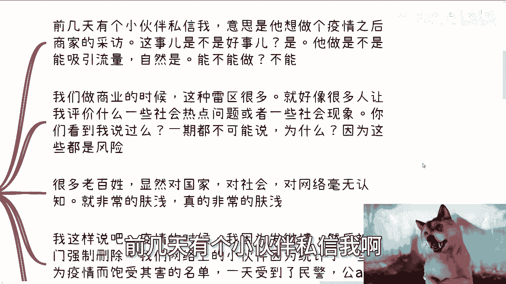

但很很好玩的，我跟你们讲，他说他想做一个在疫情之后啊，衣食住行的，比如说什么商区啊，商超啊对吧，商家的采访，我跟你们这么说啊，这个世界上有很多事情是不是有需求，有是不是好事，是他能不能吸引流量，能啊。

他能不能，比如说我去写一个剧本啊，然后用用用这个剧本来这个做出来行不行行，我就告诉你们都OK这些答案都没问题啊。

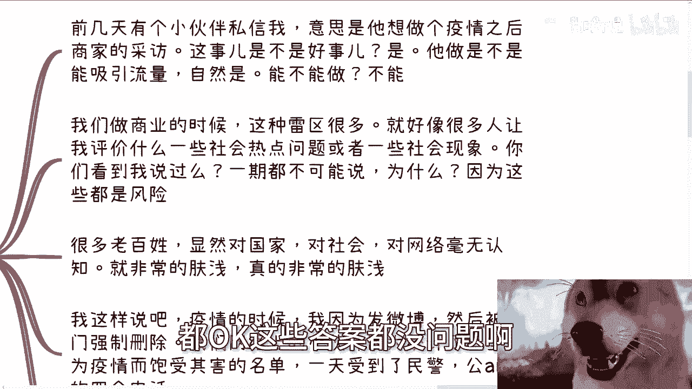

都是正向的，但是你能不能做不能啊。

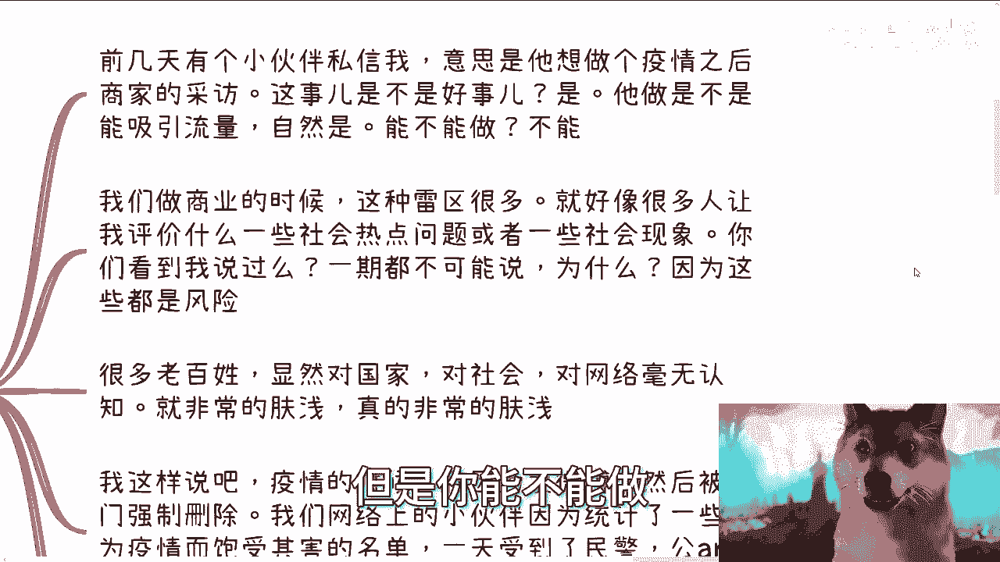

我不知道你们前两天，有没有看到过一个短视频啊，说的什么啊，说那个啊一对夫妻啊，然后她老公好像是瞒着他老婆做那个外卖啊，然后呢就是好像做了几个月了，大半年了，然后他老婆就是质问他啊。

说你什么白天死到哪去了对吧，然后白天忙什么东西了，你说对吧，然后一开始这个这个非常的气愤啊，然后后来知道呢，就是说那个她老公是做外卖了啊，去做外卖了，然后送货了啊，然后他就很难过就哭了，然后哭了。

意思就是说你有什么问题，我们一起承担对吧，好吧啦吧啦吧啦，当时引起了很大的轰动啊，然后今天呃发了声明啊，是叫什么剧本啊，假的啊，所以说啊所以说啊他下面有个评论哼也很好玩，他说你这个剧剧本来就不能这么写。

剧本怎么写，你基本得起码得要写，就是哎我送外卖3年108万，对不对，我出去摆摊啊，一年200万对吧，你要这种剧本啊，对吧哈，什么意思啊。

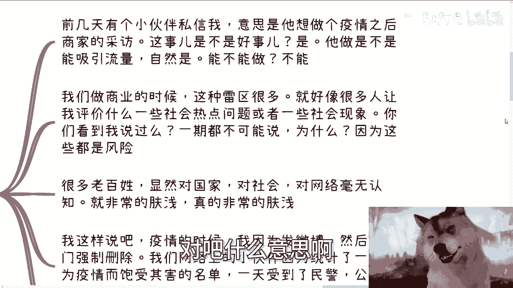

意思就是说你要明白在社会上，在国家层面，在网络上，哪些是雷区啊，哪些不是雷区。

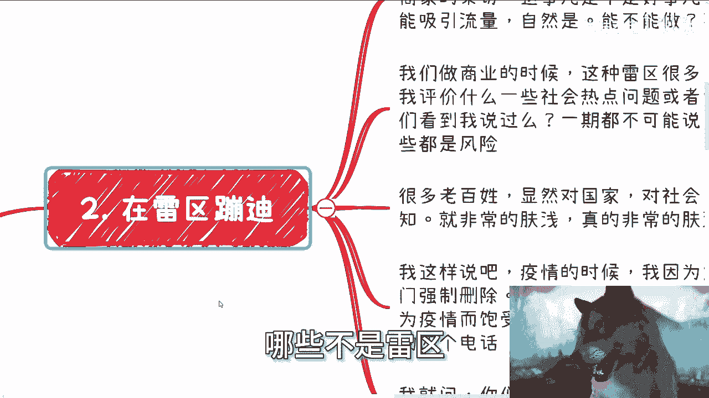

哪些你是能蹦迪的，哪些是不能蹦的啊。

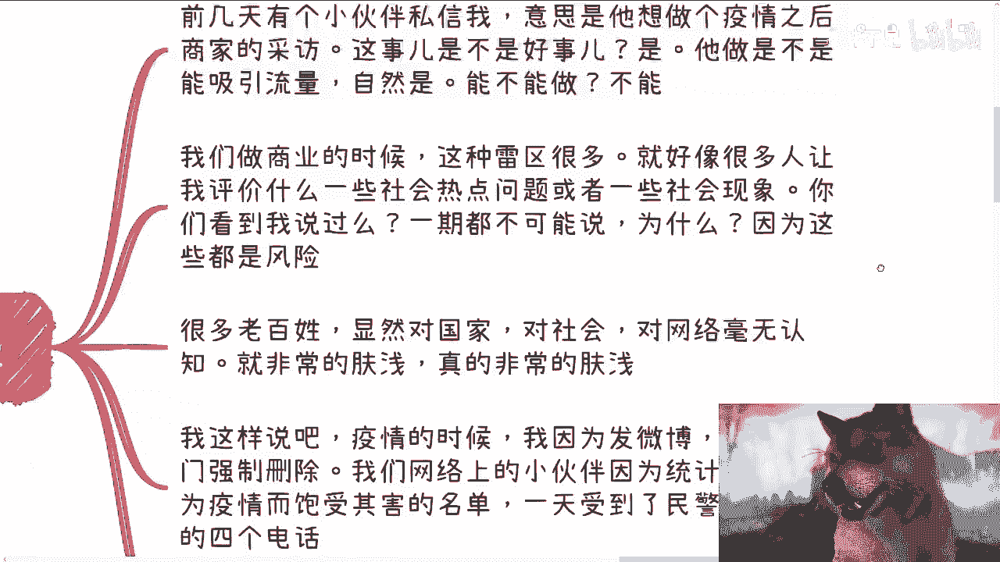

我们做商演的时候，我跟你讲这种雷区很多，那就好像很多人啊，你们会发现就是私信也好，评论区也好，很多人让我去评价，什么社会热点或者什么社会现象对吧，包括我们刚刚说的那个什么，3年108万对吧，这种东西啊。

你看到你想想看啊，我到现在有说过吗，我到现在有一期说过吗，我能说吗，能我有什么不能说我会讲吗，我有什么不能讲对吧。

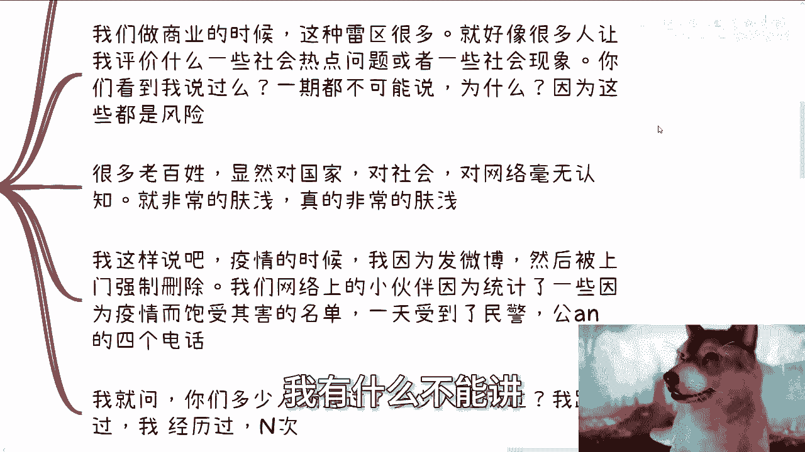

但是为什么我不说，因为这都是雷区啊对吧。

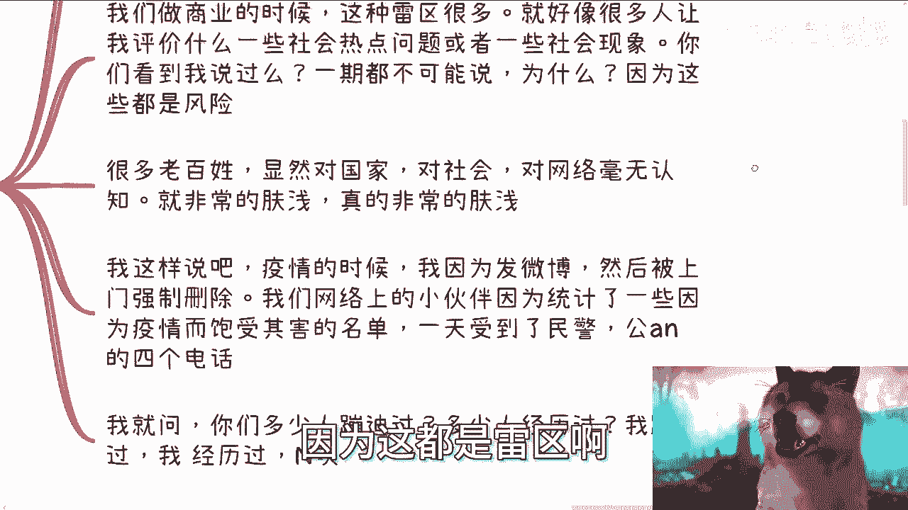

要讲这些东西有没有流量，有啊对吧，大家感不感兴趣啊，感兴趣啊，我讲这些东西不能讲，不不不不得给他讲出花来呀对吧，不能讲成小说吗，不能讲出相声吗，可以呀，但这些是雷区啊，这种东西就是不是说有没有举报你。

而是说不管有没有人举报也好，无人举报也好，你对整个网络对整个平台就是个雷区啊，你明白吧，所以说很多老百姓他显然对国家，对社会，对网络毫无认知，他认知非常肤浅啊，我跟你们讲真的很肤浅，就这些东西。

那我为什么跟你们这么说，就是就是如果你们要去做自媒体，你们要去做一些东西，你们也不要往这上面去靠，你知道吗，没必要的，得不偿失对吧，你的目的不是来做菩萨，你的目的是去赚钱的，对不对啊，孰重孰轻。

你自己要去判断哪啊，我这样说啊，疫情的时候，我因为发微博被上门强制删除，来了五个警察对吧，然后我们网络上小伙伴啊，当时也是跟我一起的，因为统计了一些因疫情而饱受其害的名单啊，我就告诉你们一天收到了对吧。

那那我就不读了呢，这个这个四个电话对吧，我就问你们多少人有胆子蹦迪，你们多少人蹦过迪，你们多少人经历过对吗，最好不要去碰碰了，不好说不好听点，我能活到现在，不代表你们能活到以后对吧，我就告诉你们。

我笨过，我经历过啊，我踩过雷区，我他妈来踩。

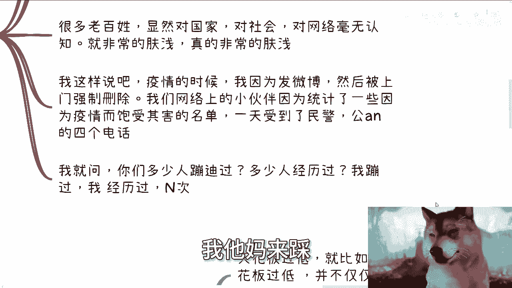

还踩过N次对吧，就这么回事。

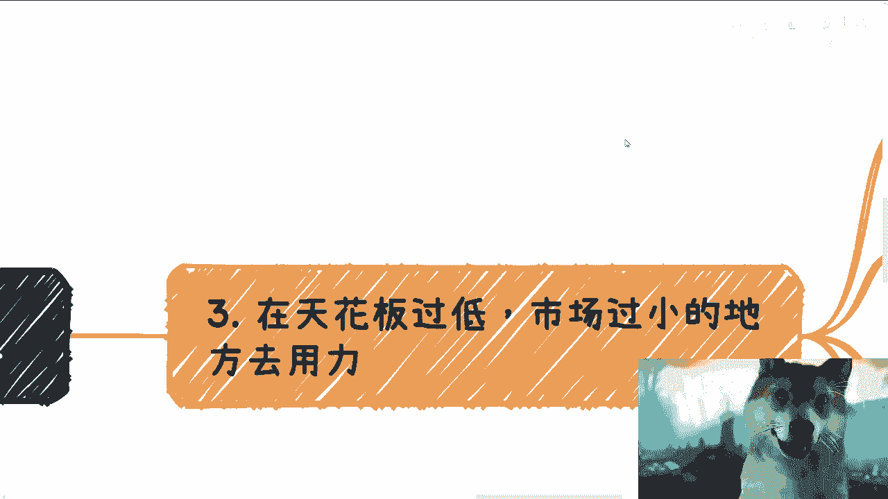

第二在天花板过低或者市场过小地方去用力啊，呃所谓天花板过低呢，就比如说什么原画啊，插画啊对吧，画师啊，设计啊这些东西啊，我了解下来就是他们的这种，就是说行业天花板它就很低啊，当然啊我说的天花板过低。

不仅仅只是在职业跟打工上面啊，包括你突破打工之后的发展。

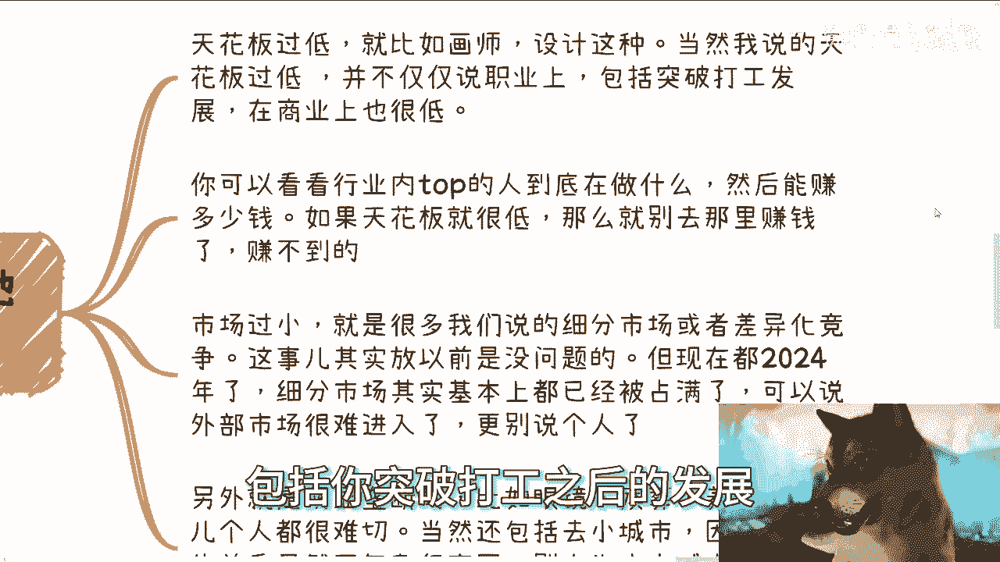

它在商业上的天花板也很低，就是你想嘛，比如说在任何一个单子，在任何一个商业闭环里面，设计能有多大的占比啊，对吧，我我我们就这么说啊，就是说呃我我说很多写代码的对吧，做开发的或者说做什么，比如解决方案的。

可能在整个商业链链路里面已经是属于叫什么，打工，也不叫打工吗，外包最底层的人，设计，可以说比他们还要底层的这么一个角色对吧，我跟你讲，你去问问那些做原画的，做插画的，做那个什么画师的呃。

他们行业内top的人到底在做什么，然后能赚多少钱，如果天花板就很低，那些所谓的大佬他都赚不了多少钱。

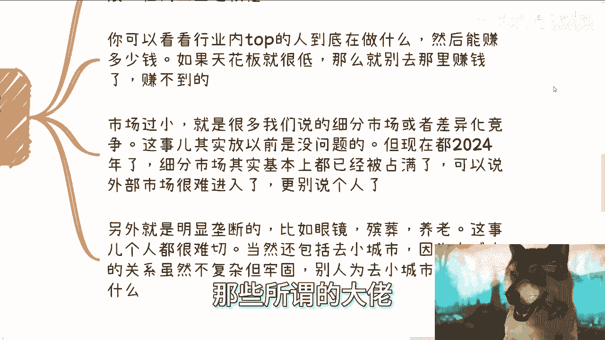

那你非要往那边钻干嘛呢，对不对，就像我这次的主题，叫什么叫赚钱的过程当中的这个这个大忌，你竟然为了赚钱，你为什么非要自己跟自己过不去呢对吧，第三第三就是市场过小，市场过小。

就是说我们很多时候说的这个细分市场，或者差异化竞争这件事情，你放在以前，比如说10年前，15年前，20年前都没问题，但是现在是2024年，2024年意味着什么，意味着几乎所有的细分市场。

基本上都已经被占满了对吧，所谓被占满的意思不是说你挤不进去，而是说他们的整个关系都已经牢固了，你知道吗，就因为牢固，所以你没办法在里面分到一杯羹哦，那么你别说企业啊，你别说你个人了。

可能连企业都很难在这里面分到一杯羹吧，另外就是明显垄断的，比如说眼镜行业啊，哎我跟你们讲，之前真的在去年大概两三月份时候吧，有人给我看过一个他写的那个商业计划书的，做的是那个眼镜的，你知道吗。

我当时打开那个那个商业计划书，我就觉得我后面就不想看了，为什么，这就是你得有认知啊，你心里得有逼数啊对吧，卧槽眼镜行业大家都知道是暴利啊，那他妈是你想做就做的啊，那么你以为你以为你是什么对吧，包括殡葬。

包括养老，那之前咨询也是的，咨询的时候我也跟他们讲过，我说你们都能看得到养老有很大的未来，你们也都看到老龄化是很大的趋势，没有错呀，我说如此大的趋势是个人都能知道，然后呢搜对吧，这就说明这个东西不好做。

我说如果是个人都能知道的东西，大家又没有办法里面，又没有办法在这些领域里面去，赚到性价比高的钱，或者分到一杯羹，那就说明什么，说明这不是老百姓想切就切的事儿啊，对不对对吧，包括还有很多人说。

那我去非常下沉的小城市，我跟你讲啊，小城市的关系虽然不复杂，但牢固他非常的牢固，你别你别以为你去了小城市就能做点什么，不可能的对吧，所以说就是说你要么就是在大城市直接啊，就是就是去去去野嘛。

去想办法分自己的一杯羹嘛，要么就是到一些稍微中间一点的对吧，1。5线啊，二线啊，这些你别特别想着说我就是去个小城市。

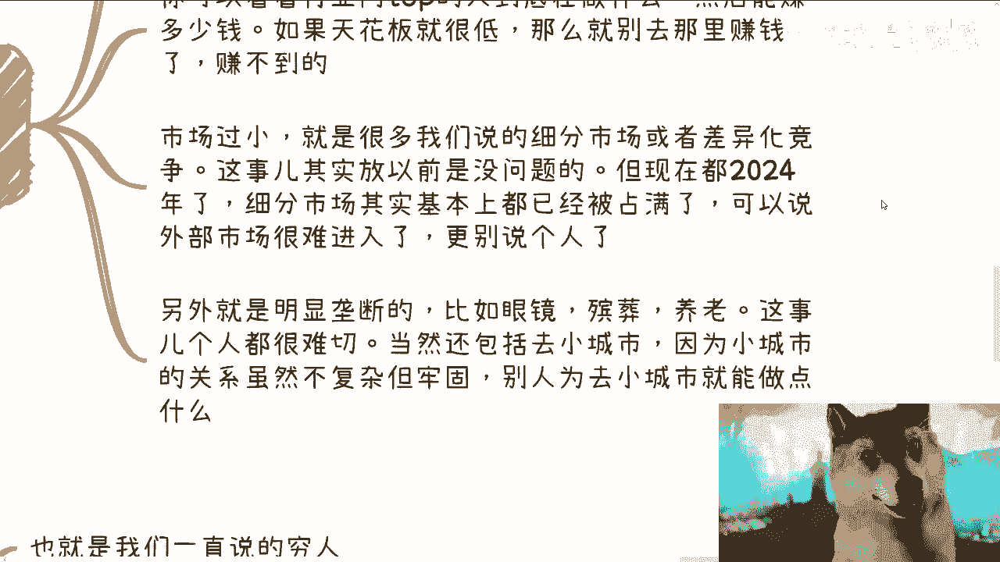

好像那个地方还没有怎么样怎么样怎么样，其实这里面关系早就已经。

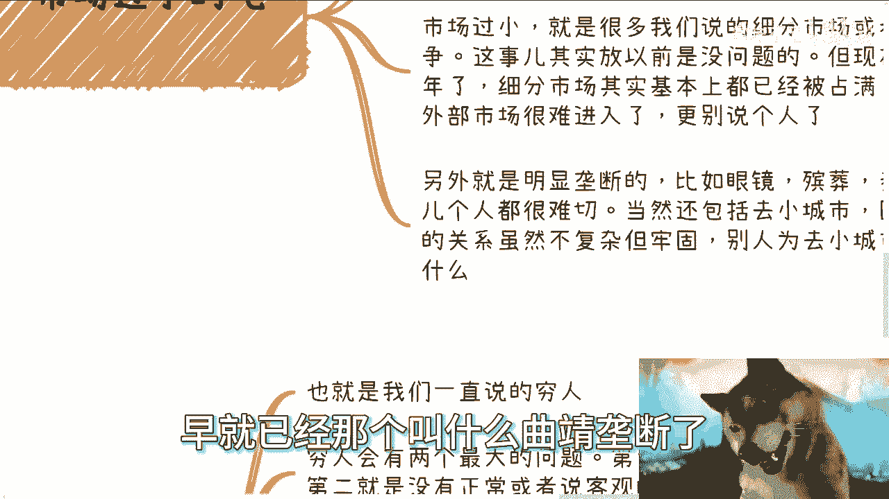

那个叫什么趋近于垄断了，只是你不知道啊，然后第四就是与生存都困难的人合作，也就是那那那那那在这个地方我得说清楚啊，大家不要对号入座啊，也就是我们一直说的穷人啊，穷人为什么不要合作。

因为穷人会有两大最大的问题，第一他没有见过大钱啊，他没有经过大钱，他动不动就要跟你说，你不接地气啊，第二就是没有正，他往往没有正常或者客观的思路去思考问题，没有见过大钱，他就会斤斤计较。

就容易会有小动作，容易会到处吃回扣，容易产生小心思，这没有办法，你知道吗，这个是由于他穷导致的，你不要来跟我说我的三观，我的品质，我的人品多好，没有用的，你懂吗，没有用的人就是这么一种生物。

就是这么俗气，怎么办呢，对吧，另外他们往往优先级P0，就private最高的考虑的是自己的升级，为什么，因为穷对吧，当如果考虑自己的生计为第一优先级的时候，目光不可能长远的，怎么个长远法对吧。

永远看着眼前的利益，那么这个这个状态是没法做好事情，你懂吗，所以说在这个过程当中，这类人只会影响合作伙伴之间的合作感情，甚至会出现挑拨离间的可能性啊，或者说就是说它往往会让整个合作变得不。

那不是那么愉快，嗯啊所以我在这个地方再强调一遍啊，不是说没有钱的就是穷人啊，啊，而是说他当下就是这个月要想着，下个月怎么活啊，这个月要想着下个月房租怎么来哦，然后生计非常存在问题的人。

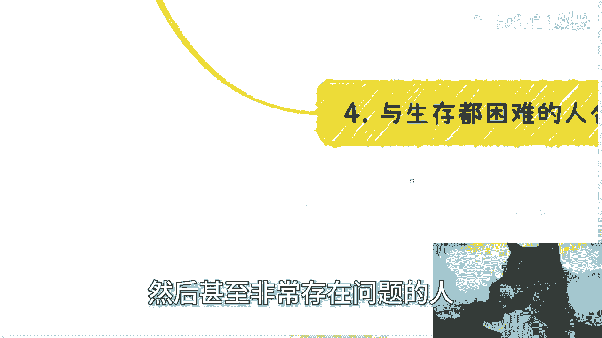

我觉得不行，还有五男与年纪大却没有积累的人合作啊。

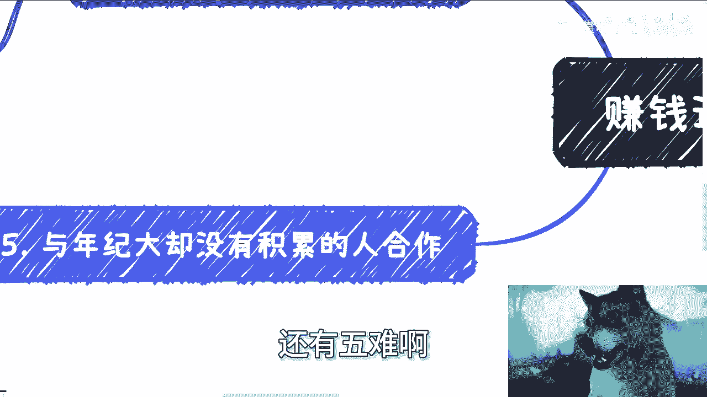

什么意思，就是不要我跟你讲，这个就是商业当中之大忌，就是不要幕墙，不要木老，不要木所有虚的东西啊，什么给出一代title，然后你一看卧槽牛逼啊，没用啊，我早就说过这句话。

你一旦心里面觉得卧槽牛逼啊的时候，你已经开始被骗了啊，你已经离被骗不远了，记住要去看这个人说什么，做什么思考问题的思路，而不是那些虚的那些虚的没有用的啊，就我就跟你们说。

就跟网上有很多人跟你们说什么要去摆摊，卧槽这他妈在我看来这不就扯淡吗，摆摊手哦，摆摊卧槽，我搞不懂啊，哦我作为一个年轻人，我作为一个新兴人类，我作为一个主播，未来的花朵，你跟我说摆摊对啊。

那么年纪大跟靠谱也没有关系，因为所有的那些就是嗯，你所看到的这个这个叫什么，就是客观事实，比如说年纪大啊，学校好啊，他得过什么金金奖啊对吧，或者他有什么title啊，都没有用啊，就这些东西跟靠不靠谱。

跟你能不能合作，跟你能不能赚到钱，TMD没有任何因果关系，对不对，这就像我跟所有人也说，你比如说你哪怕跟我合作也是一样的，我们也是先以最小的纬度先合作，这样的话就说我也要知道你有没有执行力。

你的思路清不清晰，你也得知道，就说陈老师在跟你合作当中，我的执行力怎么样，以及我能我能不能，这个给大家带来更多赚钱的可能性对吧，你不能因为说哦，这个因为因为陈老师年纪比我们大吧。

因为陈老师啊经历过很多东西，这个东西跟能不能最终赚到钱，他的执行力强不强，没有因果关系的。

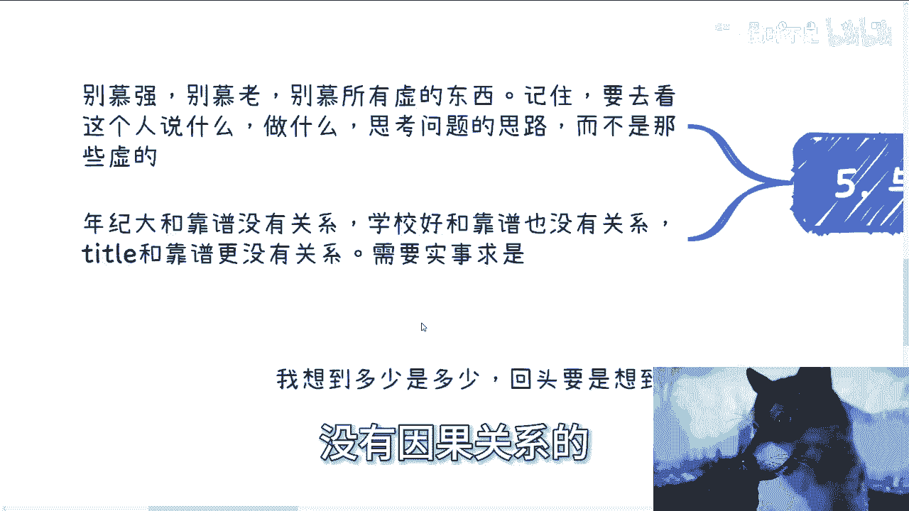

因为很多时候你不知道对方的所谓的经历，跟对方所谓的东西是不是他自己的。

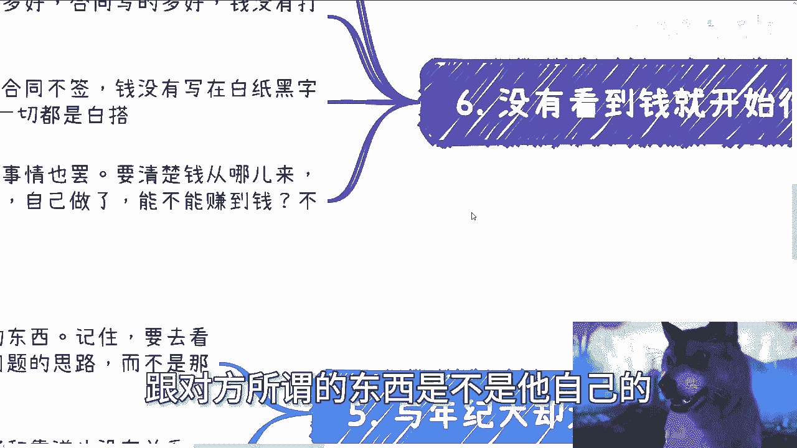

谁知道呀，对吧好，第六个。

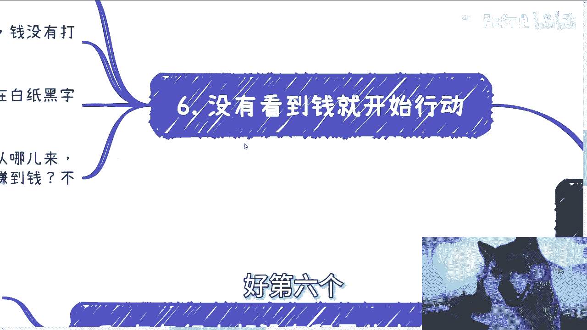

没有看到钱就开始行动啊，我跟你讲这条铁律，铁律就是无论对谁。

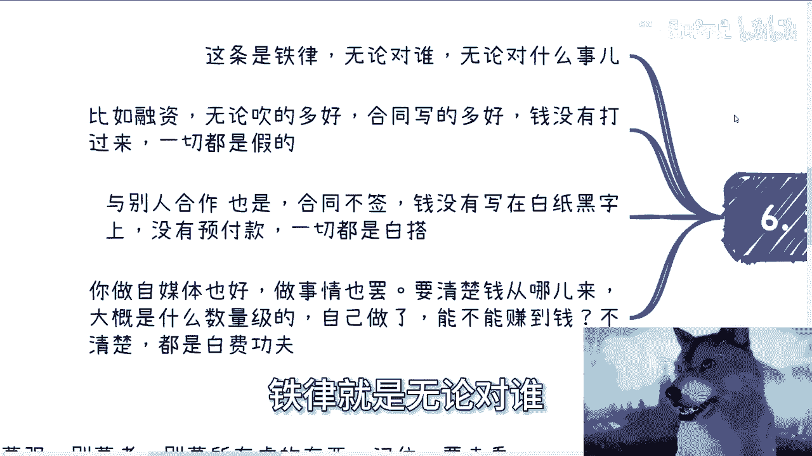

无论做什么事情，你的优先级最高的考虑点就这个啊。

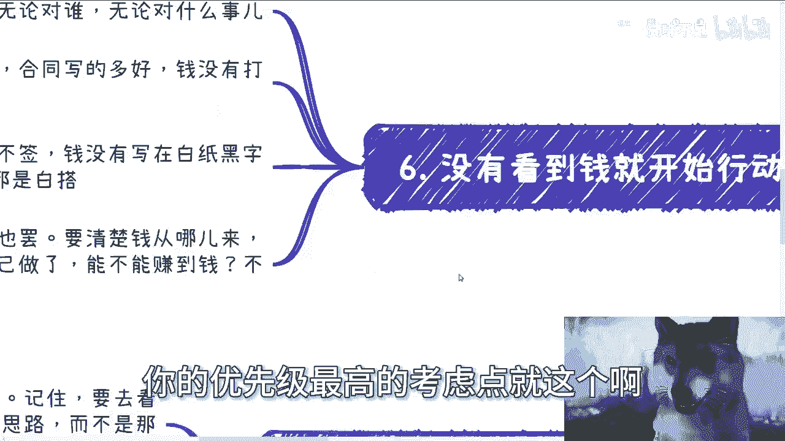

你不考虑这个，我就问嘛，我就这么跟你们讲，你不考虑这个，你就别赚钱对吧，你但凡跟我说，陈老师，我不是那种这个这个这个这个叫什么，很想赚钱的人啊，我不是那种呃呃非常利益驱动的，那可以啊。

你就这句话就像什么，你知道吗，这句话就像什么，就像你跟我说，我对七情六欲没有感情啊，我对这种东西没有追求，那你出家呀，对不对，你但凡不出家，我就告诉你，你肯定是有关系的对吧，那么这个事情。

就跟我们今天说的商业也是一个道理，你要么就别赚钱，你要么就是就是独善其身，你就不赚钱，你但凡要赚钱，这就是你的铁律对吧，否则是什么，否则就是就是就是就是你要我说啊，就是就是你做一件事情做都做了。

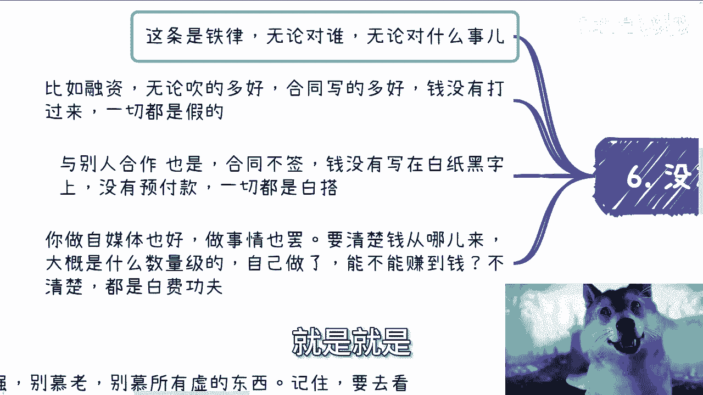

你为什么不把不把它做好呢，对啊，那么你比如说融资，无论吹得多好，合，同学多好钱，只要没打过来，对吧，你包括与别人合作合同，只要不签钱，就是比如说你什么时间点给多少钱，多久时候给到哪个账户。

应该打什么样的发票，但凡这些东西没有写在白纸黑字上，没有预付款，他妈的也他妈是对吧，你自己想想看啊，包括你要做自媒体好，做任何一件事情也罢，你得清楚，不要我来问你们啊，你自己问你们钱到底从哪里来。

你做了这件事情到底大概什么量级啊，你是不是自己做了能赚到钱，你不要去，答案是模棱两可的，比如说什么，你说啊我问你能不能赚钱，你说我不知道这东西要看流量，那那那你就别做啊，我告诉你这个东西。

就是你的这个思路就不赚钱啊，就非常的过家家，你明白了啊，那么最后我想说的是什么呢，记住啊，别羡慕别人赚钱，也不要着急，自己没有赚到钱，这个是始终要纪念在心里的啊，不要而且另外一方面不要认为被抓了。

好像被定性了就一定违法，也不要认为没被抓就一定不违法啊，不要在你们心里面去得那个思考问题，或者得出结论的时候，因为这些事情去得出结论，这当中没有因果关系的啊，所以说你要记住，你今天没有碰到事。

只是因为你命好，你没有碰到事，你没有碰到事的时候，一切都好说，碰到事了，你屁都不是，你懂吗，也就是说啊，也就是说你在小的时候你该灵活去做，你就应该灵活去做，你不要去被那些条条框框所框住。

但是一旦你做了有一定的规模呢，那么你慢慢慢慢就得去思考所谓的合规，去思考，所谓的就是我们说的那些条条框框，就是你不管是正规做还是野路子做，你心里面终究得要对整个框架得要有个了解哦。

不是说你真的野路子就对什么东西都没了解，你就是猛那没有用的。

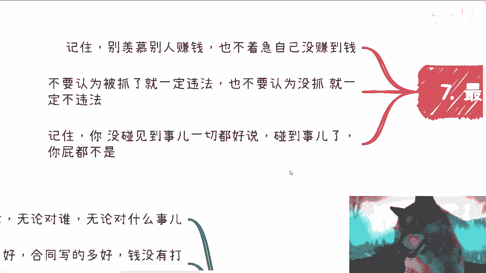

明白吧，好吧，所以我觉得啊就是嗯赚钱这件事情当中，所碰到的问题很多很多，但是永远就是有很多人会问，我就说什么哎呀要不要什么资质啊，要不要什么东西啊啊要不要什么门槛啊，或者有些什么。

明明就是就是所谓明明明明文上面写的，明令禁止的，或者明令就是说规定的什么东西，其实很多真正明文写在那边，东西反而不是最大的问题对吧，因为你们想想看啊，做很多东西当中谁来查对吧，谁又查多少。

每天能查多少啊，嗯对不对，好吧行啊，我反正就先想到这些好吧，后面我要是再想到些别的，我再给你们补，真的，你们仔细想想看啊，我列的这些点好吧嗯行，那就这么着，那个反正其他的有什么有详细的啊。

一些东西要要要沟通或者要合作的。

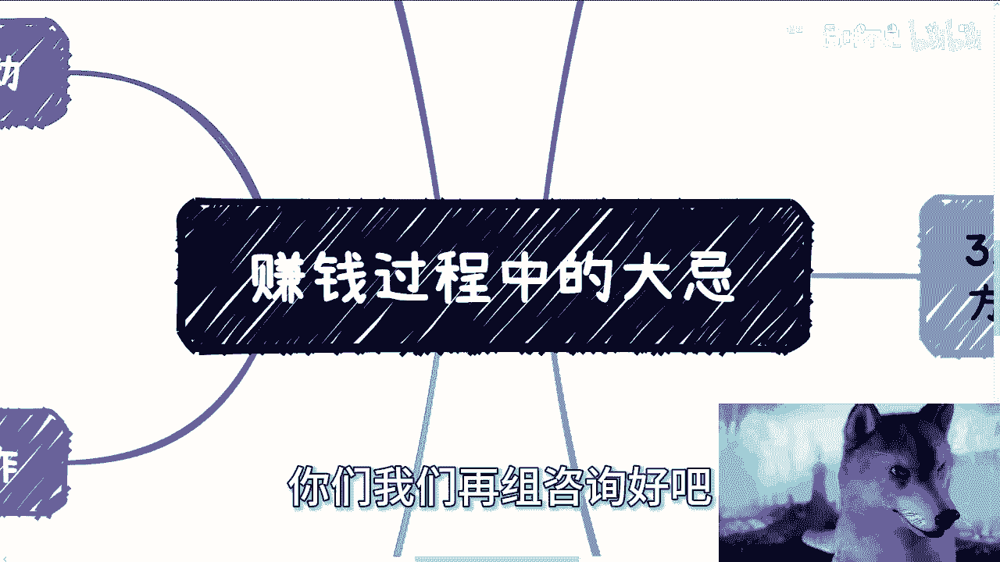