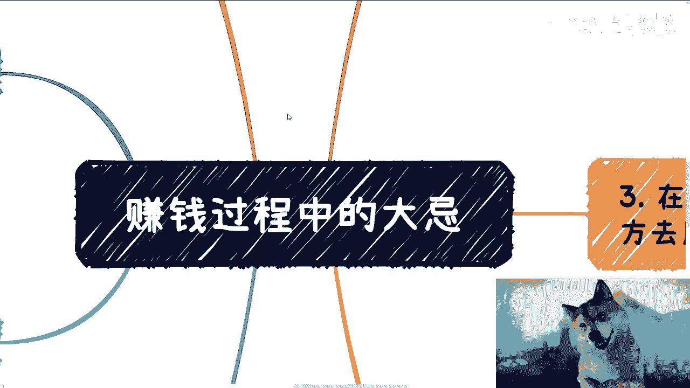

# 赚钱道路上的大忌 - P1 - 赏味不足 - BV1k2421w7Ny 💥

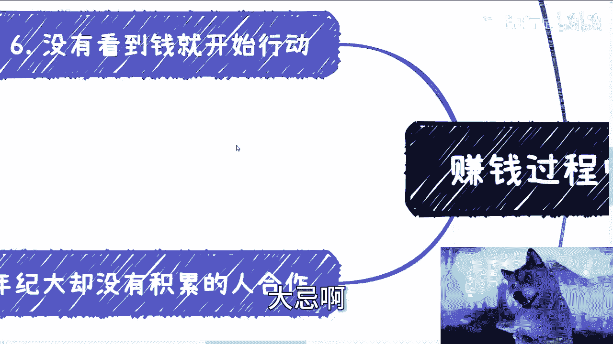

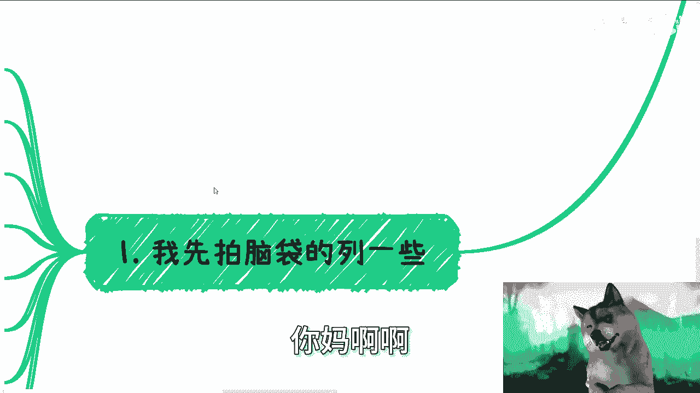

## 概述

在本节课中，我们将探讨在追求财富过程中需要极力避免的几个关键错误。这些“大忌”往往源于认知偏差、对市场环境的误判或合作对象的选择失误。理解并避开这些陷阱，是提高赚钱成功率的重要一步。

---

## 第一点：在雷区蹦迪 🚫

上一节我们介绍了课程的整体框架，本节中我们来看看第一个大忌：触碰社会或网络上的敏感话题。

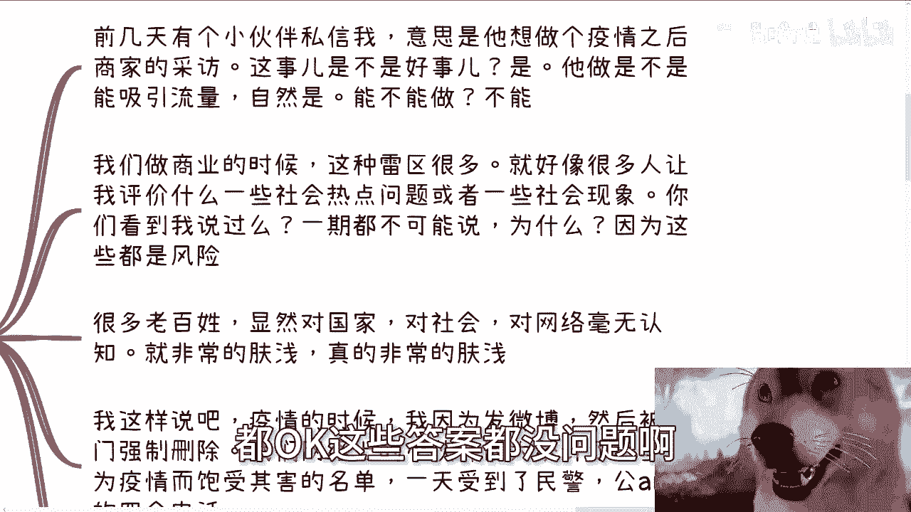

世界上很多事情看似有需求、能吸引流量，但并不意味着你可以去做。核心在于，你必须清楚哪些领域是“雷区”。

**核心概念**：`可操作性 = 有需求 && 能引流 && 非雷区`

例如，有人曾计划制作关于疫情后商家生存现状的采访内容。从内容角度看，这有需求、有流量，看似可行。但结合社会环境看，这类话题极易触及敏感地带，属于“雷区”。

另一个例子是网络上一些引发热议的短视频剧本，例如“丈夫瞒着妻子送外卖”的故事。这类内容虽然能引发共鸣和巨大流量，但事后被证实为虚构，并引发了关于网络内容真实性的争议。这正说明了某些题材是高风险区域。

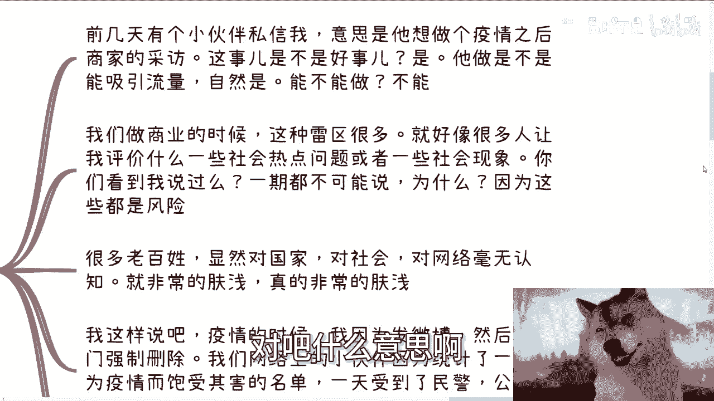

你需要明白，在社会、国家层面和网络环境中，存在明确的边界。有些话题可以讨论，有些则绝对不能触碰。很多人在自媒体创作或商业宣传时，容易因追逐流量而忽略这一点。

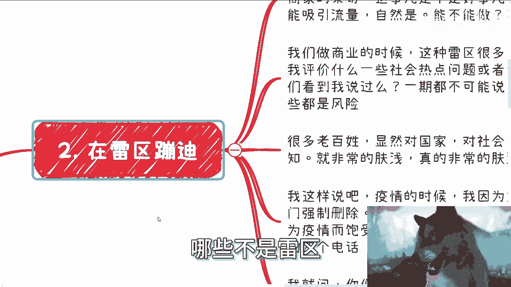

**关键在于**：你的首要目标是赚钱，而非充当“菩萨”或“评论员”。触碰雷区可能带来短暂的流量，但长远来看得不偿失，甚至可能招致严重后果。作者本人曾因在疫情期间发布相关微博，被上门要求删除。这印证了触碰雷区的真实风险。

**总结**：在行动前，务必评估内容或项目是否处于敏感地带。避免在雷区“蹦迪”，是保障项目安全和自身安全的第一要务。

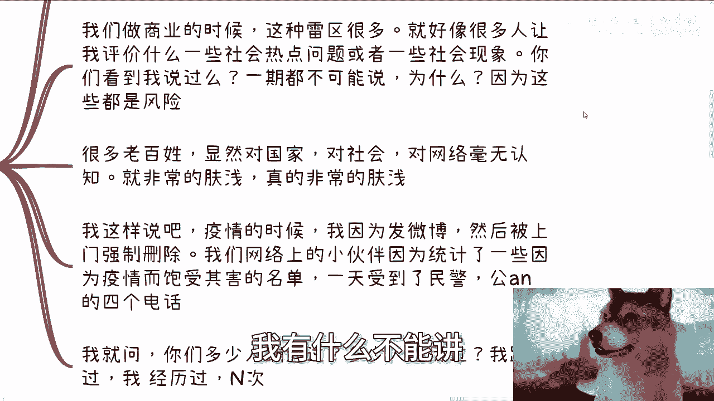

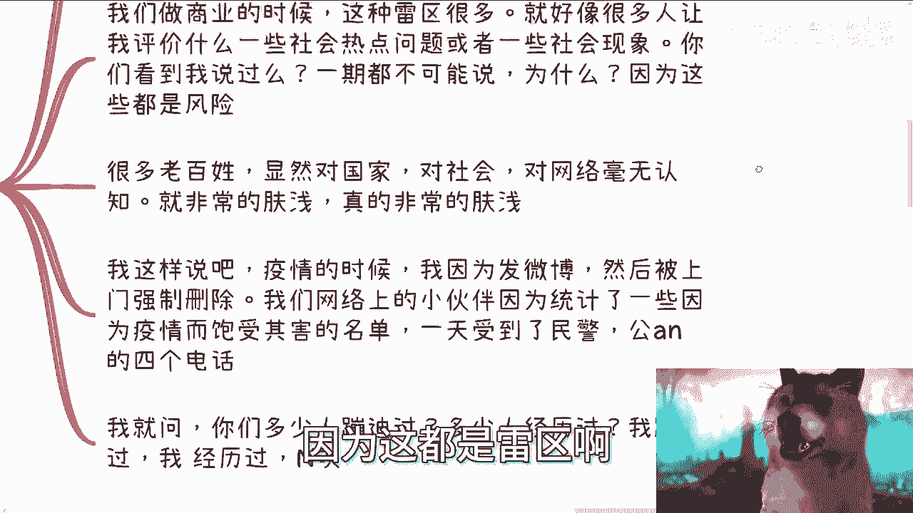

---

## 第二点：在天花板过低或市场过小的领域用力 📉

上一节我们讨论了要避开敏感领域，本节中我们来看看市场选择上的误区：进入天花板过低或市场过小的领域。

所谓“天花板过低”，指的是某个行业或职业的收入上限很低。例如原画、插画、平面设计等职业，其行业内的顶尖从业者收入也相对有限。在商业链条中，这类环节的产值占比通常不高。

**核心概念**：`选择领域时，需评估：行业收入天花板 && 市场总容量`

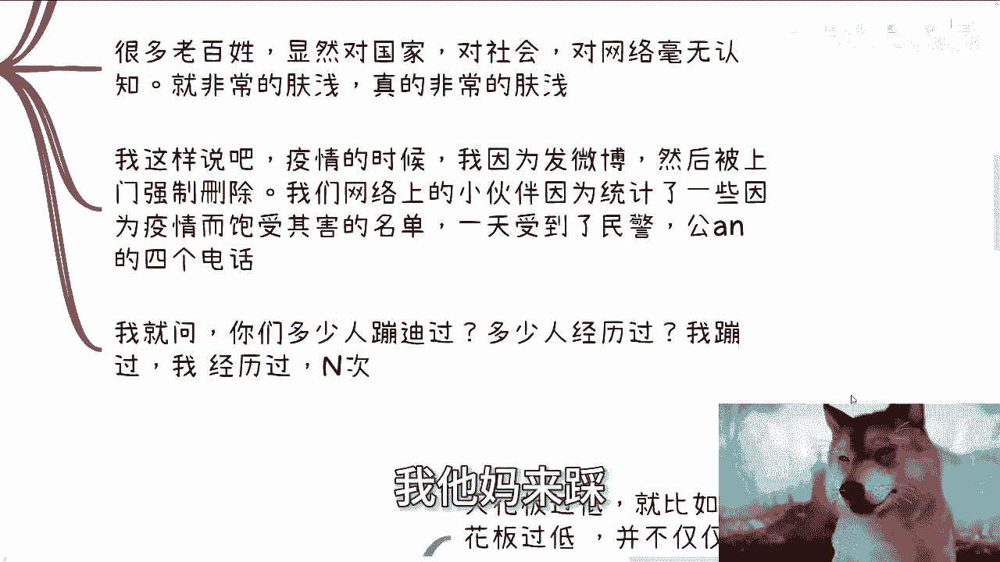

“市场过小”则指细分市场或利基市场。在10年或20年前，差异化竞争进入小市场是有效策略。但在2024年的今天，绝大多数细分市场已被占领，市场关系牢固，新进入者很难分得一杯羹。

此外，要警惕“明显垄断”的行业。例如眼镜、殡葬、养老等行业，虽然利润高、前景看似广阔，但早已形成坚固的壁垒。普通个人或小企业很难切入，因为这不仅仅是商业竞争，还涉及复杂的资源与关系网络。

下沉到小城市也并非捷径。小城市的关系网络可能更简单，但也更牢固和封闭，外来者同样难以打破现有格局。

**总结**：既然目标是赚钱，就不应选择那些先天不足、发展空间狭窄或壁垒过高的战场。要么去主流的大市场拼搏，要么寻找仍有缝隙的中间地带。

---

## 第三点：与生存困难的人合作 🤝

上一节我们分析了市场选择，本节我们来探讨合作对象的选择。一个大忌是与“生存都困难的人”合作。

这里的“穷人”特指那些当下生计存在严重问题、需要为下个月房租发愁的人。与这类人合作会面临两大问题：

以下是合作时可能遇到的主要风险：

1.  **缺乏大局观**：他们没见过“大钱”，容易认为宏大的计划“不接地气”，并倾向于斤斤计较眼前的小利。
2.  **优先级错位**：他们的第一优先级（P0）永远是自己的生计。这会导致其目光短浅，无法为长远合作目标投入，甚至在合作中产生吃回扣等“小动作”。

这种状态源于生存压力，与人品或三观关系不大。合作中，他们容易影响团队士气，甚至可能引发内部矛盾。

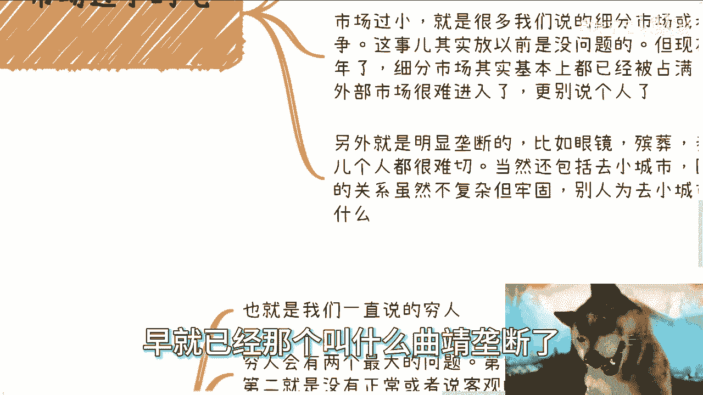

**总结**：选择合作伙伴时，应避开那些被基本生存问题所困的人。稳定的合作需要双方都有一定的余裕和长远眼光。

---

## 第四点：与年纪大却无对应积累的人合作 👴

上一节我们谈了不要与生计困难者合作，本节我们看看另一个合作陷阱：迷信资历。

在商业合作中，切忌“慕强”、“慕老”或迷信任何虚名。头衔、年龄、过往光环（如名校、奖项）与一个人是否靠谱、能否成事**没有必然因果关系**。

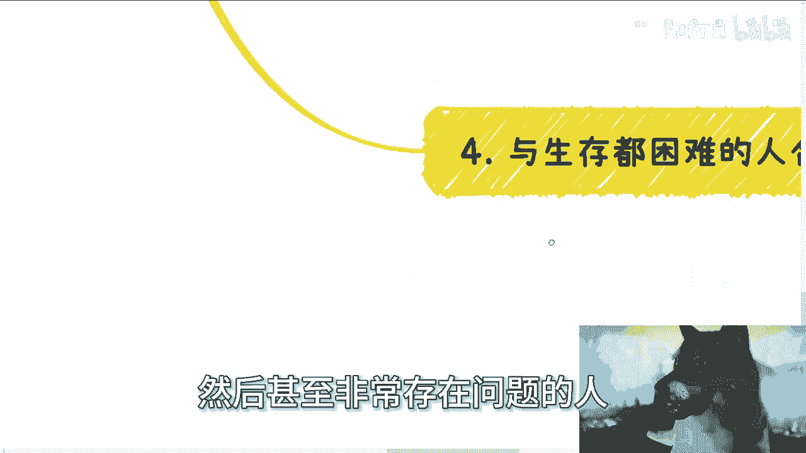

**核心概念**：`合作可靠性 ≠ 年龄 ≠ 头衔 ≠ 过往虚名`

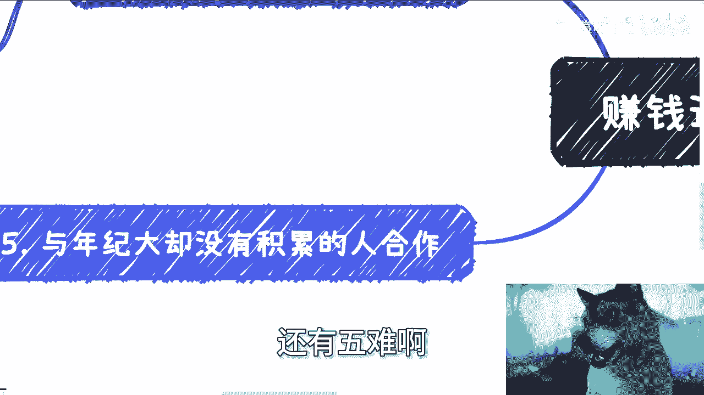

例如，网上常有人鼓吹“摆摊”是出路，并以其年龄或经验作为背书。但这本身就是一个需要谨慎评估的建议，与建议者的年龄无关。

你无法确认对方口中的“经历”是否真实属于他本人。因此，正确的做法是**通过最小规模的初步合作进行验证**。这既能考察对方的执行力与思路，也能让对方了解你的能力。

**总结**：判断合作对象，应聚焦于其当下的思考逻辑、执行能力和具体行动，而非那些无法验证的虚名和资历。

---

## 第五点：在没有看到钱时就开始行动 💰

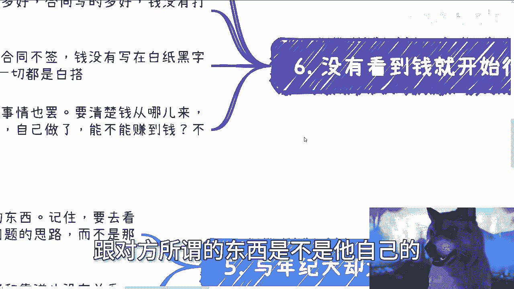

上一节我们明确了选择合作对象的标准，本节我们来看行动准则中最关键的一条：确保财务闭环。

这是一条铁律：**在钱没到位之前，不要全力行动**。你的最高优先级（P0）永远是确认“钱从哪里来”。

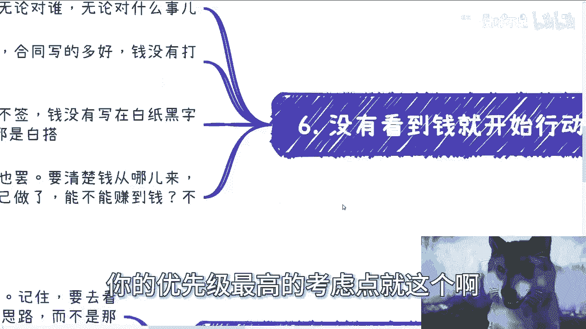

**核心概念**：`行动前提 = 明确的支付方 + 确定的支付流程 + (预付款)`

这适用于所有场景：
*   **融资**：无论故事多动听，钱没到账就不算数。
*   **合作**：无论关系多好，合同条款（付款时间、金额、账户、发票）未以白纸黑字写明并收到预付款，就存在风险。
*   **自媒体/创业**：必须想清楚变现路径和大致量级。如果回答是“不知道，看流量”，那说明思路还不成熟，如同“过家家”。

如果你的目标不是赚钱，那可以忽略此条。但只要涉及商业获利，这就是不可动摇的原则。

**总结**：任何商业行动，都必须以清晰的、可实现的财务回报为前提。避免在模糊的预期中投入过多资源。

---

## 总结与核心心态

本节课中我们一起学习了在赚钱道路上需要警惕的六个大忌。

最后，需要建立两种核心心态：

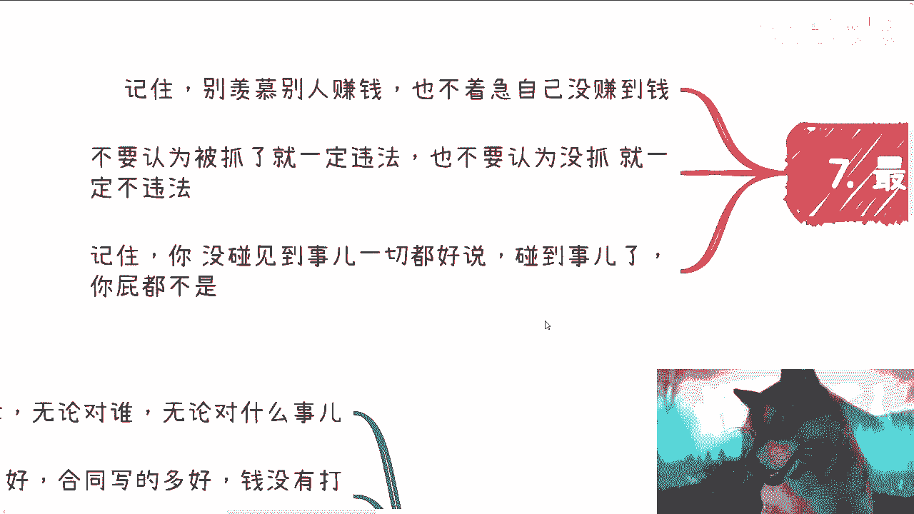

1.  **保持平常心**：不要羡慕他人赚钱，也不要急于自己一时未成。财富积累需要时间和机遇。
2.  **建立风险认知**：不要认为“没被抓”就等于完全合法，也不要认为“被抓了”就一定罪有应得。这中间没有绝对的因果关系。很多时候你安然无恙，只是因为运气好，还没碰到事。

**行动指南**：在早期规模小时，可以灵活变通，不被僵化条款束缚。但当有一定规模后，就必须开始系统性地思考合规与风险框架。真正的“野路子”不是对规则一无所知的蛮干，而是在深刻理解框架基础上的灵活穿梭。

赚钱路上问题繁多，许多人纠结于资质、门槛等明文规定。实际上，许多明文规定并非最大障碍，因为执行和检查存在弹性。真正的大忌，往往是我们今天讨论的这些关于认知、选择和原则的深层问题。

希望本课内容能帮助你避开这些陷阱，更稳健地走向你的财富目标。